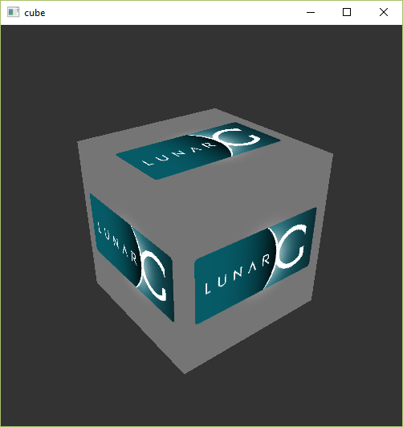
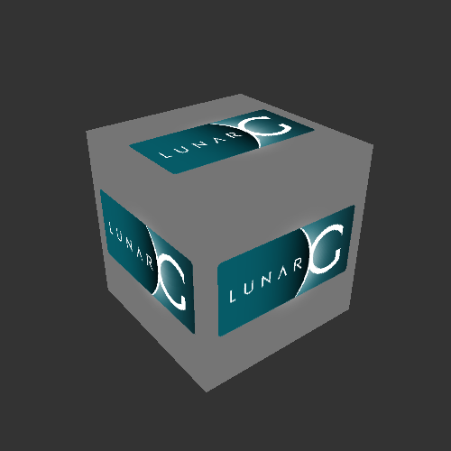
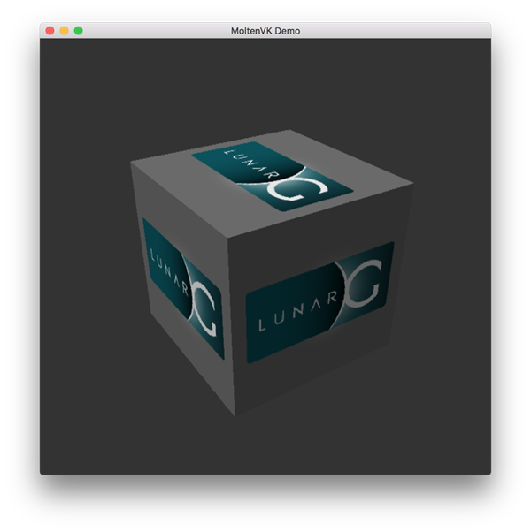

# **开发环境**

## **概述**
本文将指导你完成 Vulkan 应用程序开发环境的配置，包括安装必要的工具和库。

注意，CMake 和 vcpkg 自身的安装，以及 MSVC/Clang 等编译器的安装，不是本教程的内容。

> 作为跨平台的教程，我们不限制编译器的选择，但请保证它支持您需要的 C++ 标准。

## **安装 Vulkan SDK**

Vulkan SDK 是开发Vulkan应用程序的核心组件，包含：

- 头文件
- 函数加载器
- 标准验证层
- 开发辅助库

可以从 [LunarG官网](https://vulkan.lunarg.com/) 下载SDK，无需注册账户。

### Windows

从 [官网](https://vulkan.lunarg.com/sdk/home#windows) 下载 Vulkan SDK 并运行安装程序，**允许它设置环境变量**（如果可选）。

#### 验证安装：

进入 SDK 安装目录的 Bin 子目录，运行 vkcube.exe 演示程序：



### Linux

推荐 [LunarG官网](https://vulkan.lunarg.com/sdk/home#linux) 下载。

使用命令行安装请参考 [此文档](https://vulkan.lunarg.com/doc/sdk/latest/linux/getting_started.html) 。

#### 验证安装：

```shell
vkcube
```

确保您看到以下窗口弹出：




### MacOS

要求：MacOS 10.11或更高版本，支持Metal API的硬件。

从 [LunarG官网](https://vulkan.lunarg.com/sdk/home#mac) 下载 SDK 并解压到选定目录。

#### 验证安装：

运行 `Applications` 目录下的 `vkcube` 演示程序，您应该看到以下内容：



## **依赖库安装**

我们使用 vcpkg 进行依赖管理，它由微软管理、是 C++ 目前最通用的包管理工具，安装方式请参考 [官方文档](https://learn.microsoft.com/zh-cn/vcpkg/get_started/overview) 。

### GLFW

Vulkan 本身是一个平台无关的 API，不包含用于创建窗口以显示渲染结果的工具。
我们将使用 [GLFW](http://www.glfw.org/) 库来创建窗口，它支持 Windows、Linux 和 MacOS，且和 Vulkan 有很好的集成。

安装命令：
```shell
vcpkg install glfw3
```

> Vulkan SDK 还内置了 SDL2 窗口库，它更加强大，但远比 GLFW 复杂。
> GAMES104 的 Piccolo 引擎也使用 GLFW ，它完全可以满足本教程的需求。

### GLM

与 DirectX 12 不同，Vulkan 并不内置线性代数工具。我们使用 [GLM](https://github.com/g-truc/glm) 线性代数库，它专为图形 API 设计，常用于 OpenGL 与 Vulkan 。

安装命令：

```shell
vcpkg install glm
```

> SDK 中其实附带了 glm ，但这里依然推荐你使用 vcpkg 安装。

## **项目初始化**

### 目录结构

```
项目根目录/
│
├── CMakeLists.txt          # 主CMake配置文件
│
└── src/                    # 源代码目录
    │
    └── main.cpp            # 主程序入口
```

### CMake配置

1. 设置工具链为 vcpkg 。
2. 设定项目 C++ 标准。
3. 查找 Vulkan，glm，glfw3 三个库。
4. 添加主程序并链接库。

**参考代码：**

```cmake
# CMakeLists.txt
cmake_minimum_required(VERSION 4.0.0)

# 需要设置环境变量VCPKG_ROOT
file(TO_CMAKE_PATH "$ENV{VCPKG_ROOT}" VCPKG_CMAKE_PATH)
set(CMAKE_TOOLCHAIN_FILE "${VCPKG_CMAKE_PATH}/scripts/buildsystems/vcpkg.cmake")

project(HelloVulkan LANGUAGES CXX)

# 此处使用 23 标准，你可以按需设置
set(CMAKE_CXX_STANDARD 23)

# 需要设置VULKAN_SDK环境变量，比如 D:\Vulkan\1.4.309.0
# 环境变量默认在Vulkan SDK安装时，自动设置
find_package(Vulkan REQUIRED)

# 通过vcpkg导入第三方库
find_package(glfw3 CONFIG REQUIRED)
find_package(glm CONFIG REQUIRED)

# 添加可执行程序目标
add_executable(${PROJECT_NAME} src/main.cpp)

# 链接库
target_link_libraries(${PROJECT_NAME} PRIVATE Vulkan::Vulkan )
target_link_libraries(${PROJECT_NAME} PRIVATE glm::glm )
target_link_libraries(${PROJECT_NAME} PRIVATE glfw )

```


> `CMakeLists.txt`代码将在较长时间内不再变动。

### 测试代码

添加测试代码，测试三个库是否正常：

```cpp
// main.cpp
#include <iostream>
#include <string_view>
#include <print>

#include <vulkan/vulkan.hpp>
#include <vulkan/vulkan_raii.hpp>

#include <GLFW/glfw3.h>

#define GLM_FORCE_RADIANS
#define GLM_FORCE_DEPTH_ZERO_TO_ONE
#include <glm/vec4.hpp>
#include <glm/mat4x4.hpp>

int main() {
    // vulkan test
    const vk::raii::Context context;
    const auto extensions = context.enumerateInstanceExtensionProperties();
    std::cout << "vulkan available extensions:" << std::endl;
    for (const auto& extension : extensions) {
        std::println("{}", std::string_view( extension.extensionName ));
    }

    // glm test
    constexpr glm::mat4 matrix(1.0f);
    constexpr glm::vec4 vec(1.0f, 2.0f, 3.0f, 4.0f);
    constexpr glm::vec4 test = matrix * vec;
    std::println("{} {} {} {}", test.x, test.y, test.z, test.w);

    // glfw test
    glfwInit();
    glfwWindowHint(GLFW_CLIENT_API, GLFW_NO_API);
    GLFWwindow* window = glfwCreateWindow(800, 600, "Vulkan window", nullptr, nullptr);
    while(!glfwWindowShouldClose(window)) {
        glfwPollEvents();
    }
    glfwDestroyWindow(window);
    glfwTerminate();
}
```

你无需理解上述 C++ 代码的含义，这只是测试库是否成功导入。

### 构建运行

下面尝试构建和运行程序，在项目根目录执行：

```shell
cmake -B build
cmake --build build
```

运行：
```shell
# Windows 
build/HelloVulkan.exe
# ↑↓ 也可能是在 build/Debug/ 文件夹中
# Linux/MacOS
build/HelloVulkan
```

**预期结果：**

- 控制台输出 Vulkan 可用的扩展列表
- 控制台输出 GLM 计算结果： 1 2 3 4
- 弹出空白窗口，可点击右上角关闭窗口

### 关于CMake预设

**CMake预设不是必须的**，我们没有复杂的配置需求，你完全可以通过两行简单的 CMake 指令构建项目！

如果你喜欢使用 `CMakePresets.json` \(它可以和 CLion、VSCode、Visual Studio 集成\)，可以参考 **[这个](../../codes/00/01_env/CMakePresets.json)** 预设模板。

此预设模板使用 Ninja 作为生成器，提供了 MSVC/GNU/Clang 工具链的预设配置。

## **代码编辑器**

建议使用一个足够智能的编辑器。
当你不确定某些函数的参数和它的含义时，可以点击函数查看它的实现。Visual Studio / VSCode / CLion 都提供了此功能。

--- 

**[CMake代码](../../codes/00/01_env/CMakeLists.txt)**

**[C++代码](../../codes/00/01_env/main.cpp)**

**[CMake预设模板](../../codes/00/01_env/CMakePresets.json)**

---
