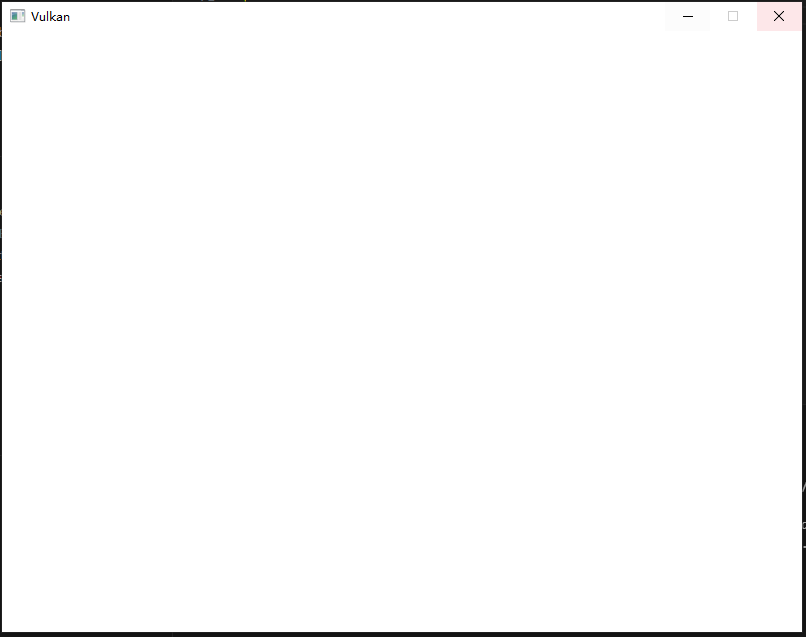

# **基础代码**

## **总体结构**
在“开发环境”章节中，我们创建了一个 Vulkan 项目，其中包含所有正确的配置，并使用示例代码进行了测试。

在本章中，我们将从以下代码开始，请修改 `main.cpp` 。

```cpp
#include <vulkan/vulkan.hpp>
#include <vulkan/vulkan_raii.hpp>

#include <iostream>
#include <vector>
#include <memory>
#include <stdexcept>

class HelloTriangleApplication {
public:
    void run() {
        initVulkan();
        mainLoop();
        cleanup();
    }

private:
    void initVulkan() {

    }

    void mainLoop() {

    }

    void cleanup() {

    }
};

int main() {
    HelloTriangleApplication app;

    try {
        app.run();
    } catch(const vk::SystemError& err ){
        // use err.code() to check err type
        std::cout << "vk::SystemError: " << err.what() << std::endl;
    } catch (const std::exception& err ){
        std::cout << "std::exception: " << err.what() << std::endl;
    }

    return 0;
}
```

首先包含了 vulkan 的头文件，前者是基础 C++ 封装，后者是高层的 RAII 封装，它们已经包含 C 风格头文件。

我们将整个应用封装在一个类中，分离了初始化、主循环、资源清理任务，并在主函数中运行和捕获异常。
`vk::SystemError` 可以捕获大部分 Vulkan 异常，你可以使用 `.code()` 成员函数判断异常类型。

## **集成 GLFW**
离屏渲染无需窗口也能完美运行，但我们希望实时地显示一些东西。

### 1. 添加GLFW支持
```cpp
#include <GLFW/glfw3.h>
```
这样会导入 GLFW 库，用于创建窗口。

> 此语句需要放在 `#include <vulkan/vulkan.hpp>` 下方，从而导入 GLFW 的 VK 相关函数。

### 2. 定义窗口常量

我们需要指定窗口大小，不推荐硬编码，请添加2个静态常量成员。

```cpp
static constexpr uint32_t WIDTH = 800;
static constexpr uint32_t HEIGHT = 600;
```

### 3. 扩展应用程序类

添加 `initWindow` 初始化函数并加入 `run` 中，代码功能如注释所示：

```cpp
class HelloTriangleApplication {
public:
    void run() {
        initWindow();  // 新增的初始化步骤
        initVulkan();
        mainLoop();
        cleanup();
    }
    
private:
    GLFWwindow* m_window{ nullptr };
    
    void initWindow() {
        // 初始化 glfw 库
        glfwInit();
        
        // 配置GLFW不使用OpenGL
        glfwWindowHint(GLFW_CLIENT_API, GLFW_NO_API);
        // 暂时禁用窗口大小调整，简化操作
        glfwWindowHint(GLFW_RESIZABLE, GLFW_FALSE);
        
        // 创建窗口
        m_window = glfwCreateWindow(WIDTH, HEIGHT, "Vulkan", nullptr, nullptr);
    }
    ...
};
```

`glfwCreateWindow` 前三个参数指定窗口的宽度、高度和标题，第四个参数是用于指定目标显示器与全屏，最后一个参数仅与 OpenGL 相关。

> 本教程使用 `m_` 前缀标识非静态成员变量。

### 4. 添加主循环

为了使应用程序保持运行直到发生错误或窗口关闭，我们需要向 `mainLoop` 函数添加一个循环：
```cpp
void mainLoop() {
    while (!glfwWindowShouldClose( m_window )) {
        glfwPollEvents();
    }
}
```
它循环并检查事件，例如按下 `X` 按钮，直到窗口被用户关闭。 `glfwPollEvents` 函数将处理本次循环期间发生的所有窗口事件。

### 5. 清理资源
一旦窗口关闭，我们需要销毁窗口并终止 GLFW 本身从而清理资源。

```cpp
void cleanup() {
    glfwDestroyWindow( m_window );
    glfwTerminate();
}
```

## **尝试运行**

现在运行程序，您应该看到一个标题为 Vulkan 的窗口出现，直到应用程序在窗口关闭时终止。



---

需要说明的是，基础部分的代码重点用于功能演示，因此可能忽略**可选**的 const 与 static 等 C++ 标识符细节。
但进阶部分会提供尽量优雅的基础代码框架。

这个基础框架为后续开发奠定了良好基础，接下来可以开始初始化 Vulkan 实例和设备。

---

**[C++代码](../../codes/01/00_base/main.cpp)**

**[CMake代码](../../codes/01/00_base/CMakeLists.txt)**

---
