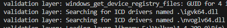

# **验证层**

## **什么是验证层**

Vulkan API 的设计理念: **尽量减少驱动程序开销**

这导致 **默认情况下 API 中的错误检查非常有限**。

Vulkan要求你对所做的一切都非常明确，因此很容易犯许多小错误。  
例如使用新的 GPU 功能，却忘记在创建逻辑设备时请求它。
即使像 "错误的枚举值" 或 "错误的空指针" 这样简单的错误，通常也不会被显式处理，只会导致崩溃或未定义的行为。

Vulkan 引入了一个优雅的系统来实现程序检查，称为验证层 \( Validation Layer \)。

它是Vulkan的核心调试工具，通过拦截API调用来实现：

- **参数验证**：检查参数合法性和规范符合性
- **资源追踪**：监控资源生命周期和泄漏
- **线程安全**：验证多线程调用合规性
- **性能分析**：记录调用耗时和频率
- **调试输出**：提供详细的运行时信息


以下是诊断验证层中函数实现的一个简化示例

```cpp
// 伪代码示例：验证层内部实现原理
VkResult vkCreateInstance_WithValidation(
    const VkInstanceCreateInfo* pCreateInfo,
    VkInstance* instance) {
    
    // 前置验证
    if (pCreateInfo == nullptr) {
        logError("Null pointer passed to pCreateInfo");
        return VK_ERROR_INITIALIZATION_FAILED;
    }
    
    // 调用真实函数
    VkResult result = real_vkCreateInstance(pCreateInfo, instance);
    
    // 后置检查
    if (result != VK_SUCCESS) {
        logWarning("Instance creation failed");
    }
    
    return result;
}
```

你可以**在调试时启用验证层**，在**发布时完全禁用它**，两全其美！！

> Vulkan本身不附带任何内置的验证层，但 LunarG Vulkan SDK 提供了一组很好的验证层，用于检查常见错误。
> 它们也是完全开源的，因此你可以查看它们检查哪些类型的错误并做出贡献。
> 
> Vulkan 以前有两种不同类型的验证层：实例特定和设备特定。  
> 设备特定层现在已被弃用，这意味着实例验证层适用于所有 Vulkan 调用。
> 
> 规范文档仍然建议你在设备级别也启用验证层以获得更好的兼容性。
> 我们只需在创建逻辑设备时指定与实例相同的层，稍后你就会看到。

## **使用验证层**

### 1. 标准验证层配置

与扩展一样，验证层需要通过指定其名称来启用。
所有有用的标准验证都捆绑到一个包含在 SDK 中的层中，该层称为 `VK_LAYER_KHRONOS_validation`。

让我们在类中添加代码：

```cpp
// ......
#include <array>
// ......

static constexpr uint32_t WIDTH = 800;
static constexpr uint32_t HEIGHT = 600;

inline static const std::vector<const char*> validationLayers {
    "VK_LAYER_KHRONOS_validation"
};

// 根据编译模式自动启用
#ifdef NDEBUG
    static constexpr bool enableValidationLayers = false;
#else
    static constexpr bool enableValidationLayers = true;
#endif
```

> `NDEBUG` 宏是 C++ 标准的一部分，意思是“非调试”。
>
> 此处不介绍常量静态成员的语法，可参考[cppref-静态成员](https://zh.cppreference.com/w/cpp/language/static)。  


### 2. 验证层可用性检查

#### 添加可用性检测函数

1. 添加一个成员函数 `checkValidationLayerSupport`，用于检查所有请求的层是否可用。

2. 使用 `m_context.enumerateInstanceLayerProperties` 函数列出所有可用的层。

3. 使用任意方式判断是否都可用，此处借助 `std::set`。

```cpp
// ...
#include <set>
// ...
bool checkValidationLayerSupport() {
    auto layers = m_context.enumerateInstanceLayerProperties();
    std::set<std::string> t_requiredLayers( validationLayers.begin(), validationLayers.end() );
    for (const auto& layer : layers) {
        t_requiredLayers.erase( layer.layerName );
    }
    return t_requiredLayers.empty();
}
```

> 需要判断的数量很少，且只会执行一次，暴力判断也可以，无需担心性能问题。

#### 使用检测函数

现在我们可以在 `createInstance` 中使用此函数

```cpp
void createInstance() {
    if (enableValidationLayers && !checkValidationLayerSupport()) {
        throw std::runtime_error("validation layers requested, but not available!");
    }
    // ......
}
```

现在在调试模式下运行程序，并确保不会发生错误 

### 3. 实例创建时启用验证层

在 `createInstance` 中添加内容，修改 `vk::InstanceCreateInfo` 结构体，以包含验证层名称（如果已启用）

```cpp
if (enableValidationLayers) {
    createInfo.setPEnabledLayerNames( validationLayers );
}
```

> 我们用了上一节提到的 `setter` ，它实际设置了指针和数量这两个成员变量。

## **设置调试回调**

默认情况下，验证层会将调试消息打印到标准输出，但我们也可以在程序中提供显式回调来自己处理它们。

如果你现在不想这样做，则可以跳到本章的最后一节。

为了在程序中设置回调以处理消息和相关详细信息，我们必须使用 `VK_EXT_debug_utils` 扩展程序设置一个带有回调的调试信使。

### 1. 优化扩展获取

创建一个 `getRequiredExtensions` 函数，用于返回需要的扩展：

```cpp
std::vector<const char*> getRequiredExtensions() {
    uint32_t glfwExtensionCount = 0;
    const char** glfwExtensions;
    glfwExtensions = glfwGetRequiredInstanceExtensions(&glfwExtensionCount);

    std::vector<const char*> extensions(glfwExtensions, glfwExtensions + glfwExtensionCount);

    if (enableValidationLayers) {
        extensions.emplace_back( VK_EXT_DEBUG_UTILS_EXTENSION_NAME );
    }
    extensions.emplace_back( VK_KHR_PORTABILITY_ENUMERATION_EXTENSION_NAME );

    return extensions;
}
```

> 此处的 `VK_EXT_DEBUG_UTILS_EXTENSION_NAME` 宏等于字符串 `"VK_EXT_debug_utils"` 。

现在可以在 `createInstance` 中使用此函数简化代码：

```cpp
std::vector<const char*> requiredExtensions = getRequiredExtensions();
// special setter
createInfo.setPEnabledExtensionNames( requiredExtensions );
createInfo.flags |= vk::InstanceCreateFlagBits::eEnumeratePortabilityKHR;
```

现在运行程序以确保你没有收到错误。

### 2. 编写注册函数

#### 添加回调函数

添加一个新的静态成员函数，名为 `debugCallback`。

```cpp
static VKAPI_ATTR VkBool32 VKAPI_CALL debugMessageFunc( 
    vk::DebugUtilsMessageSeverityFlagBitsEXT       messageSeverity,
    vk::DebugUtilsMessageTypeFlagsEXT              messageTypes,
    vk::DebugUtilsMessengerCallbackDataEXT const * pCallbackData,
    void * pUserData ) {

    std::cerr << "validation layer: " << pCallbackData->pMessage << std::endl;

    return false;
}
```

#### 回调函数说明

`VKAPI_ATTR` 和 `VKAPI_CALL` 确保该函数具有 Vulkan 调用它的正确签名。


第一个参数指定消息的严重性，具有以下可能：

| `vk::DebugUtilsMessageSeverityFlagBitsEXT` | 含义 |  
|---------------------|--------------------|
| `eVerbose` | 诊断消息 |  
| `eInfo` | 信息性消息，例如资源的创建 |  
| `eWarning` | 关于警告行为的消息 |  
| `eError` | 关于错误行为的消息，行为可能会导致崩溃 |  

你可以使用比较操作来检查消息严重性，例如

```c++
if (messageSeverity >= vk::DebugUtilsMessageSeverityFlagBitsEXT::eWarning) {
    // Message is important enough to show
}
```

第二个参数 MessageType 可以具有以下值：

| `vk::DebugUtilsMessageTypeFlagsEXT` | 含义 |  
|---------------------|--------------------|
| `eGeneral` | 发生了一些与规范或性能无关的事件 |  
| `eValidation` | 发生了一些违反规范或可能错误的事情 |  
| `ePerformance` | Vulkan 的潜在非最佳使用 |  


第三个参数 `pCallbackData` 是一个结构体的指针，此结构体包含消息本身的详细信息，最重要的成员如下

| 成员 | 含义 |  
|---------------------|--------------------|
| `pMessage` | 作为空终止字符串的调试消息 |  
| `pObjects` | 与消息相关的 Vulkan 对象句柄数组 |  
| `objectCount` | 数组中对象的数量 |  


最后的参数 `pUserData` 参数包含一个指针，供用户自己使用，可以传入任意内容。

函数返回布尔值，指示是否应中止触发了验证层消息的 Vulkan 行为。  
如果回调返回 true，则调用将中止并抛出 `vk::SystemError` 异常，错误代码为 `vk::Result::eErrorValidationFailedEXT`。
这通常仅用于测试验证层本身，因此**你应始终返回 false**;

### 3. 创建调试信使对象
在 `vk::raii::Instance instance;` 下方添加一个成员
```cpp
vk::raii::DebugUtilsMessengerEXT m_debugMessenger{ nullptr };
```

现在添加一个函数 `setupDebugMessenger`，在 `createInstance` 之后调用
```cpp
void initVulkan() {
    createInstance();
    setupDebugMessenger();
}

void setupDebugMessenger() {
    if (!enableValidationLayers) return;

}
```

我们需要填写一个结构体，其中包含有关信使及其回调的详细信息
```cpp
vk::DebugUtilsMessageSeverityFlagsEXT severityFlags( 
    vk::DebugUtilsMessageSeverityFlagBitsEXT::eVerbose |
    vk::DebugUtilsMessageSeverityFlagBitsEXT::eWarning |
    vk::DebugUtilsMessageSeverityFlagBitsEXT::eError 
);

vk::DebugUtilsMessageTypeFlagsEXT    messageTypeFlags( 
    vk::DebugUtilsMessageTypeFlagBitsEXT::eGeneral |         
    vk::DebugUtilsMessageTypeFlagBitsEXT::ePerformance |
    vk::DebugUtilsMessageTypeFlagBitsEXT::eValidation 
);

vk::DebugUtilsMessengerCreateInfoEXT createInfo( 
    {},                 // flag
    severityFlags,      // messageSeverity
    messageTypeFlags,   // messageType
    &debugMessageFunc   // 最后，pfnUserCallback
);
```

- `messageSeverity` 允许你指定回调调用的严重性类型。这里指定不输出 `info` 信息，输出其他另外三类信息。

- `messageType` 字段允许你过滤消息类型。我在此处简单地启用了所有类型。

- `pfnUserCallback` 字段指定指向回调函数的指针。

- `pUserData` 字段没有设置，构造函数会将其设置为 `nullptr` ，你也可以传递自行喜欢的东西。 

最后，让我们创建对象：

```cpp
m_debugMessenger = m_instance.createDebugUtilsMessengerEXT( createInfo );
```

## **扩展调试层**

显然调试信使的创建晚于Vulkan实例，销毁又要求早于 Vulkan 实例，这使你无法看到 Vulkan 实例创建和销毁时遇到的任何问题。

此问题有方法解决，你只需在 `vk::InstanceCreateInfo` 的 `pNext` 扩展字段中传递指向 `vk::DebugUtilsMessengerCreateInfoEXT` 结构体的指针。

首先将信使创建信息的填充提取到一个单独的函数中

```cpp
vk::DebugUtilsMessengerCreateInfoEXT populateDebugMessengerCreateInfo() {
    vk::DebugUtilsMessageSeverityFlagsEXT severityFlags( 
        vk::DebugUtilsMessageSeverityFlagBitsEXT::eVerbose |
        vk::DebugUtilsMessageSeverityFlagBitsEXT::eWarning |
        vk::DebugUtilsMessageSeverityFlagBitsEXT::eError 
    );
    vk::DebugUtilsMessageTypeFlagsEXT    messageTypeFlags( 
        vk::DebugUtilsMessageTypeFlagBitsEXT::eGeneral |         
        vk::DebugUtilsMessageTypeFlagBitsEXT::ePerformance |
        vk::DebugUtilsMessageTypeFlagBitsEXT::eValidation 
    );
    return vk::DebugUtilsMessengerCreateInfoEXT ( {}, severityFlags, messageTypeFlags, &debugMessageFunc );
}

void setupDebugMessenger(){
    if (!enableValidationLayers) return;

    auto createInfo = populateDebugMessengerCreateInfo();
    m_debugMessenger = m_instance.createDebugUtilsMessengerEXT( createInfo );
}
```

我们现在可以在 `createInstance` 函数中重用它

```cpp
// vk::DebugUtilsMessengerCreateInfoEXT
auto debugMessengerCreateInfo = populateDebugMessengerCreateInfo();
if (enableValidationLayers) {
    createInfo.setPEnabledLayerNames( validationLayers );
    createInfo.pNext = &debugMessengerCreateInfo;
}
```

> 注意：这里传入的是指针，需要保证生命周期，所以不能在if块内初始化。

## **更多配置**

验证层行为的设置远不止 `vk::DebugUtilsMessengerCreateInfoEXT` 结构体中指定的标志。

浏览到 Vulkan SDK 并转到 `Config` 目录。
在那里，你将找到一个 `vk_layer_settings.txt` 文件，其中说明了如何配置层。

要为自己的应用程序配置层设置，请将该文件复制到项目的 `Debug` 和 `Release` 目录，并按照说明设置所需的行为。
但在本教程的其余部分中，我将假设你使用的是默认设置。

## **测试**

现在尝试编译运行程序，应该没有报错，且或许能看到一些加载动态库之类的调试信息输出。



---

下一章我们会寻找合适的GPU用于渲染图像。

---

**[C++代码](../../codes/01/02_validation/main.cpp)**

**[C++代码差异](../../codes/01/02_validation/main.diff)**

**[CMake代码](../../codes/01/00_base/CMakeLists.txt)**
