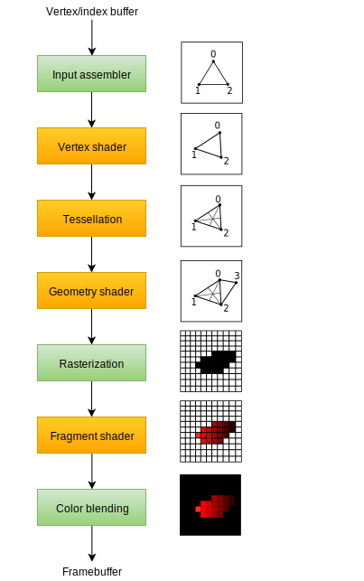

# **图形管线**

> 如果你忘记了什么是图形管线，可以回顾 [GAMES202课程第二节](https://www.bilibili.com/video/BV1YK4y1T7yY) 。

## **介绍**

在接下来的几章中，我们将设置一个图形管线，该管线将指定如何绘制我们的第一个三角形。
图形管线是将网格的顶点和纹理转换到渲染目标像素的操作序列。
下面给出了一个简化的概述



1. **输入装配(IA)**
    - 从顶点/索引缓冲区收集原始几何数据
    - 索引缓冲允许顶点数据复用，减少内存占用
2. **顶点着色器(VS)**
    - 逐顶点执行模型→视口→裁剪空间坐标变换
    - 输出后续阶段所需的顶点属性（法线、UV等）
3. **曲面细分着色器(TS)**
    - （可选）动态细分几何体
    - 包含：外壳着色器（控制细分程度）、镶嵌器（生成网格）、域着色器（处理新顶点）
4. **几何着色器(GS)**
    - （可选）逐图元处理，可增删改几何体
    - 实际应用受限（移动端不支持，桌面端性能差）
5. **光栅化(Rasterization)**
    - 将图元转换为片段（潜在像素）
    - 执行：视锥剔除→背面剔除→深度测试→属性插值
6. **片段着色器(PS/FS)**
    - 逐片段计算最终颜色/深度
    - 支持：纹理采样、光照计算、高级着色等
7. **输出合并/颜色混合(OM/CB)**
    - 处理片段可见性（深度/模板测试）
    - 混合操作：Alpha混合、叠加等颜色混合模式

### 固定阶段与可编程阶段

**绿色**的是固定功能阶段，**橙色**的是可编程阶段。

固定功能阶段允许您使用参数调整其操作，但它们的工作方式是预定义的。

可编程阶段（`programmable`）意味着您可以将自己的代码上传到显卡，以精确地应用您想要的操作。  
这使您可以使用着色器代码实现从纹理和光照到光线追踪的任何功能。这些程序在许多 GPU 核心上同时运行，以并行处理许多对象，例如顶点和片段。

如果您以前使用过像 OpenGL 和 Direct3D 这样的旧 API，那么您会习惯于使用像 `glBlendFunc` 和` OMSetBlendState`这样的调用随意更改任何管线设置。  
Vulkan 中的图形管线几乎是完全不可变的，因此如果您想更改着色器、绑定不同的帧缓冲或更改混合功能，则必须从头开始重新创建管线。

**缺点**是您必须创建许多管线来表示您想在渲染操作中使用的所有不同状态组合。  
**优点**是您将在管线中执行的所有操作都是预先知道的，因此驱动程序可以对其进行更好的优化。

### 可选阶段

一些可编程阶段是可选的，具体取决于您打算做什么。  

例如，如果您只是绘制简单的几何体，则可以禁用细分和几何阶段。   
如果您只对深度值感兴趣，则可以禁用片段着色器阶段，这对于 阴影贴图 生成很有用。

在下一章中，我们将创建将三角形放到屏幕上所需的两个可编程阶段：顶点着色器和片段着色器。

混合模式、视口、光栅化等固定功能配置将在之后的章节中设置。  
在 Vulkan 中设置图形管线的最后一部分还涉及输入和输出帧缓冲的规则。

## **添加基础结构**

让我们创建一个 `createGraphicsPipeline` 函数，该函数在 `createImageViews` 之后立即调用。我们将在接下来的章节中处理此函数。

```c++
void initVulkan() {
    createInstance();
    setupDebugMessenger();
    createSurface();
    pickPhysicalDevice();
    createLogicalDevice();
    createSwapChain();
    createImageViews();
    createGraphicsPipeline();
}

void createGraphicsPipeline() {

}
```

---

**[C++代码](../../codes/01/20_pipeline/main.cpp)**

**[C++代码差异](../../codes/01/20_pipeline/main.diff)**

**[CMake代码](../../codes/01/00_base/CMakeLists.txt)**
