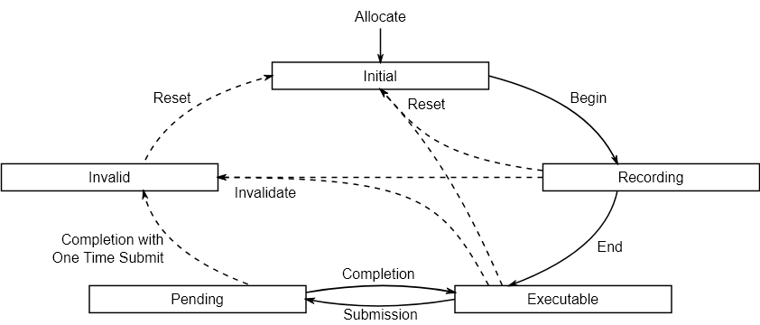

# **命令缓冲与命令池**

在 Vulkan 中，像绘制操作和内存传输这样的命令不是直接使用函数调用来执行的。你必须在你想要执行的命令缓冲区对象中记录所有操作。

这样做的好处是，当我们准备告诉 Vulkan 我们想要做什么时，所有命令都会一起提交。 Vulkan 可以更有效地处理这些命令，因为所有命令同时可用。

> 若有需要，还可以让命令记录在多个线程中进行，我们会在进阶章节详细介绍。

## **命令池**

在我们创建**命令缓冲区\(Command Buffer\)**之前，必须先创建一个**命令池\(Command Pool\)**。
命令池用于管理命令缓冲的内存，命令缓冲从命令池中分配。

现在添加一个新的类成员来存储一个 `vk::CommandPool` ：

```cpp
vk::raii::CommandPool m_commandPool{ nullptr };
```

然后创建一个新的函数 `createCommandPool` 并在帧缓冲创建之后调用它。

```cpp
void initVulkan() {
    createInstance();
    setupDebugMessenger();
    createSurface();
    selectPhysicalDevice();
    createLogicalDevice();
    createSwapChain();
    createImageViews();
    createRenderPass();
    createFramebuffers();
    createGraphicsPipeline();
    createCommandPool();
}

// ...

void createCommandPool() {

}
```

命令池创建只需要两个参数：

```cpp
const auto [graphicsFamily, presentFamily] = findQueueFamilies( m_physicalDevice );

vk::CommandPoolCreateInfo poolInfo;
poolInfo.flags = vk::CommandPoolCreateFlagBits::eResetCommandBuffer;
poolInfo.queueFamilyIndex =  graphicsFamily.value();
```

命令池至少有两个可用的标志位:

| 枚举值                   | 含义                                 |
|-----------------------|------------------------------------|
| `eTransient`          | 提示命令缓冲区非常频繁地用新命令重新记录（可能会改变内存分配行为）  |  
| `eResetCommandBuffer` | 允许单独重新记录命令缓冲区，如果没有此标志，则必须将它们全部一起重置 | 

我们将每帧记录一个命令缓冲区，所以我们希望能够重置并重新记录它。因此我们需要设置 `eResetCommandBuffer` 标志位。

命令缓冲需要先记录命令，然后在特定的队列上提交（例如我们的图形和呈现队列），这样才能实际执行对应的命令。
而一个命令池只能绑定一种队列族，分配的命令缓冲也只能向此队列族中的队列提交。
我们将记录用于绘制的命令，所以选择了图形队列族。

然后直接创建命令池即可：

```cpp
m_commandPool = m_device.createCommandPool( poolInfo );
```

你可以注意到一件事，命令池在创建时并没有指定大小，它是动态的。

## **命令缓冲区**

我们现在可以开始分配命令缓冲区了。

创建一个成员变量：

```cpp
std::vector<vk::raii::CommandBuffer> m_commandBuffers;
```

我们现在将开始处理 `createCommandBuffer` 函数，以从命令池中分配单个命令缓冲区。

```cpp
void initVulkan() {
    createInstance();
    setupDebugMessenger();
    createSurface();
    selectPhysicalDevice();
    createLogicalDevice();
    createSwapChain();
    createImageViews();
    createRenderPass();
    createFramebuffers();
    createGraphicsPipeline();
    createCommandPool();
    createCommandBuffer();
}

// ...

void createCommandBuffer() {

}
```

命令缓冲区使用 `allocateCommandBuffers` 函数分配，
该函数接受一个 `vk::CommandBufferAllocateInfo` 结构体作为参数，该结构体指定命令池和要分配的缓冲区数量

```cpp
void createCommandBuffer() {
    vk::CommandBufferAllocateInfo allocInfo;
    allocInfo.commandPool = m_commandPool;
    allocInfo.level = vk::CommandBufferLevel::ePrimary;
    allocInfo.commandBufferCount = 1;

    m_commandBuffers = m_device.allocateCommandBuffers(allocInfo);
}
```

`level` 参数指定分配的命令缓冲区是主命令缓冲区还是辅助命令缓冲区：

| `vk::CommandBufferLevel` | 含义                        |
|--------------------------|---------------------------|
| `ePrimary`               | 可以提交到队列以执行，但不能从其他命令缓冲区调用。 |  
| `eSecondary`             | 不能直接提交，但可以从主命令缓冲区调用。      |


> 我们将在进阶章节介绍次级命令缓冲区。

由于我们只分配一个命令缓冲区，因此 `commandBufferCount` 参数仅为 `1` 。

## **生命周期**

命令缓冲区具体多种状态，可以通过这幅图来了解它们之间的关系：



如果命令缓冲区在录制时没有指定 `eOneTimeSubmit` 标记位，那么一次录制可以被多次提交，提高效率。

## **记录命令**

我们现在将开始处理 `recordCommandBuffer` 函数，该函数将我们想要执行的命令写入命令缓冲区。
作为参数传入 `vk::raii::CommandBuffer` 和我们想要写入的交换链图像索引：

```cpp
void recordCommandBuffer(const vk::raii::CommandBuffer& commandBuffer, uint32_t imageIndex) const {

}
```

我们通过调用 `begin` 开始记录命令缓冲区，并使用 `vk::CommandBufferBeginInfo` 结构体作为参数，指定一些关于此命令缓冲区的详细信息。

```cpp
constexpr vk::CommandBufferBeginInfo beginInfo;
commandBuffer.begin( beginInfo );
```

`vk::CommandBufferBeginInfo` 的 `flags` 参数指定我们将如何使用命令缓冲区：

| `vk::CommandBufferUsageFlagBits` | 含义                        |
|----------------------------------|---------------------------|
| `eOneTimeSubmit`                 | 命令缓冲区将在执行一次后立即重新记录。       |  
| `eRenderPassContinue`            | 这是一个辅助命令缓冲区，它将完全在单个渲染通道内。 |  
| `eSimultaneousUse`               | 命令缓冲区可以在已经挂起执行的同时重新提交。    |


这些标志目前都不适用于我们。

它还有一个 `pInheritanceInfo` 参数，仅与辅助命令缓冲区相关。它指定要从调用的主命令缓冲区继承的状态。

如果命令缓冲区已经记录过一次，那么调用 `begin` 将隐式地重置它。

## **开始渲染通道**

### 1. 初始化渲染通道信息

通过 `vk::RenderPassBeginInfo` 结构体配置渲染通道参数：


```cpp
vk::RenderPassBeginInfo renderPassInfo;
renderPassInfo.renderPass = m_renderPass;
renderPassInfo.framebuffer = m_swapChainFramebuffers[imageIndex];
```

- `m_renderPass`：预先创建的渲染通道，定义了附件和子通道结构。

- `m_swapChainFramebuffers[imageIndex]`：根据交换链图像索引选择对应的帧缓冲。

### 2. 设置渲染区域

定义渲染操作的生效范围：

```cpp
renderPassInfo.renderArea.offset = vk::Offset2D{0, 0};  // 起始坐标（左上角）
renderPassInfo.renderArea.extent = m_swapChainExtent;   // 区域尺寸（匹配交换链分辨率）
```

### 3. 配置清除值

指定附件初始化时的清除色彩（对应 `vk::AttachmentLoadOp::eClear`）：

```cpp
vk::ClearValue clearColor(vk::ClearColorValue(0.0f, 0.0f, 0.0f, 1.0f));
renderPassInfo.setClearValues( clearColor );
```

### 4. 启动渲染通道 

```cpp
commandBuffer.beginRenderPass(renderPassInfo, vk::SubpassContents::eInline);
```

最后一个参数控制渲染通道内的绘制命令将如何提供。它至少可以是以下两个值之一

| `vk::SubpassContents`      | 含义                                 |
|----------------------------|------------------------------------|
| `eInline`                  | 渲染通道命令将嵌入在主命令缓冲区本身中，并且不会执行辅助命令缓冲区。 |  
| `eSecondaryCommandBuffers` | 渲染通道命令将从辅助命令缓冲区执行。                 |

我们不使用辅助命令缓冲区，所以选择第一个选项。

## **基本绘制命令**

我们现在可以绑定图形管线了

```cpp
commandBuffer.bindPipeline( vk::PipelineBindPoint::eGraphics, m_graphicsPipeline );
```

第一个参数指定管线对象类型。

我们现在已经告诉 Vulkan 在图形管线中执行哪些操作，以及在片段着色器中使用哪个附件。

在固定功能章节中，我们指定了视口和裁剪状态为动态状态。
因此，我们需要在发出绘制命令之前在命令缓冲区中设置它们

```cpp
const vk::Viewport viewport(
    0.0f, 0.0f, // x, y
    static_cast<float>(m_swapChainExtent.width),    // width
    static_cast<float>(m_swapChainExtent.height),   // height
    0.0f, 1.0f  // minDepth maxDepth
);
commandBuffer.setViewport(0, viewport);

const vk::Rect2D scissor(
    vk::Offset2D{0, 0}, // offset
    m_swapChainExtent   // extent
);
commandBuffer.setScissor(0, scissor);
```

`setter` 的第一个参数是开始位置的索引，第二个参数是对应的数组代理。

现在我们准备好为三角形发出绘制命令了

```cpp
commandBuffer.draw(3, 1, 0, 0);
```

实际的 `draw` 函数有点平淡无奇，如此简单是因为我们预先指定了所有信息，它具有以下参数：

- `vertexCount`：顶点数，即使我们没有顶点缓冲区，仍然有 3 个顶点要绘制。
- `instanceCount`：实例数，用于实例化渲染，如果您不这样做，请使用 1 。
- `firstVertex`：用作顶点缓冲区的偏移量，定义了 `gl_VertexIndex` 的最小值。
- `firstInstance`：用作实例化渲染的偏移量，定义了 `gl_InstanceIndex` 的最小值。

> 我们将在后面的“实例化渲染”章节中介绍实例相关内容。

## **完成**

渲染通道和命令录制可以结束了

```cpp
commandBuffer.endRenderPass();
commandBuffer.end();
```

> 结束失败会抛出异常，我们同样使用之前的方式，在主函数捕获，无需修改。

现在运行程序保证没有出错。

当命令缓冲区被提交到队列后， GPU 将顺序解析命令缓冲区中的命令并执行它们。
注意，虽然这些命令按顺序开始，但它们会以流水线的方式并行执行，如果存在依赖关系，必须显式同步。

在下一章中，我们将编写主循环的代码，它将从交换链获取图像，记录和执行命令缓冲区，然后将完成的图像返回到交换链。

---

**[C++代码](../../codes/01/30_commandbuffer/main.cpp)**

**[C++代码差异](../../codes/01/30_commandbuffer/main.diff)**

**[根项目CMake代码](../../codes/01/21_shader/CMakeLists.txt)**

**[shader-CMake代码](../../codes/01/21_shader/shaders/CMakeLists.txt)**

**[shader-vert代码](../../codes/01/21_shader/shaders/graphics.vert.glsl)**

**[shader-frag代码](../../codes/01/21_shader/shaders/graphics.frag.glsl)**

---
