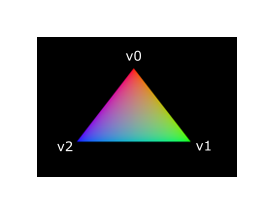

# Vulkan 着色器

## 着色器模块

### 1. 着色器介绍

在 Vulkan 中，着色器代码需要使用 SPIR-V 字节码格式，
这与传统的 [GLSL](https://en.wikipedia.org/wiki/OpenGL_Shading_Language) 
或 [HLSL](https://en.wikipedia.org/wiki/High-Level_Shading_Language) 
等高级着色语言不同。SPIR-V 是 Khronos 组织制定的一种中间表示格式，具有以下优势：

1. **跨平台兼容性**：避免了不同厂商对 GLSL 解释的差异
2. **编译器简化**：GPU 厂商只需处理标准化的字节码
3. **性能优化**：支持更精细的编译器优化

然而，这并不意味着我们需要手动编写此字节码。
我们将使用 GLSL 语法编写代码，并使用 Google 的 `glslc` 工具将代码编译成 SPIR-V 文件。

`glslc` 的优点是它使用与 GCC 和 Clang 等知名编译器相同的参数格式，并包含一些额外的功能，例如includes。
它们都已包含在 Vulkan SDK 中，因此您无需下载任何额外的程序。

### 2. 编码语言介绍

GLSL是一种具有C风格语法的着色语言。

此语言也提供了提供了int/float/bool等基础类型，还有我们熟悉的if/for/while以及结构体和函数（支持重载）。

值得注意的是，它还提供了内置了vec向量和mat矩阵以及各种数学计算函数。

它编写的程序包含一个`main`函数，该函数会针对每个对象进行调用。
比如顶点着色器会对每个顶点调用一遍主函数，片段着色器则是对每个片段（像素）调用一遍主函数。

与常规编程语言不同，GLSL并不依赖参数输入和返回值输出，而是通过全局变量来实现输入与输出操作。
语言本身隐含了一些变量用于输入和输出顶点颜色等数据，还可以定义一些全局变量传输自己需要的数据，你很快就会看到。


## 创建着色器代码文件

正如上一章提到的，我们需要编写一个顶点着色器和一个片段着色器才能在屏幕上获得一个三角形。

1. **顶点着色器 (shader.vert)**：
    - 处理每个顶点数据
    - 输出裁剪坐标和颜色

2. **片段着色器 (shader.frag)**：
    - 处理每个像素片段
    - 输出最终颜色值

现在，让我们在项目根目录创建 `shaders` 文件夹，用于存放着色器源代码，你也可以使用自己喜欢的文件夹名。

然后，在`shaders/`文件夹中创建两个文件：`shader.vert` 和 `shader.frag`。 
注意文件名甚至后缀都是完全任意的，但是我们推荐使用固定的后缀区分不同功能的着色器。

现在你的项目结构应该像这样：

```
│
├── CMakeLists.txt          # 主CMake配置文件
│
├── shaders/                # 着色器源代码目录
│   │
│   ├── shader.vert          # 顶点着色器
│   └── shader.frag          # 片段着色器
│
└── src/                    # 源代码目录
    │
    └── main.cpp            # 主程序入口
```

### 1. 顶点着色器

顶点着色器处理每个传入的顶点。
它以世界位置、颜色、法线和纹理坐标等属性作为输入。
输出是裁剪坐标中的最终位置以及需要传递给片段着色器的属性，例如颜色和纹理坐标。
然后，这些值将由光栅化器在片段上进行插值，以产生平滑的渐变。

*裁剪坐标* 是来自顶点着色器的四维向量，随后通过将整个向量除以其最后一个分量而转换为归一化设备坐标。
这些归一化设备坐标是 [齐次坐标](https://en.wikipedia.org/wiki/Homogeneous_coordinates)，
它们将帧缓冲映射到 [-1, 1] x [-1, 1] 坐标系，如下所示


如果您之前涉足过计算机图形学，那么您应该已经熟悉这些概念。
如果您以前使用过 OpenGL，那么您会注意到 Y 坐标的符号现在已翻转。
Z 坐标现在使用的范围与 Direct3D 中的范围相同，从 0 到 1。

对于我们的第一个三角形，我们不会应用任何变换，我们将直接将三个顶点的位置指定为归一化设备坐标，以创建以下形状


通常，这些坐标将存储在顶点缓冲中，但在 Vulkan 中创建顶点缓冲并用数据填充它并非易事。
因此，我决定将其推迟到我们画出第一个基础三角形之后。
在此期间，我们将做一些不太寻常的事情：直接在顶点着色器中包含坐标。代码如下所示

```glsl
#version 450

vec2 positions[3] = vec2[](
    vec2(0.0, -0.5),
    vec2(0.5, 0.5),
    vec2(-0.5, 0.5)
);

void main() {
    gl_Position = vec4(positions[gl_VertexIndex], 0.0, 1.0);
}
```

`main` 函数为每个顶点调用。
内置的 `gl_VertexIndex` 变量包含当前顶点的索引。
这通常是顶点缓冲的索引，但在我们的例子中，它将是硬编码顶点数据数组的索引。
每个顶点的位置从着色器中的常量数组访问，并与虚拟的 `z` 和 `w` 分量组合以生成裁剪坐标中的位置。
内置变量 `gl_Position` 用作输出。


### 2. 片段着色器

由顶点着色器中的位置形成的三角形在屏幕上填充一个区域，其中包含片段。
片段着色器在这些片段上调用，以生成帧缓冲（或多个帧缓冲）的颜色和深度。
一个简单的片段着色器，为整个三角形输出红色，如下所示

```glsl
#version 450

layout(location = 0) out vec4 outColor;

void main() {
    outColor = vec4(1.0, 0.0, 0.0, 1.0);
}
```

`main` 函数为每个片段调用，就像顶点着色器的 `main` 函数为每个顶点调用一样。
GLSL 中的颜色是 4 分量向量，R、G、B 和 alpha 通道在 [0, 1] 范围内。
与顶点着色器中的 `gl_Position` 不同，没有内置变量来输出当前片段的颜色。
您必须为每个帧缓冲指定自己的输出变量，其中 `layout(location = 0)` 修饰符指定帧缓冲的索引。
红色被写入此 `outColor` 变量，该变量链接到索引 `0` 处的第一个（也是唯一的）帧缓冲。

> 注意，in和out的变量名是不重要的，重要的是变量类型和location的值。
> 只要保证类型和location都一致，就能一个地方out，另一个地方in。  
> 一个location不能同时放置多个数据。

### 3. 逐顶点颜色

将整个三角形变成红色不是很吸引人，像下面这样的效果看起来不是更漂亮吗？



我们必须对两个着色器进行一些更改才能实现此目的。
首先，我们需要为三个顶点中的每一个指定不同的颜色。
顶点着色器现在应该包含一个颜色数组，就像它对位置所做的那样

```glsl
vec3 colors[3] = vec3[](
    vec3(1.0, 0.0, 0.0),
    vec3(0.0, 1.0, 0.0),
    vec3(0.0, 0.0, 1.0)
);
```

现在我们只需要将这些逐顶点颜色传递给片段着色器，以便它可以将其插值输出到帧缓冲。
向顶点着色器添加颜色输出并在 `main` 函数中写入它

```glsl
layout(location = 0) out vec3 fragColor;

void main() {
    gl_Position = vec4(positions[gl_VertexIndex], 0.0, 1.0);
    fragColor = colors[gl_VertexIndex];
}
```

接下来，我们需要在片段着色器中添加一个匹配的输入

```glsl
layout(location = 0) in vec3 fragColor;

void main() {
    outColor = vec4(fragColor, 1.0);
}
```

`main` 函数已修改为输出颜色以及 `alpha` 值。图形管线将使用三个顶点的数据，自动插值生成内部片段的`fragColor` ，从而产生平滑的渐变。

### 4. 编译着色器

现在 `shader.vert` 的内容应该是

```glsl
#version 450

layout(location = 0) out vec3 fragColor;

vec2 positions[3] = vec2[](
    vec2(0.0, -0.5),
    vec2(0.5, 0.5),
    vec2(-0.5, 0.5)
);

vec3 colors[3] = vec3[](
    vec3(1.0, 0.0, 0.0),
    vec3(0.0, 1.0, 0.0),
    vec3(0.0, 0.0, 1.0)
);

void main() {
    gl_Position = vec4(positions[gl_VertexIndex], 0.0, 1.0);
    fragColor = colors[gl_VertexIndex];
}
```

`shader.frag` 的内容应该是

```glsl
#version 450

layout(location = 0) in vec3 fragColor;

layout(location = 0) out vec4 outColor;

void main() {
    outColor = vec4(fragColor, 1.0);
}
```

我们现在将使用 glslc 程序将它们编译为 SPIR-V 字节码。命令大概是这样的：

```shell
# window
xxx/VulkanSDK/x.x.x.x/Bin/glslc.exe shader.vert -o vert.spv
xxx/VulkanSDK/x.x.x.x/Bin/glslc.exe shader.frag -o frag.spv
# linux
/home/user/VulkanSDK/x.x.x.x/x86_64/bin/glslc shader.vert -o vert.spv
/home/user/VulkanSDK/x.x.x.x/x86_64/bin/glslc shader.frag -o frag.spv
```

这两个命令告诉编译器读取 GLSL 源文件，并使用 `-o`（输出）标志输出 SPIR-V 字节码文件。

如果您的着色器包含语法错误，那么编译器会告诉您行号和问题，正如您所期望的那样。
例如，尝试省略分号并再次运行编译脚本。
还可以尝试在没有任何参数的情况下运行编译器，以查看它支持哪些类型的标志。
例如，它还可以将字节码输出为人类可读的格式，以便您可以准确地了解您的着色器正在做什么以及在此阶段已应用的任何优化。

在命令行上编译着色器是最直接的选择之一，也是我们将在本教程中使用的选择，但也可以直接从您自己的代码中编译着色器。
Vulkan SDK 包含 libshaderc，这是一个从您的程序中将 GLSL 代码编译为 SPIR-V 的库。

### 5. CMake编译着色器

直接命令行显然不够优秀，且写明路径导致无法跨平台，所以我们借助CMake执行命令。

现在让我们在 `shaders/` 文件夹中创建新的 `CMakeLists.txt`，内容如下所示：

```cmake
cmake_minimum_required(VERSION 3.30)

find_package(Vulkan REQUIRED)

set(SHADER_DIR ${CMAKE_CURRENT_SOURCE_DIR})
set(VERT_SHADER ${SHADER_DIR}/shader.vert)
set(FRAG_SHADER ${SHADER_DIR}/shader.frag)
set(SPIRV_VERT ${SHADER_DIR}/vert.spv)
set(SPIRV_FRAG ${SHADER_DIR}/frag.spv)

add_custom_command(
    OUTPUT ${SPIRV_VERT}
    COMMAND ${Vulkan_GLSLC_EXECUTABLE} ${VERT_SHADER} -o ${SPIRV_VERT}
    COMMENT "Compiling shader.vert to vert.spv"
    DEPENDS ${VERT_SHADER}
)

add_custom_command(
    OUTPUT ${SPIRV_FRAG}
    COMMAND ${Vulkan_GLSLC_EXECUTABLE} ${FRAG_SHADER} -o ${SPIRV_FRAG}
    COMMENT "Compiling shader.frag to frag.spv"
    DEPENDS ${FRAG_SHADER}
)

add_custom_target(CompileShaders ALL
    DEPENDS ${SPIRV_VERT} ${SPIRV_FRAG}
)
```

我们通过 `find_package(Vulkan REQUIRED)` 命令找到包后，会提供一系列的变量。
而 `Vulkan_GLSLC_EXECUTABLE` 变量指定了 `glslc` 的路径。

我们通过设置变量，避免了在命令中硬编码文件名。然后通过添加命令和目标，使我们可以通过统一命令执行着色器的编译。

现在还需要在项目根目录的 `CMakeLists.txt` 包含子目录，才能自动加入这一目标。
请在项目根目录的 `CMakeLists.txt` 末尾中添加一条语句。

```cmake
add_subdirectory(shaders)
```

现在配置与构建项目，shaders下应该生成了 `frag.spv` 和 `vert.spv` 两个文件。

## 加载着色器

现在我们有了一种生成 SPIR-V 着色器的方法，是时候将它们加载到我们的程序中，以便在某个时候将它们插入到图形管线中。
我们将首先编写一个简单的辅助函数，从文件中加载二进制数据。

```cpp
#include <fstream>

// ...

static std::vector<char> readFile(const std::string& filename) {
    std::ifstream file(filename, std::ios::ate | std::ios::binary);

    if (!file.is_open()) {
        throw std::runtime_error("failed to open file!");
    }
}
```

`readFile` 函数将从指定文件中读取所有字节，并将它们作为由 `std::vector` 管理的字节数组返回。我们首先使用两个标志打开文件

- `ate`：从文件末尾开始读取
- `binary`：将文件作为二进制文件读取（避免文本转换）

从文件末尾开始读取的优点是我们可以使用读取位置来确定文件的大小并分配缓冲区

```cpp
size_t fileSize = (size_t) file.tellg();
std::vector<char> buffer(fileSize);
```

之后，我们可以seek回到文件开头并一次读取所有字节

```cpp
file.seekg(0);
file.read(buffer.data(), fileSize);
```

最后关闭文件并返回字节

```cpp
file.close();

return buffer;
```

我们现在将从 `createGraphicsPipeline` 调用此函数，以加载两个着色器的字节码

```cpp
void createGraphicsPipeline() {
    auto vertShaderCode = readFile("shaders/vert.spv");
    auto fragShaderCode = readFile("shaders/frag.spv");
    std::cout << "vertShaderCode.size(): " << vertShaderCode.size() << std::endl;
    std::cout << "fragShaderCode.size(): " << fragShaderCode.size() << std::endl;
}
```

我们通过打印缓冲区的大小并检查它们是否与字节的实际文件大小匹配，确保着色器已正确加载。

> 注意我们使用了相对路径，这要求你运行可执行程序时，当前路径必须位于项目根目录。
>
> 或者你可以将着色器文件夹复制一份到你的执行目录。

## 创建着色器模块

### 1. 读取着色器代码

在我们可以将代码传递给管线之前，我们必须将其包装在 `vk:ShaderModel` 对象中。让我们创建一个辅助函数 `createShaderModule` 来执行此操作。

```cpp
vk::raii::ShaderModule createShaderModule(const std::vector<char>& code) {

}
```

该函数将采用带有字节码的缓冲区作为参数，并从中创建 `vk::raii::ShaderModule` 。

创建着色器模块很简单，我们只需要指定指向带有字节码的缓冲区的指针及其长度。
此信息在 `vk::ShaderModuleCreateInfo` 结构中指定。
需要注意的一点是，字节码的大小以字节为单位指定，但字节码指针是 uint32_t 指针，而不是 char 指针。
因此，我们需要使用 `reinterpret_cast` 强制转换指针，如下所示。
当您执行这样的强制转换时，还需要确保数据满足 uint32_t 的对齐要求。
幸运的是，数据存储在 `std::vector` 中，其中默认分配器已经确保数据满足最坏情况的对齐要求。

```cpp
vk::ShaderModuleCreateInfo createInfo(
    {},             // flags
    code.size(),    // codeSize
    reinterpret_cast<const uint32_t*>(code.data()) // pCode
);
```

然后我们创建 `vk::raii::ShaderModule` 并返回即可。

```cpp
return m_device.createShaderModule(createInfo);
```

>  `vk::raii` 内的大部分变量不可复制，只可移动，这里直接返回保证是右值，是移动。

着色器模块只是我们之前从文件加载的着色器字节码以及其中定义的函数的薄包装。
SPIR-V 字节码到由 GPU 执行的机器代码的编译和链接直到图形管线创建才发生。
这意味着我们可以在管线创建完成后立即再次销毁着色器模块，
这就是为什么我们将它们作为 `createGraphicsPipeline` 函数中的局部变量而不是类成员的原因

```cpp
void createGraphicsPipeline() {
    auto vertShaderCode = readFile("shaders/vert.spv");
    auto fragShaderCode = readFile("shaders/frag.spv");

    vk::raii::ShaderModule vertShaderModule = createShaderModule(vertShaderCode);
    vk::raii::ShaderModule fragShaderModule = createShaderModule(fragShaderCode);
}
```

### 2. 创建着色器阶段

要实际使用着色器，我们需要通过 `vk::PipelineShaderStageCreateInfo` 结构将它们分配给特定的管线阶段，作为实际管线创建过程的一部分。

我们将从填充顶点着色器的结构开始，同样在 `createGraphicsPipeline` 函数中。

```cpp
vk::PipelineShaderStageCreateInfo vertShaderStageInfo(
    {},                                 // flags
    vk::ShaderStageFlagBits::eVertex,   // stage
    vertShaderModule,                   // ShaderModule
    "main"                              // pName
);
```

`stage` 字段指定了着色器在哪个阶段工作。
接下来的两个字段指定包含代码的着色器模块以及要调用的函数，称为入口点。
这意味着可以将多个片段着色器组合到一个着色器模块中，并使用不同的入口点来区分它们的行为。
在我们当前情况下，将坚持标准的 `main`。

还有一个（可选）成员 `pSpecializationInfo`，我们在这里不会使用它，但值得讨论。
它允许您为着色器常量指定值。您可以使用单个着色器模块，其中可以通过在管线创建时为其使用的常量指定不同的值来配置其行为。
这比在渲染时使用变量配置着色器更有效，因为编译器可以进行优化，例如消除依赖于这些值的 `if` 语句。
如果您没有任何这样的常量，那么您可以将该成员设置为 `nullptr`，我们的构造函数会自动执行此操作。

片段着色器和上面的代码差不多，记得修改 `stage` 字段。

```cpp
vk::PipelineShaderStageCreateInfo fragShaderStageInfo(
    {},                                 // flags
    vk::ShaderStageFlagBits::eFragment, // stage
    fragShaderModule,                   // ShaderModule
    "main"                              // pName
);
```

最后，定义一个包含这两个结构的数组，我们稍后将在实际的管线创建步骤中使用它来引用它们。

```cpp
std::vector<vk::PipelineShaderStageCreateInfo> shaderStages{ vertShaderStageInfo, fragShaderStageInfo };
```

## 测试

这就是描述管线的可编程阶段的全部内容，你可以尝试运行程序，不应报错。

---

在下一章中，我们将研究固定功能阶段。

---

**[C++代码](../codes/0121_shader/main.cpp)**

**[C++代码差异](../codes/0121_shader/main.diff)**

**[根项目CMake代码](../codes/0121_shader/CMakeLists.txt)**

**[根项目CMake代码差异](../codes/0121_shader/CMakeLists.diff)**

**[shader-CMake代码](../codes/0121_shader/shaders/CMakeLists.txt)**

**[shader-vert代码](../codes/0121_shader/shaders/shader.vert)**

**[shader-frag代码](../codes/0121_shader/shaders/shader.frag)**
