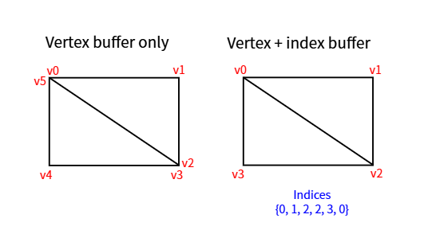
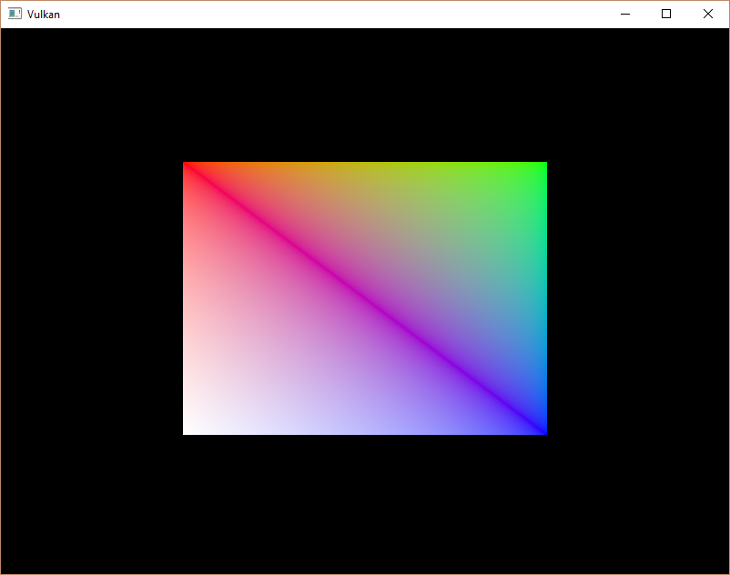

# **索引缓冲**

## **前言**

实际上需要渲染的3D网格会频繁出现顶点被多个三角形共用的情况，即使是最简单的矩形：



绘制它需要2个三角形，也就是6个顶点。
如果像我们代码中写的那样每个顶点需要2个位置坐标和3个色彩通道，那就需要30个数据。
但实际上我们只有4个不同的顶点，这里存在数据冗余。

一种聪明的方式是为每个顶点分配索引，然后只需要4个顶点数据和一个索引数组，只需26个数据。
这里的优化似乎不太明显，但实际应用中的顶点重复会非常多，此时使用索引数组可以显著降低数据量。

## **创建索引数组**

绘制矩形需要四个顶点，所以我们先修改代码中的顶点数据：

```cpp
inline static const std::vector<Vertex> vertices = {
    {{-0.5f, -0.5f}, {1.0f, 0.0f, 0.0f}},
    {{0.5f, -0.5f}, {0.0f, 1.0f, 0.0f}},
    {{0.5f, 0.5f}, {0.0f, 0.0f, 1.0f}},
    {{-0.5f, 0.5f}, {1.0f, 1.0f, 1.0f}}
};
```

左上角红色，右上角绿色，右下角蓝色，左下角白色。

然后我们编写顶点索引数组，为2个三角形所需的6个顶点分配索引：

```cpp
inline static const std::vector<uint16_t> indices = {
    0, 1, 2, 2, 3, 0
};
```

你可以使用`uint16_t`或`uint32_t`，我们这里使用前者，因为我们需要的索引数很少（不超过65535）。

和顶点缓冲一样，我们也需要索引缓冲和缓冲内存。现在添加两个成员变量：

```cpp
vk::raii::DeviceMemory m_vertexBufferMemory{ nullptr };
vk::raii::Buffer m_vertexBuffer{ nullptr };
vk::raii::DeviceMemory m_indexBufferMemory{ nullptr };
vk::raii::Buffer m_indexBuffer{ nullptr };
```

然后创建一个`createIndexBuffer`函数，内容参考`createVertexBuffer`：

```cpp
void initVulkan() {
    ......
    createVertexBuffer();
    createIndexBuffer();
    ......
}

void createIndexBuffer() {
    vk::DeviceSize bufferSize = sizeof(indices[0]) * indices.size();

    vk::raii::DeviceMemory stagingBufferMemory{ nullptr };
    vk::raii::Buffer stagingBuffer{ nullptr };
    createBuffer(bufferSize, 
        vk::BufferUsageFlagBits::eTransferSrc, 
        vk::MemoryPropertyFlagBits::eHostVisible | 
        vk::MemoryPropertyFlagBits::eHostCoherent,
        stagingBuffer, 
        stagingBufferMemory
    );

    void* data = stagingBufferMemory.mapMemory(0, bufferSize);
    memcpy(data, indices.data(), static_cast<size_t>(bufferSize));
    stagingBufferMemory.unmapMemory();

    createBuffer(bufferSize, 
        vk::BufferUsageFlagBits::eTransferDst |
        vk::BufferUsageFlagBits::eIndexBuffer, 
        vk::MemoryPropertyFlagBits::eDeviceLocal,
        m_indexBuffer, 
        m_indexBufferMemory
    );

    copyBuffer(stagingBuffer, m_indexBuffer, bufferSize);
}
```

这个顶点缓冲的创建代码基本一致，我们将顶点缓冲的变量换成了索引缓冲的。
唯一需要注意的是，创建索引缓冲时修改了`vk::BufferUsageFlagBits`，使用`eIndexBuffer`而不是`eVertexBuffer`。

## **使用索引缓冲**

我们需要修改 `recordCommandBuffer` 的两个地方。首先需要绑定索引缓冲，和绑定顶点缓冲基本一致。
特殊的是我们只能绑定一个索引缓冲，即使只有一个索引数据发生变化，也需要拷贝更新整个索引缓冲区。

```cpp
// vk::Buffer vertexBuffers[] = { m_vertexBuffer };
// vk::DeviceSize offsets[] = { 0 };
commandBuffer.bindVertexBuffers( 0, *m_vertexBuffer, vk::DeviceSize{0} );
commandBuffer.bindIndexBuffer( m_indexBuffer, 0, vk::IndexType::eUint16 );
```

我们略微调整了顶点缓冲的绑定代码，因为我们只有一个顶点缓冲。
索引缓冲的第二个参数是偏移量，第三个参数是索引使用的类型。

仅仅绑定是不够的，我们需要使用`drawIndexed`代替`draw`。

```cpp
// commandBuffer.draw(static_cast<uint32_t>(vertices.size()), 1, 0, 0);
commandBuffer.drawIndexed(static_cast<uint32_t>(indices.size()), 1, 0, 0, 0);
```

这里的五个参数分别是：索引数量、实例数量、索引开始序号、顶点偏移、实例开始序号。

我们暂时不使用实例渲染，所以全部数据都处于同一个实例中。

## **最后**

现在可以运行程序，你应该看到这样一副图像：



你现在已经知道了如何使用索引缓冲节省内存，这非常重要，因为我们后面会导入复杂的3D模型。

> 你大概还发现了一点，顶点缓冲需要在管线创建时添加描述信息，但索引缓冲不需要。  
> 因为索引数据的内容足够简单，你完全可以修改索引而不影响管线。

---

前一章的末尾提到了你应该使用内存分配器，从单个内存分配多个资源。
但实际上你还应该更进一步，[驱动程序开发者建议](https://developer.nvidia.com/vulkan-memory-management)你将多个缓冲区合并到一个`vk::Buffer`中，并在使用时通过偏移量区分不同的缓冲区。
这样做对于缓存更加友好，因为数据更加紧凑。

如果多个资源在同一渲染操作期间未使用，甚至可以重用相同的内存块，当然前提是它们的数据已刷新。
这中内存的重用在计算机图形学中被称为 **别名（Aliasing）**。

---

**[C++代码](../../codes/02/10_indexbuffer/main.cpp)**

**[C++代码差异](../../codes/02/10_indexbuffer/main.diff)**

**[根项目CMake代码](../../codes/02/00_vertexinput/CMakeLists.txt)**

**[shader-CMake代码](../../codes/02/00_vertexinput/shaders/CMakeLists.txt)**

**[shader-vert代码](../../codes/02/00_vertexinput/shaders/shader.vert)**

**[shader-frag代码](../../codes/02/00_vertexinput/shaders/shader.frag)**
