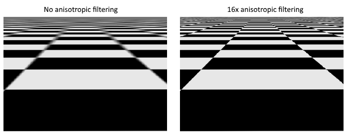

# **图像视图与采样器**

本节我们将创建两个着色器对图像进行采样所需的资源。
第一个是图像视图\(ImageView\)，我们在交换链的章节已经见过了。
第二个是采样器\(Sampler\)，它决定了着色器如何读取图像中的纹素。

## **纹理图像视图**

### 1. 创建纹理图像视图

我们在帧缓冲与交换链那几章创建过图像视图，现在要为纹理图像创建对应的视图。

首先在纹理图像`m_textureImage`下面添加新的成员变量，然后添加函数用于创建：

```cpp
vk::raii::Image m_textureImage{ nullptr };
vk::raii::ImageView m_textureImageView{ nullptr };

...

void initVulkan() {
    ...
    createTextureImage();
    createTextureImageView();
    ...
}

...

void createTextureImageView() {

}
```

创建的代码可以参考 `createImageViews`， 我们只需要修改`format`和`image`字段：

```cpp
vk::ImageViewCreateInfo viewInfo;
viewInfo.image = m_textureImage;
viewInfo.viewType = vk::ImageViewType::e2D;
viewInfo.format = vk::Format::eR8G8B8A8Srgb;
viewInfo.subresourceRange.aspectMask = vk::ImageAspectFlagBits::eColor;
viewInfo.subresourceRange.baseMipLevel = 0;
viewInfo.subresourceRange.levelCount = 1;
viewInfo.subresourceRange.baseArrayLayer = 0;
viewInfo.subresourceRange.layerCount = 1;

m_textureImageView = m_device.createImageView(viewInfo);
```

### 2. 优化代码结构

我们重复写了很多逻辑，现在可以把他们抽象成当个函数 `createImageView` ：

```cpp
vk::raii::ImageView createImageView(const vk::Image image,const vk::Format format) const {
    vk::ImageViewCreateInfo viewInfo;
    viewInfo.image = image;
    viewInfo.viewType = vk::ImageViewType::e2D;
    viewInfo.format = format;
    viewInfo.subresourceRange.aspectMask = vk::ImageAspectFlagBits::eColor;
    viewInfo.subresourceRange.baseMipLevel = 0;
    viewInfo.subresourceRange.levelCount = 1;
    viewInfo.subresourceRange.baseArrayLayer = 0;
    viewInfo.subresourceRange.layerCount = 1;

    return m_device.createImageView(viewInfo);
}
```

现在 `createTextureImageView` 可以改成这样：

```cpp
void createTextureImageView() {
    m_textureImageView = createImageView(m_textureImage, vk::Format::eR8G8B8A8Srgb);
}
```

而 `createImageViews` 可以改成这样：

```cpp
void createImageViews() {
    m_swapChainImageViews.reserve( m_swapChainImages.size() );
    for (const auto& image : m_swapChainImages) {
        m_swapChainImageViews.emplace_back( createImageView(image, m_swapChainImageFormat) );
    }
}
```

## **采样器**

### 1. 采样器介绍

虽然着色器可以之间从图像中读取纹素，但这对于纹理读取并不常见。
纹理通常通过采样器读取，它可以对纹素实现一些过滤和变换操作然后得到最终色彩。

过滤器可以处理类似超采样的问题，考虑把纹理图像映射到一个像素更多的几何体，如果采样时直接选取最近的纹素，就会出现显著的马赛克效应，像下方的第一幅图片一样：


如果你通过周围的四个纹素进行线性插值，就可以得到右边更平滑的图片。

当然，有部分应用更希望得到左边的艺术效果（比如 [Minecraft](https://www.minecraft.net/zh-hans)），但大多数应用都希望得到右侧更平衡的效果。
本教程的过滤器将使用线性差值，但会提及如何只选用最近纹素实现左图效果。

欠采样是相反的问题，将纹理图像映射到一个像素更少的几何体。当以锐角采样高频图案（如棋盘纹理）时，这将导致伪影



如左图所示，远程纹理变得混乱。解决此问题的方法是 各向异性过滤 ，它也可以由采样器设置。

> 超采样与欠采样，mipmap与各向异性过滤，都在闫令琪老师的 [GAMES101](https://www.bilibili.com/video/av90798049) 课程中有过介绍。

除了过滤，采样器还可以指定 寻址模式(AddressMode) 处理一些变换，比如索引超出图像范围时显示什么内容：


### 2. 创建采样器

现在创建新函数 `createTextureSampler` 用于创建采样器，放在纹理图像创建函数的下方：

```cpp
void initVulkan() {
    ...
    createTextureImage();
    createTextureImageView();
    createTextureSampler();
    ...
}

...

void createTextureSampler() {

}
```

然后添加 `CreateInfo` 结构体，指定我们需要的过滤器和变换类型：

```cpp
vk::SamplerCreateInfo samplerInfo;
samplerInfo.magFilter = vk::Filter::eLinear;
samplerInfo.minFilter = vk::Filter::eLinear;
```

`magFilter` 和 `minFilter` 指定了如何插值放大或缩小的像素，放大对应过采样，缩小对应欠采样。
我们指定 `eLinear` 表示线性差值，你可以使用 `eNearest` 像 Minecraft 一样保留最近的单点色彩。

可以使用 `addressMode` 字段按轴指定寻址模式。 

```cpp
samplerInfo.addressModeU = vk::SamplerAddressMode::eRepeat;
samplerInfo.addressModeV = vk::SamplerAddressMode::eRepeat;
samplerInfo.addressModeW = vk::SamplerAddressMode::eRepeat;
```

注意，轴称为 U、V 和 W 而不是 X、Y 和 Z，这是纹理空间坐标的约定。
下面给出此字段的可用值， 其中大多数在上面的图像中有演示：

| vk::SamplerAddressMode | 效果                   |
|------------------------|----------------------|
| `eRepeat`              | 当超出图像尺寸时重复纹理         |
| `eMirroredRepeat`      | 重复，但超出尺寸时反转坐标得到镜像图像  |
| `eClampToEdge`         | 超出时获取图像的最近边缘的颜色      |
| `eMirrorClampToEdge`   | 类似边缘裁剪，但是使用的是对称边缘的颜色 |
| `eClampToBorder`       | 超出时返回固定色彩            |

现在不需要关心使用哪种寻址模式，因为本教程不会超出图像范围，这些模式的效果都一样。
不过需要说明的是， `eRepeat` 可能是最常用的模式，因为它在绘制地面/墙体等纹理时很好用。

下面设置是否启用各向异性性过滤(anisotropy filter)。
除非你对性能要求极高而图像效果要求较低，否则没理由不启用它。

```cpp
samplerInfo.anisotropyEnable = true;
samplerInfo.maxAnisotropy = ???;
```

`maxAnisotropy`字段限制了各向异性过滤通过沿视角方向额外采样数量，较小的值可以带来较好的性能。
现在我们检索物理设备属性，从而为它设置合适的值：

```cpp
const auto properties = m_physicalDevice.getProperties();
```

如果你仔细看过 `vk::PhysicalDeviceProperties` 的文档，你会知道它有个 `limits` 成员，内部有个 `maxSamplerAnisotropy` 成员限制了各向异性过滤的最大值，我们可以直接用它:

```cpp
samplerInfo.maxAnisotropy = properties.limits.maxSamplerAnisotropy;
```

使用 `borderColor` 指定 `eClampToBorder` 寻址模式时超出范围返回的色彩。
虽然我们没用此模式，依然需要填写，且可选内容是有限的：

```cpp
samplerInfo.borderColor = vk::BorderColor::eIntOpaqueBlack;
```

然后使用 `unnormalizedCoordinates` 指定坐标系的类型。

- `true`: `[0, texWidth)` 和 `[0, texHeight)` 范围内的坐标
- `false`: 同一使用 `[0,1)` 的归一化坐标。

实际应用程序几乎总是使用归一化坐标，这样就可以使用具有完全相同坐标但不同分辨率的纹理。

```cpp
samplerInfo.unnormalizedCoordinates = false;
```

还可以指定比较函数，启用后纹素将先与一个值进行比较，并且该比较的结果用于过滤操作。
这主要用于阴影贴图上的 [百分比接近过滤](https://developer.nvidia.com/gpugems/GPUGems/gpugems_ch11.html)。 
我们将在以后的章节中讨论这一点，现在先禁用它：

```cpp
samplerInfo.compareEnable = false;
samplerInfo.compareOp = vk::CompareOp::eAlways;
```

最后设置 mipmapping，这在GAMES101中有过介绍，我们将在后面的章节讨论它。

```cpp
samplerInfo.mipmapMode = vk::SamplerMipmapMode::eLinear;
samplerInfo.mipLodBias = 0.0f;
samplerInfo.minLod = 0.0f;
samplerInfo.maxLod = 0.0f;
```

现在可以添加新的成员变量`m_textureSampler`并创建它了：

```cpp
vk::raii::ImageView m_textureImageView{ nullptr };
vk::raii::Sampler m_textureSampler{ nullptr };

......

m_textureSampler = m_device.createSampler(samplerInfo);
```

注意，采样器的创建并没有用到`vk::Image`，它是一个独立的对象，提供了从纹理中提取颜色的接口。
它可以应用于你想要的任何图像，无论是1D、2D还是3D。
这与需要旧API不同，他们将纹理图像和过滤组合在了一起。

### 3. 各向异性过滤设备特性

如果你现在运行你的程序，你将看到这样的验证层消息


这是因为各向异性过滤实际上是一个可选的设备特性。 我们需要更新 `createLogicalDevice` 函数来启用它

```cpp
vk::PhysicalDeviceFeatures deviceFeatures;
deviceFeatures.samplerAnisotropy = true;
```

即使现代显卡不太可能不支持它，我们也应该更新 `isDeviceSuitable` 以检查它是否可用

```cpp
bool isDeviceSuitable(const vk::raii::PhysicalDevice& physicalDevice) const {
    ...

    if (const auto supportedFeatures = physicalDevice.getFeatures();
        !supportedFeatures.samplerAnisotropy
    ) return false;
    
    ...
}
```

当然除了强制启用，你也可以通过布尔值简单的禁用它：

```cpp
samplerInfo.anisotropyEnable = false;
samplerInfo.maxAnisotropy = 1.0f;
```

## **测试**

现在运行程序，效果依然不变，但应该没有错误发生。

在下一章中，我们将向着色器公开图像和采样器对象，以将纹理绘制到正方形上。

---


**[C++代码](../../codes/02/31_sampler/main.cpp)**

**[C++代码差异](../../codes/02/31_sampler/main.diff)**

**[根项目CMake代码](../../codes/02/20_descriptor1/CMakeLists.txt)**

**[shader-CMake代码](../../codes/02/20_descriptor1/shaders/CMakeLists.txt)**

**[shader-vert代码](../../codes/02/20_descriptor1/shaders/graphics.vert.glsl)**

**[shader-frag代码](../../codes/02/20_descriptor1/shaders/graphics.frag.glsl)**

---
