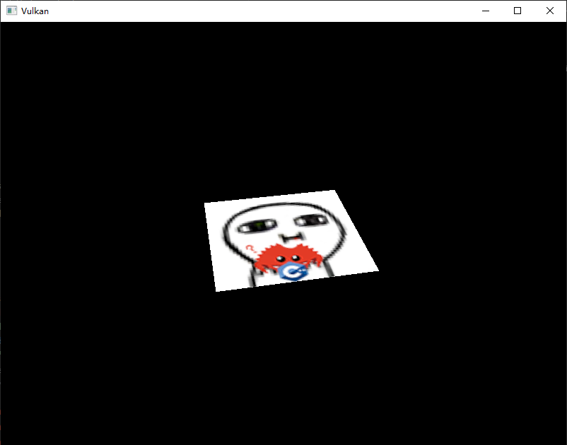
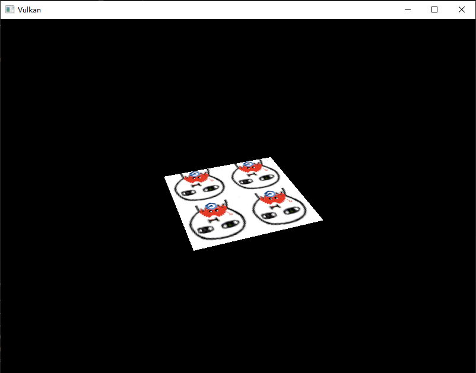
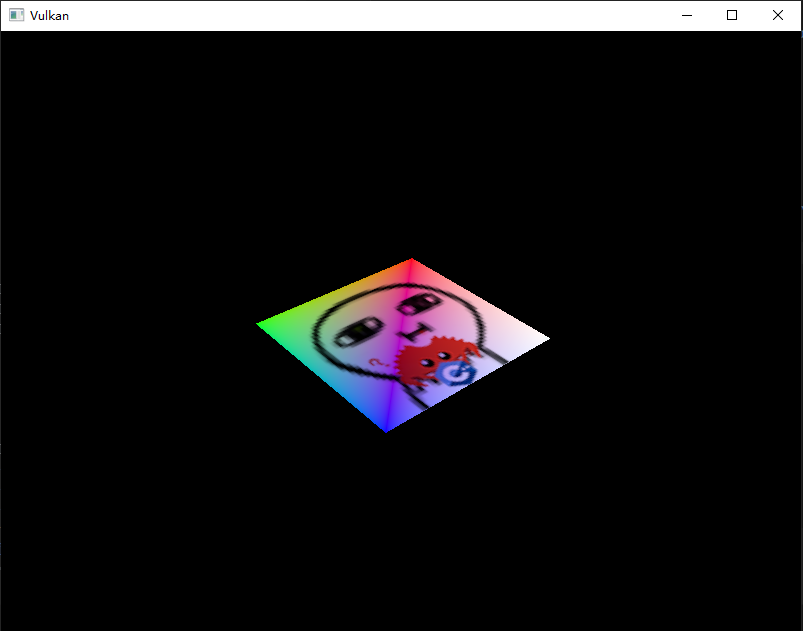

# **组合图像采样器**

## **前言**

我们在uniform缓冲的章节介绍了一种描述符，本章我们将看到新的一种：**组合图像采样器\(Combined image sampler\)**。
此描述符允许着色器通过采样器实例访问图像资源。

我们会修改描述符布局/池/集，从而加入一个组合图像采样器。
然后用我们的`Vertex`结构添加纹理坐标，并修改片段着色器让它使用纹理色彩。

> 顾名思义，此描述符绑定了图像和采样器二者。
> 事实上还有“分离的图像与采样器”描述符，也就是为图像和采样器提供两个独立的描述符，我们会在后面的章节介绍。

## **更新描述符**

### 1. 修改描述符布局

虽然我们有多个飞行中的帧，但它们可以共用一个组合图像采样器描述符。
我们之前的描述符集会被创建多份（用于多个飞行中的帧），这有些浪费资源，所以更推荐使用一个新的描述符集专门存放组合图像采样器描述符。

首先修改 `m_descriptorSetLayout` 变量，改为数组类型。

```cpp
// 这里还修改了变量名，末尾多了个 s
std::vector<vk::raii::DescriptorSetLayout> m_descriptorSetLayouts;
```

然后调整 `createDescriptorSetLayout` 函数：

```cpp
void createDescriptorSetLayout() {
    vk::DescriptorSetLayoutBinding uboLayoutBinding;
    ...

    vk::DescriptorSetLayoutCreateInfo uboLayoutInfo;
    uboLayoutInfo.setBindings( uboLayoutBinding );
    m_descriptorSetLayouts.emplace_back( m_device.createDescriptorSetLayout( uboLayoutInfo ) );
}
```

现在可以添加组合图像采样器描述符的布局绑定。

```cpp
vk::DescriptorSetLayoutBinding samplerLayoutBinding;
samplerLayoutBinding.binding = 0; // 新描述符集，因此依然从 0 开始
samplerLayoutBinding.descriptorType = vk::DescriptorType::eCombinedImageSampler;
samplerLayoutBinding.descriptorCount = 1;
samplerLayoutBinding.stageFlags = vk::ShaderStageFlagBits::eFragment;
vk::DescriptorSetLayoutCreateInfo samplerLayoutInfo;

samplerLayoutInfo.setBindings( samplerLayoutBinding );
m_descriptorSetLayouts.emplace_back( m_device.createDescriptorSetLayout( samplerLayoutInfo ) );
```

确保使用 `stageFlags` 指定了我们希望在片段着色器使用组合图像采样器描述符，因为我们将在此阶段决定片段的颜色。
不过在顶点着色器阶段使用纹理采样也是有可能的，比如通过 [高度图](https://en.wikipedia.org/wiki/Heightmap) 动态变形顶点网格。

### 2. 更新管线布局

我们增加了一个描述符集布局并调整了变量名，所以需要更新管线布局：

```cpp
void createGraphicsPipeline() {
    ......

    vk::PipelineLayoutCreateInfo pipelineLayoutInfo;
    // 获取内部句柄的数组
    const std::vector<vk::DescriptorSetLayout> descriptorSetLayouts(m_descriptorSetLayouts.begin(), m_descriptorSetLayouts.end());
    pipelineLayoutInfo.setSetLayouts(descriptorSetLayouts);
    m_pipelineLayout = m_device.createPipelineLayout( pipelineLayoutInfo );

    ......
}
```

### 3. 修改描述符池

还需要调整描述符池，为组合图像采样器的分配腾出空间。
只需 `vk::DescriptorPoolCreateInfo` 添加 `vk::DescriptorType::eCombinedImageSampler`类型的 PoolSize 即可。

现在回到 `createDescriptorPool` 函数并修改代码：

```cpp
std::array<vk::DescriptorPoolSize, 2> poolSizes;
poolSizes[0].type = vk::DescriptorType::eUniformBuffer;
poolSizes[0].descriptorCount = static_cast<uint32_t>(MAX_FRAMES_IN_FLIGHT);
poolSizes[1].type = vk::DescriptorType::eCombinedImageSampler;
poolSizes[1].descriptorCount = 1;

vk::DescriptorPoolCreateInfo poolInfo;
poolInfo.flags = vk::DescriptorPoolCreateFlagBits::eFreeDescriptorSet;
poolInfo.setPoolSizes( poolSizes );
poolInfo.maxSets = static_cast<uint32_t>(MAX_FRAMES_IN_FLIGHT) + 1;

m_descriptorPool = m_device.createDescriptorPool(poolInfo);
```

调用 `allocateDescriptorSets` 时，如果描述符池的大小不足，可能会抛出 `vk::OutOfPoolMemoryError` 异常。
但某些情况下，驱动程序可能会尝试内部解决这个问题（例如隐式扩展池），因此分配可能会成功，即使超出了池的初始限制。
因此，同一段代码在某些设备上可能成功，而在其他设备上可能失败。

尽管驱动程序可能允许超限分配，但开发者仍应遵循描述符池的初始限制。这是为了避免潜在的性能问题或兼容性问题。

> `maxSets` 指定可分配的描述符集合的最大数量  
> `poolSizeCount` 指定描述符的类型数  
> `descriptorCount` 指定可分配的单种类描述符的最大数量

### 4. 创建描述符集

创建一个新的描述符集成员变量，用于存储组合图像采样器的描述符集。

```cpp
vk::raii::DescriptorSet m_combinedDescriptorSet{ nullptr };
```

然后调整 `createDescriptorSets` 函数，分配新的描述符集，还需要略微调整之前的布局代码。

```cpp
void createDescriptorSets() {
    // 修改 UBO 的描述符布局，使用 m_descriptorSetLayouts[0]
    std::vector<vk::DescriptorSetLayout> layouts(MAX_FRAMES_IN_FLIGHT, m_descriptorSetLayouts[0]);
    
    ......

    // 分配组合图像采样器描述符集
    allocInfo.setSetLayouts( *m_descriptorSetLayouts[1] ); // 需要一次 * 显式转换
    std::vector<vk::raii::DescriptorSet> sets = m_device.allocateDescriptorSets(allocInfo);
    m_combinedDescriptorSet =  std::move(sets.at(0));

    vk::DescriptorImageInfo imageInfo;
    imageInfo.imageLayout = vk::ImageLayout::eShaderReadOnlyOptimal;
    imageInfo.imageView = m_textureImageView;
    imageInfo.sampler = m_textureSampler;

    vk::WriteDescriptorSet combinedDescriptorWrite;
    combinedDescriptorWrite.dstSet = m_combinedDescriptorSet;
    combinedDescriptorWrite.dstBinding = 0;
    combinedDescriptorWrite.dstArrayElement = 0;
    combinedDescriptorWrite.descriptorType = vk::DescriptorType::eCombinedImageSampler;
    combinedDescriptorWrite.setImageInfo(imageInfo);
    
    m_device.updateDescriptorSets(combinedDescriptorWrite, nullptr);
}
```

组合图像采样器的资源必须在 `vk::DescriptorImageInfo` 结构中指定。

### 5. 修改命令录制

现在需要调整命令缓冲的录制，加上我们新建的描述符集。

```cpp
void recordCommandBuffer(const vk::raii::CommandBuffer& commandBuffer, uint32_t imageIndex) const {
    ......

    const std::array<vk::DescriptorSet,2> descriptorSets{ 
        m_descriptorSets[m_currentFrame], 
        m_combinedDescriptorSet 
    };
    commandBuffer.bindDescriptorSets(
        vk::PipelineBindPoint::eGraphics,
        m_pipelineLayout,
        0,
        descriptorSets,
        nullptr
    );

    ......
}
```

## **纹理坐标**

纹理映射还缺少一个重要的成分，那就是每个顶点的实际坐标。坐标决定了图像实际如何映射到几何体。

修改 `Vertex` 结构以包含纹理坐标的 `vec2`。
还需添加 `vk::VertexInputAttributeDescription` ，以便我们可以在顶点着色器中使用纹理坐标作为输入。
这样才能将它们传递到片段着色器并在正方形表面上进行插值。

```cpp
struct Vertex {
    glm::vec2 pos;
    glm::vec3 color;
    glm::vec2 texCoord;

    static vk::VertexInputBindingDescription getBindingDescription() {
        vk::VertexInputBindingDescription bindingDescription;
        bindingDescription.binding = 0;
        bindingDescription.stride = sizeof(Vertex);
        bindingDescription.inputRate = vk::VertexInputRate::eVertex;

        return bindingDescription;
    }
    static std::array<vk::VertexInputAttributeDescription, 3>  getAttributeDescriptions() {
        std::array<vk::VertexInputAttributeDescription, 3> attributeDescriptions;

        attributeDescriptions[0].binding = 0;
        attributeDescriptions[0].location = 0;
        attributeDescriptions[0].format = vk::Format::eR32G32Sfloat;
        attributeDescriptions[0].offset = offsetof(Vertex, pos);

        attributeDescriptions[1].binding = 0;
        attributeDescriptions[1].location = 1;
        attributeDescriptions[1].format = vk::Format::eR32G32B32Sfloat;
        attributeDescriptions[1].offset = offsetof(Vertex, color);

        attributeDescriptions[2].binding = 0;
        attributeDescriptions[2].location = 2;
        attributeDescriptions[2].format = vk::Format::eR32G32Sfloat;
        attributeDescriptions[2].offset = offsetof(Vertex, texCoord);

        return attributeDescriptions;
    }
};
```

然后修改我们的 `vertices` 变量，加入纹理坐标：

```cpp
const std::vector<Vertex> vertices = {
    {{-0.5f, -0.5f}, {1.0f, 0.0f, 0.0f}, {1.0f, 0.0f}},
    {{0.5f, -0.5f}, {0.0f, 1.0f, 0.0f}, {0.0f, 0.0f}},
    {{0.5f, 0.5f}, {0.0f, 0.0f, 1.0f}, {0.0f, 1.0f}},
    {{-0.5f, 0.5f}, {1.0f, 1.0f, 1.0f}, {1.0f, 1.0f}}
};
```

在本教程中，我将通过使用从左上角的 `0, 0` 到右下角的 `1, 1` 的坐标来简单地用纹理填充正方形。然后尝试使用低于 0 或高于 1 的坐标来查看寻址模式的实际效果。

## **着色器**

### 1. 调试

最后一步是修改着色器以从纹理中采样颜色。
我们首先需要修改顶点着色器以将纹理坐标传递到片段着色器

```glsl
......

layout(location = 0) in vec2 inPosition;
layout(location = 1) in vec3 inColor;
layout(location = 2) in vec2 inTexCoord;

layout(location = 0) out vec3 fragColor;
layout(location = 1) out vec2 fragTexCoord;

void main() {
    gl_Position = ubo.proj * ubo.view * ubo.model * vec4(inPosition, 0.0, 1.0);
    fragColor = inColor;
    fragTexCoord = inTexCoord;
}
```

就像每个顶点的颜色一样，`fragTexCoord` 值将由光栅化器在正方形区域上平滑插值。
我们可以通过让片段着色器将纹理坐标作为颜色输出，来可视化这一点

```glsl
#version 450

layout(location = 0) in vec3 fragColor;
layout(location = 1) in vec2 fragTexCoord;

layout(location = 0) out vec4 outColor;

void main() {
    outColor = vec4(fragTexCoord, 0.0, 1.0);
}
```

您应该看到类似下图的图像。不要忘记重新编译着色器！


绿色通道代表垂直坐标，红色通道代表水平坐标。
黑色和黄色角确认纹理坐标已从 `0, 0` 正确插值到正方形上的 `1, 1`。
使用颜色可视化数据是着色器编程中相当于 `printf` 调试的方法，因为没有更好的选择！

### 2. 绑定采样器

组合图像采样器描述符在 GLSL 中由采样器 uniform 表示。在片段着色器中添加对其的引用

```glsl
layout(set = 1, binding = 0) uniform sampler2D texSampler;
```

对于其他类型的图像，有等效的 `sampler1D` 和 `sampler3D` 类型。确保在此处使用正确的绑定。


纹理使用内置的 `texture` 函数进行采样。
它接受一个 `sampler` 和坐标作为参数。采样器自动处理后台的过滤和变换。

```glsl
void main() {
    outColor = texture(texSampler, fragTexCoord);
}
```

现在，当您运行应用程序时，您应该在正方形上看到纹理



## **其他测试**

尝试通过将纹理坐标缩放到高于 `1` 的值来试验寻址模式。
例如，当寻址模式使用 `eRepeat` 时，片段着色器会产生下图中的结果

```glsl
void main() {
    outColor = texture(texSampler, fragTexCoord * 2.0);
}
```




您还可以使用顶点颜色来操作纹理颜色

```glsl
void main() {
    outColor = vec4(fragColor * texture(texSampler, fragTexCoord).rgb, 1.0);
}
```

我在这里分离了 RGB 和 alpha 通道，防止透明度被变换。



您现在知道如何在着色器中访问图像了！

当它与那些写入帧缓冲区的图像结合使用时具有非常强大的功能。
您可以使用这些图像作为输入来实现很酷的效果，例如后处理和 3D 世界中的相机显示。

---

**[C++代码](../../codes/02/32_combined/main.cpp)**

**[C++代码差异](../../codes/02/32_combined/main.diff)**

**[根项目CMake代码](../../codes/02/32_combined/CMakeLists.txt)**

**[shader-CMake代码](../../codes/02/32_combined/shaders/CMakeLists.txt)**

**[shader-vert代码](../../codes/02/32_combined/shaders/graphics.vert.glsl)**

**[shader-vert代码差异](../../codes/02/32_combined/shaders/graphics.vert.diff)**

**[shader-frag代码](../../codes/02/32_combined/shaders/graphics.frag.glsl)**

**[shader-frag代码差异](../../codes/02/32_combined/shaders/graphics.frag.diff)**

---
