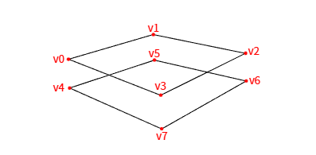
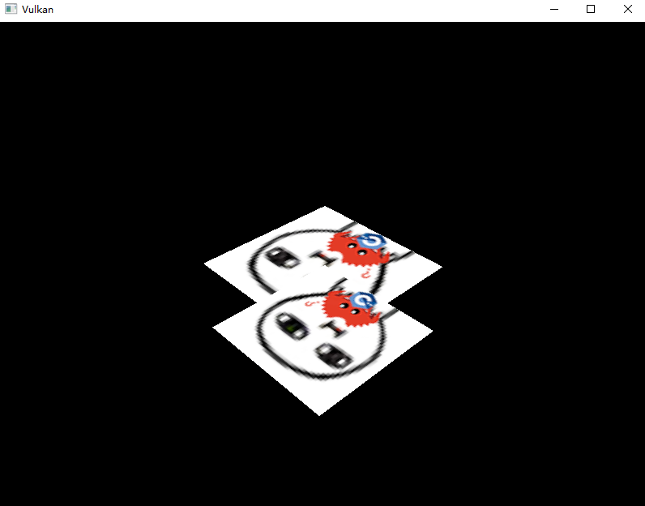
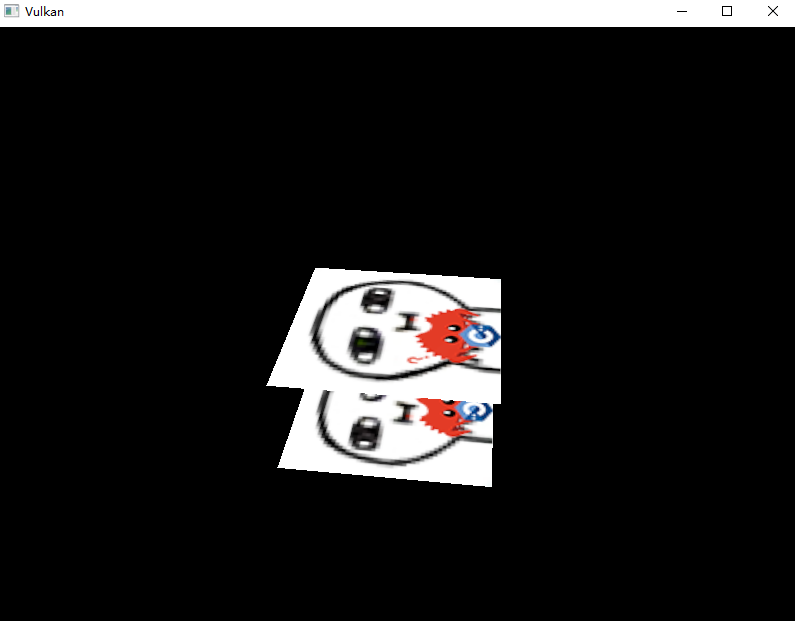

# **深度缓冲**

## **前言**

现在，我们已经将几何体载入了三维空间，但我们只输入了二维坐标。
在本章中，我们会为3D网格添加 Z 坐标，并通过一个例子向你展示图像是否处理深度时的差异。

## **3D几何体**

### 1. 添加三维坐标

改变C++代码中的 `Vertex` 结构体，使用三维坐标，同时更新 `attributeDescriptions` 中的`format`字段：

```cpp
struct Vertex {
    glm::vec3 pos;
    glm::vec3 color;
    glm::vec2 texCoord;

    ...

    static std::array<vk::VertexInputAttributeDescription, 3>  getAttributeDescriptions() {
        std::array<vk::VertexInputAttributeDescription, 3> attributeDescriptions;

        attributeDescriptions[0].binding = 0;
        attributeDescriptions[0].location = 0;
        attributeDescriptions[0].format = vk::Format::eR32G32B32Sfloat;
        attributeDescriptions[0].offset = offsetof(Vertex, pos);

        ...
    }
}
```

还需要更新 `vertices` 数据，为每个顶点添加 Z 轴坐标：

```cpp
const std::vector<Vertex> vertices = {
    {{-0.5f, -0.5f, 0.0f}, {1.0f, 0.0f, 0.0f}, {1.0f, 0.0f}},
    {{0.5f, -0.5f, 0.0f}, {0.0f, 1.0f, 0.0f}, {0.0f, 0.0f}},
    {{0.5f, 0.5f, 0.0f}, {0.0f, 0.0f, 1.0f}, {0.0f, 1.0f}},
    {{-0.5f, 0.5f, 0.0f}, {1.0f, 1.0f, 1.0f}, {1.0f, 1.0f}}
};
```

然后需要更新顶点着色器的输入和坐标变换代码，用于适配我们的三维坐标：

```glsl
...

layout(location = 0) in vec3 inPosition;

...

void main() {
    gl_Position = ubo.proj * ubo.view * ubo.model * vec4(inPosition, 1.0);
    fragColor = inColor;
    fragTexCoord = inTexCoord;
}
```

现在运行程序，你看到的内容应该和之前一样。

### 2. 添加几何体

现在可以添加一个额外的几何体让场景更有趣些，它会为我们展示本场景我们需要解决的问题。
我们希望在现有矩形的下方再放置一个矩形，就像这样：



现在往顶点数据中添加内容，新顶点的Z坐标使用 `-0.5f` ，不要忘了顶点索引：

```cpp
const std::vector<Vertex> vertices = {
    {{-0.5f, -0.5f, 0.0f}, {1.0f, 0.0f, 0.0f}, {1.0f, 0.0f}},
    {{0.5f, -0.5f, 0.0f}, {0.0f, 1.0f, 0.0f}, {0.0f, 0.0f}},
    {{0.5f, 0.5f, 0.0f}, {0.0f, 0.0f, 1.0f}, {0.0f, 1.0f}},
    {{-0.5f, 0.5f, 0.0f}, {1.0f, 1.0f, 1.0f}, {1.0f, 1.0f}},

    {{-0.5f, -0.5f, -0.5f}, {1.0f, 0.0f, 0.0f}, {0.0f, 0.0f}},
    {{0.5f, -0.5f, -0.5f}, {0.0f, 1.0f, 0.0f}, {1.0f, 0.0f}},
    {{0.5f, 0.5f, -0.5f}, {0.0f, 0.0f, 1.0f}, {1.0f, 1.0f}},
    {{-0.5f, 0.5f, -0.5f}, {1.0f, 1.0f, 1.0f}, {0.0f, 1.0f}}
};
const std::vector<uint32_t> indices = {
    0, 1, 2, 2, 3, 0,
    4, 5, 6, 6, 7, 4
};
```

现在运行程序你应该会看到类似下面的结果：

> 片段着色器中颜色计算使用 `outColor = texture(texSampler, fragTexCoord);`



### 3. 问题

两个几何体的实际大小是一样的，显示的更小说明距离摄像机更远，但现在小的几何体居然显示在了大的上方！
这是因为我们没处理前后遮挡关系，只使用索引按顺序绘制。对此问题，我们有两种解决方案:

- 将所有绘制命令从后往前排序
- 使用深度缓冲，近的覆盖远的

第一种方法通常用于绘制透明对象，因为与顺序无关的透明对象绘制并不容易。
而深度片段排序问题更常见的解决方案就是**深度缓冲\(depth buffer\)**。

深度缓冲是额外的附件，它存储每个片段对应的深度，每次在光栅化器生成片段时都会判断是否比前一个片段更近。
如果更近则替换，更远则抛弃，这被称为**深度测试\(depth testing\)**，用于处理物体的远近关系。
可以在片段着色器中操作此值，就像操作颜色的输出一样。

### 4. GLM配置

GLM 生成的透视投影矩阵默认使用 OpenGL 的 `[-1.0, 1.0]` 的范围，我们需要使用 `GLM_FORCE_DEPTH_ZERO_TO_ONE` 宏让他变为 Vulkan 使用的 `[0.0, 1.0]` ：

```cpp
#define GLM_FORCE_RADIANS
#define GLM_FORCE_DEPTH_ZERO_TO_ONE
#include <glm/glm.hpp>
#include <glm/gtc/matrix_transform.hpp>
```

## **深度图像与视图**

### 1. 成员变量与辅助函数

深度附件基于图像，我们依然需要手动创建，但只需要一个图像（而不是飞行帧的数量），因为程序一次只运行一个绘制操作。

现在创建三个成员变量：内存资源、图像、图像视图，放在交换链的下方：

```cpp
std::vector<vk::raii::ImageView> m_swapChainImageViews;
vk::raii::DeviceMemory m_depthImageMemory{ nullptr };
vk::raii::Image m_depthImage{ nullptr };
vk::raii::ImageView m_depthImageView{ nullptr };
```

> 我们将他放在交换链的下方，因为创建它需要交换链信息。

然后创建一个新函数 `createDepthResources` 来设置这些资源：

```cpp
void initVulkan() {
    ...
    createCommandPool();
    createCommandBuffers();
    createDepthResources();
    ...
}

...

void createDepthResources() {

}
```

内存分配需要用到命令缓冲，所以此函数需要放在命令池创建函数的下方。

### 2. 查找深度图像格式

创建深度图像非常简单。它应该具有与颜色附件相同的分辨率（由交换链 extent 定义），适用于深度附件的图像用途\(usage\)，最佳平铺和设备本地内存。

唯一的问题是：正确的深度图像格式是什么？格式必须包含深度组件，所以枚举名会有 `D` 字母。

与纹理图像不同，我们不需要指定图像的色彩格式，因为深度图记录的是深度信息。
我们只需要指定精度即可，下面是几种常见的选择：

| vk::Format         | 含义                        |
|--------------------|---------------------------|
| `eD32Sfloat`       | 每个深度使用32位有符号浮点数           |
| `eD32SfloatS8Uint` | 32 位有符号浮点数记录深度，外加 8 位模板分量 |
| `eD24UnormS8Uint`  | 24 位浮点数记录深度，外加 8 位模板分量    |

模板分量\(stencil component\)被用于 [模板测试\(stencil test\)](https://en.wikipedia.org/wiki/Stencil_buffer)。
它可以与深度测试组合，我们会在后面的章节中介绍。

你可以简单的使用 `eD32Sfloat` ，它受到广泛支持。

作为教程，本章选择编写 `findDepthFormat` 函数查询合适的格式，这带来更好的灵活性和可用性：

```cpp
vk::Format findDepthFormat( const std::vector<vk::Format>& candidates ) const {

}
```

支持的格式取决于平铺模式 `till` 和用途 `Feature` ，我们可以通过物理设备的 `getFormatProperties` 函数获取需要的信息：

```cpp
for(const vk::Format format : candidates) {
    // vk::FormatProperties
    const auto props = m_physicalDevice.getFormatProperties(format);
}
```

`vk::FormatProperties` 结构体包含以下字段：

- `linearTilingFeatures`：线性平铺支持的用例
- `optimalTilingFeatures`：最优平铺支持的用例
- `bufferFeatures`：缓冲支持的用例

只有前两个与这里相关，我们直接选择最优平铺，且要求它支持作为深度模板附件：

```cpp
if(props.optimalTilingFeatures & vk::FormatFeatureFlagBits::eDepthStencilAttachment){
    return format;
}
```

如果所有候选格式都不支持所需的用途，我们可以直接抛出异常或返回特殊值：

```cpp
vk::Format findDepthFormat( const std::vector<vk::Format>& candidates ) const {
    for(const vk::Format format : candidates) {
        // vk::FormatProperties
        const auto props = m_physicalDevice.getFormatProperties(format);
        if(props.optimalTilingFeatures & vk::FormatFeatureFlagBits::eDepthStencilAttachment){
            return format;
        }
    }
    throw std::runtime_error("failed to find supported format!");
}
```

在 `createDepthResources` 中使用刚才的函数：

```cpp
const vk::Format depthFormat = findDepthFormat({vk::Format::eD32Sfloat, vk::Format::eD32SfloatS8Uint, vk::Format::eD24UnormS8Uint});
```

### 3. 创建深度图像

回到 `createDepthResources` 函数，使用前几章的辅助函数 `createImage` 和 `createImageView` 创建对象：

```cpp
createImage(
    m_swapChainExtent.width,
    m_swapChainExtent.height,
    depthFormat,
    vk::ImageTiling::eOptimal,
    vk::ImageUsageFlagBits::eDepthStencilAttachment,
    vk::MemoryPropertyFlagBits::eDeviceLocal,
    m_depthImage,
    m_depthImageMemory
);
m_depthImageView = createImageView(m_depthImage, depthFormat);
```

现在 `createImageView` 函数内部的 `subresourceRange.aspectMask` 始终使用 `eColor`，但深度缓冲需要 `eDepth` 。
我们需要使用参数传递 `aspectMask` ：

```cpp
vk::raii::ImageView createImageView(
    const vk::Image image,
    const vk::Format format,
    const vk::ImageAspectFlags aspectFlags
) const {
    ...
    
    viewInfo.subresourceRange.aspectMask = aspectFlags;
    
    ...
}
```

然后需要修改用到此函数的三个地方：

```cpp
// createImageViews
m_swapChainImageViews.emplace_back(
    createImageView(image, m_swapChainImageFormat, vk::ImageAspectFlagBits::eColor)
);
...
// createTextureImageView
m_textureImageView = createImageView(m_textureImage, vk::Format::eR8G8B8A8Srgb, vk::ImageAspectFlagBits::eColor);
...
// createDepthResources
m_depthImageView = createImageView(m_depthImage, depthFormat, vk::ImageAspectFlagBits::eDepth);
```

创建深度图像就到此为止，我们不需要映射或拿另一个图像复制进去，因为它会在渲染管线开始时像颜色附件一样被清理。

深度图像的图像布局转换将交给渲染通道来处理，我们无需在此处显式转换。

## **渲染通道**

现在需要修改 `createRenderPass` 以包含深度附件，首先指定 `vk::AttachmentDescription`：

```cpp
vk::AttachmentDescription depthAttachment;
depthAttachment.format = findDepthFormat({vk::Format::eD32Sfloat, vk::Format::eD32SfloatS8Uint, vk::Format::eD24UnormS8Uint});
depthAttachment.samples = vk::SampleCountFlagBits::e1;
depthAttachment.loadOp = vk::AttachmentLoadOp::eClear;
depthAttachment.storeOp = vk::AttachmentStoreOp::eDontCare;
depthAttachment.stencilLoadOp = vk::AttachmentLoadOp::eDontCare;
depthAttachment.stencilStoreOp = vk::AttachmentStoreOp::eDontCare;
depthAttachment.initialLayout = vk::ImageLayout::eUndefined;
depthAttachment.finalLayout = vk::ImageLayout::eDepthStencilAttachmentOptimal;
```

> 注意到我们的深度资源晚于渲染通道创建，但渲染通道只需附件描述信息，所以没有问题。

`format` 应该与深度图像本身的属性相同。
我们指定了 `loadOp` 开始时清理内容。它绘制完成后不会被使用，所以`storeOp`为 `eDontCare`。

然后我们回到渲染通道的创建，现在为第一个（唯一的）子通道添加对附件的引用：

```cpp
vk::AttachmentReference depthAttachmentRef;
depthAttachmentRef.attachment = 1;
depthAttachmentRef.layout = vk::ImageLayout::eDepthStencilAttachmentOptimal;

vk::SubpassDescription subpass;
subpass.pipelineBindPoint = vk::PipelineBindPoint::eGraphics;
subpass.setColorAttachments( colorAttachmentRef );
subpass.pDepthStencilAttachment = &depthAttachmentRef;
```

注意到我们设置了 `initialLayout`、`finalLayout` 和子通道中的图像布局，渲染通道会为我们自动处理图像布局转换。

与颜色附件不同，子 Pass 只能使用单个深度（+模板）附件，所以没有 `Count` 字段，直接赋值初始指针即可。

然后需要更新渲染通道的创建信息，加上我们的深度附件。
上面的`depthAttachmentRef.attachment`是 1 ，因为深度附件会是附件数组的 1 号元素，正如下面的代码。

```cpp
const auto attachments = { colorAttachment, depthAttachment };
vk::RenderPassCreateInfo renderPassInfo;
renderPassInfo.setAttachments( attachments );
```

最后，我们需要扩展我们的子通道依赖项，以确保深度图像的转换操作和加载开始时的清除操作没有冲突。
深度图像首先在早期片段测试管线阶段被访问，并且因为我们有一个清除的加载操作，我们应该为写入指定访问掩码。

```cpp
dependency.srcStageMask = vk::PipelineStageFlagBits::eColorAttachmentOutput | vk::PipelineStageFlagBits::eEarlyFragmentTests;
dependency.srcAccessMask = {};
dependency.dstStageMask = vk::PipelineStageFlagBits::eColorAttachmentOutput | vk::PipelineStageFlagBits::eEarlyFragmentTests;
dependency.dstAccessMask = vk::AccessFlagBits::eColorAttachmentWrite | vk::AccessFlagBits::eDepthStencilAttachmentWrite;
```

## **帧缓冲**

下一步是修改帧缓冲的创建，从而将深度图像绑定到深度附件。

帧缓冲需要用到深度资源的图像视图，我们需要将帧缓冲的创建函数后移：

```cpp
void initVulkan() {
    ...
    createDepthResources();
    createFramebuffers();
    ...
}
```

转到 `createFramebuffers` 并将深度图像视图指定为第二个附件：

```cpp
for (const auto& swapchainImageView : m_swapChainImageViews) {
    const std::array<vk::ImageView, 2> imageViews { swapchainImageView, m_depthImageView };
    framebufferInfo.setAttachments( imageViews );
    m_swapChainFramebuffers.emplace_back( m_device.createFramebuffer(framebufferInfo) );
}
```

注意前后顺序不能反，第一个是颜色附件，第二个是深度附件。  

颜色附件对每个交换链都不同，但我们深度图像可以被所有的交换链图像使用，因为信号量保证了同一时间只运行一个渲染工作。

## **清除值**

因为我们现在有多个具有 `vk::AttachmentLoadOp::eClear` 的附件，所以我们还需要指定多个清除值。
转到 `recordCommandBuffer` 并创建一个 `vk::ClearValue` 结构体数组：

```cpp
std::array<vk::ClearValue, 2> clearValues;
clearValues[0].color = vk::ClearColorValue{0.0f, 0.0f, 0.0f, 1.0f};
clearValues[1].depthStencil = vk::ClearDepthStencilValue{1.0f, 0};

renderPassInfo.setClearValues( clearValues );
```

Vulkan 中深度缓冲的深度范围为 `[0.0, 1.0]`，其中 `1.0` 位于远裁剪面，`0.0` 位于近裁剪面。
深度缓冲中每个点的初始值应该是最远的可能深度，即 `1.0`。

> 请注意，`clearValues` 的顺序应与附件的顺序相同。

## **管线配置**

深度附件已经可以使用了，但仍然需要在图形管线中启用深度测试。
现在转到 `createGraphicsPipeline` 函数中添加 `vk::PipelineDepthStencilStateCreateInfo` 结构体配置：

```cpp
vk::PipelineDepthStencilStateCreateInfo depthStencil;
depthStencil.depthTestEnable = true;
depthStencil.depthWriteEnable = true;
```

`depthTestEnable`指定是否将新片段与深度缓冲中的片段对比。
`depthWriteEnable`指定是否将通过测试的片段写入深度缓冲。

然后还需通过 `depthCompareOp` 字段定义比较方式，我们坚持更小的深度=更近，所以应该这样：

```cpp
depthStencil.depthCompareOp = vk::CompareOp::eLess;
```

还可以用 `depthBoundsTestEnable` 进行边界测试，从而只保留指定深度范围的片段，我们不启用它：

```cpp
depthStencil.depthBoundsTestEnable = false; // Optional
depthStencil.minDepthBounds = 0.0f; // Optional if depthBoundsTestEnable is false
depthStencil.maxDepthBounds = 1.0f; // Optional if depthBoundsTestEnable is false
```

还有三个字段配置模板测试操作，我们也不使用它。

```cpp
depthStencil.stencilTestEnable = false; // Optional
depthStencil.front = vk::StencilOpState{}; // Optional if stencilTestEnable is false
depthStencil.back = vk::StencilOpState{}; // Optional if stencilTestEnable is false
```

然后更新 `vk::GraphicsPipelineCreateInfo` 结构体，引用我们刚刚填写的内容：

```cpp
pipelineInfo.pDepthStencilState = &depthStencil;
```

如果您现在运行程序，那么您应该看到几何体的片段现在已正确排序：



## **处理窗口大小调整**

当窗口大小调整以匹配新的颜色附件分辨率时，深度缓冲的分辨率应更改。
扩展 `recreateSwapChain` 函数以在此情况下重建深度资源：

```cpp
void recreateSwapChain() {
    ......
    
    m_device.waitIdle();

    m_swapChainFramebuffers.clear();
    m_swapChainImageViews.clear();
    m_swapChainImages.clear(); // optional
    m_swapChain = nullptr;

    m_depthImageView = nullptr;
    m_depthImage = nullptr;
    m_depthImageMemory = nullptr;

    createSwapChain();
    createImageViews();
    createDepthResources();
    createFramebuffers();

    m_framebufferResized = false;
}
```

---

**[C++代码](../../codes/02/40_depthbuffer/main.cpp)**

**[C++代码差异](../../codes/02/40_depthbuffer/main.diff)**

**[根项目CMake代码](../../codes/02/40_depthbuffer/CMakeLists.txt)**

**[shader-CMake代码](../../codes/02/40_depthbuffer/shaders/CMakeLists.txt)**

**[shader-vert代码](../../codes/02/40_depthbuffer/shaders/graphics.vert.glsl)**

**[shader-vert代码差异](../../codes/02/40_depthbuffer/shaders/graphics.vert.diff)**

**[shader-frag代码](../../codes/02/40_depthbuffer/shaders/graphics.frag.glsl)**

---
