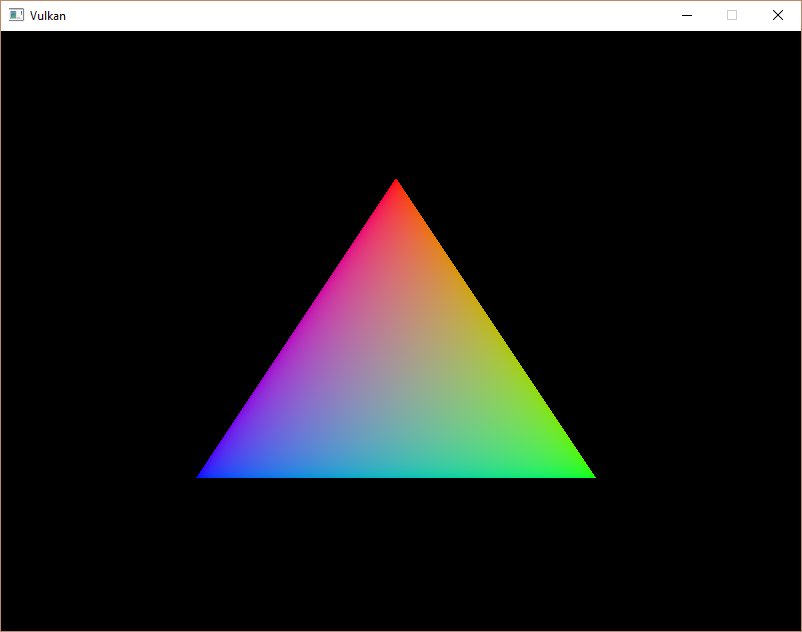

# 创建顶点缓冲

## 前言

缓冲(Buffers)在 Vulkan 中是一个用于存储任意数据的区域，它可以被显卡读取。
在本节中，我们将用它存储顶点数据。
与其他的 Vulkan 对象不同，缓冲并不会自动分配内存。
我们在之前的章节中见识到了Vulkan API的可控性，内存管理也是其中之一。

## 创建缓冲

在`initVulkan`中创建一个新的函数`createVertexBuffer`，放在`createCommandBuffers`之前：

```cpp
void initVulkan() {
    createInstance();
    setupDebugMessenger();
    createSurface();
    pickPhysicalDevice();
    createLogicalDevice();
    createSwapChain();
    createImageViews();
    createRenderPass();
    createGraphicsPipeline();
    createFramebuffers();
    createCommandPool();
    createVertexBuffer();
    createCommandBuffers();
    createSyncObjects();
}

void createVertexBuffer() {

}
```

然后创建我们熟悉的`CreateInfo`信息并填写它：

```cpp
vk::BufferCreateInfo bufferInfo;
```

首先填写了`size`参数，它定义了缓冲的总字节数，我们使用第一个元素的大小乘以总长度。

```cpp
bufferInfo.size = sizeof(vertices[0]) * vertices.size();
```

第二个参数是`usage`，它表示这些数据的用途。它本身是个位枚举，可以同时表示多种用途。
我们需要的是顶点缓冲，所以可以这样写：

```cpp
bufferInfo.usage = vk::BufferUsageFlagBits::eVertexBuffer;
```

就像交换链中的图像，缓冲也能被特定的队列族独有或同时在多个之间共享。
我们的缓冲只会被图形队列访问，所以我们排除共享。

```cpp
bufferInfo.sharingMode = vk::SharingMode::eExclusive;
```

`flags`参数用于配置稀疏缓冲内存，暂时无需设置，保持默认即可。

现在我们可以创建缓冲了，首先创建一个`vk::raii::Buffer`类型的`m_vertexBuffer`成员。
由于它不依赖交换链，且应该保证它在程序结束前都可用于渲染命令，我们可以把他放在交换链的上方:

```cpp
// ......
vk::raii::Queue m_graphicsQueue{ nullptr };
vk::raii::Queue m_presentQueue{ nullptr };
vk::raii::Buffer m_vertexBuffer{ nullptr };
vk::raii::SwapchainKHR m_swapChain{ nullptr };
std::vector<vk::Image> m_swapChainImages;
// ......
```

然后在`createVertexBuffer`函数中创建它：

```cpp
void createVertexBuffer() {
    vk::BufferCreateInfo bufferInfo;
    bufferInfo.size = sizeof(vertices[0]) * vertices.size();
    bufferInfo.usage = vk::BufferUsageFlagBits::eVertexBuffer;
    bufferInfo.sharingMode = vk::SharingMode::eExclusive;

    m_vertexBuffer = m_device.createBuffer(bufferInfo);
}
```

## 内存需求

虽然缓冲已经创建了，但它实际还未分配任何内存。分配内存的第一步是查询他的内存需求量：

```cpp
vk::MemoryRequirements memRequirements = m_vertexBuffer.getMemoryRequirements();
```

`vk::MemoryRequirements`结构体包含如下信息：

| 成员变量 | 含义 |
|----------|------|
| `size` | 需要的内存大小（字节），可能与`bufferInfo.size`不同 |
| `alignment` | 内存对齐方式，取决于`bufferInfo.usage`和`bufferInfo.flags` |
| `memoryTypeBits` | 适用于缓冲的内存类型的位字段 |

显卡可以分配不同类型的内存，这些不同的内存类型可能有不同的操作或性能表现。
我们需要结合需求寻找正确的内存类型，现在让我们创建新函数`findMemoryType`

```cpp
uint32_t findMemoryType(uint32_t typeFilter, vk::MemoryPropertyFlags properties) {

}
```

首先我们需要查询物理设备可用的内存类型信息：

```cpp
// vk::PhysicalDeviceMemoryProperties
auto memProperties = m_physicalDevice.getMemoryProperties();
```

> 以`2`位后缀的类型大多数是在原基础上支持了`pNext`指针，我们使用普通函数即可。

`vk::PhysicalDeviceMemoryProperties`结构体中有两个数组 `memoryTypes` 和 `memoryHeaps`。
第二个数组内存堆是不同的内存资源，比如VRAM耗尽时专用于VRAM和RAM交换的空间。而不同的内存类型存在于这些堆中。
现在我们只关心类型而不关心它来自哪个堆，但显然这也会影响性能。

让我们找一个合适的内存类型：

```cpp
for(uint32_t i = 0; i < memProperties.memoryTypeCount; ++i){
    if( typeFilter & (1 << i)) {
        return i;
    }
}
throw std::runtime_error("failed to find suitable memory type!");
return 0; // optional
```

`typeFilter` 参数将用于指定适合的内存类型的位字段。
我们可以通过简单地迭代并检查相应的位是否为 `1` 来寻找合适的内存类型的索引。

我们还需要保证我们的顶点数据能够写入内存。
`memoryTypes`数组由`vk::MemoryType`结构体组成，这些结构体指定每种内存类型的属性和对应的堆。

现在修改循环以检查属性支持：

```cpp
for(uint32_t i = 0; i < memProperties.memoryTypeCount; ++i){
    if( (typeFilter & (1 << i)) &&
        (memProperties.memoryTypes[i].propertyFlags & properties ) == properties ) {
        return i;
    }
}
```

## 内存分配

现在我们有办法找到正确的内存类型了，将这些信息都记入`vk::MemoryAllocateInfo`结构体中。

```cpp
vk::MemoryAllocateInfo allocInfo;
allocInfo.allocationSize = memRequirements.size;
allocInfo.memoryTypeIndex = findMemoryType( memRequirements.memoryTypeBits,
    vk::MemoryPropertyFlagBits::eHostVisible | vk::MemoryPropertyFlagBits::eHostCoherent 
);
```

`eHostVisible`表示可以被CPU访问，`eHostCoherent`表示内存自动同步。

分配内存非常简单，我们首先在`m_vertexBuffer`上方创建一个新变量，然后使用`allocateMemory`分配资源：

```cpp
vk::raii::DeviceMemory m_vertexBufferMemory{ nullptr };
vk::raii::Buffer m_vertexBuffer{ nullptr };

// ......

m_vertexBufferMemory = m_device.allocateMemory( allocInfo );
```

> `Buffer`依赖`DeviceMemory`，所以`Buffer`后声明，优先销毁。

内存分配成功后，还需要将内存和缓冲绑定：

```cpp
m_vertexBuffer.bindMemory(m_vertexBufferMemory, 0);
```

右边的`0`是内存区域内的偏移量，通过此变量可以让一块内存分成多个区域。此内存转为顶点缓冲分配，偏移量应为0。

## 填充顶点缓冲

现在是时候把顶点数据拷贝到缓冲中了。我们使用`mapMemory`获取内存地址指针:

```cpp
void* data;
data = m_vertexBufferMemory.mapMemory(0, bufferInfo.size);
```

这个函数允许我们访问由偏移量和大小定义的指定内存区域。
函数第三个参数是`flags`，提供了默认值，我们无需填写。


现在我们可以简单的拷贝资源，然后使用`unmapMemory`取消映射。

```cpp
void* data;
data = m_vertexBufferMemory.mapMemory(0, bufferInfo.size);
memcpy(data, vertices.data(), static_cast<size_t>(bufferInfo.size));
m_vertexBufferMemory.unmapMemory();
```

不幸的是，由于缓存或其他因素，驱动程序可能不会立即将数据复制到缓冲内存中，也可能对缓冲区的写入在映射的内存中尚不可见。
有两种解决方案：

- 使用主机一致的内存堆，用`vk::MemoryPropertyFlagBits::eHostCoherent`标记。

- 写入映射的内存后立刻调用`flushMappedMemoryRanges`，并在映射的内存读取前调用`invalidateMappedMemoryRanges`。

我们使用了第一种方式，在`findMemoryType`函数参数中添加了一致性标志位。
不过需要注意的是，这可能比显式刷新的性能略低一些，但我们将在下一章说明为什么这无关紧要。

刷新内存范围和使用一致性内存堆意味着驱动程序可以注意到我们写入了缓冲，但这不意味着在GPU上可见。
GPU上的数据转移是个隐含的过程，规范只[告诉我们](https://www.khronos.org/registry/vulkan/specs/1.3-extensions/html/chap7.html#synchronization-submission-host-writes)，它保证在下次调用`queue.submit`时完成。

## 绑定顶点缓冲

剩下的就是在渲染操作期间绑定顶点缓冲，我们扩展`recordCommandBuffer`函数来执行此操作。

在`draw`语句上方添加一些内容，再修改`draw`语句：

```cpp
// ......

vk::Buffer vertexBuffers[] = { m_vertexBuffer };
vk::DeviceSize offsets[] = { 0 };
commandBuffer.bindVertexBuffers( 0, vertexBuffers, offsets );

commandBuffer.draw(static_cast<uint32_t>(vertices.size()), 1, 0, 0);
// ......
```

`bindVertexBuffers`的第一个参数指定顶点缓冲绑定点的偏移量。
我们还修改了`draw`，传递缓冲中得到顶点数，而不是硬编码的`3`。

## 测试

现在运行程序，你应该可以看到熟悉的三角形：



尝试修改顶点的颜色：

```cpp
inline static const std::vector<Vertex> vertices = {
    {{0.0f, -0.5f}, {1.0f, 1.0f, 1.0f}},
    {{0.5f, 0.5f}, {0.0f, 1.0f, 0.0f}},
    {{-0.5f, 0.5f}, {0.0f, 0.0f, 1.0f}}
};
```

再次构建运行，应该看到这样的三角形：


---

在下一章中，我们将研究另一种将顶点数据复制到顶点缓冲的方法，该方法可以带来更好的性能，但需要更多的工作。

---

**[C++代码](../codes/0201_vertexbuffer/main.cpp)**

**[C++代码差异](../codes/0201_vertexbuffer/main.diff)**


