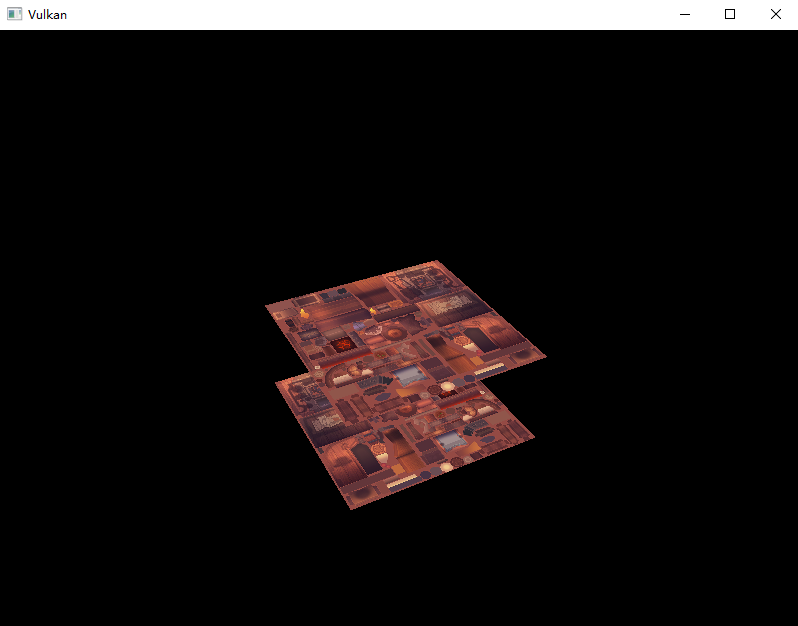
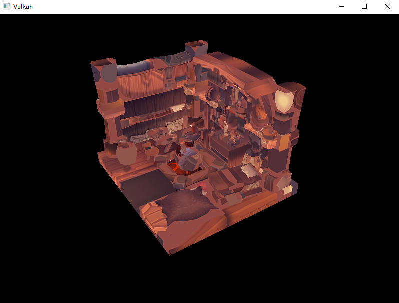

# **加载3D模型**

## **前言**

经过前面的内容，程序已经可以渲染三维网格体了。这一章节我们将从模型文件中加载顶点和索引，而不再硬编码于 C++ 代码中。

我们将使用 OBJ 格式的模型文件，它非常简单且易于使用。
部分教程会让用户自己写一个 OBJ 解析器，但我们将重点放在 Vulkan 上，而不是模型文件的解析。

## **库**

我们将使用 [tinyobjloader](https://github.com/syoyo/tinyobjloader) 库用于加载 OBJ 文件的数据。
它像 stb_image 一样是单头文件库，你可以直接去仓库下载此文件，但我们依然使用 vcpkg 安装。

```shell
vcpkg install tinyobjloader
```

然后在 CMakeLists.txt 中导入库：

```cmake
find_package(tinyobjloader CONFIG REQUIRED)

...

target_link_libraries(${PROJECT_NAME} PRIVATE tinyobjloader::tinyobjloader)
```

## **示例网格**

本章中我们依然不启用光照系统，所以我们将使用把光照烘焙到纹理上的模型。

本文档将使用 [Vulkan Tutorial](https://vulkan-tutorial.com/Loading_models) 中提供的模型文件，可以直接点击下方的链接下载：

- [viking_room.obj](../../res/viking_room.obj)
- [viking_room.png](../../res/viking_room.png)

你可以使用任何自己喜欢的模型文件，但请确保它是 OBJ 格式，并且包含纹理图像。
如果模型尺寸差异过大，你可能需要自行调整 MVP 矩阵的参数。

现在在 `shaders` 和 `textures` 旁创建新文件夹 `models` ，将 OBJ 文件放入此文件夹，将纹理图像放入 `textures` 文件夹。

在您的程序中放置两个新的配置变量，以定义模型和纹理路径

```cpp
const std::string MODEL_PATH = "models/viking_room.obj";
const std::string TEXTURE_PATH = "textures/viking_room.png";
```

并更新 `createTextureImage` 以使用此路径变量

```cpp
stbi_uc* pixels = stbi_load(TEXTURE_PATH.c_str(), &texWidth, &texHeight, &texChannels, STBI_rgb_alpha);
```

然后你可以直接运行程序，看看是否能正常加载纹理图片。



## **前置准备**

### 1. 修改顶点和索引变量

我们现在需要从模型中加载数据，顶点和索引不能再作为全局常量了。
现在将他们修改为成员变量：

```cpp
std::vector<Vertex> m_vertices;
std::vector<uint32_t> m_indices;
vk::raii::DeviceMemory m_vertexBufferMemory{ nullptr };
vk::raii::Buffer m_vertexBuffer{ nullptr };
```

注意我们修改了变量名，加了 `m_`前缀用于区分是不是成员变量，现在需要修改几处地方：

```cpp
void recordCommandBuffer( ... ) {
    ...
    commandBuffer.drawIndexed(static_cast<uint32_t>(m_indices.size()), 1, 0, 0, 0);
    ...
}
void createVertexBuffer() {
    const vk::DeviceSize bufferSize = sizeof(Vertex) * m_vertices.size();
    ...
    memcpy(data, m_vertices.data(), bufferSize);
    ...
}
void createIndexBuffer() {
    const vk::DeviceSize bufferSize = sizeof(uint32_t) * m_indices.size();
    ...
    memcpy(data, m_indices.data(), bufferSize);
    ...
}
```

### 2. 导入库

tinyobjloader 库的导入和 STB 基本一致，导入 `tiny_obj_loader.h` 头文件并在前面加上 `TINYOBJLOADER_IMPLEMENTATION` 保证头文件包含函数主体，避免链接错误、

```cpp
#define TINYOBJLOADER_IMPLEMENTATION
#include <tiny_obj_loader.h>
```

## **加载模型数据**

### 1. 辅助函数

现在创建一个 `loadModel` 函数用于加载顶点和索引数据。它应该在顶点缓冲创建之前执行：

```cpp
void initVulkan() {
    ...
    loadModel();
    createVertexBuffer();
    createIndexBuffer();
    ...
}

...

void loadModel() {

}
```

### 2. 加载模型

使用 `tinyobj::LoadObj` 函数加载模型：

```cpp
void loadModel() {
    tinyobj::attrib_t attrib;
    std::vector<tinyobj::shape_t> shapes;
    std::vector<tinyobj::material_t> materials;
    std::string warn, err;

    if (!tinyobj::LoadObj(&attrib, &shapes, &materials, &warn, &err, MODEL_PATH.c_str())) {
        throw std::runtime_error(warn + err);
    }
}
```

OBJ 文件由位置、法线、纹理坐标和面组成。
面由任意数量的顶点组成，其中每个顶点通过索引引用位置、法线和纹理坐标。
这使得不仅可以重用整个顶点，还可以重用单个属性。

`attrib` 容器在其 `attrib.vertices`、`attrib.normals` 和 `attrib.texcoords` 向量中保存所有位置、法线和纹理坐标。

`shapes` 容器包含所有单独的对象及其面。每个面都由一个顶点数组组成，并且每个顶点都包含位置、法线和纹理坐标属性的索引。

OBJ 模型还可以为每个面定义材质和纹理，但我们暂时忽略这些。

`err` 字符串包含错误，`warn` 字符串包含加载文件时发生的警告，例如缺少材质定义。
仅当 `LoadObj` 函数返回 `false` 时，加载才真正失败。

如上所述，OBJ 文件中的面实际上可以包含任意数量的顶点，而我们的应用程序只能渲染三角形。
幸运的是，`LoadObj` 有一个可选参数可以自动三角化这些面，默认情况下启用该参数。

我们将文件中的所有面组合成一个模型，因此只需遍历所有 `shape`

```cpp
for (const auto& shape : shapes) {

}
```

三角化功能已经确保每个面有三个顶点，因此我们现在可以直接迭代顶点并将它们直接转储到我们的 `vertices` 向量中

```cpp
for (const auto& shape : shapes) {
    for (const auto& index : shape.mesh.indices) {
        Vertex vertex{};

        m_vertices.push_back(vertex);
        m_indices.push_back(m_indices.size());
    }
}
```

为了简单起见，我们现在假设每个顶点都是唯一的，因此 `m_indices` 使用简单的自增索引。

`index` 变量的类型为 `tinyobj::index_t`，其中包含 `vertex_index`、`normal_index` 和 `texcoord_index `成员。
我们需要使用这些索引在 `attrib` 数组中查找实际的顶点属性

```cpp
vertex.pos = {
    attrib.vertices[3 * index.vertex_index + 0],
    attrib.vertices[3 * index.vertex_index + 1],
    attrib.vertices[3 * index.vertex_index + 2]
};

vertex.texCoord = {
    attrib.texcoords[2 * index.texcoord_index + 0],
    attrib.texcoords[2 * index.texcoord_index + 1]
};

vertex.color = {1.0f, 1.0f, 1.0f};
```

### 3. 测试与调整

现在运行程序，您应该看到类似以下内容：



太棒了，几何体看起来是正确的，但是纹理似乎有些问题。
OBJ 格式假定一个坐标系，其中垂直坐标 0 表示图像的底部，但是我们使用 Vulkan 坐标系 0 表示图像的顶部。
通过翻转纹理坐标的垂直分量来解决此问题

```cpp
vertex.texCoord = {
    attrib.texcoords[2 * index.texcoord_index + 0],
    1.0f - attrib.texcoords[2 * index.texcoord_index + 1]
};
```

再次运行程序时，您现在应该看到正确的结果


> 当模型旋转时，您可能会注意到后部（墙壁的背面）看起来有点奇怪。
> 这是正常的，因为模型删除了背面细节，而我们启用了图元的背面剔除。

## **顶点去重**

上面的代码中，我们使用自增索引，给每个面的每个点都记录了相关信息，并没有真正利用到索引缓冲区。
此时 `vertices` 向量包含大量重复的顶点数据，而我们应该去除重复顶点，并通过索引重用它们。

一种直接的方式是使用`map`或者`unordered_map`来跟踪唯一的顶点和相应的索引。

### 1. map

本节将直接使用 `map` ，它更加简单，但实际效率可能不如 `unordered_map`。

```cpp
#include <map>

std::map<Vertex, uint32_t> uniqueVertices;

for (const auto& shape : shapes) {
    for (const auto& index : shape.mesh.indices) {
        Vertex vertex;

        vertex.pos = {
            attrib.vertices[3 * index.vertex_index + 0],
            attrib.vertices[3 * index.vertex_index + 1],
            attrib.vertices[3 * index.vertex_index + 2]
        };

        vertex.texCoord = {
            attrib.texcoords[2 * index.texcoord_index + 0],
            1.0f - attrib.texcoords[2 * index.texcoord_index + 1]
        };

        vertex.color = {1.0f, 1.0f, 1.0f};

        if (!uniqueVertices.contains(vertex)) {
            uniqueVertices[vertex] = static_cast<uint32_t>(m_vertices.size());
            m_vertices.push_back(vertex);
        }
        m_indices.push_back(uniqueVertices[vertex]);    
    }
}
```

每次我们从 OBJ 文件读取顶点时，都会检查之前是否已经有完全一样的顶点。
如果是新顶点，就加入 `uniqueVertices` 中。最后再从 `uniqueVertices` 读取顶点索引。

> 注意`uniqueVertices`是函数局部变量。
> 此处`map`的使用可以优化，减少一次查找次数，但我们使用最简单的写法。

### 2. 自定义比较

现在程序无法通过编译，因为自定义类型没有重置比较运算符，

> `map` 只需要提供 `<` 运算符重载即可。`unordered_map` 则需要 `==` 和 `std::hash<>` 特化。

我们可以只重载 `<` 运算符，因为标准库的排序都依赖此运算符。

> 或者使用 C++20 的“宇宙飞船运算符” `<=>` 并配合 `==` ，它们可以自动生成所有比较运算符。

```cpp
#include <tuple>

...

struct Vertex {
    glm::vec3 pos;
    glm::vec3 color;
    glm::vec2 texCoord;

    ......

    bool operator<(const Vertex& other) const {
        return std::tie(pos.x, pos.y, pos.z, color.x, color.y, color.z, texCoord.x, texCoord.y)
             < std::tie(other.pos.x, other.pos.y, other.pos.z, other.color.x, other.color.y, other.color.z, other.texCoord.x, other.texCoord.y);
    }
};
```

## **最后**

您现在应该能够成功编译并运行您的程序。
如果您输出 `vertices` 的大小，您将看到它从 `11484` 缩小到 `3566`！
这意味着每个顶点在平均约 3 个三角形中被重用，为我们节省了大量内存。

---

**[C++代码](../../codes/03/00_loadmodel/main.cpp)**

**[C++代码差异](../../codes/03/00_loadmodel/main.diff)**

**[根项目CMake代码](../../codes/03/00_loadmodel/CMakeLists.txt)**

**[shader-CMake代码](../../codes/03/00_loadmodel/CMakeLists.txt)**

**[shader-vert代码](../../codes/03/00_loadmodel/shaders/graphics.vert.glsl)**

**[shader-frag代码](../../codes/03/00_loadmodel/shaders/graphics.frag.glsl)**

---
