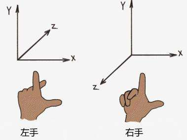

# **移动摄像机**

我们后续还会载入各种各样的几何体，不可能每次都手动调整模型大小或计算摄像头合适位置。
所以在这一节，我们将获取外设输入并实时移动摄像头位置与角度。

> 很大程度上这并非 Vulkan 自身的内容，但它可以让我们更好地观察后续教程的效果。

## **GLFW获取键盘输入**

本节内容我们要做的事情很简单，通过 `WSAD` 移动摄像头水平位置，通过 `Space` 和 `LShift` 升降摄像头，使用 `↑↓←→` 调整摄像头朝向。

GLFW 库提供了获取键盘输入的函数封装，让我们来看看如何使用。

### 1. 按键回调

GLFW 可以通过回调函数的方式处理输入：

```cpp
static void key_callback(GLFWwindow* window, int key, int scancode, int action, int mods) {
    if (action == GLFW_PRESS) std::cout << "Key pressed: " << key << std::endl;
    if (key == GLFW_KEY_ESCAPE) std::cout << "Key is Escape " << std::endl;
    
}

glfwSetKeyCallback(m_window, key_callback);
```

`key` 和 `action` 分别是按键和对应的行为。 `scancode` 是输入设备的扫描码，一般不使用。 `mods` 是一个位键盘，则用于检查 `ctrl`、`shift` 等组合键是否按下。 

需要注意的是，即使使用了回调函数，也需要等到 `glfwPollEvents()` 调用时才会触发。

### 2. 主动询问

我们还可以在需要的时候主动检查按键的状态：

```cpp
if (glfwGetKey(m_window, GLFW_KEY_W) == GLFW_PRESS) {
    // W 键被按下
}
```

这很简单，使用 `glfwGetKey` 函数检查按键，返回按键的状态。

## **坐标系**

计算机图形学中通常使用 Y 轴作为高度轴，但这并非强制性的。
在加载模型的章节中，我们就使用了 Z 轴（注意视口变化 `lookAt` 函数的第三个参数）。

在本章中我们将处理视口变换矩阵，将 Y 轴作为高度轴、并调整模型角度。

注意 Vulkan 使用右手坐标系，（从Y轴上方往下看）从X轴正方向出发，顺时针旋转90度到达Z轴正方向，而非逆时针旋转90度。



## **修改MVP变换**

现在让我们正式开始修改代码，在处理键盘输入之前还要做一些准备工作。

### 1. 添加成员变量

每次移动相机位置时都需要上一个状态的信息，所以需要使用成员变量记录摄像机位置：

```cpp
glm::vec3 m_cameraPos{ 2.0f, 2.0f, 2.0f };  // 相机位置
glm::vec3 m_cameraUp{ 0.0f, 1.0f, 0.0f };   // 相机上方向，使用Y轴
float m_pitch = -35.0f;             // 朝向与Y轴的夹角
float m_yaw = -135.0f;              // 朝向绕Y轴旋转的角度
float m_cameraMoveSpeed = 1.0f;     // 移动速度倍率
float m_cameraRotateSpeed = 1.0f;   // 转向速度倍率
```

### 2. 计算摄像头朝向

现在需要修改 `updateUniformBuffer` 函数。
我们通过 `m_pitch` 和 `m_yaw` 表示摄像头朝向，而 `lookAt` 函数使用的是“看向的目标”，所以需要手动计算朝向:

```cpp
glm::vec3 front;
front.x = std::cos(glm::radians(m_yaw)) * std::cos(glm::radians(m_pitch));
front.y = std::sin(glm::radians(m_pitch));
front.z = std::sin(glm::radians(m_yaw)) * std::cos(glm::radians(m_pitch));
front = glm::normalize(front);
```

### 2. 修改MVP矩阵

现在可以使用它们修改视口矩阵了。
注意一点，摄像机能够移动就不需要让模型自转了，所以将模型变化矩阵设为单位矩阵。

```cpp
UniformBufferObject ubo{};
ubo.model = glm::mat4(1.0f);    // 设为单位矩阵，模型不再自转
ubo.view = glm::lookAt(         // 使用成员变量计算视口变换
    m_cameraPos, 
    m_cameraPos + front, 
    m_cameraUp
);
ubo.proj = ......
```

> 注意到我们暂时不需要时间间隔 `time` 了，可以先注释掉相关代码。

### 3. 修改模型

现在运行程序，你会发现模型“翻倒”了。这是因为此模型被设计为Z轴向上（大多数模组使用Y轴向上），而我们刚刚将高度轴从Z轴改为Y轴。

现在我们需要让模型翻正，可以修改模型变化矩阵，先绕X轴旋转、使其正常向上，然后绕Z轴旋转、使其朝向摄像头：

```cpp
ubo.model = glm::rotate(
    glm::mat4(1.0f), 
    glm::radians(-90.0f), 
    glm::vec3(1.0f, 0.0f, 0.0f)
);
ubo.model *= glm::rotate(
    glm::mat4(1.0f), 
    glm::radians(-90.0f), 
    glm::vec3(0.0f, 0.0f, 1.0f)
);
```

现在你应该看到和之前类似的图像（实际视角与下图会有偏差）：


## **处理键盘输入**

我们在 `glfwPollEvents` 后调用了 `drawFrame` ，并使用 `updateUniformBuffer` 函数设置了MVP矩阵。
所以可以直接使用“主动查看按键状态”的方式在每次更新时获取输入，这更加简单。

### 1. 辅助函数

现在创建一个辅助函数 `updateCamera` 用于更新视口矩阵参数，并在 `updateUniformBuffer` 中调用它：

```cpp
void updateUniformBuffer(uint32_t currentImage) {
    updateCamera();
    ......
}
void updateCamera() {

}
```

场景复杂度不同时，帧更新的速度也不同。我们需要使用时间间隔来保证摄像头的移速正常：

```cpp
void updateCamera() {
    static auto startTime = std::chrono::high_resolution_clock::now();
    auto currentTime = std::chrono::high_resolution_clock::now();
    float time = std::chrono::duration<float, std::chrono::seconds::period>(currentTime - startTime).count();
    startTime = currentTime;
}
```

### 2. 相机位置变化

我们使用 WSAD 控制水平方向的移动，所以还需要计算出摄像头的朝向，但是需要忽略 Y 轴。

```cpp
glm::vec3 front;
front.x = std::cos(glm::radians(m_yaw)) * std::cos(glm::radians(m_pitch));
front.y = 0.0f;
front.z = std::sin(glm::radians(m_yaw)) * std::cos(glm::radians(m_pitch));
front = glm::normalize(front);

if (glfwGetKey(m_window, GLFW_KEY_W) == GLFW_PRESS)
    m_cameraPos += front * m_cameraMoveSpeed * time;
if (glfwGetKey(m_window, GLFW_KEY_S) == GLFW_PRESS)
    m_cameraPos -= front * m_cameraMoveSpeed * time;
if (glfwGetKey(m_window, GLFW_KEY_A) == GLFW_PRESS)
    m_cameraPos -= glm::normalize(glm::cross(front, m_cameraUp)) * m_cameraMoveSpeed * time;
if (glfwGetKey(m_window, GLFW_KEY_D) == GLFW_PRESS)
    m_cameraPos += glm::normalize(glm::cross(front, m_cameraUp)) * m_cameraMoveSpeed * time;
```

然后使用 Space 和 LShift 控制 Y 轴的移动。

```cpp
if (glfwGetKey(m_window, GLFW_KEY_SPACE) == GLFW_PRESS)
    m_cameraPos += m_cameraUp * m_cameraMoveSpeed * time;
if (glfwGetKey(m_window, GLFW_KEY_LEFT_SHIFT) == GLFW_PRESS)
    m_cameraPos -= m_cameraUp *m_cameraMoveSpeed * time;
```

> 由于 `front` 的计算是固定的，目前无法通过 `m_cameraUp` 变量轻易切换摄像头上方向。  
> 作为一个挑战，你可以尝试优化 `front` 的代码实现摄像头上方向的任意调整。

我们独立处理3个轴的移动，如果同时按下多个方向键，实际移速会是多个速度的叠加。
这里我们只需要让摄像机动起来，所以不考虑速度的均衡问题，但你可以思考如何解决这一问题。

> 早期游戏设计会出现斜向移动更快，就是因为这个。

### 3. 朝向变化

然后处理朝向的变化，它比较简单：

```cpp
if (glfwGetKey(m_window, GLFW_KEY_UP) == GLFW_PRESS)
    m_pitch += m_cameraRotateSpeed * time;
if (glfwGetKey(m_window, GLFW_KEY_DOWN) == GLFW_PRESS)
    m_pitch -= m_cameraRotateSpeed * time;
if (glfwGetKey(m_window, GLFW_KEY_LEFT) == GLFW_PRESS)
    m_yaw   -= m_cameraRotateSpeed * time;
if (glfwGetKey(m_window, GLFW_KEY_RIGHT) == GLFW_PRESS)
    m_yaw   += m_cameraRotateSpeed * time;

// 限制 m_yaw 在 [-180.0f, 180.0f] 之内
m_yaw = std::fmodf(m_yaw + 180.0f, 360.0f);
if (m_yaw < 0.0f) m_yaw += 360.0f;
m_yaw -= 180.0f;

// 限制 m_pitch，防止视角翻转
if (m_pitch > 89.0f) m_pitch = 89.0f;
if (m_pitch < -89.0f) m_pitch = -89.0f;
```

> 注意 `m_yaw` 是 X-Z 平面内的角度，`0.0f` 时是X轴正方向，`90.0f` 时是Z轴正方向。
> 由于Vulkan是[右手系](https://baike.baidu.com/item/%E5%8F%B3%E6%89%8B%E7%B3%BB/9751780)，`m_yaw`增加是顺时针转（Y轴上方往下看），所以左转要减少、右转要增加。

## **测试**

现在可以运行程序，已经可以正常移动和转动视角了，但是会发现视角转动非常缓慢！！

> 使用 `WSAD` 进行水平移动， `Space` 和 `LShift` 升降高度，`↑↓←→` 转动视角。

我们可以修改本章节设置的速度控制成员变量来调节转动速度，下面给出一个参考值，你可以自行调整：

```cpp
float m_cameraMoveSpeed = 1.0f;
float m_cameraRotateSpeed = 25.0f;
```

---

**[C++代码](../../codes/03/10_movecamera/main.cpp)**

**[C++代码差异](../../codes/03/10_movecamera/main.diff)**

**[根项目CMake代码](../../codes/03/00_loadmodel/CMakeLists.txt)**

**[shader-CMake代码](../../codes/02/40_depthbuffer/shaders/CMakeLists.txt)**

**[shader-vert代码](../../codes/02/40_depthbuffer/shaders/shader.vert)**

**[shader-frag代码](../../codes/02/40_depthbuffer/shaders/shader.frag)**
