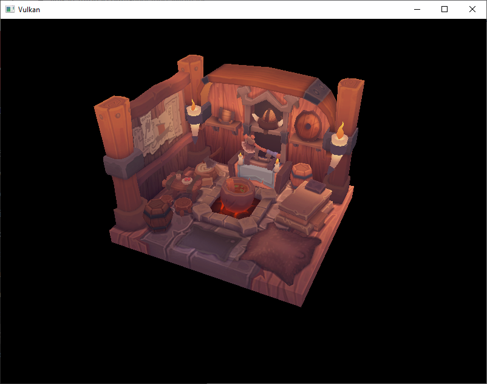

# **生成 Mipmaps**

## **前言**

在本章中，我们将为程序添加 mipmap 生成功能。Mipmaps 广泛应用于游戏和渲染软件中，Vulkan 让我们可以完全控制它们的创建方式。

Mipmaps 是图像预先计算好的等比缩放的版本，每个新图像是宽度和高度是前一个图像的一半。
当摄像头距离图像较远时，可以从较小的mip图像中采样纹理，从而提高渲染速度和避免莫尔条纹之类的伪影。

Mipmaps的外观示例如下：


> GAME101 课程中有Mipmap更详细的介绍。

## **图像创建**

### 1. 获取mip级别

在 Vulkan 中，每个 mip 图像都存储与 `vk::Image` 的不同 mip 级别中。0即是原始图像，之后的级别通常被称为 mip 链。

mip 级别是在创建 `vk::Image` 时指定的。此前，我们总将此值设为1，现在我们需要从图像的尺寸计算 mip 级别的数量。
现在添加一个类成员来存储这个数量：

```cpp
...
uint32_t m_mipLevels;
vk::raii::Image m_textureImage{ nullptr };
...
```

我们在 `createTextureImage` 中加载纹理之后就可以计算 `m_mipLevels` 值。
之前已经提到每个 mip 级别的尺寸是前者的一半，所以可以通过下面的方式计算需要的最大级别数：

```cpp
int texWidth, texHeight, texChannels;
stbi_uc* pixels = stbi_load(TEXTURE_PATH.c_str(), &texWidth, &texHeight, &texChannels, STBI_rgb_alpha);
if (!pixels) {
    throw std::runtime_error("failed to load texture image!");
}
vk::DeviceSize imageSize = texWidth * texHeight * 4;
m_mipLevels = static_cast<uint32_t>(std::floor(std::log2(std::max(texWidth, texHeight)))) + 1;
...
```

加 `1` 是为了保证原始图像具有一个级别。

> 每高一级，宽高缩小一半，总像素数变成前者的1/4。所有 mip 级别的像素数之和不超过0级的4/3。

### 2. 修改辅助函数

要使用 `m_mipLevels` ，我们需要修改 `createImage`、`createImageView` 和 `transitionImageLayout` 函数，以允许我们指定 mip 级别的数量。
现在向这些函数添加一个 `mipLevels` 参数：

```cpp
void createImage(
    uint32_t width,
    uint32_t height,
    uint32_t mipLevels,
    vk::Format format,
    vk::ImageTiling tiling,
    vk::ImageUsageFlags usage,
    vk::MemoryPropertyFlags properties,
    vk::raii::Image& image,
    vk::raii::DeviceMemory& imageMemory
) {
    ...
    imageInfo.mipLevels = mipLevels;
    ...
}
...
vk::raii::ImageView createImageView(
    vk::Image image, 
    vk::Format format, 
    vk::ImageAspectFlags aspectFlags,
    uint32_t mipLevels
) {
    ...
    viewInfo.subresourceRange.levelCount = mipLevels;
    ...
}
...
void transitionImageLayout(
    vk::raii::Image& image,
    vk::Format format,
    vk::ImageLayout oldLayout,
    vk::ImageLayout newLayout,
    uint32_t mipLevels
) {
    ...
    barrier.subresourceRange.levelCount = mipLevels;
    ...
}
```

然后更新这些函数的调用，注意只有纹理图像打开需要 mip 级别，其他图像依然保持 `1` 即可：

```cpp
// createDepthResources
createImage(
    m_swapChainExtent.width,
    m_swapChainExtent.height,
    1,
    depthFormat,
    vk::ImageTiling::eOptimal,
    vk::ImageUsageFlagBits::eDepthStencilAttachment,
    vk::MemoryPropertyFlagBits::eDeviceLocal,
    m_depthImage,
    m_depthImageMemory
);
...
// createTextureImage
createImage( 
    texWidth, 
    texHeight,
    m_mipLevels,
    vk::Format::eR8G8B8A8Srgb,
    vk::ImageTiling::eOptimal,
    vk::ImageUsageFlagBits::eTransferDst | 
    vk::ImageUsageFlagBits::eSampled,
    vk::MemoryPropertyFlagBits::eDeviceLocal,
    m_textureImage,
    m_textureImageMemory
);
...
// createImageViews
m_swapChainImageViews.emplace_back( 
    createImageView(
        m_swapChainImages[i], 
        m_swapChainImageFormat, 
        vk::ImageAspectFlagBits::eColor,
        1
    ) 
);
...
// createDepthResources
m_depthImageView = createImageView(
    m_depthImage, 
    depthFormat, 
    vk::ImageAspectFlagBits::eDepth,
    1
);
...
// createTextureImageView
m_textureImageView = createImageView(
    m_textureImage, 
    vk::Format::eR8G8B8A8Srgb, 
    vk::ImageAspectFlagBits::eColor,
    m_mipLevels
);
... 
// createDepthResources (this transitionImageLayout is optional)
transitionImageLayout(
    m_depthImage,
    depthFormat,
    vk::ImageLayout::eUndefined,
    vk::ImageLayout::eDepthStencilAttachmentOptimal,
    1
);
...
// createTextureImage
transitionImageLayout(
    m_textureImage,
    vk::Format::eR8G8B8A8Srgb,
    vk::ImageLayout::eUndefined,
    vk::ImageLayout::eTransferDstOptimal,
    m_mipLevels
);
...
// createTextureImage
transitionImageLayout(
    m_textureImage,
    vk::Format::eR8G8B8A8Srgb,
    vk::ImageLayout::eTransferDstOptimal,
    vk::ImageLayout::eShaderReadOnlyOptimal,
    m_mipLevels
);
```

## **生成 Mipmaps**

### 1. 函数修改

现在我们的纹理图像有了多个 mip 级别，但是暂存缓冲只能用于填充级别0，其他级别的内容依然未定义。
我们需要从单个级别生成其他级别的数据，使用`blitImage`命令。
此命令用于执行复制、缩放和过滤操作。我们将多次调用它以将数据 blit 到纹理图像的每个级别。

`blitImage` 被认为是传输操作，我们还需要给 `m_textureImage` 加上 `vk::ImageUsageFlagBits::eTransferDst` 标志位：

```cpp
createImage( 
    texWidth, 
    texHeight,
    m_mipLevels,
    vk::Format::eR8G8B8A8Srgb,
    vk::ImageTiling::eOptimal,
    vk::ImageUsageFlagBits::eTransferSrc |
    vk::ImageUsageFlagBits::eTransferDst | 
    vk::ImageUsageFlagBits::eSampled,
    vk::MemoryPropertyFlagBits::eDeviceLocal,
    m_textureImage,
    m_textureImageMemory
);
```

和其他操作一样， `blitImage` 命令依赖图像布局。
我们可以将整个图形转换成 `eGeneral` ，但这很可能很慢。
为了获取最佳性能，源图像应处于 `eTransferSrcOptimal` ，目标图像应处于 `eTransferDstOptimal` 。
Vulkan 允许我们独立转换每个 mip 级别的图像。
我们一次性只 blit 两个mip级别，所以可以在每个bilt之间将每个级别都转换到最优布局。

`transitionImageLayout` 函数只能转换整个图形，所以我们需要更多的管线屏障指令。
现在移除到`eShaderReadOnlyOptimal`的那条转换命令：

```cpp
transitionImageLayout(
    m_textureImage,
    vk::Format::eR8G8B8A8Srgb,
    vk::ImageLayout::eUndefined,
    vk::ImageLayout::eTransferDstOptimal,
    m_mipLevels
);

copyBufferToImage(
    stagingBuffer,
    m_textureImage,
    static_cast<uint32_t>(texWidth),
    static_cast<uint32_t>(texHeight)
);

// transitionImageLayout(
//     m_textureImage,
//     vk::Format::eR8G8B8A8Srgb,
//     vk::ImageLayout::eTransferDstOptimal,
//     vk::ImageLayout::eShaderReadOnlyOptimal,
//     m_mipLevels
// );
```

现在整幅图像（每个 mip 级别）都被设置成了 `eTransferDstOptimal` 。

### 2. 辅助函数创建

现在添加一个辅助函数用于生成 mipmaps：

```cpp
void generateMipmaps(
    vk::raii::Image& image, 
    int32_t texWidth, 
    int32_t texHeight, 
    uint32_t mipLevels
) {
    auto commandBuffer = beginSingleTimeCommands();

    vk::ImageMemoryBarrier barrier;
    barrier.image = image;
    barrier.srcQueueFamilyIndex = VK_QUEUE_FAMILY_IGNORED;
    barrier.dstQueueFamilyIndex = VK_QUEUE_FAMILY_IGNORED;
    barrier.subresourceRange.aspectMask = vk::ImageAspectFlagBits::eColor;
    barrier.subresourceRange.baseArrayLayer = 0;
    barrier.subresourceRange.layerCount = 1;
    barrier.subresourceRange.levelCount = 1;

    endSingleTimeCommands( std::move(commandBuffer) );
}
```

我们会在多次转换命令中重用这一个屏障，上面的字段在每次使用时相同。

```cpp
int32_t mipWidth = texWidth;
int32_t mipHeight = texHeight;

for (uint32_t i = 1; i < mipLevels; ++i) {

}
```

此循环用于记录每次的 `blitImage` 命令，大致需要如下步骤：

1. 将 i-1 级别的图像布局转换成 `eTransferSrcOptimal` ，以便作为传输源
2. 从 i-1 级别中 blit 新图像到 i 级别
3. 将 i-1 级别的图像布局转换回 `eShaderReadOnlyOptimal` ，以便后面采样器读取

> 创建纹理图像时的 `transitionImageLayout` 保证了所有级别的布局是 `eTransferDstOptimal`

我们需要填写 `miplevel`、`Layout`、`AccessMask` 等信息：

```cpp
barrier.subresourceRange.baseMipLevel = i - 1;
barrier.oldLayout = vk::ImageLayout::eTransferDstOptimal;
barrier.newLayout = vk::ImageLayout::eTransferSrcOptimal;
barrier.srcAccessMask = vk::AccessFlagBits::eTransferWrite;
barrier.dstAccessMask = vk::AccessFlagBits::eTransferRead;
commandBuffer.pipelineBarrier(
    vk::PipelineStageFlagBits::eTransfer,
    vk::PipelineStageFlagBits::eTransfer,
    {},
    nullptr,
    nullptr,
    barrier
);
```

首先我们将 `i-1` 级别的转换到了 `eTransferSrcOptimal` 。
此转换将等待 `i - 1` 级别被填充，无论是来自之前的 blit 命令还是 `copyBufferToImage` 命令。
当前的 blit 命令将等待此转换。

然后我们需要指定 bilt 命令的操作区域：

```cpp
vk::ImageBlit blit;
blit.srcOffsets[0] = vk::Offset3D{ 0, 0, 0 };
blit.srcOffsets[1] = vk::Offset3D{ mipWidth, mipHeight, 1 };
blit.srcSubresource.aspectMask = vk::ImageAspectFlagBits::eColor;
blit.srcSubresource.mipLevel = i - 1;
blit.srcSubresource.baseArrayLayer = 0;
blit.srcSubresource.layerCount = 1;
blit.dstOffsets[0] = vk::Offset3D{ 0, 0, 0 };
blit.dstOffsets[1] = vk::Offset3D{ 
    mipWidth > 1 ? mipWidth / 2 : 1, 
    mipHeight > 1 ? mipHeight / 2 : 1, 
    1 
};
blit.dstSubresource.aspectMask = vk::ImageAspectFlagBits::eColor;
blit.dstSubresource.mipLevel = i;
blit.dstSubresource.baseArrayLayer = 0;
blit.dstSubresource.layerCount = 1;
```

我们指定将 src(i-1级别) 的图像 blit 到 dst(i级别) 中，通过两个 `Offset` 值指定需要操作的图像范围。
因为我们需要转换的是2D图像，所以 `Offset3D` 的 Z 轴设置必须是 `[0,1)`。

现在可以通过 blit 命令记录操作了：

```cpp
commandBuffer.blitImage(
    image, vk::ImageLayout::eTransferSrcOptimal,
    image, vk::ImageLayout::eTransferDstOptimal,
    blit,
    vk::Filter::eLinear
);
```

我们将 `image` 同时指定为了 `srcImage` 和 `dstImage` 参数，因为我们需要在同一个图像的不同级别之间 blit。

原级别的布局是 `eTransferSrcOptimal` ，就是本函数上面的代码中进行的转换。  
目标级别的布局是 `eTransferDstOptimal` ，因为 `createTextureImage` 中我们将整个图像布局都变成了 `eTransferDstOptimal` 。

最后一个参数指定过滤器，我们使用线性差值（你也可以使用最近临或其他方法）。

> 注意 `blitImage` 必须提交到具有图形功能的队列（如果你使用了专用的传输队列）。

然后还需要录制命令把布局转换回 `eShaderReadOnlyOptimal` ：

```cpp
barrier.oldLayout = vk::ImageLayout::eTransferSrcOptimal;
barrier.newLayout = vk::ImageLayout::eShaderReadOnlyOptimal;
barrier.srcAccessMask = vk::AccessFlagBits::eTransferRead;
barrier.dstAccessMask = vk::AccessFlagBits::eShaderRead;
commandBuffer.pipelineBarrier(
    vk::PipelineStageFlagBits::eTransfer,
    vk::PipelineStageFlagBits::eFragmentShader,
    {},
    nullptr,
    nullptr,
    barrier
);
```

最后别忘了处理下一个 mip 级别之前更新宽高:

```cpp
if (mipWidth > 1) mipWidth /= 2;
if (mipHeight > 1) mipHeight /= 2;
```

`> 1` 检查是为了保证每个维度永远不会变为0。

注意到循环是从 1 到 mipLevels-1 ，我们并没有把最后一个级别\(mipLevels-1\)的布局变回`eShaderReadOnlyOptimal`，所以需要在循环之外特殊处理：

```cpp
    barrier.subresourceRange.baseMipLevel = mipLevels - 1;
    barrier.oldLayout = vk::ImageLayout::eTransferDstOptimal;
    barrier.newLayout = vk::ImageLayout::eShaderReadOnlyOptimal;
    barrier.srcAccessMask = vk::AccessFlagBits::eTransferRead;
    barrier.dstAccessMask = vk::AccessFlagBits::eShaderRead;
    commandBuffer.pipelineBarrier(
        vk::PipelineStageFlagBits::eTransfer,
        vk::PipelineStageFlagBits::eFragmentShader,
        {},
        nullptr,
        nullptr,
        barrier
    );

    if (mipWidth > 1) mipWidth /= 2;
    if (mipHeight > 1) mipHeight /= 2;

    endSingleTimeCommands( std::move(commandBuffer) );
}
```

> 注意最后一个级别的旧布局是 DstOptimal 而不是 SrcOptimal 。

最后，在 `createTextureImage` 中调用 `generateMipmaps` ：

```cpp
transitionImageLayout(
    m_textureImage,
    vk::Format::eR8G8B8A8Srgb,
    vk::ImageLayout::eUndefined,
    vk::ImageLayout::eTransferDstOptimal,
    m_mipLevels
);
copyBufferToImage(
    stagingBuffer,
    m_textureImage,
    static_cast<uint32_t>(texWidth),
    static_cast<uint32_t>(texHeight)
);
generateMipmaps(
    m_textureImage,
    texWidth,
    texHeight,
    m_mipLevels
);
```

## **线性过滤支持**

使用 `blitImage` 这样的内置函数生成 mip 图像非常方便，但这要求我们的纹理图像格式支持线性过滤。
可以使用 `physicalDevice.FormatProperties()` 函数进行检查。
为此在 `generateMipmaps` 函数中添加一个参数：

```cpp
void createTextureImage() {
    ...
    generateMipmaps(
        m_textureImage,
        vk::Format::eR8G8B8A8Srgb,
        texWidth,
        texHeight,
        m_mipLevels
    );
}
void generateMipmaps(
    vk::raii::Image& image, 
    vk::Format imageFormat,
    int32_t texWidth, 
    int32_t texHeight, 
    uint32_t mipLevels
){
    ...
}
```

在 `generateMipmaps` 获取格式属性：

```cpp
// vk::FormatProperties
auto formatProperties = m_physicalDevice.getFormatProperties(imageFormat);
```

`vk::FormatProperties` 结构体有一些不同的 `TilingFeatures` 字段。
我们创建的纹理图像使用最优平铺格式，所以需要检查 `optimalTilingFeatures` 是否支持线性采样过滤器，可以这样写：

```cpp
if(!(formatProperties.optimalTilingFeatures & vk::FormatFeatureFlagBits::eSampledImageFilterLinear)){
    throw std::runtime_error("texture image format does not support linear blitting!");
}
```

还有两种替代方案：

1. 使用一个函数，查找并使用支持线性bliting的图像格式。
2. 使用 stb_image_resize 这样的库实现 mipmap 生成。

应该注意的时，实际应用中一般不会在运行时生成mipmap级别。
通常会预生成然后一并放入纹理文件中，从而提高加载速度。
作为一个练习，读者可以自行寻找合适的纹理图片，尝试从中加载多个mipmap级别。

## **采样器**

### 1. 字段介绍

我们还需要为采样器指定如何读取这些mimap数据，这非常简单。
Vulkan 允许我们指定 `minLod`、`maxLod`、`mipLodBias` 和 `mipmapMode`（“Lod”表示“细节级别”）。
当对纹理进行采样时，采样器会根据以下伪代码选择 mip 级别

```cpp
// 根据距离生成一个合适的细节等级
lod = getLodLevelFromScreenSize();
lod = clamp(lod + mipLodBias, minLod, maxLod);
// 根据细节等级选择合适的 mip 等级
level = clamp(floor(lod), 0, texture.mipLevels - 1); 
// 从对应的 mip 等级图像获取色彩
if (mipmapMode == VK_SAMPLER_MIPMAP_MODE_NEAREST) {
    // 最近临方法
    color = sample(level);
} else {
    // 颜色混合方法，比如线性差值
    color = blend(sample(level), sample(level + 1));
}
```

采样\(sample\)操作本身也受 `lod` 影响：

```cpp
if (lod <= 0) {
    color = readTexture(uv, magFilter);
} else {
    color = readTexture(uv, minFilter);
}
```

如果物体距离摄像机近，。就会使用 `magFilter` 过滤器；反之离得远则使用 `minFilter` 过滤器。
通常 `lod` 是非负数，因为0表示贴近摄像机，`mipLodBias` 偏移量允许我们强制 Vulkan 使用比通常使用的更低的 `lod` 和 `level` 。

### 2. 指定字段

我们需要为 `textureSampler` 选择合适的值。
我们已经将 `minFilter` 和 `magFilter` 设置为线性差值，现在只需指定合适的 `minLod`、`maxLod`、`mipLodBias` 和 `mipmapMode` 。

```cpp
samplerInfo.mipmapMode = vk::SamplerMipmapMode::eLinear;
samplerInfo.mipLodBias = 0.0f;
samplerInfo.minLod = 0.0f;
samplerInfo.maxLod = static_cast<float>(m_mipLevels);
```

根据上面的伪代码，你应该可以理解这里的参数。

## **运行**

现在运行您的程序，您应该看到以下内容



差异并不显著，因为我们的场景非常简单。如果您仔细观察，应该能发现细微的差别。


最明显的差异是纸上的文字。
使用 mipmaps 后文字已被平滑。不使用 mipmaps 时文字有粗糙的边缘和来自莫尔伪影的间隙。

您可以尝试调整采样器设置，看看它们如何影响 mipmapping。
例如更改 minLod，强制着色器使用较高的 mip 级别：

```cpp
samplerInfo.minLod = static_cast<float>(m_mipLevels / 2);
```

此参数将生成类似下面的图像：


---

**[C++代码](../../codes/03/20_mipmaps/main.cpp)**

**[C++代码差异](../../codes/03/20_mipmaps/main.diff)**

**[根项目CMake代码](../../codes/03/00_loadmodel/CMakeLists.txt)**

**[shader-CMake代码](../../codes/02/40_depthbuffer/shaders/CMakeLists.txt)**

**[shader-vert代码](../../codes/02/40_depthbuffer/shaders/shader.vert)**

**[shader-frag代码](../../codes/02/40_depthbuffer/shaders/shader.frag)**

