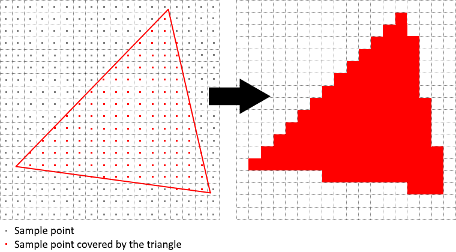
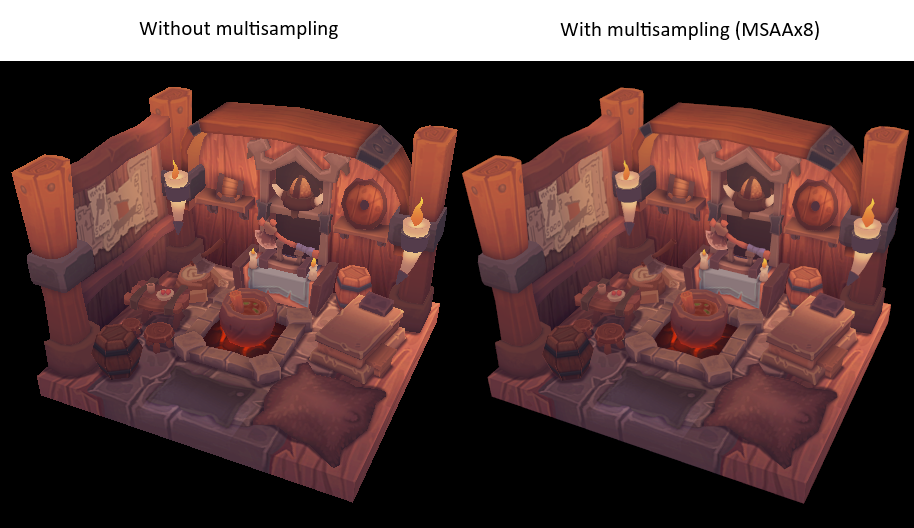

# **多重采样**\(Multisampling\)

## **前言**

我们的程序现在可以为纹理加载多个细节级别，这修复了渲染远离观察者的物体时出现的瑕疵。
图像现在平滑了很多，但是仔细观察你将注意到几何形状边缘可能会出现锯齿状的图案。
这在我们早期的程序中尤其明显，当时我们渲染了一个四边形：


这种不良效果被称为“走样”，它是可用像素数量有限造成的。
有很多方法可以解决这个问题，在本章中，我们将重点介绍一种常见的方法：[多重采样抗锯齿](https://en.wikipedia.org/wiki/Multisample_anti-aliasing) \(MSAA\)。

参考下图，在光栅化过程需要考虑哪些像素位于三角形内部，我们只为三角形内的像素着色。
特殊的是那些三角形边缘的像素（只有部分在三角形内），普通渲染时只考虑中心点在不在三角形内，就容易产生“锯齿状”的效果：



原因是这些部分在内的像素，要么染色要么不染色，而没有选择染部分颜色。
MSAA 的作用就是每个像素使用多个采样点来确定其最终颜色。
正如你想的那样，样本越多，效果越好，但在计算上也更昂贵。


在本节，我们重点关注最大可用采样计数。
最大采样计数并不总是最佳方法，如果最终效果可以满足您的质量要求，则最好为了更高的性能而使用更少的采样数。

## **获取可用的采样计数**

首先要确定我们的硬件可以使用多少个样本（对于每个像素）。
大多数现代 GPU 至少支持 8 个样本，但不能保证任何地方都相同。
我们通过一个新的类成员来跟踪它：

```cpp
vk::SampleCountFlagBits m_msaaSamples = vk::SampleCountFlagBits::e1;
```

> 它并非RAII，可以任意放置。样例代码将它放在交换链下方、深度缓冲上方。

默认情况下，我们每个像素只使用一个样本，这等于没有超采样。
我们正在使用深度缓冲，因此必须考虑颜色和深度的采样计数。
现在设计一个函数 `getMaxUsableSampleCount` 用于获取可能的最大样本数：

```cpp
vk::SampleCountFlagBits getMaxUsableSampleCount() {
    // vk::PhysicalDeviceProperties
    auto properties = m_physicalDevice.getProperties();

    vk::SampleCountFlags counts = (
        properties.limits.framebufferColorSampleCounts & 
        properties.limits.framebufferDepthSampleCounts
    );
    
    if(counts & vk::SampleCountFlagBits::e64) return vk::SampleCountFlagBits::e64;
    if(counts & vk::SampleCountFlagBits::e32) return vk::SampleCountFlagBits::e32;
    if(counts & vk::SampleCountFlagBits::e16) return vk::SampleCountFlagBits::e16;
    if(counts & vk::SampleCountFlagBits::e8) return vk::SampleCountFlagBits::e8;
    if(counts & vk::SampleCountFlagBits::e8) return vk::SampleCountFlagBits::e4;
    if(counts & vk::SampleCountFlagBits::e8) return vk::SampleCountFlagBits::e2;
    return vk::SampleCountFlagBits::e1;
}
```

使用此函数在物理设备选择过程中设置 `msaaSamples` 变量。
现在稍微修改 `pickPhysicalDevice` 函数

```cpp
void pickPhysicalDevice() {
    ...
    for (const auto& it : physicalDevices) {
        if (isDeviceSuitable(it)) {
            m_physicalDevice = it;
            m_msaaSamples = getMaxUsableSampleCount();
            break;
        }
    }
    ...
}
```

## **设置渲染目标**

### 1. 创建资源

在 MSAA 中，每个像素先在一个离屏缓冲中采样，再渲染到屏幕上。
这个新的缓冲与我们一直在渲染的常规图像略有不同 - 它们必须能为每个像素存储多个样本。

一旦创建了多重采样缓冲，就必须将其解析为默认帧缓冲（每个像素仅存储一个样本）。
这就是为什么我们必须创建一个额外的渲染目标并修改我们当前的绘制过程。

我们只需要一个渲染目标，因为一次只有一个绘制操作处于活动状态，就像深度缓冲一样。
添加以下多处采样缓冲所需的资源：


```cpp
...
std::vector<vk::raii::ImageView> m_swapChainImageViews;
vk::SampleCountFlagBits m_msaaSamples = vk::SampleCountFlagBits::e1;
vk::raii::DeviceMemory m_colorImageMemory{ nullptr };
vk::raii::Image m_colorImage{ nullptr };
vk::raii::ImageView m_colorImageView{ nullptr };
vk::raii::DeviceMemory m_depthImageMemory{ nullptr };
...
```

### 2. 修改辅助函数

这个新的图像将需要存储每个像素所需的样本数，因此我们需要在图像创建过程中将这个数字传递给 `vk::ImageCreateInfo`。
通过添加 `numSamples` 参数来修改 `createImage` 函数：

```cpp
void createImage(
    uint32_t width,
    uint32_t height,
    uint32_t mipLevels,
    vk::SampleCountFlagBits numSamples,
    vk::Format format,
    vk::ImageTiling tilling,
    vk::ImageUsageFlags usage,
    vk::MemoryPropertyFlags properties,
    vk::raii::Image& image,
    vk::raii::DeviceMemory& imageMemory
) {
    ...
    imageInfo.samples = numSamples;
    ...
}
```

现在使用 `e1` 更新几处调用了此函数的代码，我们会再候选具体替换为需要的值：

```cpp
// createTextureImage
createImage( 
    texWidth, 
    texHeight,
    m_mipLevels,
    vk::SampleCountFlagBits::e1,
    vk::Format::eR8G8B8A8Srgb,
    vk::ImageTiling::eOptimal,
    vk::ImageUsageFlagBits::eTransferSrc |
    vk::ImageUsageFlagBits::eTransferDst | 
    vk::ImageUsageFlagBits::eSampled,
    vk::MemoryPropertyFlagBits::eDeviceLocal,
    m_textureImage,
    m_textureImageMemory
);
...
// createDepthResources
createImage(
    m_swapChainExtent.width,
    m_swapChainExtent.height,
    1,
    vk::SampleCountFlagBits::e1,
    depthFormat,
    vk::ImageTiling::eOptimal,
    vk::ImageUsageFlagBits::eDepthStencilAttachment,
    vk::MemoryPropertyFlagBits::eDeviceLocal,
    m_depthImage,
    m_depthImageMemory
);
```

### 3. 创建色彩资源

现在创建一个新函数 `createColorResources` 用于创建多重采样色彩缓冲，这里的 `createImage` 使用 `m_msaasample` 成员变量。
我们仅使用一个 mip 级别，因为对于每个像素具有多个样本的图像，Vulkan 规范强制执行此操作。
此外这个颜色缓冲不需要 mipmap，因为它不会用作纹理

```cpp
void createColorResources() {
    vk::Format colorFormat = m_swapChainImageFormat;

    createImage(
        m_swapChainExtent.width,
        m_swapChainExtent.height,
        1,
        m_msaaSamples,
        colorFormat,
        vk::ImageTiling::eOptimal,
        vk::ImageUsageFlagBits::eTransientAttachment |
        vk::ImageUsageFlagBits::eColorAttachment,
        vk::MemoryPropertyFlagBits::eDeviceLocal,
        m_colorImage,
        m_colorImageMemory
    );
    m_colorImageView = createImageView(
        m_colorImage,
        colorFormat,
        vk::ImageAspectFlagBits::eColor,
        1
    );
}
```

在 `createDepthResource`s 之前调用该函数：

```cpp
void initVulkan() {
    ...
    createColorResources();
    createDepthResources();
    ...
}
```

### 4. 修改深度资源

现在我们已经有了一个多重采样颜色缓冲，是时候处理深度了。修改 `createDepthResources` 并更新深度缓冲使用的样本数

```cpp
void createDepthResources() {
    ...
    createImage(
        m_swapChainExtent.width,
        m_swapChainExtent.height,
        1,
        m_msaaSamples,
        depthFormat,
        vk::ImageTiling::eOptimal,
        vk::ImageUsageFlagBits::eDepthStencilAttachment,
        vk::MemoryPropertyFlagBits::eDeviceLocal,
        m_depthImage,
        m_depthImageMemory
    );
    ...
}
```

### 5. 重建交换链

并更新 `recreateSwapChain`，以便在调整窗口大小时可以以正确的分辨率重建颜色图像

```cpp
void recreateSwapChain() {
    ...
    m_depthImageView = nullptr;
    m_depthImage = nullptr;
    m_depthImageMemory = nullptr;

    m_colorImageView = nullptr;
    m_colorImage = nullptr;
    m_colorImageMemory = nullptr;
    ...
    createColorResources();
    createDepthResources();
    ...
}
```

我们已经完成了 MSAA 的初始设置，现在我们需要开始在图形管线、帧缓冲和渲染通道中使用这个新资源，并查看结果！

## **添加新附件**

让我们首先处理渲染通道。修改 `createRenderPass` 并更新颜色和深度附件创建信息结构

```cpp
    void createRenderPass() {
        ...
        colorAttachment.samples = m_msaaSamples;
        ...
        colorAttachment.finalLayout = vk::ImageLayout::eColorAttachmentOptimal;
        ...
        depthAttachment.samples = m_msaaSamples;
        ...
    }
```

您会注意到，我们已将 `finalLayout` 从 `ePresentSrcKHR` 更改为 `eColorAttachmentOptimal`。
这是因为多重采样图像无法直接呈现，我们需要先它们解析为常规图像。
此要求不适用于深度缓冲，因为它在任何时候都不会用于呈现。
因此，我们将不得不仅为颜色添加一个新的附件，即所谓的解析附件

```cpp
vk::AttachmentDescription colorAttachmentResolve;
colorAttachmentResolve.format = m_swapChainImageFormat;
colorAttachmentResolve.samples = vk::SampleCountFlagBits::e1;
colorAttachmentResolve.loadOp = vk::AttachmentLoadOp::eDontCare;
colorAttachmentResolve.storeOp = vk::AttachmentStoreOp::eStore;
colorAttachmentResolve.stencilLoadOp = vk::AttachmentLoadOp::eDontCare;
colorAttachmentResolve.stencilStoreOp = vk::AttachmentStoreOp::eDontCare;
colorAttachmentResolve.initialLayout = vk::ImageLayout::eUndefined;
colorAttachmentResolve.finalLayout = vk::ImageLayout::ePresentSrcKHR;
```

注意 `loadOp` 不再需要清除，整幅图像会根据多重缓冲图像更新全部内容。

现在必须指示渲染通道将多重采样颜色图像解析为常规附件。
创建一个新的附件引用，它将指向将用作解析目标的颜色缓冲

```cpp
vk::AttachmentReference colorAttachmentResolveRef;
colorAttachmentResolveRef.attachment = 2;
colorAttachmentResolveRef.layout = vk::ImageLayout::eColorAttachmentOptimal;
```

将 `pResolveAttachments` 子通道结构成员设置为指向新创建的附件引用。
这足以让渲染通道定义一个多重采样解析操作，这将使我们能够将图像渲染到屏幕

```cpp
subpass.colorAttachmentCount = 1;
subpass.pColorAttachments = &colorAttachmentRef;
subpass.pDepthStencilAttachment = &depthAttachmentRef;
subpass.pResolveAttachments = &colorAttachmentResolveRef;
```

`ColorAttachments` 和 `ResolveAttachments` 的数量要求保存一致，所以共用 `colorAttachmentCount` 记录。
因此我们将操作分离，分别添加数量和两个开始指针，而不是使用 `setter` 函数。

现在使用新的颜色附件更新渲染通道信息结构：

```cpp
auto attachments = { colorAttachment, depthAttachment, colorAttachmentResolve };
vk::RenderPassCreateInfo renderPassInfo;
renderPassInfo.setAttachments( attachments );
renderPassInfo.setSubpasses( subpass );
```

在渲染通道就位后，修改 `createFramebuffers` 并将新的图像视图添加到列表中

```cpp
std::array<vk::ImageView, 3> attachments { 
    m_colorImageView, 
    m_depthImageView,
    m_swapChainImageViews[i]
};
framebufferInfo.setAttachments( attachments );
```

> 注意交换链呈现图像是2号位，新的超采样图像视图才是0号位。

最后，通过修改 `createGraphicsPipeline` 告诉新创建的管线使用多个样本

```cpp
void createGraphicsPipeline() {
    ...
    multisampling.rasterizationSamples =  m_msaaSamples;
    ...
}
```

## **运行**

现在运行你的程序，你应该看到以下内容


就像 mipmapping 一样，差异可能不是特别明显。
仔细观察你会注意到边缘不再那么锯齿状，并且与原始图像相比，整个图像看起来更平滑一些。



当放大其中一个边缘时，差异较为明显（截图并放大而非移动摄像头靠近观看）


## **样本着色**

我们当前的 MSAA 实现存在某些限制，这些限制可能会影响更细致的场景中输出图像的质量。
例如，我们目前没有解决由着色器走样引起的潜在问题，即 MSAA 仅平滑几何体的边缘，但不平滑内部填充。

> 假如MSAA将一个像素分成4份，只有1份在三角形内，那么最终色彩是 “中心像素色彩的1/4+背景色的3/4”。
> 注意虽然像素分成了4份，却之会使用中间的色彩，只着色一次。

这可能会导致一种情况，即你在屏幕上获得一个平滑的多边形，但如果应用的纹理包含高对比度颜色，它仍然会显得走样。
解决此问题的一种方法是启用“样本着色\(sample shadering\)”，超采样的每小部分单独着色再平均。
这将进一步提高图像质量，但会增加额外的性能成本


```cpp
void createLogicalDevice() {
    ...
    deviceFeatures.sampleRateShading = true; // enable sample shading feature for the device
    ...
}

void createGraphicsPipeline() {
    ...
    multisampling.sampleShadingEnable = true; // enable sample shading in the pipeline
    multisampling.minSampleShading = .2f; // min fraction for sample shading; closer to one is smoother
    ...
}
```

本章节中不会启用它，但你可以根据下面的例子或者自行启用观察差异：


> 注意这是一整张图像，红色的圆是白色图像的一部分，而非独立的几何体。

---

**[C++代码](../../codes/03/30_multisample/main.cpp)**

**[C++代码差异](../../codes/03/30_multisample/main.diff)**

**[根项目CMake代码](../../codes/03/00_loadmodel/CMakeLists.txt)**

**[shader-CMake代码](../../codes/02/40_depthbuffer/shaders/CMakeLists.txt)**

**[shader-vert代码](../../codes/02/40_depthbuffer/shaders/shader.vert)**

**[shader-frag代码](../../codes/02/40_depthbuffer/shaders/shader.frag)**


