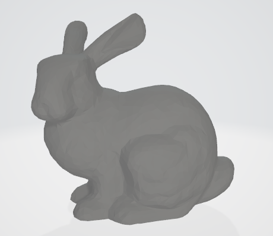
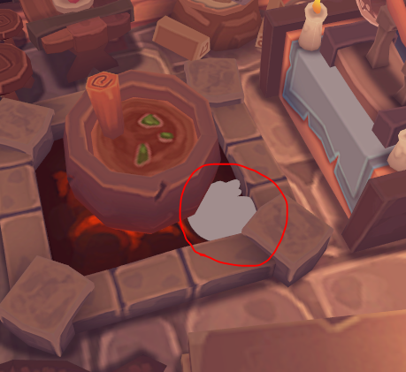

# **实例化渲染**

## **前言**

本章我们会介绍 **实例化渲染\(Instanced Rendering\)** ，它是Vulkan中一种高效的渲染技术，允许你使用单个绘制调用渲染多个相同或相似的物体，每个实例可以有自己独特的属性(如位置、颜色、缩放等)。
这种技术特别适合渲染大量重复对象(如草地、人群、子弹等)。

我们现在仅渲染了一个房子模型。在本章中，我们将添加一个兔子模型，并在场景中渲染多只兔子。

## **添加新模型**

### 1. 下载模型

可以点击 **[这里](../../res/bunny.obj)** 下载模型，将它也放入“models”文件夹中。

[](../../res/bunny.obj)

### 2. 读入模型

现在添加新的静态常量成员，存放模型的路径：

```cpp
inline static const std::string BUNNY_PATH = "models/bunny.obj";
```

我们可以复用使用之前的 `loadModel` 函数，但需要略微调整函数签名和内容：

```cpp
void loadModel(const std::string& model_path) {
    ......
    if (!tinyobj::LoadObj(&attrib, &shapes, &materials, &warn, &err, model_path.c_str())) {
        throw std::runtime_error(warn + err);
    }
    ......
    static std::unordered_map<
        ......
    > uniqueVertices;
    ......
}
```

我们将模型路径作为参数名，并且将 `uniqueVertices` 设为了 `static` ，保证多次模型重用同一个顶点哈希表。

现在可以修改 `initVulkan` 函数，加载两个模型：

```cpp
loadModel(MODEL_PATH);
loadModel(BUNNY_PATH);
```

### 3. 区分索引

按上面的方式加载模型时，我们无法区分哪些索引是第一个模型的，哪些是第二个的。
一种解决方案是，使用一个数组记录每个模型的索引起始位置。在 `m_indices` 下方添加一个成员变量 `m_firstIndices` ：

```cpp
std::vector<uint32_t> m_indices;
std::vector<uint32_t> m_firstIndices;
```

然后修改 `loadModel` 函数，在每次读取时通过已有索引数记录开始位置：

```cpp
void loadModel(const std::string& model_path) {
    ......

    if (!tinyobj::LoadObj(&attrib, &shapes, &materials, &warn, &err, model_path.c_str())) {
        throw std::runtime_error(warn + err);
    }

    m_firstIndices.push_back(m_indices.size());
    ......
}
```

这样我们可以通过 `m_firstIndices[i]` 查询第 i 个模型的索引开始位置，使用后一个开始位置减当前位置得到模型的顶点数。

### 4. 顶点色彩与纹理

如果你打开兔子模型的obj文件，会注意到它没有法线也没有纹理坐标，只有最普通的顶点集和三角形集，所以我需要修改代码防止数组越界：

```cpp
void loadModel(const std::string& model_path) {
    ......
    // 检查是否有纹理坐标
    if (!attrib.texcoords.empty() && index.texcoord_index >= 0) {
        vertex.texCoord = {
            attrib.texcoords[2 * index.texcoord_index],
            1.0f - attrib.texcoords[2 * index.texcoord_index + 1]
        };
    } else {
        vertex.texCoord = {0.61f, 0.17f}; // 暂时选用一个灰色的纹理点
    }
    ......
}
```

### 4. 运行

现在启动程序，仔细观察，兔子出现在中央锅炉旁，半身嵌入地下且身体翻转：



> 使用 `WSAD` 进行水平移动摄像头， `Space` 和 `LShift` 升降高度，`↑↓←→` 转动视角。

## **实例缓冲区**

实例化渲染依赖“实例缓冲区”，它本质上也属于“顶点缓冲区”，最后通过命令缓冲的 `bindVertexBuffers` 函数绑定。
因此，你很快会发现创建实例缓冲和我们之前创建顶点缓冲的过程几乎一样。

### 1. 存储实例数据

有哪些数据是实例特定的呢？

我们之前提过，现在的房屋模型使用 Z 轴向上，需要将其旋转；而新的兔子模型是正常 Y 轴向上的，无需旋转。
而且我们会渲染多只兔子，要将其它们放在不同位置，所以需要不同的模型变换矩阵。
此外，房屋模型有纹理，而兔子模型没有，我们希望通过一个标志位控制片段着色器是否从纹理中采样。

现在创建一个数据结构用于存放实例数据，我们需要模型和纹理控制字段：

```cpp
struct alignas(16) InstanceData {
    glm::mat4 model;
    uint32_t enableTexture;
};
```

类似顶点缓冲的创建过程，我们需要“顶点输入绑定描述”，添加辅助函数：

```cpp
static vk::VertexInputBindingDescription getBindingDescription() {
    vk::VertexInputBindingDescription bindingDescription;
    bindingDescription.binding = 1; // binding 1 for instance data
    bindingDescription.stride = sizeof(InstanceData);
    bindingDescription.inputRate = vk::VertexInputRate::eInstance;

    return bindingDescription;
}
```

实例缓冲和顶点缓冲最后一起使用命令缓冲的 `bindVertexBuffers` 函数绑定，它的输入包含一个缓冲区数组。
我们后面会将顶点缓冲数据放在数组 0 号位，实例缓冲数据放在 1 号位，所以这里 `binding = 1` 。

然后还需要“参数描述”，它对应着色器中的 `location` 信息，一个 `location` 上限是16字节，所以我们需要五个：

```cpp
static std::array<vk::VertexInputAttributeDescription, 5>  getAttributeDescriptions() {
    std::array<vk::VertexInputAttributeDescription, 5> attributeDescriptions;
    for(uint32_t i = 0; i < 4; ++i) {
        attributeDescriptions[i].binding = 1; // binding 1 for instance data
        attributeDescriptions[i].location = 3 + i; // location 3, 4, 5, 6
        attributeDescriptions[i].format = vk::Format::eR32G32B32A32Sfloat;
        attributeDescriptions[i].offset = sizeof(glm::vec4) * i;
    }
    attributeDescriptions[4].binding = 1;
    attributeDescriptions[4].location = 7;
    attributeDescriptions[4].format = vk::Format::eR32Uint;
    attributeDescriptions[4].offset = sizeof(glm::mat4);
    return attributeDescriptions;
}
```

我们在“顶点缓冲”章节介绍过这些内容。
`location` 的 0~2 已经被顶点缓冲使用，所以这里使用 3~7；
注意 `enableTexture` 的类型是 `uint32_t` ，对应 `eR32Uint` 。

最后，在成员变量中添加一个数组用于存储实例数据，可以放在 `m_vertices` 下方：

```cpp
std::vector<InstanceData> m_instanceDatas;
```

> 如果提示找不到 `InstanceData` ，可能需要添加前向声明。

### 2. 初始化实例数据

首先添加一个静态成员常量，用于指定需要渲染多少只兔子：

```cpp
static constexpr int BUNNY_NUMBER = 5;
```

现在创建一个新函数用于初始化实例数据，可以放在 `loadModel(BUNNY_PATH);` 下方：

```cpp
void initVulkan() {
    ...
    loadModel(MODEL_PATH);
    loadModel(BUNNY_PATH);
    initInstanceDatas();
    ...
}
......
void initInstanceDatas() {

}
```

然后需要初始化实例数据，我们一共需要 `1 + BUNNY_NUMBER` 个实例数据，分别表示房屋模型和多只兔子。
对于房屋模型，可以参考 `updateUniformBuffer` 中的模型矩阵。对于兔子模型，可以随机生成位移和旋转矩阵。

```cpp
#include <random>

......

void initInstanceDatas() {
    InstanceData instanceData;
    m_instanceDatas.reserve(BUNNY_NUMBER + 1);
    // 房间的旋转矩阵，参考 `updateUniformBuffer` 中的内容。
    instanceData.model = glm::rotate(
        glm::mat4(1.0f), 
        glm::radians(-90.0f), 
        glm::vec3(1.0f, 0.0f, 0.0f)
    ) *  glm::rotate(
        glm::mat4(1.0f), 
        glm::radians(-90.0f), 
        glm::vec3(0.0f, 0.0f, 1.0f)
    );
    instanceData.enableTexture = 1; // 允许房间采样
    m_instanceDatas.emplace_back( instanceData );
    // 随机数生成器
    std::random_device rd;
    std::mt19937 gen(rd());
    std::uniform_real_distribution<float> dis(-1.0f, 1.0f);
    // 初始化兔子的参数
    for (int i = 0; i < BUNNY_NUMBER; ++i) {
        // 随机移动和水平旋转
        instanceData.model = glm::translate(
            glm::mat4(1.0f), 
            glm::vec3(dis(gen), dis(gen), dis(gen))
        ) * glm::rotate(
            glm::mat4(1.0f), 
            glm::radians(dis(gen) * 180.0f), 
            glm::vec3(0.0f, 1.0f, 0.0f)
        );
        instanceData.enableTexture = 0; // 禁止纹理采样
        m_instanceDatas.emplace_back( instanceData );
    }
}
```

我们使用了标准库的 `mt19937` 和 `uniform_real_distribution` 用于生成 `[-1.0f, 1.0f)` 之间的随机数，且只允许第一个模型进行纹理采样。

### 3. 实例缓冲区

现在要创建实例缓冲区，在顶点缓冲变量 `m_vertexBuffer` 的下面添加两个新成员变量：

```cpp
...
vk::raii::DeviceMemory m_vertexBufferMemory{ nullptr };
vk::raii::Buffer m_vertexBuffer{ nullptr };
vk::raii::DeviceMemory m_instanceBufferMemory{ nullptr };
vk::raii::Buffer m_instanceBuffer{ nullptr };
...
```

然后添加添加一个新函数 `createInstanceBuffer` ，在 `createVertexBuffer` 下方调用 ：

```cpp
void initVulkan() {
    ......
    createVertexBuffer();
    createInstanceBuffer();
    ......
}
......
void createInstanceBuffer() {

}
```

实例缓冲的创建流程同样可以参考顶点缓冲：

```cpp
void createInstanceBuffer() {
    vk::DeviceSize bufferSize = sizeof(InstanceData) * m_instanceDatas.size();

    vk::raii::DeviceMemory stagingBufferMemory{ nullptr };
    vk::raii::Buffer stagingBuffer{ nullptr };
    createBuffer(bufferSize,
        vk::BufferUsageFlagBits::eTransferSrc,
        vk::MemoryPropertyFlagBits::eHostVisible | 
        vk::MemoryPropertyFlagBits::eHostCoherent,
        stagingBuffer,
        stagingBufferMemory
    );

    void* data = stagingBufferMemory.mapMemory(0, bufferSize);
    memcpy(data, m_instanceDatas.data(), static_cast<size_t>(bufferSize));
    stagingBufferMemory.unmapMemory();

    createBuffer(bufferSize,
        vk::BufferUsageFlagBits::eTransferDst | 
        vk::BufferUsageFlagBits::eVertexBuffer,
        vk::MemoryPropertyFlagBits::eDeviceLocal,
        m_instanceBuffer,
        m_instanceBufferMemory
    );

    copyBuffer(stagingBuffer, m_instanceBuffer, bufferSize);
}
```

### 4. 修改管线布局

在 `createGraphicsPipeline()` 函数中修改顶点输入的信息：

```cpp
void createGraphicsPipeline() {
    ......
    auto vertexBindingDescription = Vertex::getBindingDescription();
    auto vertexAttributeDescriptions = Vertex::getAttributeDescriptions();
    auto instanceBindingDescription = InstanceData::getBindingDescription();
    auto instanceAttributeDescriptions = InstanceData::getAttributeDescriptions();

    std::vector<vk::VertexInputBindingDescription> bindingDescriptions = { 
        vertexBindingDescription, 
        instanceBindingDescription 
    };
    std::vector<vk::VertexInputAttributeDescription> attributeDescriptions;
    attributeDescriptions.insert(
        attributeDescriptions.end(),
        vertexAttributeDescriptions.begin(),
        vertexAttributeDescriptions.end()
    );
    attributeDescriptions.insert(
        attributeDescriptions.end(),
        instanceAttributeDescriptions.begin(),
        instanceAttributeDescriptions.end()
    );

    vertexInputInfo.setVertexBindingDescriptions(bindingDescriptions);
    vertexInputInfo.setVertexAttributeDescriptions(attributeDescriptions);
    ......
}
```

`BindingDescription` 可以直接使用构造函数将两个值组成数组，但 `AttributeDescriptions` 本身就是数组，需要使用 `insert` 插入末尾。

### 5. 绑定与绘制

在 `recordCommandBuffer()` 中，绑定实例缓冲区：

```cpp
vk::Buffer vertexBuffers[] = { *m_vertexBuffer, *m_instanceBuffer };
vk::DeviceSize offsets[] = { 0, 0 };
commandBuffer.bindVertexBuffers( 0, vertexBuffers, offsets );
```

`m_vertexBuffer` 在数组的 0 号位，`m_instanceBuffer` 在 1 号位，这就是为什么之前的 `binding` 参数分别是 0 和 1 。


然后修改下方的绘制代码，直接使用两条绘制命令：

```cpp
commandBuffer.drawIndexed(  // 绘制房屋模型
    m_firstIndices[1],      // vertexCount 一个实例包含的顶点/索引数量
    1,                      // instanceCount 实例数量
    0,                      // firstIndex   索引的开始位置
    0,                      // vertexOffset 顶点的偏移量
    0                       // firstInstance 实例的开始位置
);
commandBuffer.drawIndexed(  // 绘制 BUNNY_NUMBER 个兔子模型
    static_cast<uint32_t>(m_indices.size() - m_firstIndices[1]),
    BUNNY_NUMBER,
    m_firstIndices[1],
    0, 
    1
);
```

第一条命令用于绘制房屋，只有一个实例，且偏移量都是 0 。
第二条命令用于绘制兔子，要绘制 `BUNNY_NUMBER` 只，通过索引的差值得到了兔子模型的顶点数量；由于 0 号实例是房屋模型，所以 `firstInstance` 设为 1 ，从 1 号实例开始才是兔子；索引的偏移量同理。

> 注意，计算顶点数时用 `m_indices.size()` 而不是 `m_firstIndices.size()` 。

### 6. 修改着色器

首先修改顶点着色器代码。实例数据绑定在顶点输入中，可以直接通过 `in` 关键字获取。
需要注意的是，还要将纹理控制位从输入转发到输出，让片段着色器读取： 

```glsl
......

layout(location = 3) in mat4 inModel;
layout(location = 7) in uint inEnableTexture;

......

layout(location = 2) flat out uint enableTexture;

void main() {
    gl_Position = ubo.proj * ubo.view * inModel * vec4(inPosition, 1.0);
    ......
    enableTexture = inEnableTexture;
}
```

我们使用 `flat` 标记，阻止管线从顶点到片段着色器时对其进行查值操作，片段着色器会直接使用第一个顶点传递的值（通常）。

> 之前提到，一个 `location` 最多 16 字节，所以 `inModel` 直接占了 4 个位置。

修改片段着色代码，从输入中获取 `enableTexture` 并控制色彩：

```glsl
......

layout(location = 2) flat in uint enableTexture;

......

void main() {
    if (enableTexture > 0) {
        outColor = texture(texSampler, fragTexCoord);
    } else {
        outColor = vec4(fragColor, 1.0);
    }
}
```

## **运行程序**

现在你可以运行程序，在房子周围会有5只兔子，且每次重启程序后位置和朝向都不同，类似这样：


> 可以尝试修改 `BUNNY_NUMBER` 值，渲染更多兔子。

## **删除冗余代码**

一开始，我们在 `loadModel` 中将**没有纹理的顶点**的纹理坐标设为了 `{0.61f, 0.17f}` ，这是个灰色的纹理点，方便我们观察效果。
但现在我们后续使用了顶点色彩，已经不需要它，可以删去或设为 `{0.0f, 0.0f}` 。

```cpp
if (!attrib.texcoords.empty() && index.texcoord_index >= 0) {
    vertex.texCoord = {
        attrib.texcoords[2 * index.texcoord_index],
        1.0f - attrib.texcoords[2 * index.texcoord_index + 1]
    };
} else {
    vertex.texCoord = {0.0f, 0.0f};
}
```

现在的 Uniform 缓冲中还有模型矩阵，但我们已经不需要它了。

修改 `UniformBufferObject` 结构体，删除 `model` 字段：

```cpp
struct alignas(16) UniformBufferObject {
    glm::mat4 view;
    glm::mat4 proj;
};
```

修改 `updateUniformBuffer` 函数，删除ubo的模型矩阵设置：

```cpp
UniformBufferObject ubo{};
// ubo.model = glm::rotate(
//     glm::mat4(1.0f), 
//     glm::radians(-90.0f), 
//     glm::vec3(1.0f, 0.0f, 0.0f)
// );
// ubo.model *= glm::rotate(
//     glm::mat4(1.0f), 
//     glm::radians(-90.0f), 
//     glm::vec3(0.0f, 0.0f, 1.0f)
// );
```

别忘了顶点着色器中也需要删除UBO的模型矩阵：

```glsl
layout(binding = 0) uniform UniformBufferObject {
    mat4 view;
    mat4 proj;
} ubo;
```

现在重新构建和运行程序，依然能看到之前的内容。

---

**[C++代码](../../codes/03/40_instancedrendering/main.cpp)**

**[C++代码差异](../../codes/03/40_instancedrendering/main.diff)**

**[根项目CMake代码](../../codes/03/40_instancedrendering/CMakeLists.txt)**

**[shader-CMake代码](../../codes/03/40_instancedrendering/shaders/CMakeLists.txt)**

**[shader-vert代码](../../codes/03/40_instancedrendering/shaders/shader.vert)**

**[shader-vert代码差异](../../codes/03/40_instancedrendering/shaders/vert.diff)**

**[shader-frag代码](../../codes/03/40_instancedrendering/shaders/shader.frag)**

**[shader-frag代码差异](../../codes/03/40_instancedrendering/shaders/frag.diff)**
