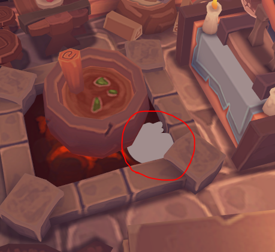

# **推送常量**

不同几何体的模型矩阵常常不同，而我们的 uniform 缓冲区\(UBO\)中只有一个模型矩阵。
我们当然可以在 UBO 中载入全部需要的模型矩阵，可这样我们每次更新一个矩阵，都需要拷贝整个UBO。

一种更好更简单的方式是使用 **推送常量（Push Constants）**。
它是一种在 GPU 着色器中传递少量数据的高效机制，一种可快速访问的小型内存区域，适合传递频繁变化但体积小的数据（例如变换矩阵、颜色、标志位等）。

| 特性             | 推送常量（Push Constants）         | Uniform 缓冲区（UBO）         |
|------------------|-----------------------------------|-------------------------------|
| 适用场景         | 小数据量、频繁变化                 | 大数据量、变化不频繁           |
| 典型用途         | 每物体模型矩阵、标志位等           | 全局参数、灯光、投影矩阵等     |
| 最大容量         | 通常 128 字节（硬件相关）           | 通常几 KB 甚至更大（硬件相关） |
| 更新方式         | `vkCmdPushConstants`，无需缓冲区    | 需创建/更新缓冲区              |
| 访问速度         | 更快                               | 快                            |
| 资源管理         | 无需显式分配内存                   | 需管理缓冲区                   |
| 适合实例渲染     | 不适合大批量实例数据                | 适合存储大量实例数据           |

## **添加新模型**

还记得“移动摄像机”章节提到的内容吗？现在使用的模型OBJ文件采用Z轴向上的方式，导致我们不得不使用模型矩阵将其旋转。

而本章我们会为场景再添加一个模型，它是正常的Y轴向上，不需要旋转。
我们将通过推送常量的方式为着色器提供模型矩阵，而视口与投影矩阵依然使用之前 UBO 的方式。

### 1. 下载模型

可以点击 **[这里](../../res/bunny.obj)** 下载模型，将它也放入“models”文件夹中。

[](../../res/bunny.obj)

如果你打开obj文件，会注意到它没有法线也没有纹理，只有最普通的顶点集和三角形集。

### 2. 读入模型

现在添加新的成员变量，存放模型的路径：

```cpp
inline static const std::string BUNNY_PATH = "models/bunny.obj";
```

我们可以直接使用之前的 `loadModel` 函数，但最好调整函数签名，以便重用：

```cpp

void loadModel(const std::string& model_path) {
    ......
    if (!tinyobj::LoadObj(&attrib, &shapes, &materials, &warn, &err, model_path.c_str())) {
        throw std::runtime_error(warn + err);
    }
    ......
}
```

我们将模型路径作为参数名，然后可以修改 `initVulkan` 函数，加载两个模型：

```cpp
loadModel(MODEL_PATH);
loadModel(BUNNY_PATH);
```

上面提到一个问题，此模型中没有纹理坐标，所以我需要修改代码防止数组越界：

```cpp
// 检查是否有纹理坐标
if (!attrib.texcoords.empty() && index.texcoord_index >= 0) {
    vertex.texCoord = {
        attrib.texcoords[2 * index.texcoord_index],
        1.0f - attrib.texcoords[2 * index.texcoord_index + 1]
    };
} else {
    // 没有纹理坐标，任意指定
    vertex.texCoord = {0.61f, 0.17f};
}
```

由于着色器依然要用到纹理，可以随意指定一个，上面选择了一个银灰色的点让效果更明显。

### 3. 运行

现在启动程序，仔细观察，兔子出现在中央锅炉旁，半身嵌入地下且身体翻转：



> 使用 `WSAD` 进行水平移动摄像头， `Space` 和 `LShift` 升降高度，`↑↓←→` 转动视角。

## **使用推送常量**

我们现在要为兔子设置单独的模型矩阵，让其移动到锅炉旁边的石桌上。

### 1. 数据存放

首先添加一个新类型，存放推送常量的数据：

```cpp
struct PushConstantData {
    glm::mat4 model;
};
```

然后在着色器中声明并使用推送常量：

```glsl
layout(push_constant) uniform PushConstants {
    mat4 model;
} pc;

......

void main() {
    gl_Position = ubo.proj * ubo.view * pc.model * vec4(inPosition, 1.0);
    ......
}
```

### 2. 管线布局声明

现在需要修改管线布局，加入推送常量的信息。修改 `createGraphicsPipeline` 函数：

```cpp
vk::PushConstantRange pushConstantRange;
pushConstantRange.stageFlags = vk::ShaderStageFlagBits::eVertex;
pushConstantRange.offset = 0;
pushConstantRange.size = sizeof(PushConstantData);

vk::PipelineLayoutCreateInfo pipelineLayoutInfo;
pipelineLayoutInfo.setPushConstantRanges( pushConstantRange );
```

`pushConstantRange` 是 Vulkan 中用于描述推送常量在着色器中的可用范围的结构体。它告诉 Vulkan：

- 这些推送常量会被哪些着色器阶段访问
- 推送常量数据的起始偏移
- 推送常量数据的大小

### 3. 模型分离

推送常量将在命令缓冲记录时填写，但在此之间还有一个问题。
我们有两个模型，需要两个推送常量，要指定哪些顶点使用第一个推送常量、哪些顶点使用第二个。

为此，我们修改 `loadModel` 函数，并用一个成员变量记录每个模型对应的的索引偏移量：

```cpp
std::vector<Vertex> m_vertices;
std::vector<uint32_t> m_indices;
std::vector<uint32_t> m_indicesOffsets; // 索引偏移量

......

void loadModel(const std::string& model_path) {
    ......

    if (!tinyobj::LoadObj(&attrib, &shapes, &materials, &warn, &err, model_path.c_str())) {
        throw std::runtime_error(warn + err);
    }

    m_indicesOffsets.push_back(m_indices.size());
    ......
}
```

### 4. 命令记录

然后在命令缓冲记录时\(`recordCommandBuffer`函数\)，为不同的模型使用不同的推送常量：

```cpp
for(size_t counter = 1; const uint32_t firstIndex : m_indicesOffsets) {
    PushConstantData pcData;
    if(counter == 1) {
        pcData.model = glm::rotate(
            glm::mat4(1.0f), 
            glm::radians(-90.0f), 
            glm::vec3(1.0f, 0.0f, 0.0f)
        )  * glm::rotate(
            glm::mat4(1.0f), 
            glm::radians(-90.0f), 
            glm::vec3(0.0f, 0.0f, 1.0f)
        );
    } else {
        pcData.model = glm::mat4(1.0f);

    }
    commandBuffer.pushConstants<PushConstantData>(
        m_pipelineLayout,
        vk::ShaderStageFlagBits::eVertex,
        0, // offset
        pcData
    );
    commandBuffer.drawIndexed(
        counter == m_indicesOffsets.size() ? m_indices.size() - firstIndex : m_indicesOffsets,
        firstIndex,
        1,
        firstIndex,
        0,
        0
    );
    ++counter;
}
```

我们使用一个循环，遍历所有的模型。
第一个模型需要转换方向，第二个模型暂时不动。

然后使用 `pushConstants` 函数传入推送常量的数据，可以使用模版函数简化代码。
最好根据索引绘制图像，第一个参数是索引数，第二个参数是开始位置。
索引数量可以用后一个开始位置减去前一个开始位置得到，注意最后一个模型没有后一个开始位置，需要使用总数。

### 5. 移动兔子

现在运行程序，你会发现兔子已经摆正，但位置依然不正确，半个模型位于锅炉内。
可以调整上面的模型矩阵，下面给出一个例子：

```cpp
pcData.model = glm::translate(glm::mat4(1.0f), glm::vec3(0.5f, 0.12f, 0.0f));
```

你应该能看到兔子移动到了石桌上：


## **删除UBO中的模型矩阵**

现在，UBO中的模型矩阵已经用不到了，我们可以删除。

首先修改 `UniformBufferObject` ，删除第一个成员变量：

```cpp
struct alignas(16) UniformBufferObject {
    glm::mat4 view;
    glm::mat4 proj;
};
```

然后调整 `updateUniformBuffer` ，删除模型矩阵的代码：

```cpp
void updateUniformBuffer(uint32_t currentImage) {
    updateCamera();

    glm::vec3 front;
    front.x = std::cos(glm::radians(m_yaw)) * std::cos(glm::radians(m_pitch));
    front.y = std::sin(glm::radians(m_pitch));
    front.z = std::sin(glm::radians(m_yaw)) * std::cos(glm::radians(m_pitch));
    front = glm::normalize(front);

    UniformBufferObject ubo{};
    ubo.view = glm::lookAt(
        m_cameraPos, 
        m_cameraPos + front, 
        m_cameraUp
    );
    ubo.proj = glm::perspective(
        glm::radians(45.0f), 
        static_cast<float>(m_swapChainExtent.width) / m_swapChainExtent.height, 
        0.1f, 
        10.0f
    );

    ubo.proj[1][1] *= -1;

    memcpy(m_uniformBuffersMapped[currentImage], &ubo, sizeof(ubo));
}
```

然后重新运行程序，与之前没有差别。

---

## **最后**

你现在掌握的 Vulkan 基本原理知识应该足以开始探索更多功能，例如

- 实例渲染\(Instanced rendering\)
- 动态 uniform\(Dynamic uniforms\)
- 分离的图像和采样器描述符\(Separate images and sampler descriptors\)
- 管线缓存\(Pipeline cache\)
- 多线程命令缓冲生成\(Multi-threaded command buffer generation\)
- 多个子通道\(Multiple subpasses\)
- 计算着色器\(Compute shaders\)

当前的程序可以通过多种方式扩展，例如添加 Blinn-Phong 光照、后期处理效果和阴影贴图。
你应该能够从其他 API 的教程中学习这些效果是如何工作。尽管 Vulkan API 很细致，但许多概念仍然是相同的。

> 理论上，作者会慢慢更新这些内容，你可以看看Github仓库的最近更新时间。

---

**[C++代码](../../codes/03/40_pushconstant/main.cpp)**

**[C++代码差异](../../codes/03/40_pushconstant/main.diff)**

**[根项目CMake代码](../../codes/03/40_pushconstant/CMakeLists.txt)**

**[shader-CMake代码](../../codes/03/40_pushconstant/shaders/CMakeLists.txt)**

**[shader-vert代码](../../codes/03/40_pushconstant/shaders/shader.vert)**

**[shader-vert代码差异](../../codes/03/40_pushconstant/shaders/vert.diff)**

**[shader-frag代码](../../codes/03/40_pushconstant/shaders/shader.frag)**

