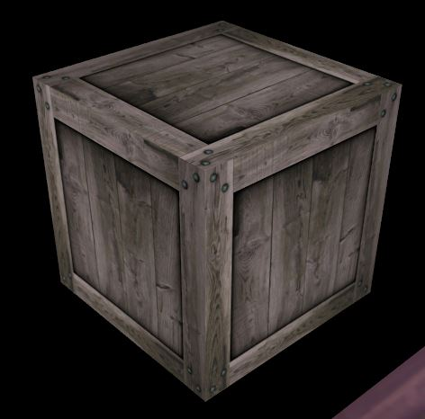
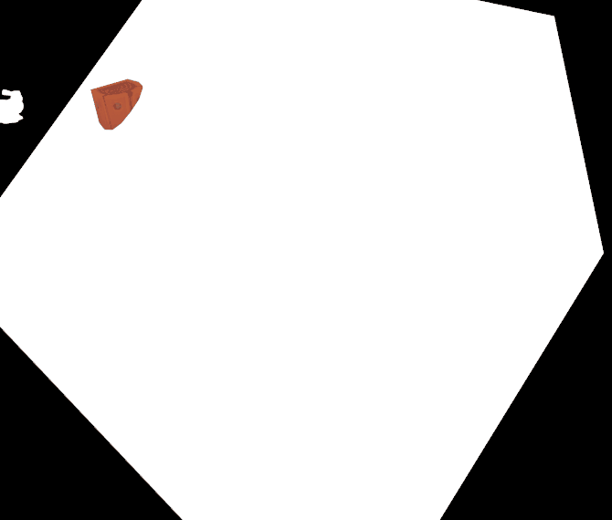
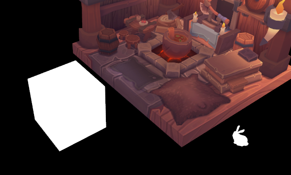
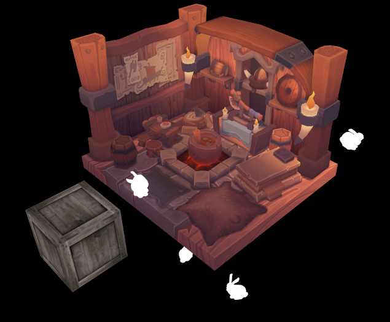

# **分离图像与采样器**

## **前言**

在之前的章节中，我们学习过如何加载纹理并采样，当时使用了 **组合图像采样器\(Combined Image Sampler\)** ，采样器和图像绑定在了一起，想要新的采样器或纹理就需要重新创建。

本章我们将介绍 **分离的图像和采样器\(Separate Image and Sampler\)** ，这允许采样器和纹理图像独立存在，可以让一个采样器采样不同的图像，也能让一幅图像被多个采样器采样。


## **修改原有纹理**

本章我们会添加新模型，但在此之前，先将原有的组合图像采样器修改为分离的图像与采样器。

事实上，C++ 端的代码修改非常简单。
无论是“组合图像采样器”还是“分离的图像与采样器”，都需要“图像内存+图像+图像视图+采样器”，而这些资源的创建过程和描述符无关。

我们已经在“纹理映射”章节创建了这些资源，所以本章暂时无需修改它们。
现在只需修改描述符相关内容，将组合图像采样器描述符替换成一个采样器描述符和一个采样器图像描述符。

### 1. 修改描述符布局

修改 `createDescriptorSetLayout` 函数，调整采样器描述符布局类型，并增加一个图像描述符：

```cpp
void createDescriptorSetLayout() {
    ...
    // 采样器的描述符布局
    vk::DescriptorSetLayoutBinding samplerLayoutBinding;
    samplerLayoutBinding.binding = 0;
    samplerLayoutBinding.descriptorType = vk::DescriptorType::eSampler; // 原先是 eCombinedImageSampler
    samplerLayoutBinding.descriptorCount = 1;
    samplerLayoutBinding.stageFlags = vk::ShaderStageFlagBits::eFragment;
    // 纹理图像的描述符布局
    vk::DescriptorSetLayoutBinding textureLayoutBinding;
    textureLayoutBinding.binding = 1;
    textureLayoutBinding.descriptorType = vk::DescriptorType::eSampledImage;
    textureLayoutBinding.descriptorCount = 1;
    textureLayoutBinding.stageFlags = vk::ShaderStageFlagBits::eFragment;

    const auto samplerLayoutBindings = { 
        samplerLayoutBinding, 
        textureLayoutBinding
    };

    vk::DescriptorSetLayoutCreateInfo samplerLayoutInfo;
    samplerLayoutInfo.setBindings( samplerLayoutBindings );
    
    ...
}
```

我们将采样器描述符的类型从 `eCombinedImageSampler` 变为了 `eSampler` ，因此图像需要独立的描述符，我们为此添加了 `textureLayoutBinding` ，它的类型是 `eSampledImage` ，表示专用于采样器的图像。

### 2. 更新描述符池

描述符池的修改与上面的描述符集布局类似：

```cpp
void createDescriptorPool() {
    std::array<vk::DescriptorPoolSize, 4> poolSizes;

    ...

    poolSizes[1].type = vk::DescriptorType::eSampler; // changed
    poolSizes[1].descriptorCount = 1;

    ...

    poolSizes[3].type = vk::DescriptorType::eSampledImage;
    poolSizes[3].descriptorCount = 1;

    ...
}
```

### 3. 修改描述符集

修改了描述符布局与描述符池，还需修改描述符集的创建过程。
修改 `createDescriptorSets` 函数，只需将原先的 `imageInfo` 拆分成 `samplerInfo` 和 `textureInfo` 即可：

```cpp
void createDescriptorSets() {
    ......

    vk::DescriptorImageInfo samplerInfo;
    samplerInfo.sampler = m_textureSampler;

    vk::DescriptorImageInfo textureInfo;
    textureInfo.imageLayout = vk::ImageLayout::eShaderReadOnlyOptimal;
    textureInfo.imageView = m_textureImageView;

    std::array<vk::WriteDescriptorSet, 2> combinedDescriptorWrites;
    combinedDescriptorWrites[0].dstSet = m_combinedDescriptorSet;
    combinedDescriptorWrites[0].dstBinding = 0;
    combinedDescriptorWrites[0].dstArrayElement = 0;
    combinedDescriptorWrites[0].descriptorType = vk::DescriptorType::eSampler;
    combinedDescriptorWrites[0].setImageInfo(samplerInfo);
    combinedDescriptorWrites[1].dstSet = m_combinedDescriptorSet;
    combinedDescriptorWrites[1].dstBinding = 1;
    combinedDescriptorWrites[1].dstArrayElement = 0;
    combinedDescriptorWrites[1].descriptorType = vk::DescriptorType::eSampledImage;
    combinedDescriptorWrites[1].setImageInfo(textureInfo);

    m_device.updateDescriptorSets(combinedDescriptorWrites, nullptr);
}
```

### 4. 着色器代码

最后，修改片段着色代码，我们需要访问采样器和纹理图像资源：

```glsl
......

layout(set = 1, binding = 0) uniform sampler texSampler;
layout(set = 1, binding = 1) uniform texture2D texImage;

......

void main() {
    if (pc.enableTexture > 0) {
        outColor = texture(sampler2D(texImage, texSampler), fragTexCoord);
    } else {
        outColor = vec4(fragColor, 1.0);
    }
}
```

注意到 `texSampler` 的类型从 `sampler2D` 变成了 `sampler` ，这意味着采样器自身不含图像，因此采样的命令也变了，需要使用 `sampler2D(texImage, texSampler)` 而不是直接 `texSampler` 。

### 5. 测试

现在运行程序，你应该看到和之前一模一样的内容。


## **增加模型**

上面的内容虽然使用了分离的采样器和图像，但体现不出分离的好处。

下面我们添加一个带纹理的模型，顺便展示数组类型的描述符。

### 1. 下载模型

兔子模型没有纹理，为此我们增加一个新模型，可以点击下面的链接进行下载。

- **[crate.obj](../../res/crate.obj)**
- **[crate.jpg](../../res/crate.jpg)**

将 obj 文件放入 models 文件夹，将 jpg 文件放入 textures 文件夹。
此模型是一个正方体，附带纹理图片后看起来像这样：



### 2. 导入模型

首先增加两行常量，用于记录模型路径：

```cpp
const std::string CRATE_OBJ_PATH = "models/crate.obj";
const std::string CRATE_TEXTURE_PATH = "textures/crate.jpg";
```

在 `initVulkan` 函数中使用命令读取模型：

```cpp
loadModel(MODEL_PATH);
loadModel(BUNNY_PATH);
loadModel(CRATE_OBJ_PATH);
```

修改命令缓冲的录制，添加新模型的绘制命令：

```cpp
commandBuffer.drawIndexed( // draw the bunny
    m_indexCount[1],
    BUNNY_NUMBER,
    m_firstIndices[1],
    0,
    1
);
commandBuffer.drawIndexed( // draw the crate
    m_indexCount[2],
    1,
    m_firstIndices[2],
    0,
    0
);
```

你将看到一个非常大的正方体：



### 3. 提供实例数据

我们需要给它提供实例数据，通过模型矩阵缩小体积，并通过动态 uniform 设置动态变化信息。

修改 `initInstanceDatas` 函数，额外加入一个矩阵：

```cpp
void initInstanceDatas() {
    ......

    instanceData.model = glm::translate(
        glm::mat4(1.0f),
        glm::vec3(0.0f, 0.0f, 1.2f)
    ) * glm::scale(
        glm::mat4(1.0f),
        glm::vec3(0.2f, 0.2f, 0.2f)
    );
    m_instanceDatas.emplace_back( instanceData );
}
```

我们将模型缩放成原先的 0.2 倍，然后向 z 轴正方向移动了 1.2f 距离。

然后修改 `initDynamicUboMatrices` 函数，额外添加一个模型矩阵：

```cpp
void initDynamicUboMatrices() {
    m_dynamicUboMatrices.emplace_back(1.0f);
    m_dynamicUboMatrices.emplace_back(1.0f);
    m_dynamicUboMatrices.emplace_back(1.0f);
}
```

最后回到 `recordCommandBuffer` 函数，绘制正方体：

```cpp
dynamicOffset = 2 * sizeof(glm::mat4);
commandBuffer.bindDescriptorSets( // 保持模型静止
    vk::PipelineBindPoint::eGraphics,
    m_pipelineLayout,
    0,
    descriptorSets,
    dynamicOffset
);
commandBuffer.drawIndexed( // draw the crate
    m_indexCount[2],
    1,
    m_firstIndices[2],
    0,
    BUNNY_NUMBER + 1  // 实例索引
);
```

重新运行程序，你应该能看到正方体缩小并移动到了左侧，且保存静止：



## **添加纹理**

我们希望为 crate 模型加上纹理，加载多个纹理，需要创建多份图像和图像视图资源。
由于描述符支持数组类型，我们不需要创建新的描述符，只需要修改一点描述符设置。

### 1. 修改纹理资源

现在修改成员变量，将纹理资源用可变长数组包装：

```cpp
std::vector<vk::raii::DeviceMemory> m_textureImageMemories;
std::vector<vk::raii::Image> m_textureImages;
std::vector<vk::raii::ImageView> m_textureImageViews;
```

### 2. 创建纹理资源

然后修改 `createTextureImage` 函数，将图像资源路径设为函数形参，并将新建的资源移入成员变量：

```cpp
void createTextureImage(const std::string& texturePath) {
    ...
    
    stbi_uc* pixels = stbi_load(texturePath.c_str(), &texWidth, &texHeight, &texChannels, STBI_rgb_alpha);
    
    ...

    // 临时存放纹理图像的缓冲区，创建后移动到成员变量的数组中
    vk::raii::DeviceMemory tmpTextureBufferMemory{ nullptr };
    vk::raii::Image tmpTextureBuffer{ nullptr };

    ...

    createImage( 
        ...
        tmpTextureBuffer,
        tmpTextureBufferMemory
    );

    transitionImageLayout(
        tmpTextureBuffer,
        ...
    );

    copyBufferToImage(
        stagingBuffer,
        tmpTextureBuffer,
        ...
    );

    generateMipmaps(
        tmpTextureBuffer,
        ...
    );

    m_textureImages.emplace_back( std::move(tmpTextureBuffer) );
    m_textureImageMemories.emplace_back( std::move(tmpTextureBufferMemory) );
}
```

修改 `initVulkan` 中的调用语句：

```cpp
void initVulkan() {
    ...
    createTextureImage(TEXTURE_PATH);
    createTextureImage(CRATE_TEXTURE_PATH);
    ...
}
```

### 3. 创建图像视图

修改 `createTextureImageView` 函数，遍历纹理图像数组并创建图像视图：

```cpp
void createTextureImageView() {
    for (const auto& image : m_textureImages) {
        m_textureImageViews.emplace_back(
            createImageView(
                *image, 
                vk::Format::eR8G8B8A8Srgb, 
                vk::ImageAspectFlagBits::eColor,
                m_mipLevels
            )
        );
    }
}
```

### 4. 修改描述符

首先修改描述符布局，将纹理图像的描述符数量设置为2，表示是一个数组：

```cpp
void createDescriptorSetLayout() {
    ...

    textureLayoutBinding.descriptorCount = 2;

    ...
}
```

然后需要增加描述符池中的描述符数量：

```cpp
void createDescriptorPool() {
    ......
    poolSizes[3].type = vk::DescriptorType::eSampledImage;
    poolSizes[3].descriptorCount = 2;
    ......
}
```

最后修改描述符集的创建：

```cpp
void createDescriptorSets() {
    ......

    std::array<vk::DescriptorImageInfo, 2> textureInfos;
    for (size_t index = 0; auto& info : textureInfos) {
        info.imageLayout = vk::ImageLayout::eShaderReadOnlyOptimal;
        info.imageView = m_textureImageViews[index];
        ++index;
    }

    ......

    combinedDescriptorWrites[1].dstSet = m_combinedDescriptorSet;
    combinedDescriptorWrites[1].dstBinding = 1;
    combinedDescriptorWrites[1].dstArrayElement = 0; // 写入数组的开始索引而非元素数量，保持 0 不变
    combinedDescriptorWrites[1].descriptorType = vk::DescriptorType::eSampledImage;
    combinedDescriptorWrites[1].setImageInfo(textureInfos);

    ......
}
```

我们使用 `textureInfos` 数组，`setImageInfo` 函数会根据数组大小填充描述符数量字段。

### 5. 修改命令记录

现在着色器已经可以访问到描述符数组，但在此之前，我们需要修改推送常量的值，允许 crate 模型进行纹理采样。

我们还需要指定使用哪一个纹理，不幸的是我们的推送常量使用无复制整数 `uint` ，可以写入序号，但 0 表示不需要纹理。

为此，我们修改管线布局中的命令缓冲设置，修改数据大小：

```cpp
void createGraphicsPipeline() {
    ......
    pushConstantRange.size = sizeof(int32_t);
    ......
}
```

> 虽然 `int32_t` 和 `uint32_t` 一样大，`sizeof` 的效果相关，但你依然应该修改。

然后调整命令录制的代码，使用 `-1` 表示无需纹理，`>=0` 时表示纹理序号。

```cpp
void recordCommandBuffer( ... ) {
    ......

    uint32_t dynamicOffset = 0;
    int32_t enableTexture = 0;  // 绘制房屋，纹理索引是 0
    commandBuffer.bindDescriptorSets( ... );
    commandBuffer.pushConstants<int32_t>( ... ); // 修改模板形参为 int32_t
    commandBuffer.drawIndexed( ... );

    dynamicOffset = sizeof(glm::mat4);
    enableTexture = -1; // 绘制兔子，无纹理，索引用 -1
    commandBuffer.bindDescriptorSets( ... );
    commandBuffer.pushConstants<int32_t>( ... );
    commandBuffer.drawIndexed( ... );

    dynamicOffset = 2 * sizeof(glm::mat4);
    enableTexture = 1;  // 绘制正方体，纹理索引是 1
    commandBuffer.bindDescriptorSets( ... );
    commandBuffer.pushConstants<int32_t>(
        m_pipelineLayout,
        vk::ShaderStageFlagBits::eFragment,
        0,              // offset
        enableTexture   // value
    );
    commandBuffer.drawIndexed( ... );

    ......
}
```

### 6. 修改着色器

我们需要修改片段着色器代码，因为我们使用了描述符数组，还要根据推送常量决定是否进行纹理采样。

```glsl
...

layout(push_constant) uniform PushConstants {
    int enableTexture;
} pc;

layout(set = 1, binding = 0) uniform sampler texSampler;
layout(set = 1, binding = 1) uniform texture2D texImage[2];

...

void main() {
    if (pc.enableTexture < 0) {
        outColor = vec4(fragColor, 1.0);
    } else {
        outColor = texture(sampler2D(texImage[pc.enableTexture], texSampler), fragTexCoord);
    }
}
```

我们修改了推送常量的数据类型，使用有符号的 `int` ，并使用 `texImage[2]` 声明纹理数组。

## **测试**

现在可以重新构建并运行程序，你应该能看到类似下面图片的场景，左下角的正方体已经正确加载纹理，正如模型的名字 `crate` 一样，是一个板条箱。



---

**[C++代码](../../codes/03/70_separatesampler/main.cpp)**

**[C++代码差异](../../codes/03/70_separatesampler/main.diff)**

**[根项目CMake代码](../../codes/03/50_pushconstant/CMakeLists.txt)**

**[shader-CMake代码](../../codes/03/50_pushconstant/shaders/CMakeLists.txt)**

**[shader-vert代码](../../codes/03/60_dynamicuniform/shaders/graphics.vert.glsl)**

**[shader-frag代码](../../codes/03/70_separatesampler/shaders/graphics.frag.glsl)**

**[shader-frag代码差异](../../codes/03/70_separatesampler/shaders/graphics.frag.diff)**

---
