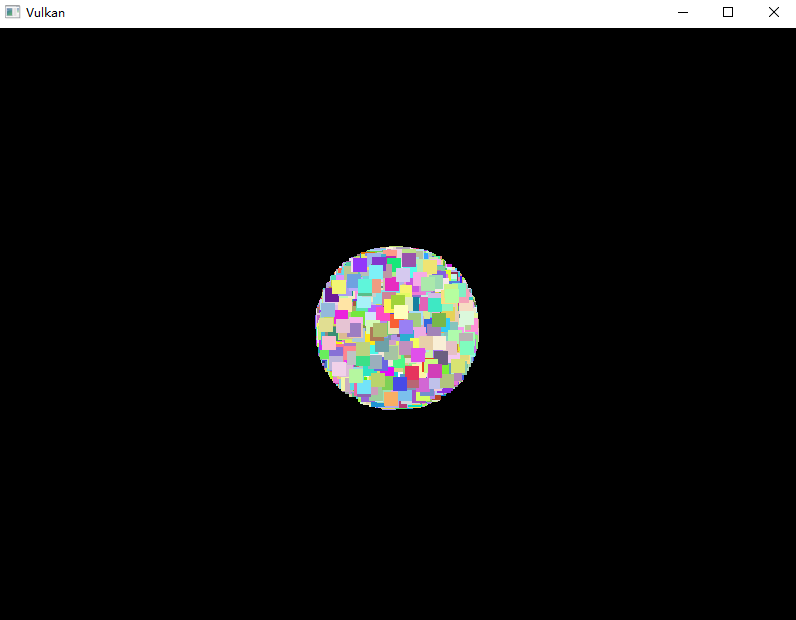
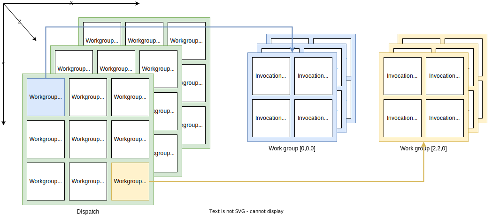
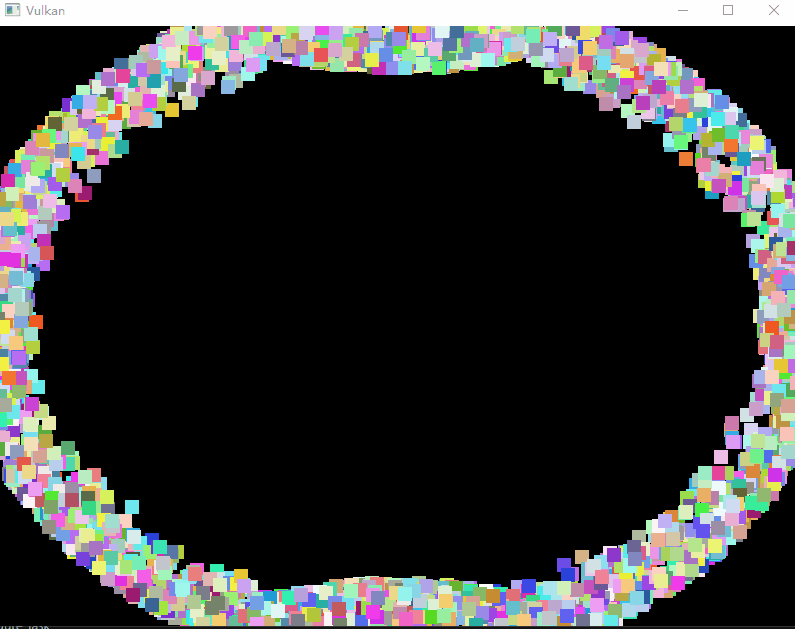

# **计算着色器与SSBO**

## **前言**

在基础部分的最后，我们将介绍 **计算着色器\(compute shader\)** 和 **着色器存储缓冲对象\(SSBO\)** 。

与其他图形引擎不同， Vulkan 强制支持计算着色器，这意味着你可以使用它在 GPU 上进行通用计算。
GPU 的计算能力可以用于图像处理、可见性测试、后期处理、高级光照计算、动画、物理（例如粒子系统）等工作。
它甚至可以用于不需要任何图形输出的非可视化计算工作，例如数值计算或 AI 相关的内容，这被称为“无头计算\(headless compute\)”。

## **基础代码框架**

在开始实际的内容阅读之前，请下载下面的代码框架：

**[点击下载](../../codes/03/80_compute/base_code.zip)**

编译并运行程序，你将看到以下内容：



本代码基于“顶点缓冲”章节的最终代码，并做如下修改：

1. 将顶点 `Vertex` 相关数据改名为了粒子 `Particle` ，并随机生成。
2. 修改图形管线布局的输入装配设置，输入拓扑结构改成了点列表，以绘制粒子而非三角形
3. 修改着色器，以绘制点集

`main.cpp` 中提供了一个常量，用于控制粒子数量，你可以自行修改它：

```cpp
constexpr uint32_t PARTICLE_COUNT = 8192;
```

## **粒子系统**

本章将实现一个非常简单的基于 GPU 的粒子系统，用于演示计算着色器与 SSBO 的使用。

> 你可以移动到页面最下方查看效果图。

渲染这样的系统需要两个主要组件：顶点\(用顶点缓冲传递\)和更新它们的方式\(比如某种方程\)。

“经典”的基于 CPU 的粒子系统会将粒子数据存于系统主存，然后使用 CPU 更新它们。
每次更新后，都需要将数据从主存传输到 GPU 的显存，无论你使用“主机可见内存”还是“设备本地内存\(需暂存缓冲中转\)”都是如此，这非常昂贵。

基于 GPU 的粒子系统不需要这种数据往返，计算着色器将直接更新 GPU 显存中的顶点数据，而此数据区可采用设备本地内存类型，从而获得最高性能。

## **管线框图**

计算着色器并非图形管线的一部分，让我们看看官方规范的 Vulkan 管线框图：


左侧是我们熟悉的传统图形管线，中间是输入缓冲、描述符与附件，而计算着色器位于右上角。

> 中右侧有个“Task-Mesh”的着色器模块，它用于代替传统的“顶点-细分-几何”着色器模式，我们会在进阶章节中介绍。

这里的重点是，虽然计算着色器不属于图形管线，但它可以使用描述符集访问内存资源。

## **数据准备**

Vulkan 提供了两种专用存储类型允许着色器**任意读取和写入显存**，它们分别是：

- 着色器存储缓冲对象\(Shader Storage Buffer Object, SSBO\)
- 存储图像

> 我们不会在本章中进行图像处理，但你应该知晓计算着色器也可以用于图像。

SSBO 类似于 Uniform 缓冲对象，但它可被着色器写入（UBO是着色器只读的），且可简单的将其他缓冲类型别名化为 SSBO，
支持任意大的内存（仅受硬件限制）。

SSBO 并非万能，它与 UBO 有不同的用处：

| 类型          | SSBO           | UBO          |
|-------------|----------------|--------------|
| 内存类型        | 常为设备本地内存       | 常为主机可见内存     |
| 着色器访问       | 可读可写           | 只读           | 
| 着色器效率       | 较慢\(需要支持随机访问\) | 快\(可常量缓存优化\) |
| 主机\(CPU\)访问 | 常需通过暂存缓冲       | 常可直接拷贝内存资源   |

好消息是，将缓冲区标记为 SSBO 几乎不影响缓冲区原有功能的效率（比如作为顶点输入），只有在作为 SSBO 使用时读写较慢。

### 1. 创建缓冲区

为了允许着色器修改缓冲，需要给创建信息添加一个 `usage` 标志位 `eStorageBuffer` ，它表示此缓冲可以用作“存储缓冲”。
修改 `createParticleBuffer` 函数中粒子缓冲区的创建代码：

```cpp
void createParticleBuffer() {
    ......
    createBuffer(bufferSize,
        vk::BufferUsageFlagBits::eStorageBuffer | // 添加存储缓冲区标志
        vk::BufferUsageFlagBits::eTransferDst |
        vk::BufferUsageFlagBits::eVertexBuffer,
        vk::MemoryPropertyFlagBits::eDeviceLocal,
        m_particleBuffer,
        m_particleBufferMemory
    );
    ......
}
```

着色器存储缓冲\(SSB\) 的创建方式就是这么简单，在缓冲区创建时添加一个 `usage` 标志位即可。
此缓冲区现在既能使用原有的功能（比如这里作为顶点缓冲），还能作为 SSBO 使用。 

### 2. 数据竞争问题

计算和渲染并不在同一个管线中，渲染需要读取粒子数据，而计算需要读写数据，我们需要避免数据竞争。

一种方式是使用单个粒子缓冲区，通过同步原语（如围栏和信号量）保证计算和渲染顺序进行。
这也是本节使用的方式，只需要额外增加一些信号量即可，非常简单。

另一种方式是使用双缓冲区，一个表示上一次的数据，一个表示本次的数据。
渲染管线和计算管线都**读取**同一个缓冲区，但计算管线还需要将新数据**写入**另一个缓冲，这样二者可以同步进行，即“异步计算”，带来更好的性能。

作为一个挑战，你可以在完成本章的学习后，尝试实现这种更优性能的方式。
我们会在章节最后给出一些提示，关于需要你实现的额外工作。


### 3. 时间差信息

每次更新粒子的位置，位置的差值应该是 `时间差 * 速度` 。
计算着色器只需要读取此数据而无需写入，因此可以通过 UBO 传递时间差信息，也可以使用推送常量。
本章选择使用后者，因为它更简单。

推送常量直接在管线布局中声明，并在命令录制时绑定。我们还没有创建计算管线和对应的命令缓冲，因此将这些工作留到后面进行。

现在先创建一个函数，用于获取时间差数据：

```cpp
#include <chrono>

......

static float getDeltaTime() {
    static auto lastTime = std::chrono::steady_clock::now();
    const auto currentTime = std::chrono::steady_clock::now();
    const float res =  std::chrono::duration<float, std::chrono::milliseconds::period>(currentTime - lastTime).count();
    lastTime = currentTime;
    return res;
}
```

> 注意这里是 `milliseconds` ，如果写成 `seconds` ，物体的移动会非常慢。

### 4. 描述符

着色器需要通过描述符才能访问内存资源，现在创建描述符布局：（可以声明在管线布局上方）

```cpp
......
vk::raii::DescriptorSetLayout m_descriptorSetLayout{ nullptr };
......
void initVulkan() {
    ...
    createDescriptorSetLayout();
    createGraphicsPipeline();
    ...
}

......

void createDescriptorSetLayout() {
    vk::DescriptorSetLayoutBinding layoutBinding; // Storage Buffer 粒子数据
    layoutBinding.binding = 0;
    layoutBinding.descriptorCount = 1;
    layoutBinding.descriptorType = vk::DescriptorType::eStorageBuffer; // 存储缓冲区
    layoutBinding.stageFlags = vk::ShaderStageFlagBits::eCompute; // 计算着色器
    vk::DescriptorSetLayoutCreateInfo layoutInfo;
    layoutInfo.setBindings( layoutBinding );
    m_descriptorSetLayout = m_device.createDescriptorSetLayout( layoutInfo );
}
```

然后设置描述符池，我们只需要一个描述符集和一个存储缓冲描述符：

```cpp
.......
vk::raii::DescriptorSetLayout m_descriptorSetLayout{ nullptr };
vk::raii::DescriptorPool m_descriptorPool{ nullptr };
......
void initVulkan() {
    ...
    createDescriptorSetLayout();
    createDescriptorPool();
    ...
}
......
void createDescriptorPool() {
    vk::DescriptorPoolSize poolSize;
    poolSize.type = vk::DescriptorType::eStorageBuffer; // 存储缓冲区
    poolSize.descriptorCount = 1;

    vk::DescriptorPoolCreateInfo poolInfo;
    // raii 封装需要使用 eFreeDescriptorSet 标志位
    poolInfo.flags = vk::DescriptorPoolCreateFlagBits::eFreeDescriptorSet;
    poolInfo.maxSets = 1;
    poolInfo.setPoolSizes( poolSize );

    m_descriptorPool = m_device.createDescriptorPool( poolInfo );
}
```

描述符布局和描述符池不需要具体的资源，但是描述符集合的分配必须放在缓冲资源创建之后：

```cpp
.......
vk::raii::DeviceMemory m_particleBufferMemory{ nullptr };
vk::raii::Buffer m_particleBuffer{ nullptr };
std::vector<vk::raii::DescriptorSet> m_descriptorSets;
......
void initVulkan() {
    ...
    createParticleBuffer();
    createDescriptorSets(); // 放在粒子创建之后
}
......
void createDescriptorSets() {
    vk::DescriptorSetAllocateInfo allocInfo;
    allocInfo.setDescriptorPool( m_descriptorPool );
    allocInfo.setSetLayouts( *m_descriptorSetLayout ); // 需要至少一次 * 显式转换

    // 此描述符集数组仅单个元素
    m_descriptorSets = m_device.allocateDescriptorSets( allocInfo );

    vk::DescriptorBufferInfo particleBufferInfo;
    // 绑定粒子缓冲区
    particleBufferInfo.buffer = m_particleBuffer;
    particleBufferInfo.offset = 0;
    particleBufferInfo.range = sizeof(Particle) * PARTICLE_COUNT; // 计算缓冲区大小

    vk::WriteDescriptorSet descriptorWrite;
    descriptorWrite.dstSet = m_descriptorSets.at(0);
    descriptorWrite.dstBinding = 0;
    descriptorWrite.descriptorType = vk::DescriptorType::eStorageBuffer; // 存储缓冲区类型
    descriptorWrite.setBufferInfo( particleBufferInfo );

    m_device.updateDescriptorSets(descriptorWrite, nullptr);
}
```

## **计算着色器**

### 1. 获取数据

现在为项目添加一个着色器文件，可以起名为 `compute.comp.glsl` ，放在 `shaders` 文件夹中，然后填写内容以访问推送常量和粒子数据：

```glsl
#version 450

struct Particle {
  vec2 position;
  vec2 velocity;
  vec4 color;
};

layout(push_constant) uniform PushConstants {
    float deltaTime;
} pc;

layout(std140, binding = 0) buffer ParticleSSBO {
    Particle particles[ ];
};

```

我们定义了一个结构体 `Particle` ，它的成员以及内存布局和我们在 C++ 代码中定义的完全一致。
SSBO 通过 `buffer` 标识符指定，它包含未知数量的数据，以 `[]` 标记，不需要我们显式指定元素数量。

### 2. 计算空间

在填写具体的主函数之前，让我们先了解一下计算着色器的两个基本概念： **工作组** 和 **调用** 。

“工作组”和“调用”定义了一个抽象模型，用于说明 GPU 的计算硬件如何通过三个维度\(XYZ\)按需处理工作负荷。

- **调用\(invocations\)**
    - 指调用一次计算着色器
    - 是工作组内的执行线程，并行执行
    - 同一工作组内的调用可通过共享内存通信，并支持同步
    - 在着色器内指定维度
- **工作组\(Workgroup\)**
    - 包含多个调用
    - 是 GPU 调度的基本单位
    - 不同工作组之间完全独立（无执行顺序保证）
    - 用命令缓冲指定维度



“调用”的三个维度的乘积等于并行的线程数，常是 32 或 64 的整数倍以保证最高效率，但不能超过 GPU 支持的最大值。

> 可在程序中通过 Vulkan 物理设备的 `properties` 进行查询。

“调用”的合适维度与需要操作的数据结构有关。
如果设定总线程数为 256 ，对于可以 `arr[index]` 访问的一维数据，调用维度可设为 `(256, 1, 1)`；
对于图像之类的二维数据，需要 `image[x][y]` 访问，调用维度可设为 `(16, 16, 1)` ；三维数据同理。

> 如果暂时无法理清，可以根据下面的计算着色器代码辅助理解。

“调用”指调用一次计算着色器，因此“调用”维度的乘积既是同时进行的线程数，也是单个工作组的计算量。因此工作组的大小就可以设为 `总计算量/单工作组的计算数` ，再向上取整。

> 例如：如果我们分发 [64, 1, 1] 的工作组计数，计算着色器局部大小为 [32, 32, 1] ，则我们的计算着色器将被调用 64 x 32 x 32 = 65,536 次。

### 3. 调用维度与主函数

我们需要访问的是一维数组，因此调用只需一个维度，那么我们可以在计算着色器中这样设置调用的维度：

```glsl
layout (local_size_x = 256, local_size_y = 1, local_size_z = 1) in;
```

它通过 `local_size_*` 设置某个维度的大小，最后只有 `in` 而没有具体的变量名。
这将引入一个 `gl_GlobalInvocationID` 变量，我们可以通过它获取当前的索引：

```glsl
void main() {
    uint index = gl_GlobalInvocationID.x;
}
```

它的计算方式类似这样：

```
gl_GlobalInvocationID.x =  
   工作组ID.x * local_size_x + 调用在组内的局部ID.x
```

你应该能猜到二维和三维时的情况。
正如上面说的工作组数量应该等于“总计算量/单工作组的计算数”并向上取整，由于最后的“取整”，实际调用次数很可能大于你的需求。
但我们将粒子数设为了 8192 整，保证索引不会超出数据范围。

> 假设计算量是 4000 ，由于总计算数将是 256 的整数倍，最后会有 96 次调用是无效索引。
> 一种可行的方式是使用推送常量向计算着色器传输最大索引数，在主函数中判断索引是否越界。

然后就可以通过索引修改粒子的位置和速度了，唯一注意的是我们将边缘粒子的速度反转，实现撞墙反弹的效果（并防止粒子都飞到屏幕外）:

```glsl
void main() {
    uint index = gl_GlobalInvocationID.x;

    Particle particle = particles[index];

    particles[index].position = particle.position + particle.velocity.xy * pc.deltaTime;

    // Flip movement at window border
    if (abs(particles[index].position.x) >= 1.0) particles[index].velocity.x *= -1;
    if (abs(particles[index].position.y) >= 1.0) particles[index].velocity.y *= -1;
}
```

### 4. 修改子目录CMake配置

如果你使用 CMakeLists.txt 自动编译着色器代码，请修改 shaders 目录的CMake配置文件：

```cmake
......

set(STAGE_COMP "-fshader-stage=comp")
set(COMPUTE_COMP_SHADER ${SHADER_DIR}/compute.comp.glsl)
set(COMPUTE_SPIRV_COMP ${SHADER_DIR}/compute.comp.spv)
......

add_custom_command(
    OUTPUT ${COMPUTE_SPIRV_COMP}
    COMMAND ${Vulkan_GLSLC_EXECUTABLE} ${STAGE_COMP} ${COMPUTE_COMP_SHADER} -o ${COMPUTE_SPIRV_COMP}
    COMMENT "Compiling compute.comp.glsl to compute.comp.spv"
    DEPENDS ${COMPUTE_COMP_SHADER}
)

add_custom_target(CompileShaders ALL
    DEPENDS ${GRAPHICS_SPIRV_VERT} ${GRAPHICS_SPIRV_FRAG} ${COMPUTE_SPIRV_COMP}
)
```


## **计算管线**

管线框图部分提到，计算着色器并不属于图形管线，我们要为它创建“计算管线”。

### 1. 变量与辅助函数

创建计算管线也需要管线布局，为此添加两个变量和一个辅助函数：

> 计算管线变量放在图形管线变量的上方或下方都可以，但需要晚于描述符布局。

```cpp
......
vk::raii::PipelineLayout m_computePipelineLayout{ nullptr };
vk::raii::Pipeline m_computePipeline{ nullptr };
......
void initVulkan() {
    ......
    createGraphicsPipeline();
    createComputePipeline();
    ......
}
......
void createComputePipeline() {

}
```

### 2. 创建管线

计算管线的创建非常简单，因为它的阶段非常少，我们只需创建着色器模块并填充少量信息：

```cpp
void createComputePipeline() {
    // 创建管线布局
    vk::PipelineLayoutCreateInfo pipelineLayoutInfo;
    pipelineLayoutInfo.setSetLayouts( *m_descriptorSetLayout ); // 设置描述符布局
    m_computePipelineLayout = m_device.createPipelineLayout(pipelineLayoutInfo);

    // 读取并创建着色器模块
    const auto computeShaderCode = readFile("shaders/compute.comp.spv");
    const vk::raii::ShaderModule computeShaderModule = createShaderModule(computeShaderCode);

    // 设置计算着色器阶段信息
    vk::PipelineShaderStageCreateInfo computeShaderStageInfo;
    computeShaderStageInfo.stage = vk::ShaderStageFlagBits::eCompute;
    computeShaderStageInfo.module = computeShaderModule;
    computeShaderStageInfo.pName = "main";

    // 创建计算管线
    vk::ComputePipelineCreateInfo computePipelineInfo;
    computePipelineInfo.stage = computeShaderStageInfo;
    computePipelineInfo.layout = m_computePipelineLayout;
    m_computePipeline = m_device.createComputePipeline(nullptr, computePipelineInfo);
}
```

还有一件事，我们要用到推送常量传递时间差信息，需要在管线布局中添加推送常量范围：

```cpp
// 推送常量配置
vk::PushConstantRange pushConstantRange;
pushConstantRange.stageFlags = vk::ShaderStageFlagBits::eCompute; // 计算着色器阶段
pushConstantRange.offset = 0; // 偏移量
pushConstantRange.size = sizeof(float); // 大小为 float

// 创建管线布局
vk::PipelineLayoutCreateInfo pipelineLayoutInfo;
pipelineLayoutInfo.setPushConstantRanges( pushConstantRange ); // 设置推送常量范围
......
```

## **运行计算命令**

### 1. 队列族查找

计算命令需要提交到计算队列族，Vulkan 要求支持图形操作的实现至少有一个同时支持图形和计算操作的队列族，所以我们可以简单的修改 `findQueueFamilies` 代码，使用同时支持两种操作的队列族：

```cpp
for (int i = 0; const auto& queueFamily : queueFamilies) {
    if ((queueFamily.queueFlags & vk::QueueFlagBits::eGraphics) &&
        (queueFamily.queueFlags & vk::QueueFlagBits::eCompute)
    ) indices.graphicsFamily = i;
    ......
}
```

注意，设备可能存在专用于计算操作的队列族，实际应用中可以使用它们获得最佳性能。此时缓冲区将被多个队列族使用，需要调整缓冲创建信息的 `sharingMode` 字段，使用 `eConcurrent` ，并设置 `queueFamilyIndices` 数组。

现在创建一个成员变量存储计算队列，并从逻辑设备中获取：

```cpp
......
vk::raii::Queue m_computeQueue{ nullptr };
......
void createLogicalDevice() {
    ......
    m_computeQueue = m_device.getQueue( graphics.value(), 0 );
}
```

### 2. 创建命令缓冲

和图形管线一样，我们需要一组命令缓冲用于录制命令。
观察命令池的创建函数，我们的命令池绑定了图形队列，而此队列支持计算功能（我们刚刚修改了队列族查找函数），因此我们可以直接使用此命令池。

现在声明命令缓冲的成员变量，再使用一个辅助函数创建它：

```cpp
......
std::vector<vk::raii::CommandBuffer> m_computeCommandBuffers;
......
void initVulkan() {
    ...
    createCommandBuffers();
    createComputeCommandBuffers(); // 可以放在图形命令缓冲的下方或上方
    ...
}
......
void createComputeCommandBuffers() {
    vk::CommandBufferAllocateInfo allocInfo;
    allocInfo.commandPool = m_commandPool;
    allocInfo.level = vk::CommandBufferLevel::ePrimary;
    allocInfo.commandBufferCount = static_cast<uint32_t>(MAX_FRAMES_IN_FLIGHT);

    m_computeCommandBuffers = m_device.allocateCommandBuffers(allocInfo);
}
```

虽然粒子缓冲会通过同步原语与图形管线同步，只需要一个。但是命令缓冲仍需要多个，以便对应多个飞行中的帧。

### 3. 命令录制

有了命令缓冲与合适的队列，现在可以开始录制命令了。

```cpp
void recordComputeCommandBuffer(const vk::raii::CommandBuffer& commandBuffer) {
    constexpr vk::CommandBufferBeginInfo beginInfo;
    commandBuffer.begin(beginInfo);
    
    ......

    commandBuffer.end();
}
```

记录命令非常简单，开始->绑定管线->绑定描述符->推送常量->分发任务->结束。

```cpp
// 绑定计算管线
commandBuffer.bindPipeline(vk::PipelineBindPoint::eCompute, m_computePipeline);

// 绑定描述符集
commandBuffer.bindDescriptorSets(
    vk::PipelineBindPoint::eCompute,
    m_computePipelineLayout,
    0,
    *m_descriptorSets.at(0),
    nullptr
);

// 推送常量
const float deltaTime = getDeltaTime(); // 获取时间差
commandBuffer.pushConstants<float>(
    m_computePipelineLayout,
    vk::ShaderStageFlagBits::eCompute, // 计算着色器阶段
    0, // 偏移量
    deltaTime // 数据
);

// 调用计算着色器
commandBuffer.dispatch((PARTICLE_COUNT + 255) / 256, 1, 1);
```

图像管线使用 `draw` 命令进行绘制，而计算管线使用 `dispatch` 命令分发任务，其中三个参数就是工作组的维度。
`(PARTICLE_COUNT + 255) / 256` 计算就是之前提到的 “总计算量/单工作组计算量”然后向上取整。

在 `drawFrame` 函数中录制命令：

```cpp
void drawFrame() {
    ......
    m_computeCommandBuffers[m_currentFrame].reset();
    recordComputeCommandBuffer(m_computeCommandBuffers[m_currentFrame]);

    m_commandBuffers[m_currentFrame].reset();
    recordCommandBuffer(m_commandBuffers[m_currentFrame], imageIndex);
    ......
}
```

### 4. 命令同步

在命令提交之前，我们还需要和图形管线一样使用某种同步原语进行命令同步。

我们希望使用这样的流程：

- 【本节计算】要等到【上传绘制】完成
- 【本此绘制】要等待【本次计算】和【本次图像获取】完成
- 【本次呈现】要等到【本次绘制】完成

为此，我们需要新建两个信号量，分别表示计算完成和渲染完成。

```cpp
......
std::vector<vk::raii::Semaphore> m_computeFinishedSemaphores;
std::vector<vk::raii::Semaphore> m_graphicsFinishedSemaphores;
......
void createSyncObjects() {
    ...
    for(size_t i = 0; i < MAX_FRAMES_IN_FLIGHT; ++i){
        ...
        m_computeFinishedSemaphores.emplace_back( m_device, semaphoreInfo );
        m_graphicsFinishedSemaphores.emplace_back( m_device, semaphoreInfo );
    }
}
......
```

### 5. 绘制帧

现在可以根据上面的流程修改 `drawFrame` 函数了：

```cpp
void drawFrame() {
    ......
    
    // 计算管线命令录制
    m_computeCommandBuffers[m_currentFrame].reset();
    recordComputeCommandBuffer(m_computeCommandBuffers[m_currentFrame]);

    // 标记是不是第一次提交计算命令
    static bool firstTime = true;

    // 设置提交信息，并在任务完成时发送信号量
    vk::SubmitInfo computeSubmitInfo;
    computeSubmitInfo.setCommandBuffers( *m_computeCommandBuffers[m_currentFrame] );
    // 设置计算完成的信号量
    computeSubmitInfo.setSignalSemaphores( *m_computeFinishedSemaphores[m_currentFrame] );
    if (!firstTime) { // 如果不是第一次，则等待上一次绘制完成
        computeSubmitInfo.setWaitSemaphores( *m_graphicsFinishedSemaphores[ (m_currentFrame+MAX_FRAMES_IN_FLIGHT-1)%MAX_FRAMES_IN_FLIGHT ] );
        // 在计算着色器阶段等待上一次渲染完成
        constexpr vk::PipelineStageFlags pipelineStage = vk::PipelineStageFlagBits::eComputeShader;
        computeSubmitInfo.setWaitDstStageMask( pipelineStage );
    } else {
        firstTime = false;
    }
    m_computeQueue.submit(computeSubmitInfo);

    // 绘制命令录制
    m_commandBuffers[m_currentFrame].reset();
    recordCommandBuffer(m_commandBuffers[m_currentFrame], imageIndex);

    vk::SubmitInfo submitInfo;
    // 渲染需要等待图像可用和本次计算完成
    const std::array<vk::Semaphore,2> waitSemaphores = {
        m_computeFinishedSemaphores[m_currentFrame],
        m_imageAvailableSemaphores[m_currentFrame]
    };
    submitInfo.setWaitSemaphores( waitSemaphores );
    // 在顶点输入阶段等待计算完成，在颜色输出阶段等待图像可用
    constexpr std::array<vk::PipelineStageFlags,2> waitStages = {
        vk::PipelineStageFlagBits::eVertexInput,
        vk::PipelineStageFlagBits::eColorAttachmentOutput
    };
    submitInfo.setWaitDstStageMask( waitStages );
    submitInfo.setCommandBuffers( *m_commandBuffers[m_currentFrame] );

    // 设置信号量，表示图形渲染完成。renderFinished 提供给呈现呈现，graphicsFinished提供给计算管线
    const std::array<vk::Semaphore,2> signalSemaphores = {
        m_renderFinishedSemaphores[m_currentFrame],
        m_graphicsFinishedSemaphores[m_currentFrame]
    };
    submitInfo.setSignalSemaphores( signalSemaphores );
    m_graphicsQueue.submit(submitInfo, m_inFlightFences[m_currentFrame]);
}
```

## **最后**

现在可以运行程序，你应该能看到类似下面的效果：



除了此种单一缓冲区的方式外，你也可以选择双缓冲区交替，或者为每个飞行中的帧创建一个缓冲区。
此时计算管线和图形管线可以并行运行，你需要额外实现如下内容：

- 优先选择计算专用队列族，以便获得更高的并行性能
- 创建多份粒子缓冲区，缓冲需要被不同队列族使用，需修改 `sharingMode` 和设置 `queueFamilyIndices` 字段
- 为每个缓冲区创建描述符集并绑定管线
- 修改计算着色器，读取缓冲的数据修改另一个缓冲区
- 修改同步逻辑，以便计算和渲染可以并行进行

---

**[基础代码](../../codes/03/80_compute/base_code.zip)**

**[C++代码](../../codes/03/80_compute/src/main.cpp)**

**[C++代码差异](../../codes/03/80_compute/src/main.diff)**

**[shader-CMake代码](../../codes/03/80_compute/shaders/CMakeLists.txt)**

**[shader-comp代码](../../codes/03/80_compute/shaders/compute.comp.glsl)**

---
