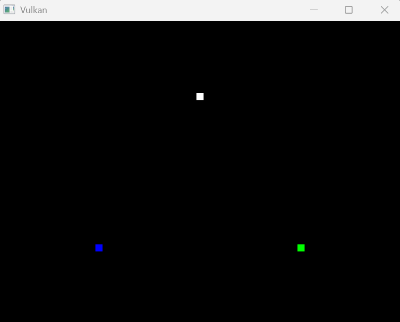
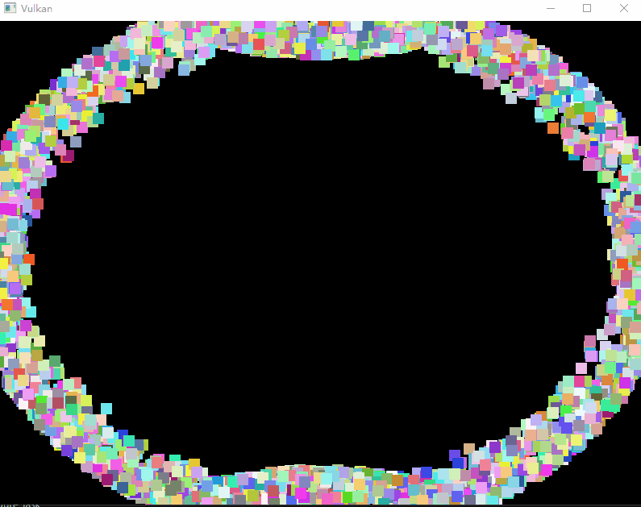

# **计算着色器与SSBO**

## **前言**

在基础部分的最后，我们将介绍 **计算着色器\(compute shader\)** 和 **着色器存储缓冲对象\(SSBO\)** 。

与其他图形引擎不同， Vulkan 强制支持计算着色器，这意味着你可以使用它在 GPU 上进行通用计算。
GPU 的计算能力可以用于图像处理、可见性测试、后期处理、高级光照计算、动画、物理（例如粒子系统）等工作。
它甚至可以用于不需要任何图形输出的非可视化计算工作，例如数值计算或 AI 相关的内容，这被称为“无头计算\(headless compute\)”。

## **基础代码框架**

在开始实际的内容阅读之前，请下载下面的代码框架：

**[点击下载](../../codes/03/80_compute/base_code.zip)**

编译并运行程序，你将看到以下内容：



本代码基于“顶点缓冲”章节的最终代码，并做如下修改：

1. 将顶点 `Vertex` 相关数据改名为了粒子 `Particle` 。
2. 修改图形管线布局的输入装配设置，输入拓扑结构改成了点列表，以绘制粒子而非三角形
3. 修改着色器，以绘制点集

## **粒子系统**

本章将实现一个简单的基于 GPU 的粒子系统，用于演示计算着色器与 SSBO 的使用。

> 你可以移动到页面最下方查看效果图。

这种系统在许多游戏中都有使用，通常由数千个需要按逻辑帧速率更新的粒子组成。
渲染这样的系统需要两个主要组件：顶点\(用顶点缓冲传递\)和更新它们的方式\(比如某种方程\)。

“经典”的基于 CPU 的粒子系统会将粒子数据存于系统主存，然后使用 CPU 更新它们。
每次更新后，都需要将数据从主存传输到 GPU 的显存，无论你使用“主机可见内存”还是“设备本地内存\(需暂存缓冲中转\)”都是如此，这非常昂贵。

基于 GPU 的粒子系统不需要这种数据往返，计算着色器将直接更新 GPU 显存中的顶点数据，而此数据区可采用设备本地内存类型，从而获得最高性能。

> 在具有专用计算队列的 GPU 上，可以并行执行计算任务和图像管线的渲染任务，这被称为“异步计算”，我们将在进阶章节介绍。

## **管线框图**

计算着色器并非图形管线的一部分，让我们看看官方规范的 Vulkan 管线框图：


左侧是我们熟悉的传统图形管线，中间是输入缓冲、描述符与附件，而计算着色器位于右上角。

> 中右侧有个“Task-Mesh”的着色器模块，它用于代替传统的“顶点-细分-几何”着色器模式，我们会在进阶章节中介绍。

这里的重点是，虽然计算着色器不属于图形管线，但它可以使用描述符集访问内存资源。

## **数据准备**

Vulkan 提供了两种专用存储类型允许着色器**任意读取和写入缓存**，它们分别是：

- 着色器存储缓冲对象\(Shader Storage Buffer Object, SSBO\)
- 存储图像

> 我们不会在本章中进行图像处理，但你应该知晓计算着色器也可以用于图像处理。

SSBO 类似于 Uniform 缓冲对象，但它可被着色器写入（UBO是着色器只读的），且可简单的将其他缓冲类型别名化为 SSBO，
支持任意大的内存（仅受硬件限制）。

SSBO 并非万能，它与 UBO 有不同的用处：

| 类型 | SSBO | UBO |
|-----------|--------|----------|
| 内存类型 | 常为设备本地内存 | 常为主机可见内存 |
| 着色器访问 | 可读可写 | 只读 | 
| 着色器效率 | 慢\(需要支持随机访问\) | 快\(可常量缓存优化\) |
| 主机\(CPU\)访问 | 常需通过暂存缓冲 | 常可直接拷贝内存资源 |

> 好消息是，将缓冲区标记为 SSBO 几乎不影响缓冲区原有功能的效率（比如作为顶点输入），只有在作为 SSBO 使用时读写较慢。

### 1. 生成粒子数据

如果你仔细查看代码，会看到 `Particle` 参数里有个速度，我们会让计算着色器使用它并实时修改粒子缓冲区的数据。三个粒子肯定不够，现在添加一个成员常量记录需要的粒子数：

```cpp
static constexpr uint32_t PARTICLE_COUNT = 4096;
```

然后修改 `createParticleBuffer` ，现在使用随机生成的粒子数据：

```cpp
#include <random>
......
void createParticleBuffer() {
    std::default_random_engine rndEngine(static_cast<unsigned>(time(nullptr)));
    std::uniform_real_distribution<float> rndDist(0.0f, 1.0f);
    std::vector<Particle> particles(PARTICLE_COUNT);
    for (auto& particle : particles) {
        float r = 0.25f * std::sqrt(rndDist(rndEngine));
        float theta = rndDist(rndEngine) * 2.0f * 3.141592653f;
        float x = r * std::cos(theta) * HEIGHT / WIDTH;
        float y = r * std::sin(theta);
        particle.pos = glm::vec2(x, y);
        particle.velocity = glm::normalize(glm::vec2(x,y)) * 0.00025f;
        particle.color = glm::vec4(rndDist(rndEngine), rndDist(rndEngine), rndDist(rndEngine), 1.0f);
    }
    vk::DeviceSize bufferSize = sizeof(particles[0]) * particles.size();

    ......
}
```

> 这里将点随机分布在一个圆形区域中，且具有向外的初速度和随机色彩。

注意我们直接使用了局部变量存放 `particles` ，因为数据上传后全权交给GPU处理，我们的程序不再需要记录它。
现在你可以删除外部的 `particles` 变量。

### 2. 创建缓冲区

为了允许着色器修改缓冲，需要给创建信息添加一个 `usage` 标志位 `eStorageBuffer` ，它表示此缓冲可以用作“存储缓冲”。
修改 `createParticleBuffer` 函数中粒子缓冲区的创建代码：

```cpp
void createParticleBuffer() {
    ......
    // 增加 eStorageBuffer 标志位
    createBuffer(bufferSize, 
        vk::BufferUsageFlagBits::eStorageBuffer |
        vk::BufferUsageFlagBits::eTransferDst |
        vk::BufferUsageFlagBits::eVertexBuffer, 
        vk::MemoryPropertyFlagBits::eDeviceLocal,
        m_particleBuffer, 
        m_particleBufferMemory
    );
    ......
}
```

着色器存储缓冲\(SSB\) 的创建方式就是这么简单，在缓冲区创建时添加一个 `usage` 标志位即可。
此缓冲区现在既能使用原有的功能（比如这里作为顶点缓冲），还能作为 SSBO 使用。 

之前的章节，顶点缓冲区的数据不会修改，因此只需要一个顶点输入缓冲区。
现在我们会修改数据，一种较好的方案是为每个飞行中的帧都设置一个输入缓冲区，计算着色器将使用前一个缓冲的数据配合时间差更新当前缓冲。

```cpp
std::vector<vk::raii::DeviceMemory> m_particleBufferMemory;
std::vector<vk::raii::Buffer> m_particleBuffers;
......
void createParticleBuffers() {
    ......

    for(int i = 0; i < MAX_FRAMES_IN_FLIGHT; ++i) {
        m_particleBuffers.emplace_back(nullptr);
        m_particleBufferMemory.emplace_back(nullptr);
        createBuffer(bufferSize, 
            vk::BufferUsageFlagBits::eStorageBuffer |
            vk::BufferUsageFlagBits::eTransferDst |
            vk::BufferUsageFlagBits::eVertexBuffer, 
            vk::MemoryPropertyFlagBits::eDeviceLocal,
            m_particleBuffers[i], 
            m_particleBufferMemory[i]
        );
        copyBuffer(stagingBuffer, m_particleBuffers[i], bufferSize);
    }
}
```

> 注意我们修改了函数名，你还需要自己调整一下 `initVulkan` 函数。

### 3. 修改命令录制

我们修改了粒子缓冲区，现在需要修改 `recordCommandBuffer` 函数，输入绑定时使用第 `m_currentFrame` 个缓冲区，绘制时直接使用 `PARTICLE_COUNT` ：

```cpp
void recordCommandBuffer( ... ) {
    ......
    std::array<vk::Buffer,1> vertexBuffers { m_particleBuffers[m_currentFrame] };
    std::array<vk::DeviceSize,1> offsets { 0 };
    commandBuffer.bindVertexBuffers( 0, vertexBuffers, offsets );

    commandBuffer.draw(PARTICLE_COUNT, 1, 0, 0);
    ......
}
```

> 注意是 `m_currentFrame` 不是 `imageIndex` 。

### 4. 时间差信息

每次更新粒子的位置，位置的差值应该是 `时间差\*速度` ，因此我们还需要通过一个 UBO 向计算着色器推送时间间隔信息。

首先添加一个结构体：

```cpp
struct UniformBufferObject {
    float deltaTime = 1.0f;
};
```

创建 Uniform 缓冲区：

```cpp
......
std::vector<vk::raii::DeviceMemory> m_uniformBuffersMemory;
std::vector<vk::raii::Buffer> m_uniformBuffers;
std::vector<void*> m_uniformBuffersMapped;
......
void initVulkan() {
    ...
    createParticleBuffers();
    createUniformBuffers();
    ...
}
......
void cleanup() {
    // 结束指针映射
    for (const auto& memory : m_uniformBuffersMemory) {
        memory.unmapMemory();
    }
    ...
}
......
void createUniformBuffers() {
    vk::DeviceSize bufferSize = sizeof(UniformBufferObject);

    for (size_t i = 0; i < MAX_FRAMES_IN_FLIGHT; i++) {
        m_uniformBuffers.emplace_back(nullptr);
        m_uniformBuffersMemory.emplace_back(nullptr);
        m_uniformBuffersMapped.emplace_back(nullptr);
        createBuffer(
            bufferSize,
            vk::BufferUsageFlagBits::eUniformBuffer,
            vk::MemoryPropertyFlagBits::eHostVisible | 
            vk::MemoryPropertyFlagBits::eHostCoherent,
            m_uniformBuffers[i],
            m_uniformBuffersMemory[i]
        );
        m_uniformBuffersMapped[i] = m_uniformBuffersMemory[i].mapMemory(0, bufferSize);
    }
}
```

注意着色器只需要读取时间差数据，并不需要写入，所以没有必要使用 SSBO 。

### 5. 更新时间差

我们曾在 Uniform 缓冲章节，通过时间更新 MVP 矩阵。现在只需要获取时间差，更加简单：

```cpp
#include <chrono>
......
void drawFrame() {
    ......
    updateUniformBuffer(m_currentFrame);

    m_commandBuffers[m_currentFrame].reset();
    recordCommandBuffer(m_commandBuffers[m_currentFrame], imageIndex);
    ......
}
......
void updateUniformBuffer(uint32_t currentImage) {
    static auto lastTime = std::chrono::steady_clock::now();
    auto currentTime = std::chrono::steady_clock::now();
    float deltaTime = std::chrono::duration<float, std::chrono::milliseconds::period>(currentTime - lastTime).count();
    lastTime = currentTime;
    
    UniformBufferObject ubo{ deltaTime };
    memcpy(m_uniformBuffersMapped[currentImage], &ubo, sizeof(ubo));
}
```

> 注意这里是 `milliseconds` ，如果写成 `seconds` ，物体会动的非常慢。

### 6. 描述符

着色器需要通过描述符才能访问内存资源，现在创建描述符布局：（变量可以声明在关系布局上方）

```cpp
......
vk::raii::DescriptorSetLayout m_descriptorSetLayout{ nullptr };
......
void initVulkan() {
    ...
    createDescriptorSetLayout();
    createGraphicsPipeline();
    ...
}
......
void createDescriptorSetLayout() {
    std::array<vk::DescriptorSetLayoutBinding, 3> layoutBindings;
    // 绑定0：Uniform Buffer 传输时间差
    layoutBindings[0].binding = 0;
    layoutBindings[0].descriptorCount = 1;
    layoutBindings[0].descriptorType = vk::DescriptorType::eUniformBuffer;
    layoutBindings[0].stageFlags = vk::ShaderStageFlagBits::eCompute;
    // 绑定1：Storage Buffer 粒子数据 ，1号位用于访问上一组粒子数据
    layoutBindings[1].binding = 1;
    layoutBindings[1].descriptorCount = 1;
    layoutBindings[1].descriptorType = vk::DescriptorType::eStorageBuffer;
    layoutBindings[1].stageFlags = vk::ShaderStageFlagBits::eCompute;
    // 绑定2：Storage Buffer 粒子数据 ，2号位用于访问当前组粒子数据
    layoutBindings[2] = layoutBindings[1];
    layoutBindings[2].binding = 2;

    vk::DescriptorSetLayoutCreateInfo layoutInfo;
    layoutInfo.setBindings( layoutBindings );

    m_descriptorSetLayout = m_device.createDescriptorSetLayout( layoutInfo );
}
```

然后设置描述符池：（注意创建函数的调用位置）

```cpp
.......
vk::raii::DescriptorSetLayout m_descriptorSetLayout{ nullptr };
vk::raii::DescriptorPool m_descriptorPool{ nullptr };
......
void initVulkan() {
    ...
    createParticleBuffers();
    createUniformBuffers();
    createDescriptorPool();
    ...
}
......
void createDescriptorPool() {
    std::array<vk::DescriptorPoolSize, 2> poolSizes;
    poolSizes[0].type = vk::DescriptorType::eUniformBuffer;
    poolSizes[0].descriptorCount = static_cast<uint32_t>(MAX_FRAMES_IN_FLIGHT);
    // eStorageBuffer 描述符需要两倍数量
    poolSizes[1].type = vk::DescriptorType::eStorageBuffer;
    poolSizes[1].descriptorCount = static_cast<uint32_t>(MAX_FRAMES_IN_FLIGHT) * 2;

    vk::DescriptorPoolCreateInfo poolInfo;
    poolInfo.flags = vk::DescriptorPoolCreateFlagBits::eFreeDescriptorSet;
    poolInfo.maxSets = static_cast<uint32_t>(MAX_FRAMES_IN_FLIGHT);
    poolInfo.setPoolSizes( poolSizes );

    m_descriptorPool = m_device.createDescriptorPool( poolInfo );
}
```

描述符集合的分配必须在缓冲区创建之后（分配描述符集需要引用缓冲区），但布局和池的创建可以放前面。现在分配描述符集合：

```cpp
.......
vk::raii::DescriptorSetLayout m_descriptorSetLayout{ nullptr };
vk::raii::DescriptorPool m_descriptorPool{ nullptr };
std::vector<vk::raii::DescriptorSet> m_descriptorSets;
......
void initVulkan() {
    ...
    createParticleBuffers();
    createUniformBuffers();
    createDescriptorPool();
    createDescriptorSets();
    ...
}
......
void createDescriptorSets() {
    std::vector<vk::DescriptorSetLayout> layouts(MAX_FRAMES_IN_FLIGHT, *m_descriptorSetLayout);
    vk::DescriptorSetAllocateInfo allocInfo;
    allocInfo.setDescriptorPool( m_descriptorPool );
    allocInfo.setSetLayouts( layouts );

    m_descriptorSets = m_device.allocateDescriptorSets( allocInfo );

    for (size_t i = 0; i < MAX_FRAMES_IN_FLIGHT; i++) {
        vk::DescriptorBufferInfo uniformBufferInfo;
        uniformBufferInfo.buffer = *m_uniformBuffers[i];
        uniformBufferInfo.offset = 0;
        uniformBufferInfo.range = sizeof(UniformBufferObject);

        vk::DescriptorBufferInfo particleBufferInfo1;
        // 绑定上一个缓冲区
        particleBufferInfo1.buffer = *m_particleBuffers[(i + MAX_FRAMES_IN_FLIGHT - 1) % MAX_FRAMES_IN_FLIGHT];
        particleBufferInfo1.offset = 0;
        particleBufferInfo1.range = sizeof(Particle) * PARTICLE_COUNT;

        vk::DescriptorBufferInfo particleBufferInfo2;
        particleBufferInfo2.buffer = *m_particleBuffers[i];
        particleBufferInfo2.offset = 0;
        particleBufferInfo2.range = sizeof(Particle) * PARTICLE_COUNT;

        std::array<vk::WriteDescriptorSet, 3> descriptorWrites;
        descriptorWrites[0].dstSet = m_descriptorSets[i];
        descriptorWrites[0].dstBinding = 0;
        descriptorWrites[0].descriptorType = vk::DescriptorType::eUniformBuffer;
        descriptorWrites[0].setBufferInfo( uniformBufferInfo );

        descriptorWrites[1].dstSet = m_descriptorSets[i];
        descriptorWrites[1].dstBinding = 1;
        descriptorWrites[1].descriptorType = vk::DescriptorType::eStorageBuffer;
        descriptorWrites[1].setBufferInfo( particleBufferInfo1 );

        descriptorWrites[2].dstSet = m_descriptorSets[i];
        descriptorWrites[2].dstBinding = 2;
        descriptorWrites[2].descriptorType = vk::DescriptorType::eStorageBuffer;
        descriptorWrites[2].setBufferInfo( particleBufferInfo2 );

        m_device.updateDescriptorSets(descriptorWrites, nullptr);
    }
}
```

> 这些内容都在“Uniform 缓冲”章节介绍过，此处不再赘述，你应当能直接看懂。  
> 如果感到困惑，可回顾曾经的章节或询问 AI 。

## **计算着色器**

### 1. 获取数据

现在为项目添加一个着色器文件，可以起名为 `shader.comp` ，放在 `shaders` 文件夹中，然后填写内容以访问 UBO 和 SSBO 的数据：

```glsl
#version 450

struct Particle {
  vec2 position;
  vec2 velocity;
  vec4 color;
};

layout(std140, binding = 0) uniform ParameterUBO {
    float deltaTime;
} ubo;

layout(std140, binding = 1) readonly buffer ParticleSSBOIn {
   Particle particlesIn[ ];
};

layout(std140, binding = 2) buffer ParticleSSBOOut {
   Particle particlesOut[ ];
};
```

我们定义了一个结构体 `Particle` ，它的成员以及内存布局和我们在 C++ 代码中定义的完全一致。
SSBO 通过 `buffer` 标识符指定，它包含未知数量的数据，以 `[]` 标记，不需要我们显式指定元素数量。

> `std140` 用于强制使用严格的、标准化的内存对齐规则。

### 2. 计算空间

在填写具体的主函数之前，让我们先了解一下计算着色器的两个基本概念： **工作组** 和 **调用** 。

“工作组”和“调用”定义了一个抽象模型，用于说明 GPU 的计算硬件如何在三个维度\(XYZ\)中处理工作负荷\(workloads\)。

> “工作负荷”可以理解为所有的计算任务。

- **工作组\(Workgroup\)**
    - 包含多个调用
    - 是 GPU 调度的基本单位
    - 不同工作组之间完全独立（无执行顺序保证）
    - 用命令缓冲指定维度。
- **调用\(invocations\)**
    - 调用一次计算着色器
    - 工作组内的执行线程，并行执行
    - 同一工作组内的调用可通过共享内存通信，并支持同步
    - 在着色器内指定维度


“调用”的三个维度的乘积等于并行的线程数，常是 32 或 64 的整数倍以保证最高效率，但不能超过 GPU 支持的最大值。

> 可在程序中通过 Vulkan 物理设备的 `properties` 进行查询。

“调用”的合适维度与需要操作的数据结构有关。
如果设定总线程数为 256 ，对于可以 `arr[index]` 访问的一维数据，调用维度可设为 `(256, 1, 1)`；
对于图像之类的二维数据，需要 `image[x][y]` 访问，调用维度可设为 `(16, 16, 1)` ；三维数据同理。

> 如果暂时无法理清，可以根据下面的计算着色器代码辅助理解。

“调用”指调用一次计算着色器，因此“调用”维度的乘积既是同时进行的线程数，也是单个工作组的计算量。因此工作组的大小就可以设为 `总计算量/单工作组的计算数` ，再向上取整。

> 例如：如果我们分发 [64, 1, 1] 的工作组计数，计算着色器局部大小为 [32, 32, 1] ，则我们的计算着色器将被调用 64 x 32 x 32 = 65,536 次。

### 3. 调用维度与主函数

我们需要访问的是一维数组，因此调用只需一个维度，那么我们可以这样设置调用的维度：

```glsl
layout (local_size_x = 256, local_size_y = 1, local_size_z = 1) in;
```

它通过 `local_size_*` 设置某个维度的大小，最后只有 `in` 而没有具体的变量名。
这将引入一个 `gl_GlobalInvocationID` 变量，我们可以通过它获取当前的索引：

```glsl
void main() {
    uint index = gl_GlobalInvocationID.x;
}
```

它的计算方式类似这样：

```
gl_GlobalInvocationID.x =  
   工作组ID.x * local_size_x + 调用在组内的局部ID.x
```

你应该能猜到二维和三维时的情况。
正如上面说的工作组数量应该等于“总计算量/单工作组的计算数”并向上取整，由于最后的“取整”，实际调用次数很可能大于你的需求。
但我们将粒子数设为了 4096 整，保证索引不会超出数据范围。

> 假设计算量是 4000 ，由于总计算数将是 256 的整数倍，最后会有 96 次调用是无效索引。
> 一种可行的方式是使用 UBO 向计算着色器传输最大索引数，在主函数中判断索引是否越界。

然后就可以通过索引修改粒子的位置和速度了，唯一注意的是我们将边缘粒子的速度反转，实现撞墙反弹的效果（并防止粒子都飞到屏幕外）:

```glsl
void main() {
    uint index = gl_GlobalInvocationID.x;  

    Particle particleIn = particlesIn[index];

    particlesOut[index].position = particleIn.position + particleIn.velocity.xy * ubo.deltaTime;
    particlesOut[index].velocity = particleIn.velocity;

    // Flip movement at window border
    if (abs(particlesOut[index].position.x) >= 1.0) particlesOut[index].velocity.x *= -1;
    if (abs(particlesOut[index].position.y) >= 1.0) particlesOut[index].velocity.y *= -1;
}
```

### 4. 修改子目录CMake配置

如果你使用 CMakeLists.txt 自动编译着色器代码，请修改 shaders 目录的CMake配置文件：

```cmake
......

set(COMP_SHADER ${SHADER_DIR}/shader.comp)

......

set(SPIRV_COMP ${SHADER_DIR}/comp.spv)

......

add_custom_command(
    OUTPUT ${SPIRV_COMP}
    COMMAND ${Vulkan_GLSLC_EXECUTABLE} ${COMP_SHADER} -o ${SPIRV_COMP}
    COMMENT "Compiling shader.comp to comp.spv"
    DEPENDS ${COMP_SHADER}
)

add_custom_target(CompileShaders ALL
    DEPENDS ${SPIRV_VERT} ${SPIRV_FRAG} ${SPIRV_COMP}
)
```


## **计算管线**

管线框图部分提到，计算着色器并不属于图形管线，我们要为它创建“计算管线”。

### 1. 变量与辅助函数

创建计算管线也需要管线布局，为此添加两个变量和一个辅助函数：

> 计算管线变量放在图形管线变量的上方或下方都可以，它们相互独立。

```cpp
......
vk::raii::PipelineLayout m_computePipelineLayout{ nullptr };
vk::raii::Pipeline m_computePipeline{ nullptr };
......
void initVulkan() {
    ......
    // createComputePipeline(); // 放上方也一样
    createGraphicsPipeline();
    createComputePipeline();
    ......
}
......
void createComputePipeline() {

}
```

### 2. 创建管线

计算管线的创建非常简单，因为它的阶段非常少，我们只需创建着色器模块并填充少量信息：

```cpp
void createComputePipeline() {
    // 创建管线布局
    vk::PipelineLayoutCreateInfo pipelineLayoutInfo;
    pipelineLayoutInfo.setSetLayouts( *m_descriptorSetLayout ); // 设置描述符布局
    m_computePipelineLayout = m_device.createPipelineLayout(pipelineLayoutInfo);

    // 读取并创建着色器模块
    auto computeShaderCode = readFile("shaders/comp.spv");
    vk::raii::ShaderModule computeShaderModule = createShaderModule(computeShaderCode);

    // 设置计算着色器阶段信息
    vk::PipelineShaderStageCreateInfo computeShaderStageInfo;
    computeShaderStageInfo.stage = vk::ShaderStageFlagBits::eCompute;
    computeShaderStageInfo.module = computeShaderModule;
    computeShaderStageInfo.pName = "main";

    // 创建计算管线
    vk::ComputePipelineCreateInfo computePipelineInfo;
    computePipelineInfo.stage = computeShaderStageInfo;
    computePipelineInfo.layout = m_computePipelineLayout;
    m_computePipeline = m_device.createComputePipeline(nullptr, computePipelineInfo);
}
```

## **运行计算命令**

### 1. 队列族查找

计算命令需要提交到计算队列族，Vulkan 要求支持图形操作的实现至少有一个同时支持图形和计算操作的队列族，所以我们可以简单的修改 `findQueueFamilies` 代码，使用同时支持两种操作的队列族：

```cpp
for (int i = 0; const auto& queueFamily : queueFamilies) {
    if (
        (queueFamily.queueFlags & vk::QueueFlagBits::eGraphics) &&
        (queueFamily.queueFlags & vk::QueueFlagBits::eCompute)
    ) {
        indices.graphicsFamily = i;
    }
    ......
}
```

> 注意，设备可能存在专用于计算操作的队列族，实际应用中可以使用它们获得最佳性能。

然后创建一个成员变量存储计算队列，并从逻辑设备中获取：

```cpp
......
vk::raii::Queue m_computeQueue{ nullptr };
......
void createLogicalDevice() {
    ......
    m_computeQueue = m_device.getQueue( indices.graphicsFamily.value(), 0 );
}
```

### 2. 创建命令缓冲

和图形管线一样，我们需要一组命令缓冲用于录制命令。
观察命令池的创建函数 `createCommandPool` ，我们的命令池绑定了图形队列，而此队列支持计算功能（我们刚刚修改了队列族查找函数），因此我们可以直接使用此命令池。

现在声明命令缓冲的成员变量，再使用一个辅助函数创建它：

```cpp
......
std::vector<vk::raii::CommandBuffer> m_computeCommandBuffers;
......
void initVulkan() {
    ...
    createCommandBuffers();
    createComputeCommandBuffers(); // 可以放在图形命令缓冲的下方或上方
    ...
}
......
void createComputeCommandBuffers() {
    vk::CommandBufferAllocateInfo allocInfo;
    allocInfo.commandPool = m_commandPool;
    allocInfo.level = vk::CommandBufferLevel::ePrimary;
    allocInfo.commandBufferCount = static_cast<uint32_t>(MAX_FRAMES_IN_FLIGHT);

    m_computeCommandBuffers = m_device.allocateCommandBuffers(allocInfo);
}
```

### 3. 命令录制

有了命令缓冲与合适的队列，现在可以开始录制命令了。

```cpp
void recordComputeCommandBuffer(const vk::raii::CommandBuffer& commandBuffer) {
    vk::CommandBufferBeginInfo beginInfo;
    commandBuffer.begin(beginInfo);

    // 绑定计算管线
    commandBuffer.bindPipeline(vk::PipelineBindPoint::eCompute, m_computePipeline);

    // 绑定描述符集
    commandBuffer.bindDescriptorSets(
        vk::PipelineBindPoint::eCompute,
        m_computePipelineLayout,
        0,
        *m_descriptorSets[m_currentFrame],
        nullptr
    );

    // 调用计算着色器
    commandBuffer.dispatch((PARTICLE_COUNT + 255) / 256, 1, 1);

    commandBuffer.end();
}
```

记录命令非常简单，开始->绑定管线->绑定描述符->分发任务->结束。

图像管线使用 `draw` 命令进行绘制，而计算管线使用 `dispatch` 命令分发任务，其中三个参数就是工作组的维度。
`(PARTICLE_COUNT + 255) / 256` 计算就是之前提到的 “总计算量/单工作组计算量”然后向上取整。 

注意我们一共有 `MAX_FRAMES_IN_FLIGHT` 个描述符布局。我们每次使用第 `m_currentFrame` 个描述符，
它绑定了第 `m_currentFrame` 个时间间隔，以及第 `m_currentFrame - 1` 和第 `m_currentFrame` 个粒子缓冲区。

因此，应该在时间间隔更新后再录制命令，在 `drawFrame` 函数中：

```cpp
void drawFrame() {
    ......
    updateUniformBuffer(m_currentFrame);

    m_computeCommandBuffers[m_currentFrame].reset();
    recordComputeCommandBuffer(m_computeCommandBuffers[m_currentFrame]);

    m_commandBuffers[m_currentFrame].reset();
    recordCommandBuffer(m_commandBuffers[m_currentFrame], imageIndex);
    ......
}
```

### 4. 命令同步

在命令提交之前，我们还需要和图形管线一样使用某种同步原语进行命令同步。

我们希望使用这样的流程：

- 【本次计算】要等到【上次计算】完成
- 【获取图像】要等到【上次绘制】完成
- 【本次绘制】要等到【本次计算】完成和【本次图像获取】完成
- 【本次呈现】要等到【本次绘制】完成

> 这未必是最优同步策略，但一定是个可行的策略。

为此，我们需要新建计算围栏和计算信号量，添加成员变量并修改 `createSyncObjects` 函数：

```cpp
......
std::vector<vk::raii::Semaphore> m_computeFinishedSemaphores;
std::vector<vk::raii::Fence> m_computeInFlightFences;
......
void createSyncObjects() {
    ...
    for(size_t i = 0; i < MAX_FRAMES_IN_FLIGHT; ++i){
        ...
        m_computeFinishedSemaphores.emplace_back( m_device,  semaphoreInfo );
        m_computeInFlightFences.emplace_back( m_device, fenceInfo );
    }
}
......
```

### 5. 绘制帧

现在可以根据上面的流程修改 `drawFrame` 函数了，注意我们需要将 Uniform 缓冲的更新和计算命令移动到函数的最前面：

```cpp
void drawFrame() {
    // 等待上一次的计算任务完成
    if( auto res = m_device.waitForFences( *m_computeInFlightFences[m_currentFrame], true, UINT64_MAX );
        res != vk::Result::eSuccess ){
        throw std::runtime_error{ "compute in drawFrame was failed" };
    }
    m_device.resetFences( *m_computeInFlightFences[m_currentFrame] );
    
    // 更新 uniform buffer， 即更新时间间隔
    updateUniformBuffer(m_currentFrame);

    // 录制计算命令缓冲区
    m_computeCommandBuffers[m_currentFrame].reset();
    recordComputeCommandBuffer(m_computeCommandBuffers[m_currentFrame]);

    // 设置提交信息，并在任务完成时发送信号量
    vk::SubmitInfo computeSubmitInfo;
    computeSubmitInfo.setCommandBuffers( *m_computeCommandBuffers[m_currentFrame] );
    computeSubmitInfo.setSignalSemaphores( *m_computeFinishedSemaphores[m_currentFrame] );

    // 提交任务并在完成时触发围栏
    m_computeQueue.submit(computeSubmitInfo, m_computeInFlightFences[m_currentFrame]);


    // 等待上一次的渲染任务完成
    if( auto res = m_device.waitForFences( *m_inFlightFences[m_currentFrame], true, UINT64_MAX );
        res != vk::Result::eSuccess ){
        throw std::runtime_error{ "waitForFences in drawFrame was failed" };
    }

    //  获取下一张图像 记录渲染命令
    ...... // 未修改
    
    // 设置渲染提交参数
    vk::SubmitInfo submitInfo;

    // 现在渲染操作要同时等待 计算任务完成 和 图像就绪
    std::array<vk::Semaphore, 2> waitSemaphores = { *m_computeFinishedSemaphores[m_currentFrame], *m_imageAvailableSemaphores[m_currentFrame] };
    submitInfo.setWaitSemaphores( waitSemaphores );
    // 顶点着色器阶段等待计算任务完成 ， 颜色附件输出阶段 会等待 交换链图像可用
    std::array<vk::PipelineStageFlags,2> waitStages = { vk::PipelineStageFlagBits::eVertexInput, vk::PipelineStageFlagBits::eColorAttachmentOutput };
    submitInfo.setWaitDstStageMask( waitStages );

    // 其他设置 与 提交渲染命令
    ...... // 未修改

    // 提交呈现命令，呈现命令要等待渲染命令完成
    ...... // 未修改
}
```

## **运行**

现在你应该能看到类似下面的效果：



---

**[C++代码](../../codes/03/80_compute/src/main.cpp)**

**[C++代码差异](../../codes/03/80_compute/src/main.diff)**

**[根项目CMake代码](../../codes/03/80_compute/CMakeLists.txt)**

**[shader-CMake代码](../../codes/03/80_compute/shaders/CMakeLists.txt)**

**[shader-CMake代码差异](../../codes/03/80_compute/shaders/CMakeLists.diff)**

**[shader-vert代码](../../codes/03/80_compute/shaders/shader.vert)**

**[shader-frag代码](../../codes/03/80_compute/shaders/shader.frag)**

**[shader-comp代码](../../codes/03/80_compute/shaders/shader.comp)**

---
