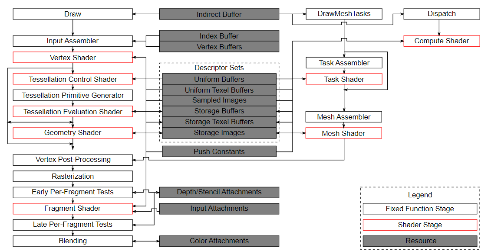

# **计算着色器与SSBO**

## **前言**

在基础部分的最后，我们将介绍 **计算着色器\(compute shader\)** 和 **着色器存储缓冲对象\(SSBO\)** 。

与其他图形引擎不同， Vulkan 强制支持计算着色器，这意味着你可以使用它在 GPU 上进行通用计算。
GPU 的计算能力可以用于图像处理、可见性测试、后期处理、高级光照计算、动画、物理（例如粒子系统）等工作。
它甚至可以用于不需要任何图形输出的非可视化计算工作，例如数值计算或 AI 相关的内容，这被称为“无头计算\(headless compute\)”。

## **管线框图**

计算着色器并非图形管线的一部分，让我们看看官方规范的 Vulkan 管线框图：



左侧是我们熟悉的传统图形管线，中间是输入缓冲、描述符与附件，而计算着色器位于右上角。

> 中右侧有个“Task-Mesh”的着色器模块，它用于代替传统的“顶点-细分-几何”着色器模式，我们会在进阶章节中介绍。

这里的重点是，虽然计算着色器不属于图形管线，但它可以使用描述符集访问内存资源。

## **粒子系统**

本章将实现一个简单的基于 GPU 的粒子系统，用于演示计算着色器与 SSBO 的使用。

这种系统在许多游戏中都有使用，通常由数千个需要按逻辑帧速率更新的粒子组成。
渲染这样的系统需要两个主要组件：顶点\(用顶点缓冲传递\)和更新它们的方式\(比如某种方程\)。

“经典”的基于 CPU 的粒子系统会将粒子数据存于系统主存，然后使用 CPU 更新它们。
每次更新后，都需要将数据从主存传输到 GPU 的显存，无论你使用“主机可见内存”还是“设备本地内存”都是如此，这非常昂贵。

基于 GPU 的粒子系统不需要这种往返，计算着色器将直接更新 GPU 显存中的顶点数据，而此数据区可采用设备本地内存类型，从而获得最高性能。

在具有专用计算队列的 GPU 上，可以并行执行计算任务和图像管线的渲染任务，这被称为“异步计算”，我们将在进阶章节介绍。

## **数据准备**

Vulkan 提供了两种专用存储类型允许着色器**任意读取和写入缓存**，它们分别是：

- 着色器存储缓冲对象\(SSBO\)
- 存储图像

我们不会在本章中进行图像处理，但你应该知晓计算着色器也可以用于图像处理。

### 1. 着色器存储缓冲

“着色器存储缓冲对象\(SSBO\)”允许着色器直接读取和写入缓冲。它们类似于 Uniform 缓冲对象，最大的区别在于您可以将其他缓冲类型别名化为 SSBO，并且它们可以任意大。

本章我们会直接让计算着色器修改我们的顶点缓冲区数据，为此需要给缓冲区创建信息添加一个标志位 `vk::BufferUsageFlagBits::eStorageBuffer` ，此标志位表示此缓冲将用作存储缓冲。

因此我们需要修改 `createVertexBuffer` 函数中顶点缓冲区的创建代码：

```cpp
void createVertexBuffer() {
    ......
    createBuffer(bufferSize, 
        vk::BufferUsageFlagBits::eStorageBuffer |
        vk::BufferUsageFlagBits::eTransferDst |
        vk::BufferUsageFlagBits::eVertexBuffer, 
        vk::MemoryPropertyFlagBits::eDeviceLocal,
        m_vertexBuffer, 
        m_vertexBufferMemory
    );
    ......
}
```

// TODO 2025-06-22

---

我们的 `main.cpp` 已经变得非常庞大，不适合再添加内容了。

对于后面的进阶章节，我们会在前言部分给出代码框架。
请读者先阅读基础代码，然后根据章节内容为框架添加代码。

---


