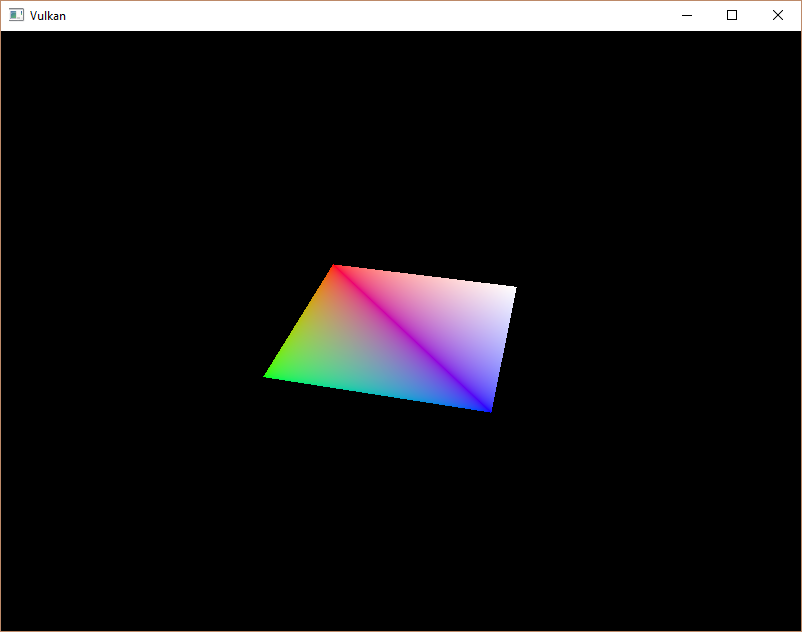

# 描述符池和集

## 前言

我们上一章定义的描述符布局描述了可以绑定的描述符类型。
在这一章，我们将为每个 `vk::Buffer` 资源创建描述符集，从而绑定到对应的`uniform`缓冲描述符。

## 描述符池

描述符集不能直接创建，必须通过描述符池分配，就像命令缓冲一样。
现在我们创建一个新函数`createDescriptorPool`用于设置描述符池。

```cpp
void initVulkan() {
    ...
    createUniformBuffers();
    createDescriptorPool();
    ...
}

...

void createDescriptorPool() {

}
```

首先，我们需要使用`vk::DescriptorPoolSize`结构体描述我们需要的描述符类型以及数量。

```cpp
vk::DescriptorPoolSize poolSize;
poolSize.type = vk::DescriptorType::eUniformBuffer;
poolSize.descriptorCount = static_cast<uint32_t>(MAX_FRAMES_IN_FLIGHT);
```

我们会为每个帧分配一个描述符。上面的`poolSize`结构体会被`CreateInfo`引用：

```cpp
vk::DescriptorPoolCreateInfo poolInfo;
poolInfo.flags = vk::DescriptorPoolCreateFlagBits::eFreeDescriptorSet;
poolInfo.setPoolSizes( poolSize );
```

我们使用了RAII封装，必须指定`eFreeDescriptorSet`标志位，从而在描述符集合释放时将控制全交还给描述符池。

除了可用的单个描述符的最大数量外，我们还需要指定可能分配的描述符集合的最大数量：

```cpp
poolInfo.maxSets = static_cast<uint32_t>(MAX_FRAMES_IN_FLIGHT);
```

在`m_descriptorSetLayout`下方添加一个新的类成员来存储描述符池的句柄，并调用  来创建它。

```cpp
vk::raii::DescriptorSetLayout m_descriptorSetLayout{ nullptr };
vk::raii::DescriptorPool m_descriptorPool{ nullptr };

......

m_descriptorPool = m_device.createDescriptorPool(poolInfo);
```

## 描述符集合

现在可以分配描述符集合本身了，为此目的添加一个 `createDescriptorSets` 函数：

```cpp
void initVulkan() {
    ...
    createDescriptorPool();
    createDescriptorSets();
    ...
}

...

void createDescriptorSets() {

}
```

我们需要使用`vk::DescriptorSetAllocateInfo`结构定义描述符集合的分配方式。
您需要从中指定对应的描述符池、需要分配的描述符集合数量和布局。

```cpp
std::vector<vk::DescriptorSetLayout> layouts(MAX_FRAMES_IN_FLIGHT, *m_descriptorSetLayout); 
vk::DescriptorSetAllocateInfo allocInfo;
allocInfo.descriptorPool = m_descriptorPool;
allocInfo.setSetLayouts( layouts );
```

我们为每个飞行中的帧都创建一个描述符集合，它们的布局相同，所以需要一个布局数组。

注意我们这里的布局数组，共用了成员变量中RAII布局变量的内部句柄，避免不需要的重复资源创建。

现在添加一个类成员来保存描述符集合句柄，并使用 `allocateDescriptorSets` 分配：

```cpp
vk::raii::DescriptorPool m_descriptorPool{ nullptr };
std::vector<vk::raii::DescriptorSet> m_descriptorSets;

......

m_descriptorSets = m_device.allocateDescriptorSets(allocInfo);
```

描述符集合现在已经分配，但是描述符任然需要配置，现在添加一个循环来填充每个描述符：

```cpp
for (size_t i = 0; i < MAX_FRAMES_IN_FLIGHT; ++i) {

}
```

使用 `vk::DescriptorBufferInfo` 结构体配置描述符缓冲，指定缓冲区以及数据区域：

```cpp
for (size_t i = 0; i < MAX_FRAMES_IN_FLIGHT; ++i) {
    vk::DescriptorBufferInfo bufferInfo;
    bufferInfo.buffer = m_uniformBuffers[i];
    bufferInfo.offset = 0;
    bufferInfo.range = sizeof(UniformBufferObject);
}
```

描述符的配置使用抽象设备的 `updateDescriptorSets` 成员函数更新，我们需要先填写 `vk::WriteDescriptorSet` 结构作为参数：

```cpp
vk::WriteDescriptorSet descriptorWrite;
descriptorWrite.dstSet = m_descriptorSets[i];
descriptorWrite.dstBinding = 0;
descriptorWrite.dstArrayElement = 0;
```

前两个字段指定要更新的描述符集合和绑定，我们的`uniform`缓冲绑定的是索引`0`。
由于描述符可以是数组，我们还需要指定更新数组元素的开始索引。我们没有使用数组，所以这里是`0`。

我们还需要再次指定描述符的类型和数量：

```cpp
descriptorWrite.descriptorType = vk::DescriptorType::eUniformBuffer;
descriptorWrite.setBufferInfo(bufferInfo);
```

注意`setBufferInfo`设置了`descriptorCount`和`pBufferInfo`两个字段。

不同的描述符需要设置不同的字段，比如`BufferInfo`自动用于引用缓冲区数据的描述符，`ImageInfo`用于引用图像数据的描述符，`TexelBufferView`则用于引用缓冲区视图的描述符。我们使用`BufferInfo`。

最后使用`updateDescriptorSets`更新描述符集合。

```cpp
m_device.updateDescriptorSets(descriptorWrite, nullptr);
```

第一个参数是`vk::WriteDescriptorSet`的代理数组。
第二个参数是`vk::CopyDescriptorSet`的代理数组，用于描述符相互复制，我们不需要。

## 使用描述符集合

我们现在需要更新 `recordCommandBuffer` 函数，从而将每帧正确的描述符集合绑定到着色器的描述符上。
在 `drawIndexed` 之前使用 `bindDescriptorSets` ：


```cpp
commandBuffer.bindDescriptorSets(
    vk::PipelineBindPoint::eGraphics, 
    m_pipelineLayout,
    0,
    *m_descriptorSets[m_currentFrame],
    nullptr
);

commandBuffer.drawIndexed(static_cast<uint32_t>(indices.size()), 1, 0, 0, 0);
```

描述符集合并非图形管线独有，所以我们第一个参数需要指定绑定到图形管线（而不是计算管线）。
第二个参数指定管线布局，第三个参数指定描述符集合的开始位置，第四个参数就是描述符集合。
最后一个参数指定动态描述符，我们会在以后的章节介绍。

如果您现在运行程序，您会注意到不幸的是什么都不可见。
问题是由于我们在投影矩阵中所做的 Y 翻转，顶点现在以逆时针顺序而不是顺时针顺序绘制。
这会导致背面剔除生效，并阻止绘制任何几何图形。
转到 `createGraphicsPipeline` 函数并修改  `frontFace` 以纠正此问题

```cpp
rasterizer.cullMode = vk::CullModeFlagBits::eBack;
rasterizer.frontFace = vk::FrontFace::eCounterClockwise;
```

再次运行程序，您现在应该看到以下内容



矩形已变为正方形，因为投影矩阵现在校正了宽高比。
`updateUniformBuffer` 负责屏幕大小调整，因此我们不需要在 `recreateSwapChain` 中重新创建描述符集合。

## 对齐要求

到目前为止，我们忽略了一件事，即 C++ 结构中的数据应如何与着色器中的 `uniform` 定义匹配。简单地在两者中使用相同的类型似乎很明显

```cpp
// cpp
struct UniformBufferObject {
    glm::mat4 model;
    glm::mat4 view;
    glm::mat4 proj;
};

// glsl
layout(binding = 0) uniform UniformBufferObject {
    mat4 model;
    mat4 view;
    mat4 proj;
} ubo;
```

但是，这并不是全部。例如，尝试修改结构和着色器，使其看起来像这样

```cpp
// cpp
struct UniformBufferObject {
    glm::vec2 foo;
    glm::mat4 model;
    glm::mat4 view;
    glm::mat4 proj;
};

// glsl
layout(binding = 0) uniform UniformBufferObject {
    vec2 foo;
    mat4 model;
    mat4 view;
    mat4 proj;
} ubo;
```

重新编译您的着色器和程序并运行它，您会发现您迄今为止使用的彩色正方形消失了！那是因为我们没有考虑到对齐要求。

Vulkan 希望您结构中的数据以特定方式在内存中对齐，例如

- 标量必须按 N 对齐（= 4 字节，给定 32 位浮点数）。
- `vec2` 必须按 2N 对齐（= 8 字节）
- `vec3` 或 `vec4` 必须按 4N 对齐（= 16 字节）
- 嵌套结构必须按其成员的基本对齐方式对齐，向上舍入到 16 的倍数。
- `mat4` 矩阵必须与 `vec4` 具有相同的对齐方式。

您可以在 [规范](https://www.khronos.org/registry/vulkan/specs/1.3-extensions/html/chap15.html#interfaces-resources-layout) 中找到完整的对齐要求列表。

我们原始的着色器只有三个 `mat4` 字段，已经满足了对齐要求。由于每个 `mat4` 的大小为 4 x 4 x 4 = 64 字节，因此 `model` 的偏移量为 0，`view `的偏移量为 64，`proj` 的偏移量为 128。所有这些都是 16 的倍数，这就是它工作正常的原因。

新结构以 `vec2` 开头，它只有 8 字节大小，因此会抵消所有偏移量。现在 `model` 的偏移量为 8，`view` 的偏移量为 72，`proj` 的偏移量为 136，它们都不是 16 的倍数。为了解决这个问题，我们可以使用 C++11 中引入的 `alignas` 说明符

```cpp
struct UniformBufferObject {
    glm::vec2 foo;
    alignas(16) glm::mat4 model;
    glm::mat4 view;
    glm::mat4 proj;
};
```

如果您现在编译并再次运行程序，您应该会看到着色器再次正确接收其矩阵值。

幸运的是，有一种方法可以在大多数情况下不必考虑这些对齐要求。我们可以在包含 GLM 之前定义 `GLM_FORCE_DEFAULT_ALIGNED_GENTYPES`

```cpp
#define GLM_FORCE_RADIANS
#define GLM_FORCE_DEFAULT_ALIGNED_GENTYPES
#include <glm/glm.hpp>
```

这将强制 GLM 使用已经为我们指定了对齐要求的 `vec2` 和 `mat4` 版本。如果您添加此定义，则可以删除 `alignas` 说明符，并且您的程序仍然可以正常工作。

不幸的是，如果您开始使用嵌套结构，此方法可能会崩溃。考虑 C++ 代码中的以下定义

```cpp
struct Foo {
    glm::vec2 v;
};

struct UniformBufferObject {
    Foo f1;
    Foo f2;
};
```

以及以下着色器定义

```glsl
struct Foo {
    vec2 v;
};

layout(binding = 0) uniform UniformBufferObject {
    Foo f1;
    Foo f2;
} ubo;
```

在这种情况下，`f2` 的偏移量将为 `8`，而它应该是 `16` 的偏移量，因为它是一个嵌套结构。在这种情况下，您必须自己指定对齐方式

```cpp
struct UniformBufferObject {
    Foo f1;
    alignas(16) Foo f2;
};
```

这些陷阱是始终明确对齐方式的一个很好的理由。这样，您就不会被对齐错误造成的奇怪症状所迷惑。

```cpp
struct alignas(16) UniformBufferObject {
    glm::mat4 model;
    glm::mat4 view;
    glm::mat4 proj;
};
```

> 不要忘记在删除 `foo` 字段后重新编译着色器。

## 多个描述符集合

正如一些结构和函数调用所暗示的那样，实际上可以同时绑定多个描述符集合。
创建管线布局时，您需要为每个描述符集合指定一个描述符布局。
然后，着色器可以像这样引用特定的描述符集合

```glsl
layout(set = 0, binding = 0) uniform UniformBufferObject { ... }
```

您可以使用此功能将每个对象变化的描述符和共享的描述符放入单独的描述符集合中。
在这种情况下，您可以避免在绘制调用中重新绑定大多数描述符，这可能更有效。

---

**[C++代码](../codes/0301_descriptor2/main.cpp)**

**[C++代码差异](../codes/0301_descriptor2/main.diff)**

**[根项目CMake代码](../codes/0300_descriptor1/CMakeLists.txt)**

**[shader-CMake代码](../codes/0300_descriptor1/shaders/CMakeLists.txt)**

**[shader-vert代码](../codes/0300_descriptor1/shaders/shader.vert)**

**[shader-frag代码](../codes/0300_descriptor1/shaders/shader.frag)**

