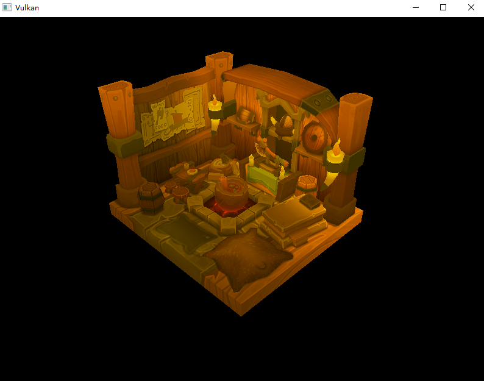
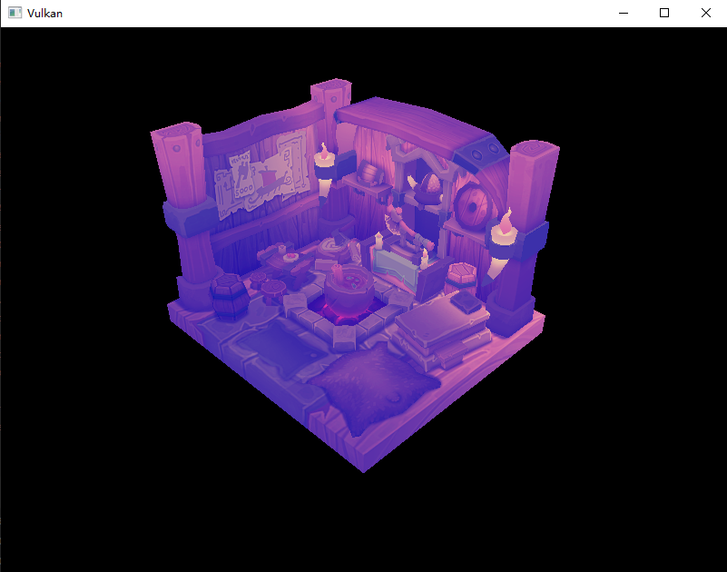

# **特化常量**

## **前言**

**特化常量\(Specialization Constants\)**是 Vulkan 中一种在**管线创建时**指定的常量值，它允许在 SPIR-V 代码中保留“占位符”，直到应用程序运行时才确定具体值。
与推送常量不同，特化常量最后将直接嵌入 SPIR-V 代码中，且管线创建后无法修改，类似于编译时常量。

需要注意，SPIR-V 依然只是一种中间语言，而我们为其嵌入了常量值，因此它可以在生成目标 ISA 时进行优化，如常量折叠、死代码消除等。

因此，它可以在某些时候代替高级着色器语言（GLSL/HLSL）中的预处理宏，实现更优雅的着色器代码。

> 关于特化常量：[Vulkan-Guide \[specialization constants\]](https://docs.vulkan.org/guide/latest/mapping_data_to_shaders.html#specialization-constants)

## **基础代码**

请下载并阅读下面的基础代码，这是“C++模块化”章节的第二部分代码：

**[点击下载](../../codes/04/00_cxxmodule/module_code.zip)**

本章内容非常简单，仅演示特化常量的使用方式，不演示复杂功能。

## **着色器**

它在着色器中的使用非常简单，使用 constant_id 关键字：

```glsl
#version 450
 // 通过 constant_id 指定特化常量的 ID，且可以提供默认值
layout (constant_id = 0) const float myColor = 1.0;
layout(location = 0) out vec4 outColor;

void main() {
    outColor = vec4(myColor);
}
```

显然特化常量在各个着色器都可用。本文以片段着色器为例，请修改 `shaders/graphics.frag.glsl` 文件：


```glsl
#version 450

// 提供默认值 0.0
layout (constant_id = 0) const float myColor = 0.0;

layout(set = 1, binding = 0) uniform sampler2D texSampler;

layout(location = 0) in vec2 fragTexCoord;

layout(location = 0) out vec4 outColor;

void main() {
    outColor = vec4(texture(texSampler, fragTexCoord).xy, myColor, 1.0);
}
```

我们所做的事情非常简单，通过特化常量指定了蓝色通道并设置了默认值。

现在运行程序可以看到这样的图像：



你可以尝试调整 `myColor` 的默认值，可以看到各种奇怪色彩的图像。

## **图形管线**

仅使用默认值肯定无法满足需求，我们可以在管线创建时指定特化常量的值。

现在回到 C++ 代码，在 `GraphicsPipeline.cppm` 模块文件中找到管线创建函数：

```cpp
void create_graphics_pipeline() {
    ......
}
```

指定特化常量的值一般需要三种内容：

1. 源数据（类型和具体的对象）
2. 特化映射条目（用于指定数据格式和 `constant_id` 序号）
3. 特化信息汇总（用于绑定具体数据）

我们的数据类型非常简单，单个 `float` ，所以可以这样写：

```cpp
// 1. 数据源
float my_color = 0.4f;
// 2. 特化映射条目
vk::SpecializationMapEntry mapEntry;
mapEntry.constantID = 0; // 对应 GLSL 中的 constant_id 和 SPIR-V 中的 SpecId
mapEntry.offset     = 0; // 源数据的起始偏移量
mapEntry.size       = sizeof(float);
// 3. 特化信息
vk::SpecializationInfo specializationInfo;
specializationInfo.setMapEntries(mapEntry); // 如果需要，可以设置多个映射条目
specializationInfo.setData<float>(my_color);
// 此模板设置了 指针 和 数据大小 ，不能放右值

vk::PipelineShaderStageCreateInfo fragment_shader_create_info; // 片段着色器
fragment_shader_create_info.stage = vk::ShaderStageFlagBits::eFragment;
fragment_shader_create_info.module = fragment_shader_module;
fragment_shader_create_info.pName = "main";
// 直接在着色器创建信息中绑定“特化信息”
fragment_shader_create_info.pSpecializationInfo = &specializationInfo;

// ... 后续代码不变
```

需要注意的是，特化常量仅能在管线创建时指定，后续无法修改，因此才能实现类似“编译期常量”的优化。
（管线创建后数据已经写入 SPIR-V 文件，不再需要 `my_color` 变量。）

经过基础章节的学习，你应该能够轻松理解这些字段。现在运行程序，你将看到这样的图像：




## **最后**

特化常量的使用就是这么简单。

观察代码可知，一次性可以设置多个特化常量，还可以使用其他数据类型。
前言部分提到它可以代替预处理宏，即你可以将它作为分支语句的条件值，编译器可以根据常量优化掉无效分支。

作为进阶章节，请自行思考或尝试使用这些功能，它们并不复杂。

---

**[初始代码集](../../codes/04/00_cxxmodule/module_code.zip)**

**[shader - frag](../../codes/04/10_specialization/graphics.frag.glsl)**

**[GraphicsPipeline.cppm](../../codes/04/10_specialization/GraphicsPipeline.cppm)**

**[GraphicsPipeline.diff\(差异文件\)](../../codes/04/10_specialization/GraphicsPipeline.diff)**

---
