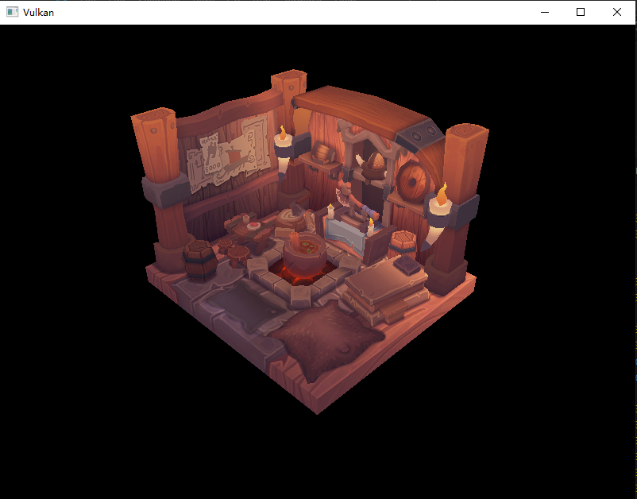

# **shaderc**

## **前言**

本章我们将介绍如何使用 `shaderc` 工具在运行时编译着色器代码。

[shaderc](https://github.com/google/shaderc) 是 Google 提供的一个工具集，它包含了 `glslc` ，可用于将 GLSL 着色器代码（在运行时）编译为 SPIR-V 二进制格式。

## **基础代码**

请下载并阅读下面的基础代码，这是“C++模块化“章节的第二部分代码，但使用了同步2语法：

**[点击下载](../../codes/04/15_shaderc/shaderc_base.zip)**

我们还修改了一点，在 `GraphicsPipeline.cppm` 中添加了着色器的硬编码代码，但没有使用。

构建运行，将显示我们熟悉的房屋模型：



## **安装 shaderc**

如果你打开 Vulkan SDK 的安装目录，查询头文件路径，会发现 `shaderc` 已经位于其中，这就是为什么我们之前可以直接在 CMake 使用 `glslc` 命令。

> Vulkan SDK 的头文件甚至包含了 `glm` 线性代数库。

此外，也可以通过 `vcpkg` 安装 `shaderc`：

```shell
vcpkg install shaderc
```

如果你使用 Vulkan SDK 自带的 `shaderc` ，则可以查阅 [此文档](https://cmake.org/cmake/help/latest/module/FindVulkan.html) ，它告诉了你如何使用 Vulkan 自带的 `shaderc` 目标。

如果你使用 `vcpkg` 安装，请修改 `CMakeLists.txt` 文件，添加以下内容：

```cmake
find_package(unofficial-shaderc CONFIG REQUIRED)
# ......
target_link_libraries(main PRIVATE unofficial::shaderc::shaderc)
```

`shaderc` 的对外接口并不多，下面出一个模块接口文件的示例，你可以将它加到 `src/third/` 目录下：

```cpp
module;

#include <shaderc/shaderc.hpp>

export module shaderc;

export namespace shaderc {
    using target_env = ::shaderc_target_env;
    using env_version = ::shaderc_env_version;
    using spirv_version = ::shaderc_spirv_version;
    using compilation_status = ::shaderc_compilation_status;
    using source_language = ::shaderc_source_language;
    using shader_kind = ::shaderc_shader_kind;
    using profile = ::shaderc_profile;
    using optimization_level = ::shaderc_optimization_level;
    using limit = ::shaderc_limit;
    using uniform_kind = ::shaderc_uniform_kind;
    using include_result = ::shaderc_include_result;
    using include_type = ::shaderc_include_type;
    using compilation_result_t = ::shaderc_compilation_result_t;
    using shaderc::CompilationResult;
    using shaderc::Compiler;
    using shaderc::CompileOptions;
    using shaderc::SpvCompilationResult;
    using shaderc::AssemblyCompilationResult;
    using shaderc::PreprocessedSourceCompilationResult;
}
```

## **编译着色器**

转到 `GraphicsPipeline.cppm` 模块，我们已经将需要的着色器代码硬编码在了两个 `std::string` 中，现在要在运行时编译这些着色器代码，并生成 Vulkan 着色器模块。

### 1. 辅助函数

首先导入 `shaderc` 模块，然后创建一个函数用于编译着色器：

```cpp
import shaderc;

...

std::vector<std::uint32_t> compile_shader(
    const std::string& source,              // 着色器源代码
    const shaderc::shader_kind kind,        // 着色器类型
    const std::string& name = "shader"     // 着色器名称（可选，默认为 "shader"）
) {


}
```

我们需要着色器源码和着色器类型作为参数。着色器名称是可选的，它用于输出调试日志。

`shaderc` 中有一个 `Compiler` 类，它是编译器的核心。具体的配置参数则通过 `CompileOptions` 类来设置。
整体代码如下：

```cpp
std::vector<std::uint32_t> compile_shader(
    const std::string& source,              // 着色器源代码
    const shaderc::shader_kind kind,        // 着色器类型
    const std::string& name = "shader"     // 着色器名称（可选，默认为 "shader"）
) {
    // 创建编译器和编译选项
    shaderc::Compiler compiler;
    shaderc::CompileOptions options;

    // 设置编译选项
    options.SetOptimizationLevel(shaderc::optimization_level::shaderc_optimization_level_performance);
    // 设置目标环境
    options.SetTargetEnvironment(shaderc::target_env::shaderc_target_env_vulkan, shaderc::env_version::shaderc_env_version_vulkan_1_4);
    // 设置源语言
    options.SetSourceLanguage(shaderc::source_language::shaderc_source_language_glsl);

    // 编译着色器
    const shaderc::SpvCompilationResult result = compiler.CompileGlslToSpv(
        source, // 着色器源代码
        kind,   // 着色器类型
        name.c_str(), // 着色器名称
        options // 编译选项
    );

    // 检查编译结果
    if (result.GetCompilationStatus() != shaderc::compilation_status::shaderc_compilation_status_success) {
        throw std::runtime_error(result.GetErrorMessage());
    }

    return {result.cbegin(), result.cend()};
}
```

### 2. 创建着色器模块

现在可以修改 `create_graphics_pipeline` 函数，使用 `compile_shader` 函数来编译着色器代码，并创建着色器模块：

```cpp
const auto vertex_shader_code = compile_shader(VERT_CODE, shaderc::shader_kind::shaderc_glsl_vertex_shader);
const auto fragment_shader_code = compile_shader(FRAG_CODE, shaderc::shader_kind::shaderc_glsl_fragment_shader);
const auto vertex_shader_module = m_device->device().createShaderModule(
    vk::ShaderModuleCreateInfo().setCode( vertex_shader_code )
);
const auto fragment_shader_module = m_device->device().createShaderModule(
    vk::ShaderModuleCreateInfo().setCode(fragment_shader_code)
);
```

由于现在生成的着色器代码使用 `vector<uint32_t>` 存储，因此可以直接调用 `setCode` 函数自动设置数组指针与代码长度。

现在你可以运行程序，看到房屋模型依然正常显示。


## **最后**

我们的代码至少还有两处可以改进：

1. 将编译好的代码存储到本地文件，每次启动时检查是否已有编译好的文件，避免重复编译。
2. 将着色器代码存放在独立的文件中，需要重编译时进行读取，以便修改和维护。

你可能会好奇，这和我们之前使用 `CMake` 的做法有什么区别？

现在将着色器编译过程放在了运行时，因此可以让用户在首次运行时编译着色器，而程序无需提前打包编译好的着色器二进制文件。

这便于软件的更新（着色器代码的更新与程序独立），且可能在编译时根据用户自身的硬件或环境进行优化。
许多游戏在版本更新后需要重新编译着色器，使用的就是类似的方式。

`shaderc` 还有很多可配置功能，参考上方 `shaderc.cppm` 导出的内容，你可以自行了解。

---

**[基础代码](../../codes/04/15_shaderc/shaderc_base.zip)**

**[shaderc.cppm](../../codes/04/15_shaderc/shaderc.cppm)**

**[GraphicsPipeline.cppm](../../codes/04/15_shaderc/GraphicsPipeline.cppm)**

**[GraphicsPipeline.diff](../../codes/04/15_shaderc/GraphicsPipeline.diff)**

**[CMakeLists.txt](../../codes/04/15_shaderc/CMakeLists.txt)**

**[CMakeLists.diff](../../codes/04/15_shaderc/CMakeLists.diff)**

---
