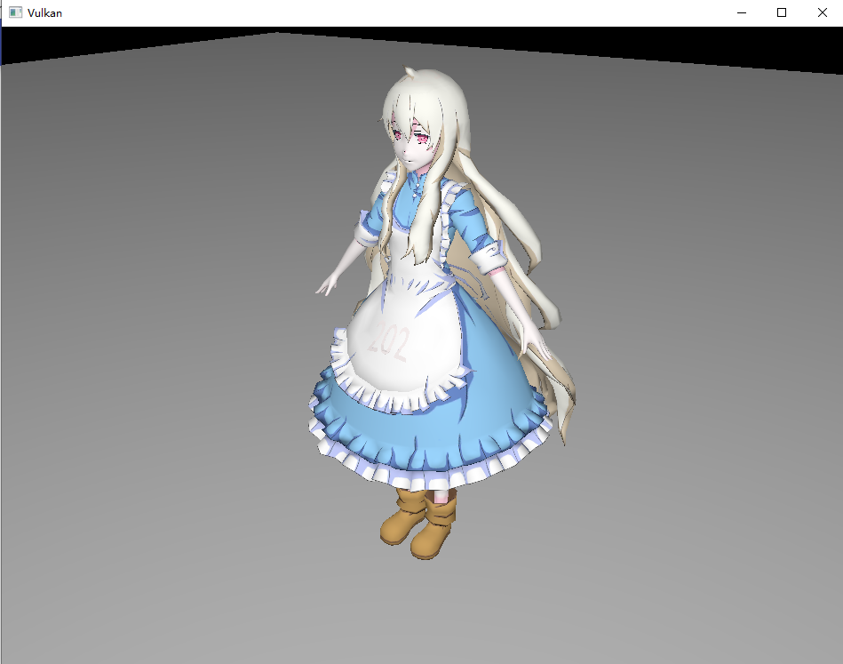
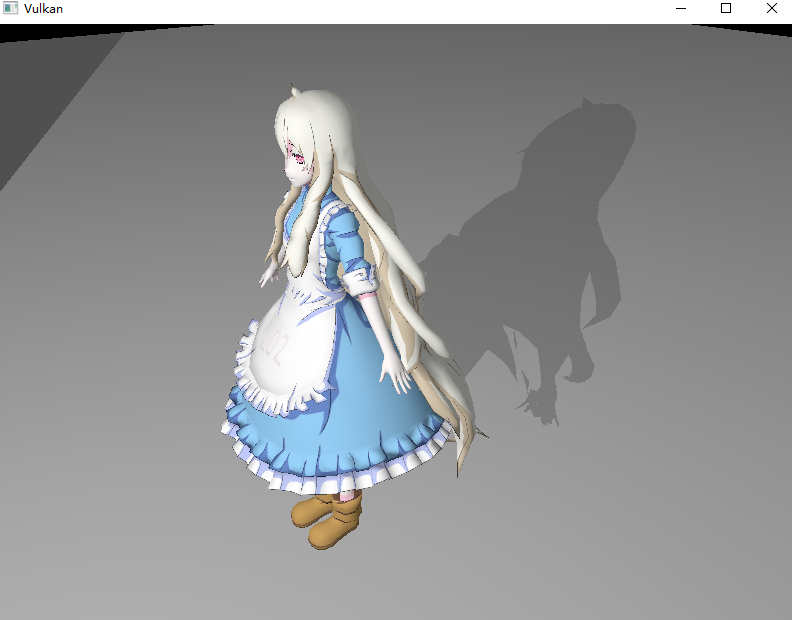
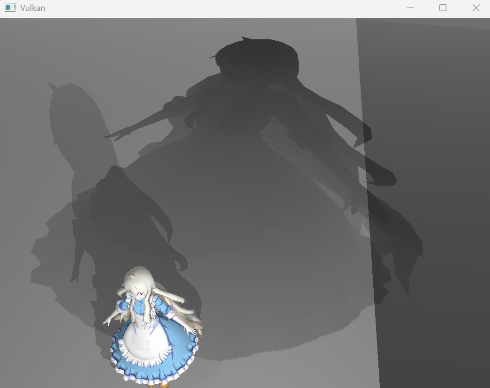

# **阴影映射**

## **前言**

在之前的章节中，我们只用到了一个管线、渲染通道和子通道来渲染场景。
然而，实际渲染流程往往需要多个图形管线协作完成，例如实现阴影、镜面反射和后处理等。

在本章中，我们将通过 Phong 光照模型，渲染一个带光照和阴影的简单场景。
我们将使用最简单的 **阴影映射** 方式来实现阴影效果，先生成光源视角下的深度图，然后在渲染主场景时使用该深度图来判断片元是否被遮挡。

由于渲染目标不同，需要分别用两个渲染通道处理深度图和主场景。

> 如果目标相同，可以使用一个渲染通道和多个子通道来实现。

## **基础代码**

请下载下方的代码并编译运行：

**[点击下载代码](../../codes/04/20_shadowmap/0420_base_code.zip)**

本场景使用了 [GAMES202](https://www.bilibili.com/video/BV1YK4y1T7yY) 课程作业1的模型，建议阅读本章前先完成阴影映射部分的理论学习。

自行移动摄像机位置，你将看到类似下面的效果:



本章节基础代码基于“C++模块化”章节的示例二代码，主要做出如下修改：

- 添加 `LightUBO` ，用于传递光源信息。
- 修改模型读取代码，读取地面和Marry人物模型，以及材质数据。
- 添加实例缓冲区，存储模型自身的材质数据。
- 使用推送常量控制是否纹理采样。
- 创建深度图所需图像和采样器，但未使用。
- 修改着色器，添加简单的 Phong 光照计算逻辑。

## **深度图**

在渲染阴影时，我们需要先生成一个**深度图**，记录光源视角下的场景深度信息。
基础代码已经创建了深度图所需的图像资源和采样器，但尚未真正使用。

前言部分提到，我们需要使用两个渲染通道来分别处理深度图和主场景的渲染。
因此需要创建一个新的图形管线和渲染通道用于生成深度图，此管线无需绘制最终颜色、只需记录深度信息，因此无需颜色附件和片段着色器。
深度图像将**作为附件添加到第一个渲染通道**。

在第二个渲染通道中，我们将使用该深度图来判断片元对于光源是否可见，需要使用采样器来读取深度图像。
因此图像和采样器在第二个管线将**使用描述符集**以供着色器访问，而非附件的形式。

## **渲染通道**

现在创建一个新的渲染通道用于生成深度图。

### 1. 阴影渲染通道模块

现在创建一个 `ShadowRenderPass.cppm` 模块文件，负责创建阴影渲染通道和帧缓冲区。

```cpp
module;
#include <memory>
#include <vector>
export module ShadowRenderPass;

import vulkan_hpp;
import Device;
import ShadowDepthImage;

export namespace vht {
    class ShadowRenderPass {
        std::shared_ptr<vht::Device> m_device{ nullptr };
        std::shared_ptr<vht::ShadowDepthImage> m_shadow_depth_image{ nullptr };
        vk::raii::RenderPass m_render_pass{ nullptr };
        std::vector<vk::raii::Framebuffer> m_framebuffers;
        vk::Extent2D m_extent{};  // 使用阴影深度图的宽度和高度
    public:
        explicit ShadowRenderPass(
            std::shared_ptr<vht::Device> device,
            std::shared_ptr<vht::ShadowDepthImage> shadow_depth_image)
        :   m_device(std::move(device)),
            m_shadow_depth_image(std::move(shadow_depth_image)) {
            m_extent.width = m_shadow_depth_image->width();
            m_extent.height = m_shadow_depth_image->height();
            create_render_pass();
            create_framebuffers();
        }

        [[nodiscard]]
        const vk::raii::RenderPass& render_pass() const { return m_render_pass; }
        [[nodiscard]]
        const std::vector<vk::raii::Framebuffer>& framebuffers() const { return m_framebuffers; }
        [[nodiscard]]
        const vk::Extent2D& extent() const { return m_extent; } // 命令缓冲录制时需要使用
    private:
        // 创建渲染通道
        void create_render_pass() {

        }
        // 创建帧缓冲
        void create_framebuffers() {

        }
    };
}
```

有一点值得注意，此渲染通道不需要用到“交换链”，更准确的说是不需要获取交换链图像的大小。
这是因为深度图不用于屏幕显示，第二次渲染使用采样器读取时使用 `[0,1]` 表示图像范围，因此不需要考虑交换链的图像大小。
此外，它也不需要在窗口变化时重建。

深度图大小可根据需求设定，它在 `ShadowDepthImage.cppm` 模块的类成员中指定。
越大的深度图，最后表现出的阴影效果越精细，但会消耗更多的显存和计算资源。

### 2. 创建渲染通道

渲染通道与帧缓冲的创建过程与之前类似，但此通道只需要一个深度附件，无需颜色附件。

```cpp
void create_render_pass() {
    vk::AttachmentDescription depth_attachment;
    depth_attachment.format = m_shadow_depth_image->format();
    depth_attachment.samples = vk::SampleCountFlagBits::e1;
    depth_attachment.loadOp = vk::AttachmentLoadOp::eClear;
    depth_attachment.storeOp = vk::AttachmentStoreOp::eStore; // 阴影深度图像通常需要存储
    depth_attachment.stencilLoadOp = vk::AttachmentLoadOp::eDontCare;
    depth_attachment.stencilStoreOp = vk::AttachmentStoreOp::eDontCare;
    depth_attachment.initialLayout = vk::ImageLayout::eUndefined;
    depth_attachment.finalLayout = vk::ImageLayout::eShaderReadOnlyOptimal; // 后续需要让着色器读取

    vk::AttachmentReference depth_attachment_ref;
    depth_attachment_ref.attachment = 0;
    depth_attachment_ref.layout = vk::ImageLayout::eDepthStencilAttachmentOptimal;

    vk::SubpassDescription subpass;
    subpass.pipelineBindPoint = vk::PipelineBindPoint::eGraphics;
    subpass.setPDepthStencilAttachment( &depth_attachment_ref );

    vk::RenderPassCreateInfo create_info;
    create_info.setAttachments( depth_attachment );
    create_info.setSubpasses( subpass );

    m_render_pass = m_device->device().createRenderPass( create_info );
}
```

注意附件信息，我们要保留深度图像的存储操作，以便后续渲染时可以读取。
而且后续要让第二个管线的着色器读取，因此需要将深度图像的最终布局设置为 `eShaderReadOnlyOptimal`。

### 3. 创建帧缓冲

帧缓冲的创建与之前类似，但需要使用阴影深度图像的视图以及尺寸。

```cpp
void create_framebuffers() {
    vk::FramebufferCreateInfo create_info;
    create_info.renderPass = m_render_pass;
    create_info.width = m_extent.width;
    create_info.height = m_extent.height;
    create_info.layers = 1;
    for (const auto& image_view : m_shadow_depth_image->image_views()) {
        create_info.setAttachments( *image_view ); // 记得加 * 操作符
        m_framebuffers.emplace_back(m_device->device().createFramebuffer( create_info ));
    }
}
```

### 4. 依赖注入

我们后续将在 `Drawer` 模块中使用此渲染通道，现在为其添加成员：

```cpp
...
import ShadowRenderPass;
...
class Drawer {
    ...
    std::shared_ptr<vht::ShadowRenderPass> m_shadow_render_pass{ nullptr };
    ...
    std::shared_ptr<vht::ShadowRenderPass> shadow_render_pass, // 构造函数参数
    ...
    m_shadow_render_pass(std::move(shadow_render_pass)), // 构造函数初始化
    ...
};
```

回到 `App.cppm` 模块，初始化对象，并为 `Drawer` 注入依赖：

> 我们使用共享指针管理资源，可以不那么在意声明顺序，但你需要注意创建顺序。

```cpp
...
import ShadowRenderPass;
...
class App {
    ...
    std::shared_ptr<vht::ShadowRenderPass> m_shadow_render_pass{ nullptr };
    ...
    init_shadow_render_pass();
    std::cout << "shadow render pass created" << std::endl;
    ...
    void init_shadow_render_pass() { m_shadow_render_pass = std::make_shared<vht::ShadowRenderPass>( m_device, m_shadow_depth_image ); }
    ...
    void init_drawer() {
        m_drawer = std::make_shared<vht::Drawer>(
            ...
            m_shadow_render_pass,
            ...
        );
    }
};
```

### 5. 测试

进阶内容的任务多且复杂，建议在每个小阶段完成后都进行测试，尽早发现问题。

## **着色器**

现在需要编写深度图渲染通道的着色器，此管线只需要顶点着色器（因为我们仅记录深度，不需要绘制色彩）。
我们需要在定义着色器中使用“光源”的视角变换矩阵，将顶点位置转换到光源视角下，以便管线后续自动绘制光源视角的场景深度图。

### 1. 顶点着色器

光源的 MVP 矩阵已经在 `LightUBO` 中定义，你可以自行调整。

着色器代码直接使用相同的数据格式即可，后续将使用 UBO 传递光源信息。
现在可以在 `shaders` 文件夹下创建一个新的着色器文件 `shadow.vert`，内容如下：

```glsl
#version 450

layout(location = 0) in vec3 inPosition;
layout(location = 1) in vec3 inNormal;
layout(location = 2) in vec2 inTexCoord;

layout(std140, binding = 0) uniform UBO {
    mat4 model;
    mat4 view;
    mat4 proj;
    vec3 lightPos;
    vec3 lightColor;
    vec3 viewPos;
} ubo;

void main() {
    gl_Position = ubo.proj * ubo.view * ubo.model * vec4(inPosition, 1.0);
}
```

顶点输入可以参考输入装配模块的内容，但深度图不需要实例数据（模型的材质信息），因此我们后续只传顶点数据。

### 2. CMake脚本

在 `shaders` 目录的 `CMakeLists.txt` 中添加新的着色器编译规则：

```cmake
# ...
set(SHADOW_SHADER ${SHADER_DIR}/shadow.vert)
# ...
set(SPIRV_SHADOW ${SHADER_DIR}/shadow.spv)
# ...
add_custom_command(
        OUTPUT ${SPIRV_SHADOW}
        COMMAND ${Vulkan_GLSLC_EXECUTABLE} ${SHADOW_SHADER} -o ${SPIRV_SHADOW}
        COMMENT "Compiling shadow.vert vertex shadow.spv"
        DEPENDS ${SHADOW_SHADER}
)

add_custom_target(CompileShaders ALL
        DEPENDS ${SPIRV_VERT} ${SPIRV_FRAG} ${SPIRV_SHADOW}
)
```

然后尝试编译项目与着色器，确保没有错误。

## **管线与描述符布局**

### 1. 管线模块

现在创建一个新的管线模块 `ShadowPipeline.cppm`，用于创建阴影渲染通道的图形管线。

```cpp
module;
#include <memory>
#include <vector>
export module ShadowPipeline;

import vulkan_hpp;
import DataLoader;
import Utility;
import Device;
import ShadowRenderPass;

export namespace vht {
    class ShadowPipeline {
        std::shared_ptr<vht::Device> m_device;
        std::shared_ptr<vht::ShadowRenderPass> m_shadow_render_pass;
        vk::raii::DescriptorSetLayout m_descriptor_set_layout{ nullptr };
        vk::raii::PipelineLayout m_pipeline_layout{ nullptr };
        vk::raii::Pipeline m_pipeline{ nullptr };
    public:
        explicit ShadowPipeline(std::shared_ptr<vht::Device> device, std::shared_ptr<vht::ShadowRenderPass> shadow_render_pass)
        :   m_device(std::move(device)),
            m_shadow_render_pass(std::move(shadow_render_pass)) {
            create_descriptor_set_layout();
            create_graphics_pipeline();
        }

        [[nodiscard]]
        const vk::raii::DescriptorSetLayout& descriptor_set_layout() const { return m_descriptor_set_layout; }
        [[nodiscard]]
        const vk::raii::PipelineLayout& pipeline_layout() const { return m_pipeline_layout; }
        [[nodiscard]]
        const vk::raii::Pipeline& pipeline() const { return m_pipeline; }

    private:
        void create_descriptor_set_layout() {
            ......
        }
        // 创建图形管线
        void create_graphics_pipeline() {
            ......
            ......
        }

    };
}
```

### 2. 描述符集布局

首先创建描述符集布局，包含一个绑定点用于传递光源信息。

```cpp
void create_descriptor_set_layout() {
    vk::DescriptorSetLayoutBinding light_ubo_layout_binging;
    light_ubo_layout_binging.binding = 0;
    light_ubo_layout_binging.descriptorType = vk::DescriptorType::eUniformBuffer;
    light_ubo_layout_binging.descriptorCount = 1;
    light_ubo_layout_binging.stageFlags = vk::ShaderStageFlagBits::eVertex;

    vk::DescriptorSetLayoutCreateInfo layoutInfo;
    layoutInfo.setBindings( light_ubo_layout_binging );

    m_descriptor_set_layout = m_device->device().createDescriptorSetLayout( layoutInfo );
}
```

### 3. 创建图形管线

管线创建方式与之前类似。注意我们只需要顶点着色器，且不需要颜色附件和颜色混合阶段。

```cpp
// 创建图形管线
void create_graphics_pipeline() {
    const auto vertex_shader_code = vht::read_shader("shaders/shadow.spv");
    const auto vertex_shader_module = vht::create_shader_module(m_device->device(), vertex_shader_code);
    // 只需要顶点着色器
    vk::PipelineShaderStageCreateInfo vertex_shader_create_info;
    vertex_shader_create_info.stage = vk::ShaderStageFlagBits::eVertex;
    vertex_shader_create_info.module = vertex_shader_module;
    vertex_shader_create_info.pName = "main";
    const std::vector<vk::PipelineShaderStageCreateInfo> shader_stages = { vertex_shader_create_info };

    // 顶点输入状态（只需要顶点位置，不需要实例材质数据）
    auto binding_description = vht::Vertex::get_binding_description();
    auto attribute_description = vht::Vertex::get_attribute_description();
     vk::PipelineVertexInputStateCreateInfo vertex_input;
    vertex_input.setVertexBindingDescriptions(binding_description);
    vertex_input.setVertexAttributeDescriptions(attribute_description);
    // 输入装配状态
    vk::PipelineInputAssemblyStateCreateInfo input_assembly;
    input_assembly.topology = vk::PrimitiveTopology::eTriangleList;
    // 视口与裁剪
    // 直接使用静态状态，因为我们的深度图像大小不会变化
    const vk::Viewport viewport(
        0.0f, 0.0f,          // x, y
        static_cast<float>(m_shadow_render_pass->extent().width),    // width
        static_cast<float>(m_shadow_render_pass->extent().height),   // height
        0.0f, 1.0f      // minDepth maxDepth
    );
    const vk::Rect2D scissor(
        vk::Offset2D{0, 0},              // offset
        m_shadow_render_pass->extent()         // extent
    );
    vk::PipelineViewportStateCreateInfo viewport_state;
    viewport_state.setViewports(viewport);
    viewport_state.setScissors(scissor);
    // 深度与模板测试
    vk::PipelineDepthStencilStateCreateInfo depth_stencil;
    depth_stencil.depthTestEnable = true;
    depth_stencil.depthWriteEnable = true;
    depth_stencil.depthCompareOp = vk::CompareOp::eLess;
    // 光栅化器
    vk::PipelineRasterizationStateCreateInfo rasterizer;
    rasterizer.depthClampEnable = false;
    rasterizer.rasterizerDiscardEnable = false;
    rasterizer.polygonMode = vk::PolygonMode::eFill;
    rasterizer.lineWidth = 1.0f;
    // 注意此处不剔除（和主渲染一样剔除背面的话会出问题，但可以只剔除，让迷枵思考一会。。。）
    rasterizer.cullMode = vk::CullModeFlagBits::eNone;
    rasterizer.frontFace = vk::FrontFace::eCounterClockwise;
    rasterizer.depthBiasEnable = false;
    // 多重采样
    vk::PipelineMultisampleStateCreateInfo multisampling;
    multisampling.rasterizationSamples =  vk::SampleCountFlagBits::e1;
    multisampling.sampleShadingEnable = false;  // default
    // 管线布局，引用描述符集布局
    vk::PipelineLayoutCreateInfo layout_create_info;
    layout_create_info.setSetLayouts( *m_descriptor_set_layout );
    m_pipeline_layout = m_device->device().createPipelineLayout( layout_create_info );
    // 创建图形管线
    vk::GraphicsPipelineCreateInfo create_info;
    create_info.layout = m_pipeline_layout;

    create_info.setStages( shader_stages );
    create_info.pVertexInputState =  &vertex_input;
    create_info.pInputAssemblyState = &input_assembly;
    create_info.pViewportState = &viewport_state;
    create_info.pDepthStencilState = &depth_stencil;
    create_info.pRasterizationState = &rasterizer;
    create_info.pMultisampleState = &multisampling;
    // 不需要颜色混合阶段
    // 不需要管线动态状态

    create_info.renderPass = m_shadow_render_pass->render_pass();
    create_info.subpass = 0;

    m_pipeline = m_device->device().createGraphicsPipeline( nullptr, create_info );
}
```

### 4. 依赖注入

我们至少有两个地方需要使用阴影管线，一个是 `Drawer` 模块，另一个是 `Descriptor` 模块。
现在需要为它们注入依赖，首先修改 `Drawer.cppm` 模块：

```cpp
...
import ShadowPipeline;
...
class Drawer {
    ...
    std::shared_ptr<vht::ShadowPipeline> m_shadow_pipeline{ nullptr };
    ...
    std::shared_ptr<vht::ShadowPipeline> shadow_pipeline,   // 构造函数参数
    ...
    m_shadow_pipeline(std::move(shadow_pipeline)),      // 构造函数初始化
    ...
};
```

然后是 `Descriptor.cppm` 模块：

```cpp
...
import ShadowPipeline;
...
class Descriptor {
    ...
    std::shared_ptr<vht::ShadowPipeline> m_shadow_pipeline{ nullptr };
    ...
    std::shared_ptr<vht::ShadowPipeline> shadow_pipeline,
    ...
    m_shadow_pipeline(std::move(shadow_pipeline)),
    ...
};
```

最后在 `App.cppm` 模块中初始化阴影管线，并修改上面两个模块对象的初始化语句：

```cpp
...
import ShadowPipeline;
...
class App {
    ...
    std::shared_ptr<vht::ShadowPipeline> m_shadow_pipeline{ nullptr };
    ...
    init_shadow_pipeline();
    std::cout << "shadow pipeline created" << std::endl;
    ...
    void init_shadow_pipeline() { m_shadow_pipeline = std::make_shared<vht::ShadowPipeline>(m_device, m_shadow_render_pass); }
    ...
    void init_descriptor() {
        m_descriptor = std::make_shared<vht::Descriptor>(
            ...
            m_shadow_pipeline,
            ...
        );
    }
    void init_drawer() {
        m_drawer = std::make_shared<vht::Drawer>(
            ...
            m_shadow_pipeline,
            ...
        );
    }
};
```

现在请编译运行项目，确保没有错误。

## **描述符集**

现在我们需要创建描述符集，以便在渲染阴影时传递光源信息。

### 1. 存储描述符

现在回到 `Descriptor.cppm` 模块，创建变量来存储阴影管线的描述符集。

```cpp
class Descriptor {
    ...
    // 添加成员变量
    std::vector<vk::raii::DescriptorSet> m_shadow_sets;
    ...
    // 对外接口
    [[nodiscard]]
    const std::vector<vk::raii::DescriptorSet>& shadow_sets() const { return m_shadow_sets; }
    ...
};
```

### 1. 修改描述符池

修改描述符池的创建代码，需要添加描述符的数量：

```cpp
void create_descriptor_pool() {
    std::array<vk::DescriptorPoolSize, 2> pool_sizes;
    pool_sizes[0].type = vk::DescriptorType::eUniformBuffer;
    // 一份 UBO + 2 份 Light UBO
    pool_sizes[0].descriptorCount = static_cast<uint32_t>(MAX_FRAMES_IN_FLIGHT * 3); 
    ......
    // 两个管线都需要 MAX_FRAMES_IN_FLIGHT
    poolInfo.maxSets = static_cast<uint32_t>(MAX_FRAMES_IN_FLIGHT * 2); 

    m_pool = m_device->device().createDescriptorPool(poolInfo);
}
```

注意描述符集的最大数量和描述符的数量都需要修改。

### 2. 创建描述符集布局

```cpp
void create_descriptor_sets() {
    // 为阴影管线创建描述符集布局
    std::vector<vk::DescriptorSetLayout> shadow_layouts(MAX_FRAMES_IN_FLIGHT, *m_shadow_pipeline->descriptor_set_layout());
    vk::DescriptorSetAllocateInfo shadow_alloc_info;
    shadow_alloc_info.descriptorPool = m_pool;
    shadow_alloc_info.setSetLayouts( shadow_layouts );
    
    m_shadow_sets = m_device->device().allocateDescriptorSets(shadow_alloc_info);
    
    for (size_t i = 0; i < MAX_FRAMES_IN_FLIGHT; ++i) {
        vk::DescriptorBufferInfo shadow_light_buffer_info;
        shadow_light_buffer_info.buffer = m_light_uniform_buffer->buffers()[i];
        shadow_light_buffer_info.offset = 0;
        shadow_light_buffer_info.range = sizeof(LightUBO);
        
        vk::WriteDescriptorSet write;
        write.dstSet = m_shadow_sets[i];
        write.dstBinding = 0;
        write.dstArrayElement = 0;
        write.descriptorType = vk::DescriptorType::eUniformBuffer;
        write.setBufferInfo(shadow_light_buffer_info);
        
        m_device->device().updateDescriptorSets(write, nullptr);
    }
    
    // 第二个管线的描述符集
    ......
    ......
}
```

现在再次运行程序，确保没有错误。

## **绘制命令记录**

现在回到 `Drawer.cppm` 模块，修改命令缓冲的记录，添加“阴影”渲染通道的绘制命令。

```cpp
// 记录命令缓冲区
void record_command_buffer(const vk::raii::CommandBuffer& command_buffer, const uint32_t image_index) const {
    // 开始记录命令缓冲区
    command_buffer.begin( vk::CommandBufferBeginInfo{} );

    // 记录阴影渲染通道的命令
    vk::RenderPassBeginInfo shadow_pass_begin_info;
    shadow_pass_begin_info.renderPass = m_shadow_render_pass->render_pass();
    // 注意这里的帧缓冲区是阴影渲染通道的帧缓冲，使用 current_frame 索引而不是 image_index
    shadow_pass_begin_info.framebuffer = m_shadow_render_pass->framebuffers()[m_current_frame];
    shadow_pass_begin_info.renderArea.offset = vk::Offset2D{0, 0};
    shadow_pass_begin_info.renderArea.extent = m_shadow_render_pass->extent(); // 注意这里使用阴影渲染通道的尺寸
    constexpr vk::ClearValue shadow_clear_color = vk::ClearDepthStencilValue{ 1.0f ,0 };
    shadow_pass_begin_info.setClearValues( shadow_clear_color );

    command_buffer.beginRenderPass( shadow_pass_begin_info, vk::SubpassContents::eInline );
    command_buffer.bindPipeline( vk::PipelineBindPoint::eGraphics, m_shadow_pipeline->pipeline() );
    // 我们使用了静态视口与裁剪，因此此处无需设置
    const std::vector<vk::Buffer> shadow_vertex_buffers = { *m_input_assembly->vertex_buffer() };
    constexpr std::array<vk::DeviceSize,1> shadow_offsets = { 0 };
    command_buffer.bindVertexBuffers( 0, shadow_vertex_buffers, shadow_offsets );
    command_buffer.bindIndexBuffer( m_input_assembly->index_buffer(), 0, vk::IndexType::eUint32 );
    command_buffer.bindDescriptorSets(
        vk::PipelineBindPoint::eGraphics,
        m_shadow_pipeline->pipeline_layout(),
        0,
        *m_descriptor->shadow_sets()[m_current_frame],
        nullptr
    );
    command_buffer.drawIndexed(static_cast<uint32_t>(m_data_loader->indices().size()), 1, 0, 0, 0);
    command_buffer.endRenderPass();
    

    // 记录主渲染通道的命令，没有任何修改
    ......
    ......
    
    command_buffer.end();
}
```

重点注意，这里的渲染渲染范围使用的是阴影深度图像的大小，而非交换链图像的大小。

现在编译运行程序，确保没有错误。

## **图像采样描述符**

现在我们的视频效果还没有变化，因为我们还没有修改主渲染的代码。
首先，我们需要让主渲染的着色器能够读取阴影深度图像，需要创建图像与采样器描述符。

### 1. 描述符布局

首先修改 `GraphicsPipeline.cppm` 模块，添加一个新的描述符布局，用于传递阴影深度图像和采样器。

```cpp
// 创建描述符集布局
void create_descriptor_set_layout() {
    ...
    // 这里依然使用组合图像采样器描述符
    vk::DescriptorSetLayoutBinding depth_map_layout_binding;
    depth_map_layout_binding.binding = 3;
    depth_map_layout_binding.descriptorType = vk::DescriptorType::eCombinedImageSampler;
    depth_map_layout_binding.descriptorCount = 1;
    depth_map_layout_binding.stageFlags = vk::ShaderStageFlagBits::eFragment;

    auto bindings = {
        ubo_layout_binging,
        sampler_layout_binding,
        light_ubo_layout_binging,
        depth_map_layout_binding // 添加深度图像采样器描述符
    };
    ...
}
```

### 2. 分配描述符集合

在 `Descriptor.cppm` 模块中，首先修改描述符池的配置，添加深度图像采样器的描述符数量：

```cpp
void create_descriptor_pool() {
    ...
    pool_sizes[1].descriptorCount = static_cast<uint32_t>(MAX_FRAMES_IN_FLIGHT * 2); // 纹理采样器 + 阴影贴图
    ...
}
```

然后在 `create_descriptor_sets` 方法中，添加深度图像采样器的描述符集：

```cpp
import ShadowDepthImage; // 导入模块

...
class Descriptor {
    ...
    std::shared_ptr<vht::ShadowDepthImage> m_shadow_depth_image{ nullptr }; // 添加成员变量
    ...
    std::shared_ptr<vht::ShadowDepthImage> shadow_depth_image, // 构造函数参数
    ...
    m_shadow_depth_image(std::move(shadow_depth_image)), // 构造函数初始化
    ...
    void create_descriptor_sets() {
        // 第一个管线的描述符集，略
        ...
        
        // 主渲染管线的描述符集
        ......
        // 添加深度图像采样器描述符信息
        vk::DescriptorImageInfo depth_map_info;
        depth_map_info.imageLayout = vk::ImageLayout::eShaderReadOnlyOptimal;
        depth_map_info.imageView = m_shadow_depth_image->image_views()[i];
        depth_map_info.sampler = m_shadow_depth_image->sampler();
        // 增加数组元素
        std::array<vk::WriteDescriptorSet, 4> writes;
        ...
        writes[3].dstSet = m_sets[i];
        writes[3].dstBinding = 3;
        writes[3].dstArrayElement = 0;
        writes[3].descriptorType = vk::DescriptorType::eCombinedImageSampler;
        writes[3].setImageInfo(depth_map_info);
        ...
    }
};
```

别忘了修改 `App.cppm` 中 `Descriptor` 的构造函数，添加 `ShadowDepthImage` 的依赖注入：

```cpp
void init_descriptor() {
    m_descriptor = std::make_shared<vht::Descriptor>(
        ...
        m_shadow_depth_image,
        ...
    );
}
```

### 3. 片段着色器

现在我们需要修改主渲染管线的片段着色器 `shader.frag` ，先尝试添加描述符，测试是否可以编译通过：

```glsl
// ......

// 添加阴影深度图像采样器
layout(binding = 3) uniform sampler2D depthSampler;

// ......
```

然后尝试编译和运行项目，确保没有错误。

## **片段着色器逻辑**

现在来到最后一步，我们需要在片段着色器中实现阴影映射的逻辑。

```glsl
void main() {
    // 计算光源空间坐标
    vec4 lightSpacePos = ubo.proj * ubo.view * ubo.model * vec4(fragPos, 1.0);
    vec3 projCoords = lightSpacePos.xyz / lightSpacePos.w;
    projCoords.xy = projCoords.xy * 0.5 + 0.5; // 将 x,y 转换到[0,1]区间

    float shadow = 0.0; // 光照范围之外直接设为 0
    if(projCoords.x > 0.0 && projCoords.x < 1.0 && projCoords.y > 0.0 && projCoords.y < 1.0) {
        float closestDepth = texture(depthSampler, projCoords.xy).r;
        float currentDepth = projCoords.z;
        // 阴影判断
        float bias = 0.008;
        shadow = currentDepth - bias > closestDepth ? 0.5 : 1.0; // 0.5表示阴影，1.0表示光照
    }

    // ... Phong 光照计算逻辑

    // 最终色彩，乘以光照和阴影
    vec3 result = (ambient + shadow * (diffuse + specular)) * objectColor;
    result = min(result, vec3(1.0));
    outColor = vec4(result, 1.0);
}
```

顶点着色器向片段着色器传递了顶点位置 `fragPos`，我们通过光源的 MVP 矩阵将其转换到光源视角下的坐标系。 
然后将顶点与光源的距离（Z分量）与深度图像中存储的距离进行比较，判断该片元是否被其他物体遮挡。

MVP 变换后的坐标可能在 `[0,1]` 之外，我们仅考虑范围内的顶点。

## **最后**

现在编译运行程序，你应该可以看到阴影效果了：



如果你仔细观察，可能发现小腿后面没有阴影。这在 GAMES202 课程中有提到，是我们着色器中的 `bias` 设置过大导致的，你可以尝试降低 `bias` 的值来改善这个问题。

你可能好奇深度图是什么样子，这里提供一种简单的呈现方式。
注意到地面没有绘制纹理，而它的纹理坐标正是 `[0.0,0.0] - [1.0,1.0]`,我们可以修改地面的着色逻辑，让它呈现深度图的内容：

```glsl
// 原先，根据推送常量觉得是否采样纹理，地面使用固定色彩
// vec3 objectColor = pc.enableTexture == 1 ? texture(texSampler, fragTexCoord).rgb : vec3(0.5, 0.5, 0.5);
// 修改后，地面采样深度图形
float depth = texture(depthSampler, fragTexCoord.xy).r;
depth = (depth - 0.90) * 10.0;      // 让深度图效果更明显
depth = pow(depth, 6.0);          // 让深度图效果更明显
vec3 objectColor = pc.enableTexture == 1 ? texture(texSampler, fragTexCoord).rgb : vec3(depth, depth, depth);
```

> 上面通过截断放大和幂运算来增强深度图的可视化效果，如果你不这么做，深度差异过小将导致地面全白看不出差异。



作为进阶章节，作者希望你能实现更多扩展功能，例如：

- 实现光源位置的动态变化。
- 改进阴影效果，例如使用 PCF/PCSS 来平滑阴影边缘。

---

**[基础代码](../../codes/04/20_shadowmap/0420_base_code.zip)**

**[shadow.vert（新增）](../../codes/04/20_shadowmap/shaders/shadow.vert)**

**[shader.frag（修改）](../../codes/04/20_shadowmap/shaders/shader.frag)**

**[frag.diff（差异文件）](../../codes/04/20_shadowmap/shaders/frag.diff)**

**[shaders/CMakeLists.txt（修改）](../../codes/04/20_shadowmap/shaders/CMakeLists.txt)**

**[shaders/CMakeLists.diff（差异文件）](../../codes/04/20_shadowmap/shaders/CMakeLists.diff)**

**[ShadowPipeline.cppm（新增）](../../codes/04/20_shadowmap/cppm/ShadowPipeline.cppm)**

**[ShadowRenderPass.cppm（新增）](../../codes/04/20_shadowmap/cppm/ShadowRenderPass.cppm)**

**[App.cppm（修改）](../../codes/04/20_shadowmap/cppm/App.cppm)**

**[App.diff（差异文件）](../../codes/04/20_shadowmap/cppm/App.diff)**

**[Descriptor.cppm（修改）](../../codes/04/20_shadowmap/cppm/Descriptor.cppm)**

**[Descriptor.diff（差异文件）](../../codes/04/20_shadowmap/cppm/Descriptor.diff)**

**[Drawer.cppm（修改）](../../codes/04/20_shadowmap/cppm/Drawer.cppm)**

**[Drawer.diff（差异文件）](../../codes/04/20_shadowmap/cppm/Drawer.diff)**

**[GraphicsPipeline.cppm（修改）](../../codes/04/20_shadowmap/cppm/GraphicsPipeline.cppm)**

**[GraphicsPipeline.diff（差异文件）](../../codes/04/20_shadowmap/cppm/GraphicsPipeline.diff)**

---
