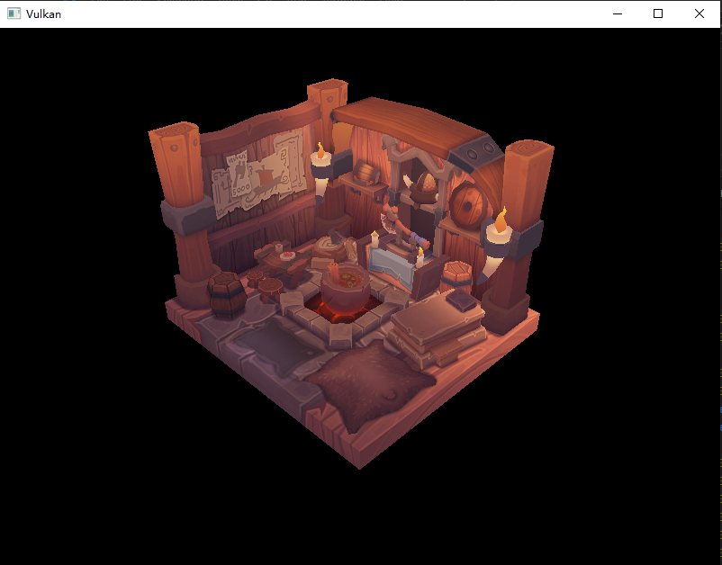

# **动态渲染**

## **前言**

**动态渲染\(Dynamic Rendering\)**是 Vulkan 1.3 引入的核心特性，允许开发者在命令缓冲录制阶段直接配置渲染目标和相关参数，无需提前创建渲染通道和帧缓冲对象。
这显著提高了开发灵活性。

但需要注意，动态渲染**不支持子通道**，因此无法在一次渲染过程中使用多个子通道（同时也不支持输入附件）。
因此，你必须使用图像内存屏障代替子通道依赖实现附件的布局转换。

> 关于动态渲染：[Vulkan-Guide \[dynamic rendering\]](https://docs.vulkan.org/samples/latest/samples/extensions/dynamic_rendering/README.html)

## **基础代码**

请下载并阅读下面的基础代码，这是“C++模块化“章节的第二部分代码，但使用了同步2语法：

**[点击下载](../../codes/04/00_cxxmodule/module_code2.zip)**

构建运行，将显示我们熟悉的房屋模型：



## **准备工作**

### 1. 启用设备特性

动态渲染在 Vulkan 1.2 中由扩展引入，在 1.3 中成为核心特性，但仍需显式启用设备特性。
请修改 `Device.cppm` 中的逻辑设备创建代码：

```cpp
device_create_info.get<vk::PhysicalDeviceVulkan13Features>()
    .setSynchronization2( true )
    .setDynamicRendering( true );
```

### 2. 删除渲染通道模块

由于动态渲染不需要渲染通道，因此可以删除 `RenderPass.cppm` 模块。
然后我们需要让相关模块去除对 `RenderPass` 的导入。


首先是 `GraphicsPipeline.cppm` 模块，需要删除渲染通道模块。
动态渲染在管线创建时无需渲染通道，但需要指定附件的格式，因此需要导入交换链和深度图像模块。

```cpp
// GraphicsPipeline.cppm
// import RenderPass; // 删除渲染通道
import Swapchain;   // 导入交换链
import DepthImage;  // 导入深度图像
...
// std::shared_ptr<vht::RenderPass> m_render_pass; 修改成员变量
std::shared_ptr<vht::Swapchain> m_swapchain;
std::shared_ptr<vht::DepthImage> m_depth_image;
...
... // 修改构造函数
```

然后是 `Drawer.cppm` 模块，同样需要删除渲染通道，然后加入深度图像模块。

```cpp
// Drawer.cppm
// import RenderPass; // 删除渲染通道
import DepthImage;    // 导入深度图像
...
std::shared_ptr<vht::DepthImage> m_depth_image{ nullptr }; // 修改成员变量
// std::shared_ptr<vht::RenderPass> m_render_pass{ nullptr };
...
std::shared_ptr<vht::DepthImage> depth_image, // 修改构造函数参数
// std::shared_ptr<vht::RenderPass> render_pass,
...
m_depth_image(std::move(depth_image)), // 修改构造函数的成员初始化列表
// m_render_pass(std::move(render_pass)),
```

最后修改 `App.cppm` 模块，删除渲染通道相关代码，并调整 `GraphicsPipeline` 和 `Drawer` 的创建函数，此处省略。

## **图形管线**

图形管线在创建时需要指定渲染通道，但现在没有渲染通道对象，因此我们需要修改相关代码。

转到 `GraphicsPipeline.cppm` 模块，修改管线创建函数。
现在没有渲染通道，需要给创建信息额外链接一个结构体：

```cpp
vk::StructureChain<
    vk::GraphicsPipelineCreateInfo,
    vk::PipelineRenderingCreateInfo
> create_info;
```

首先添加管线阶段信息，这些内容和之前一样：

```cpp
create_info.get()
    .setLayout( m_pipeline_layout )
    .setStages( shader_stages )
    .setPDynamicState( &dynamic_state )
    .setPVertexInputState( &vertex_input )
    .setPInputAssemblyState( &input_assembly )
    .setPViewportState( &viewport_state )
    .setPDepthStencilState( &depth_stencil )
    .setPRasterizationState( &rasterizer )
    .setPMultisampleState( &multisampling )
    .setPColorBlendState( &color_blend );
```

注意我们没有添加渲染通道和子通道字段。

然后需要填写第二个参数，它包含所有附件的图像格式：

```cpp
vk::Format color_format = m_swapchain->format();
vk::Format depth_format = m_depth_image->format();
create_info.get<vk::PipelineRenderingCreateInfo>()
    .setColorAttachmentFormats( color_format )
    .setDepthAttachmentFormat( depth_format );
```

注意颜色附件格式可以设置多个，对应多个颜色附件。深度格式只能设置一个，因为只允许一个深度附件。
此处还省略了模板格式和 `ViewMask` 字段，你可以自行了解它们的用处。

最后调整管线的创建函数：

```cpp
m_pipeline = m_device->device().createGraphicsPipeline( nullptr, create_info.get() );
```

## **深度图像格式**

前言部分替代，动态渲染不支持自动转换布局，因此我们需要使用图像内存屏障来手动转换两个图像（交换链和深度图）的布局。

交换链图像需要频繁转换，因此我们将它留到后面的命令录制中处理。而深度图像的布局是固定的，因此可以在创建时就为其转换布局。

首先修改 `Tools.cppm` 模块的 `transition_image_layout` 函数，我们需要传递 `ImageAspectFlags` 参数，且让它支持深度图像的布局转换。

```cpp
void transition_image_layout(
    ... // 其他参数保持不变
    // 添加 ImageAspectFlags 参数，此处设置默认参数避免其他模块修改
    const vk::ImageAspectFlags aspect_flags = vk::ImageAspectFlagBits::eColor 
) {
    const auto command_buffer = begin_command(command_pool, device);

    vk::ImageMemoryBarrier2 barrier2;
    ...
    barrier2.subresourceRange = {
        aspect_flags,   // 使用 ImageAspectFlags 参数
        0, 1, 0, 1
    };

    ......
    } else if ( //  允许图像从 Undefined 转换为 AttachmentOptimal
        oldLayout == vk::ImageLayout::eUndefined &&
        newLayout == vk::ImageLayout::eAttachmentOptimal
    ) {
        barrier2.srcStageMask = vk::PipelineStageFlagBits2::eNone;
        barrier2.srcAccessMask = vk::AccessFlagBits2::eNone;
        barrier2.dstStageMask = vk::PipelineStageFlagBits2::eEarlyFragmentTests;
        barrier2.dstAccessMask = vk::AccessFlagBits2::eDepthStencilAttachmentWrite;
    }else {
        throw std::invalid_argument("unsupported layout transition!");
    }
    ......
}
```

然后转到 `DepthImage.cppm` 模块，修改 `create_depth_resources` 函数，在图像和图像视图创建后转换图像布局：

```cpp
import CommandPool; // 导入命令池模块
...
class DepthImage {
    ... // 添加成员变量
    std::shared_ptr<vht::CommandPool> m_command_pool{ nullptr };
    ...
public:
    explicit DepthImage(
        ... // 修改构造函数
        std::shared_ptr<vht::CommandPool> command_pool
    ):  ...
        m_command_pool(std::move(command_pool)) {
        init();
    }
    
    ......
    
    // 创建深度图像和视图
    void create_depth_resources() {
        ......
        // 转换图像布局
        transition_image_layout(
            m_command_pool->pool(),
            m_device->device(),
            m_device->graphics_queue(),
            m_image,
            vk::ImageLayout::eUndefined,
            vk::ImageLayout::eAttachmentOptimal, // 使用同步2提供的自动布局
            vk::ImageAspectFlagBits::eDepth // 传递深度图像的 aspect
        );
    }
};
```

然后需要修改 `App.cppm` 模块，为深度图像传入命令池对象。

注意，现在命令池的创建晚于深度图像，因此你需要将命令池的创建移动到深度图像创建之前。

```cpp
init_command_pool(); // 前移命令池的创建
std::println("command pool created");
init_depth_image();
std::println("depth image created");
// App.cppm 的其他修改省略，只需为 `DepthImage` 传入命令池对象即可
```

## **命令录制**

现在可以修改命令录制，转到 `Drawer.cppm` 模块，修改 `record_command_buffer` 函数。

动态渲染使用 `RenderingAttachmentInfo` 结构体绑定附件：

```cpp
// 设置颜色附件
vk::RenderingAttachmentInfo color_attachment;
color_attachment.setImageView( m_swapchain->image_views()[image_index] );
color_attachment.setImageLayout( vk::ImageLayout::eColorAttachmentOptimal );
color_attachment.setLoadOp( vk::AttachmentLoadOp::eClear );
color_attachment.setStoreOp( vk::AttachmentStoreOp::eStore );
color_attachment.setClearValue( vk::ClearColorValue{ 0.0f, 0.0f, 0.0f, 1.0f } );

// 设置深度附件
vk::RenderingAttachmentInfo depth_attachment;
depth_attachment.setImageView( m_depth_image->image_view() );
depth_attachment.setImageLayout( vk::ImageLayout::eDepthAttachmentOptimal );
depth_attachment.setLoadOp( vk::AttachmentLoadOp::eClear );
depth_attachment.setStoreOp( vk::AttachmentStoreOp::eDontCare );
depth_attachment.setClearValue( vk::ClearDepthStencilValue{ 1.0f, 0 } );
```

注意到我们没有设置 `stencilLoadOp/stencilStoreOp` ，这两个字段已经被合并到了 `loadOp/storeOp` 中。
模板/深度附件的 `loadOp/storeOp` 会自动作用于深度和模板两个分量。

动态渲染的开始/结束函数也进行了调整，使用 `beginRendering/endRendering` 函数和  `RenderingInfo` 结构体：

```cpp
vk::RenderingInfo render_info;
render_info.setRenderArea( vk::Rect2D{ vk::Offset2D{0, 0}, m_swapchain->extent() } );
render_info.setLayerCount( 1 );
render_info.setColorAttachments( color_attachment );
render_info.setPDepthAttachment( &depth_attachment );
// render_info.setPStencilAttachment( nullptr ); // 设置模板附件

command_buffer.beginRendering( render_info ); // 开始渲染

...

command_buffer.endRendering(); // 结束渲染
```

## **布局转换**

动态渲染不需要子通道，因此它自身的配置简化了很多。
但是，我们现在需要手动处理图像布局的转换，即交换链图像的布局（深度图像布局我们刚才已经处理了）。

首先在渲染开始前，需要将交换链布局转换为颜色附件布局，注意要放在渲染开始前：

```cpp
command_buffer.begin( vk::CommandBufferBeginInfo{} );

vk::ImageMemoryBarrier2 color_barrier;
color_barrier.setImage( m_swapchain->images()[image_index] );
color_barrier.setOldLayout( vk::ImageLayout::eUndefined );
color_barrier.setNewLayout( vk::ImageLayout::eAttachmentOptimal );
color_barrier.setSrcStageMask( vk::PipelineStageFlagBits2::eColorAttachmentOutput ); // 等待之前的色彩操作
color_barrier.setSrcAccessMask( vk::AccessFlagBits2::eNone );   // 等待全部阶段
color_barrier.setDstStageMask( vk::PipelineStageFlagBits2::eColorAttachmentOutput ); // 然后可以开始本次写入
color_barrier.setDstAccessMask( vk::AccessFlagBits2::eColorAttachmentWrite );
color_barrier.setSubresourceRange( { vk::ImageAspectFlagBits::eColor, 0, 1, 0, 1 } );
color_barrier.srcQueueFamilyIndex = vk::QueueFamilyIgnored; // 忽略队列族所有权的转移
color_barrier.dstQueueFamilyIndex = vk::QueueFamilyIgnored;
            
vk::DependencyInfo dependency_info;
dependency_info.setImageMemoryBarriers( color_barrier );
command_buffer.pipelineBarrier2( dependency_info );
// ↑ 放在渲染开始前
...
command_buffer.beginRendering( render_info ); // 开始渲染
```

在渲染结束后，需要将交换链图像转换成呈现布局：

```cpp
command_buffer.endRendering();  // 结束渲染

vk::ImageMemoryBarrier2 present_barrier;
present_barrier.setImage( m_swapchain->images()[image_index] );
present_barrier.setOldLayout( vk::ImageLayout::eAttachmentOptimal );
present_barrier.setNewLayout( vk::ImageLayout::ePresentSrcKHR );    // 转换为呈现布局
present_barrier.setSrcStageMask( vk::PipelineStageFlagBits2::eColorAttachmentOutput ); // 等待色彩写入完成
present_barrier.setSrcAccessMask( vk::AccessFlagBits2::eColorAttachmentWrite );
present_barrier.setDstStageMask( vk::PipelineStageFlagBits2::eNone );   // 后续没有其他阶段
present_barrier.setDstAccessMask( vk::AccessFlagBits2::eNone );
present_barrier.setSubresourceRange( { vk::ImageAspectFlagBits::eColor, 0, 1, 0, 1 } );
present_barrier.setSrcQueueFamilyIndex( vk::QueueFamilyIgnored );
present_barrier.setDstQueueFamilyIndex( vk::QueueFamilyIgnored );
            
vk::DependencyInfo present_dependency;
present_dependency.setImageMemoryBarriers( present_barrier );

command_buffer.pipelineBarrier2( present_dependency );  //  提交管线屏障

command_buffer.end();
```

## **重建交换链**

还有最后一件事，我们删除了渲染通道模块，然依然需要重建交换链。
因此，我们需要在 `Drawer.cppm` 模块中重写一个重建交换链函数，并替换 `draw()` 中的标识符：

```cpp
import glfw;
...
void recreate_swapchain() const {
    int width = 0, height = 0;
    glfw::get_framebuffer_size(m_window->ptr(), &width, &height);
    while (width == 0 || height == 0) {
        glfw::get_framebuffer_size(m_window->ptr(), &width, &height);
        glfw::wait_events();
    }
    m_device->device().waitIdle();

    m_swapchain->recreate();
    m_depth_image->recreate();

    m_window->reset_framebuffer_resized();
}
...
// 修改 draw() 函数中的重建交换链代码，使用 recreate_swapchain()
```

## **最后**

现在运行代码，应该可以看到和之前一样的房屋模型。


动态渲染除了不需要提前创建渲染通道和帧缓冲外，还有一些强大的功能，你可以自行学习。

比如它还能通过 `RenderingInfo` 的 `flags` 字段来实现一些特殊功能，如录制次级命令缓冲、挂起与恢复，这在多线程渲染中非常有用。

---

**[基础代码](../../codes/04/00_cxxmodule/module_code2.zip)**

**[Device.cppm（修改）](../../codes/04/21_dynamicrendering/Device.cppm)**

**[Device.diff（差异文件）](../../codes/04/21_dynamicrendering/Device.diff)**

**[Drawer.cppm（修改）](../../codes/04/21_dynamicrendering/Drawer.cppm)**

**[Drawer.diff（差异文件）](../../codes/04/21_dynamicrendering/Drawer.diff)**

**[GraphicsPipeline.cppm（修改）](../../codes/04/21_dynamicrendering/GraphicsPipeline.cppm)**

**[GraphicsPipeline.diff（差异文件）](../../codes/04/21_dynamicrendering/GraphicsPipeline.diff)**

**[DepthImage.cppm（修改）](../../codes/04/21_dynamicrendering/DepthImage.cppm)**

**[DepthImage.diff（差异文件）](../../codes/04/21_dynamicrendering/DepthImage.diff)**

**[Tools.cppm（修改）](../../codes/04/21_dynamicrendering/Tools.cppm)**

**[Tools.diff（差异文件）](../../codes/04/21_dynamicrendering/Tools.diff)**

**[App.cppm（修改）](../../codes/04/21_dynamicrendering/App.cppm)**

**[App.diff（差异文件）](../../codes/04/21_dynamicrendering/App.diff)**

---
