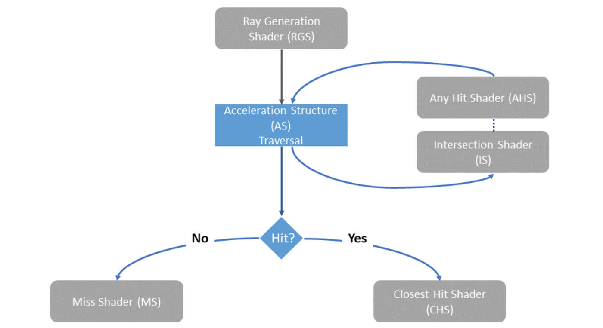

# **其他内容**

现在您已掌握了 Vulkan 的许多基础功能，但还有一部分重要内容尚未涉及。

本节将简要介绍建议您自行学习的内容，以此作为文档的结束部分。

## **多管线渲染**

### 1. 多个渲染通道

以“**阴影映射**”为例，你可以创建两个渲染通道，每个渲染通道都是单个子通道，各绑定一个图形管线。

第一个管线以光源视角渲染深度图，然后第二个管线渲染以摄像机视角渲染场景并通过深度图绘制阴影。

### 2. 多个子通道

你可以通过单个渲染通道，两个子通道，实现简单的“**延迟渲染**”。

第一个通道仅处理色彩、法线、坐标等信息（甚至不需要片段着色器），将这些内容放在图像附件中。
在第二个通道中使用一个覆盖摄像机的三角形，从而对每个像素调用一次片段着色器，在片段着色器中通过图像附件的信息计算光照并输出最终图像。

第一个子通道输出的图像附件可以作为第二个子通道的“**输入附件**”，这也是渲染通道的一个重要概念。

### 3. 模板测试

我们在深度缓冲章节提到过模板测试，它的“使用方式”并不复杂，但用法却非常多样。

你可以尝试使用模板测试实现一个小的“**镜面区域**”。
第一次渲染时从摄像机视角渲染场景、并通过模板测试标记镜面区域，第二次渲染时以镜面摄像机视角渲染场景、填充镜面区域。。

## **多线程渲染**

GPU 在处理计算和渲染任务时本身就是并行的，因此多线程渲染指的是 CPU 上程序的多线程，

### 1. 次级命令缓冲

从命令池中分配命令缓冲时有一个 `level` 参数，可以是 `ePrimary` 或 `eSecondary`。
次级命令缓冲的 `level` 为 `eSecondary` ，它不能直接提交，但可以作为主命令缓冲的一部分进行提交。

这样的好处是你可以将命令缓冲录制的内容“模块化”，在命令需要修改时无需全部重新录制，可以复用未修改的次级命令缓冲。

### 2. 并行命令录制

图形程序（特别是游戏开发）需要充分利用硬件资源，主机端的多线程是很常见的做法。

Vulkan 的命令池并不是线程安全的，一般建议每个录制线程拥有独立的命令池，并从自身的命令池中分配命令缓冲并录制，避免交替使用。

虽然录制与分配是线程独立的，但往往需要将不同命令缓冲提交到同一队列，此时必须进行显式的同步以保证提交顺序正确。

## **性能优化**

### 1. 间接绘制

之前的程序中，我们需要在主机端、在命令缓冲录制时指定绘制所需的顶点、实例等内容。

而**间接渲染**是一种通过 GPU 缓冲区传递渲染参数的技术，它允许渲染命令的参数（如顶点数量、实例数量等）存储在 GPU 内存的缓冲区中，而非由 CPU 直接提供。
这种方式减少了 CPU 与 GPU 之间的同步开销，尤其适用于动态或 GPU 生成渲染参数的场景。

### 2. 稀疏资源

**稀疏资源**是 Vulkan 中一种高级内存管理技术，它允许应用程序部分分配资源（如纹理、缓冲区）的内存，而不是一次性全部分配。
这种技术特别适合处理超大尺寸资源或需要动态内存管理的场景。

### 3. 内存分配器

在之前的章节中我们提过不应该为每个缓冲区申请独立的内存块，而应该设计一个内存分配器。

Vulkan SDK 内置了 `Vulkan-Memory-Allocator` 库，你可以学习使用它（或对应的 C++ 封装库），并尝试自己写一个简单的内存分配器。

## **离屏渲染**

此处仅代指最简单的**离屏渲染**，不需要窗口集成系统，直接将图像渲染后保存为图片。

你可以尝试去除交换链、窗口表面等内容，使用手动创建的图像与图像视图作为渲染的输出附件，然后将内存中的图像资源保持为本地文件。

此外，还可以尝试一些图像域上的操作，以及尝试启用 HDR 。

## **着色器进阶**

### 1. 几何着色器

几何着色器是传统图形管线的一个可编程阶段，它可以将输入的图元进行简化或者扩充，实现更加粗糙或细节的几何体。显然前者可以降低渲染开销，而后者可以改善渲染效果。

### 2. 细分着色器

细分着色器是 Vulkan 图形管线中用于动态生成几何细节的可编程阶段，它位于顶点着色器之后、几何着色器之前，能够根据**简单控制点**生成复杂曲面。

细分着色器分为三个部分，控制、生成与域着色器。
控制点着色器主要用于设置细分参数，生成器是固定阶段、根据细分参数**自动**细分生成域点，最后的域着色器根据域点输出最终控制点。

### 3. 任务与网格着色器

任务-网格着色器是 Vulkan 1.2 引入的现代 GPU 编程模型，它彻底重构了传统图形管线，取代了顶点着色器/几何着色器/细分着色器体系。

需要注意这通常仅用于间接渲染。

## **计算着色器进阶**

### 1. 原子操作

计算着色器的“调用”是并行的，但有时存在修改同一变量的需求。
此时可以借助一些“原子操作"函数，避免数据竞争。

### 2. 共享内存

共享内存是计算着色器中工作组成员间高速通信的关键机制，类似“全局变量”，但通常位于 GPU 片上缓存，比全局内存访问快得多。

注意共享内存仅在单个计算工作组内共享。

### 3. 子组操作

子组\(Subgroup\)是 Vulkan 中表示 GPU 执行并行计算的最小逻辑单元，通常对应硬件上的 SIMD 执行单元。

正确使用子组操作可以显著提过计算着色器效率。

## **光线追踪**

Vulkan 的光线追踪主要由三部分组成：加速结构、光追管线、着色器绑定表。

加速结构用于为几何体生成 BVH 等结构加速光线的碰撞查询。  
光追管线包含多种着色器，用于处理光线碰撞、反射、未命中和递归等逻辑。  
着色器绑定表用于连接几何体和着色器，以在不同几何体中使用不同的着色器。

## **多视口渲染**

顾名思义，在单个渲染通道中同时向多个视口\(Viewport\)或裁剪区域渲染内容，这是 VR/AR 渲染、分屏游戏和高级可视化应用的关键技术。

---
