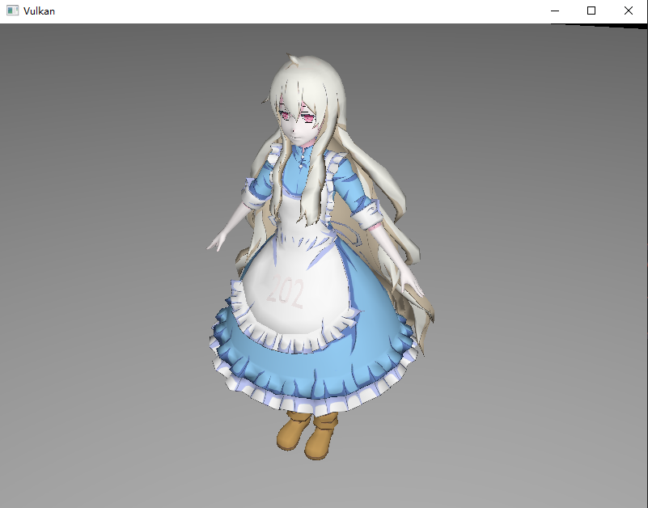

# **延迟渲染**

## **前言**

在绘制每个物体（的片段）时完成对应的光照计算，这种方法称为 **前向渲染\(forward rendering\)** ，也就是我们上一节的做法。

此方法有个问题，片段着色器后存在深度测试，很多片段会被丢弃。光照计算的消耗通常较高，对这些会被丢弃的片段进行光照计算是很浪费性能的。

**延迟渲染\(deferred rendering\)**的做法是进行两次渲染，第一次将片段的基础色彩、法线和坐标等信息渲染（存储）到输出的颜色附件中，第二次渲染直接读取附件内容进行光照计算。
第一次渲染的结果图像们被称为 **G-Buffer\(几何缓冲区\)** ，仅包含通过深度测试的片段的信息，从而减少光照计算的次数。

第一个管线的输出图像将直接作为第二个管线的输入附件（下面会为您介绍），因此我们可以使用单个渲染通道、两个子通道。

## **基础代码**

请下载并阅读下面的基础代码，此基础代码和上一节的基础代码相似，但提供了 G-Buffer ：

**[点击下载](../../codes/04/21_deferred/0421_base_code.zip)**

G-Buffer 是延迟渲染的核心，它并非实际的缓冲区对象，而是多个图像附件的集合。

第二次渲染不依赖顶点数据，因此我们需要在 G-Buffer 中存储每个片段对应的世界坐标、法线、颜色和材质等信息。
本章为了简化内容，不记录材质信息（你可以自行添加），因此需要三个图像分别存储其他三种数据。

基础代码中已经提供了 `GBuffer.cppm` 模块，请你自行阅读并重点关注以下内容：

- 图像格式
- 图像的 `usage` 字段
- 图像视图的 `AspectFlag` 字段

运行程序并移动摄像机，你将看到以下场景：


## **输入附件**

Vulkan 渲染通道中的“**输入附件\(Input Attachment\)**“是一种特殊的附件类型，允许在同一个渲染通道的不同子通道之间高效传递图像数据。比如：

- 在第一个子通道中将渲染结果写入附件（如颜色或深度）。
- 在后续子通道中，将该附件作为“输入附件”读取，直接在着色器中访问，无需显式采样。

着色器中可以通过 `input_attachment_index` 关键字指定输入附件的索引，像这样使用：

```glsl
layout(input_attachment_index = 0, set = 0, binding = 0) uniform subpassInput gBuffer;
void main() {
    vec4 data = subpassLoad(gBuffer);
    // 使用 data 进行后续处理
}
```

注意到它直接使用 `subpassLoad` 读取而没有任何索引，这就是输入附件的特性，它读取的直接就是附件中对应当前片段位置的数据。

我们需要在渲染通道中指定附件的类型是输入附件，但这还不够，后续还需要为其分配描述符集。

## **渲染通道**

我们需要在渲染通道中创建两个子通道，第一个子通道用于渲染 G-Buffer，第二个子通道用于光照计算。
然后设置渲染通道的附件，并为两个子通道指定需要的附件和子通道依赖。

### 1. 添加附件描述

基础代码已为渲染通道注入了 GBuffer 的依赖，可以直接修改 `create_render_pass` 函数。
首先创建三个新的附件描述，分别对应、法线和世界坐标：

```cpp
vk::AttachmentDescription g_pos_attachment;
g_pos_attachment.format = m_g_buffer->pos_format();
g_pos_attachment.samples = vk::SampleCountFlagBits::e1;
g_pos_attachment.loadOp = vk::AttachmentLoadOp::eClear;
g_pos_attachment.storeOp = vk::AttachmentStoreOp::eDontCare; // 渲染通道内部使用，不需要 Store
g_pos_attachment.stencilLoadOp = vk::AttachmentLoadOp::eDontCare;
g_pos_attachment.stencilStoreOp = vk::AttachmentStoreOp::eDontCare;
g_pos_attachment.initialLayout = vk::ImageLayout::eUndefined;
// 最终布局设为最后一个子通道使用时的布局，减少转换开销
g_pos_attachment.finalLayout = vk::ImageLayout::eShaderReadOnlyOptimal;

vk::AttachmentDescription g_color_attachment;
g_color_attachment.format = m_g_buffer->color_format();
g_color_attachment.samples = vk::SampleCountFlagBits::e1;
g_color_attachment.loadOp = vk::AttachmentLoadOp::eClear;
g_color_attachment.storeOp = vk::AttachmentStoreOp::eDontCare;
g_color_attachment.stencilLoadOp = vk::AttachmentLoadOp::eDontCare;
g_color_attachment.stencilStoreOp = vk::AttachmentStoreOp::eDontCare;
g_color_attachment.initialLayout = vk::ImageLayout::eUndefined;
g_color_attachment.finalLayout = vk::ImageLayout::eShaderReadOnlyOptimal;

vk::AttachmentDescription g_normal_depth_attachment;
g_normal_depth_attachment.format = m_g_buffer->normal_depth_format();
g_normal_depth_attachment.samples = vk::SampleCountFlagBits::e1;
g_normal_depth_attachment.loadOp = vk::AttachmentLoadOp::eClear;
g_normal_depth_attachment.storeOp = vk::AttachmentStoreOp::eDontCare;
g_normal_depth_attachment.stencilLoadOp = vk::AttachmentLoadOp::eDontCare;
g_normal_depth_attachment.stencilStoreOp = vk::AttachmentStoreOp::eDontCare;
g_normal_depth_attachment.initialLayout = vk::ImageLayout::eUndefined;
g_normal_depth_attachment.finalLayout = vk::ImageLayout::eShaderReadOnlyOptimal;
```

三个附件描述的内容几乎一样，只有格式不同。

因为附件只在渲染通道内部的两个子通道中使用，我们不关心渲染通道外如何，所以 `storeOp` 都设置为 `DontCare` 。
最终布局同样不影响效果，我们使用 `ShaderReadOnlyOptimal` ，因为后面的第二个子通道会将布局转换成它，设为同样的布局可以减少转换开销。

### 2. 子通道附件引用

现在添加子通道的附件引用，分别对应三个附件：

```cpp
// 用于第一个子通道的附件引用
vk::AttachmentReference g_pos_out_ref;
g_pos_out_ref.attachment = 2; // 后续附件绑定到帧缓冲的实际索引
g_pos_out_ref.layout = vk::ImageLayout::eColorAttachmentOptimal;
vk::AttachmentReference g_color_out_ref;
g_color_out_ref.attachment = 3;
g_color_out_ref.layout = vk::ImageLayout::eColorAttachmentOptimal;
vk::AttachmentReference g_normal_depth_out_ref;
g_normal_depth_out_ref.attachment = 4;
g_normal_depth_out_ref.layout = vk::ImageLayout::eColorAttachmentOptimal;
// 用于第二个子通道的附件引用
vk::AttachmentReference g_pos_input_ref;
g_pos_input_ref.attachment = 2;
g_pos_input_ref.layout = vk::ImageLayout::eShaderReadOnlyOptimal;
vk::AttachmentReference g_color_input_ref;
g_color_input_ref.attachment = 3;
g_color_input_ref.layout = vk::ImageLayout::eShaderReadOnlyOptimal;
vk::AttachmentReference g_normal_depth_input_ref;
g_normal_depth_input_ref.attachment = 4;
g_normal_depth_input_ref.layout = vk::ImageLayout::eShaderReadOnlyOptimal;
```

注意到第一个子通道的附件引用使用 `ColorAttachmentOptimal` 布局，而第二个子通道的附件引用使用 `ShaderReadOnlyOptimal` 布局，且它们实际引用同一组附件。

### 3. 绑定帧缓冲

现在需要把实际的图像资源绑定到帧缓冲区，修改 `create_framebuffers` 函数中的 `attachments` ：

```cpp
std::array<vk::ImageView, 5> attachments {
    image_view,
    m_depth_image->image_view(),
    m_g_buffer->pos_views(),
    m_g_buffer->color_views(),
    m_g_buffer->normal_depth_views()
};
```

这里的资源顺序需要严格对应附件引用的 `attachment` 字段。
我们的呈现保证同一时间只有一组绘制命令在执行，因此只需要一组 G-Buffer 资源。

### 4. 创建子通道

删除原先的子通道创建代码，添加两个新的子通道：

```cpp
std::array<vk::SubpassDescription,2> subpasses;
// 第一个子通道 生成 G-Buffer
subpasses[0].pipelineBindPoint = vk::PipelineBindPoint::eGraphics;
const auto first_attachments = { g_pos_out_ref, g_color_out_ref, g_normal_depth_out_ref };
subpasses[0].setColorAttachments( first_attachments );
subpasses[0].setPDepthStencilAttachment( &depth_attachment_ref );
// 第二个子通道 进行光照计算
subpasses[1].pipelineBindPoint = vk::PipelineBindPoint::eGraphics;
const auto second_attachments = { g_pos_input_ref, g_color_input_ref, g_normal_depth_input_ref };
subpasses[1].setInputAttachments( second_attachments );
subpasses[1].setColorAttachments( color_attachment_ref );
```

第一个子通道需要使用深度缓冲区过滤无效片段，然后将信息写入三个色彩附件。
而第二个子通道使用输入附件接受三个附件数据，并将光照结果写入交换链图像对应的颜色附件。

然后设置子通道依赖：

```cpp
std::array<vk::SubpassDependency,2> dependencies;
dependencies[0].srcSubpass = vk::SubpassExternal;
dependencies[0].srcStageMask = vk::PipelineStageFlagBits::eFragmentShader;
dependencies[0].srcAccessMask = {};
dependencies[0].dstSubpass = 0;
dependencies[0].dstStageMask = vk::PipelineStageFlagBits::eEarlyFragmentTests;
dependencies[0].dstAccessMask = vk::AccessFlagBits::eDepthStencilAttachmentWrite;
dependencies[1].srcSubpass = 0;
dependencies[1].srcStageMask = vk::PipelineStageFlagBits::eColorAttachmentOutput;
dependencies[1].srcAccessMask = vk::AccessFlagBits::eColorAttachmentWrite;
dependencies[1].dstSubpass = 1;
dependencies[1].dstStageMask = vk::PipelineStageFlagBits::eFragmentShader;
dependencies[1].dstAccessMask = vk::AccessFlagBits::eInputAttachmentRead;
```

需要等待外部子通道（上一次渲染）的片段着色器执行完成，即附件使用完毕，才可转换它们的布局。
第一个子通道写入颜色后，才能开始第二个子通道的光照计算（读取输入附件）。

然后可以创建渲染通道：

```cpp
const auto attachments = {
    color_attachment,
    depth_attachment,
    g_pos_attachment,
    g_color_attachment,
    g_normal_depth_attachment
};
vk::RenderPassCreateInfo create_info;
create_info.setAttachments( attachments );
create_info.setSubpasses( subpasses );
create_info.setDependencies( dependencies );
```

`attachments` 内的附件描述顺序同样要与帧缓冲区的 `attachments` 顺序严格对应。

### 5. 图像重建

还需要修改 `recreate` 函数，只需在深度图像重建后重建 GBuffer 资源：

```cpp
m_framebuffers.clear();
m_swapchain->recreate();
m_depth_image->recreate();
m_g_buffer->recreate(); // 在深度图像重建语句的下方
create_framebuffers();
```

## **着色器**

现在需要修改原有的着色器代码，并添加新管线的着色器代码。

### 1. 修改原有着色器

首先修改 `shader.frag` 片段着色器，需要向颜色混合附件输出世界坐标等消息：

```glsl
#version 450

layout(push_constant) uniform PushConstants {
    int enableTexture;
} pc;

layout(binding = 1) uniform sampler2D texSampler;

// layout(std140, binding = 2) uniform LightUBO 移除光源内容

layout(location = 0) in vec3 fragPos;
layout(location = 1) in vec3 fragNormal;
layout(location = 2) in vec2 fragTexCoord;
layout(location = 3) in float fragNa;   // 无用
layout(location = 4) in vec3 fragKa;    // 无用
layout(location = 5) in vec3 fragKd;    // 无用
layout(location = 6) in vec3 fragKs;    // 无用

layout(location = 0) out vec4 outPosition;
layout(location = 1) out vec4 outColor;
layout(location = 2) out vec4 outNormalDepth;

void main() {
    // 根据推送常量决定是否采样纹理
    vec3 objectColor = pc.enableTexture == 1 ? texture(texSampler, fragTexCoord).rgb : vec3(0.5, 0.5, 0.5);
    outColor = vec4(objectColor, 1.0);
    outPosition = vec4(fragPos, 1.0);
    outNormalDepth = vec4(fragNormal, 1.0); //第四位 深度信息此处不用
}
```

可以看到第一个管线所做的事情非常简单，它将片段的世界坐标、颜色和法线等信息输出到三个颜色附件中。
我们没有用到材质信息，你可以自行扩展。

### 2. 添加新顶点着色器

然后添加第二个管线的顶点着色器 `second.vert` 。我们不需要任何输入，因此直接选择屏幕的端点，后续通过六个顶点绘制整个屏幕：

```glsl
#version 450

// 通过两个三角形，绘制整个屏幕
// 注意顶点顺序
vec2 output_position[6] = vec2[](
vec2(-1.0, -1.0),
vec2(1.0, 1.0),
vec2(1.0, -1.0),
vec2(-1.0, -1.0),
vec2(-1.0, 1.0),
vec2(1.0, 1.0)
);

void main() {
    gl_Position =vec4(output_position[gl_VertexIndex], 0.5, 1.0);
}
```

### 3. 添加新片段着色器

然后添加第二个片段着色器 `second.frag` ，它将读取 G-Buffer 中的内容进行光照计算：

```glsl
#version 450

layout(std140, binding = 0) uniform LightUBO {
    vec3 lightPos;
    vec3 lightColor;
    vec3 viewPos;
} ubo;

layout(input_attachment_index = 0, binding = 1) uniform subpassInput g_buffer[3];

layout(location = 0) out vec4 outColor;

void main() {
    vec3 pos = subpassLoad(g_buffer[0]).xyz;        // 片段位置
    vec3 color = subpassLoad(g_buffer[1]).rgb;      // 片段颜色
    vec3 normal = subpassLoad(g_buffer[2]).xyz;     // 法线

    // 视角方向
    vec3 viewDir = normalize(ubo.viewPos - pos);

    // 环境光强
    vec3 ambient = 0.15 * ubo.lightColor;

    // 漫反射
    vec3 lightDir = normalize(ubo.lightPos - pos);
    float diff = max(dot(normal, lightDir), 0.0);
    vec3 diffuse = diff * 0.8 * ubo.lightColor;

    // 镜面反射
    vec3 reflectDir = reflect(-lightDir, normal);
    float spec = pow(max(dot(viewDir, reflectDir), 0.0), 512);
    vec3 specular = spec * 0.3 * ubo.lightColor;

    // 最终色彩
    vec3 result = (ambient + diffuse + specular) * color;
    result = min(result, vec3(1.0));
    outColor = vec4(result, 1.0);
}
```

光照计算此处不再赘述，注意我们将光源信息放在了此着色器，后续需要修改描述符布局。

### 4. CMake脚本

最后修改 `shaders` 目录下的 `CMakeLists.txt` ，添加着色器的自动编译：

```cmake
# ...

set(VERT_SECOND ${SHADER_DIR}/second.vert)
set(FRAG_SECOND ${SHADER_DIR}/second.frag)

# ...

set(SPIRV_SECOND_VERT ${SHADER_DIR}/second_vert.spv)
set(SPIRV_SECOND_FRAG ${SHADER_DIR}/second_frag.spv)

# ......

add_custom_command(
        OUTPUT ${SPIRV_SECOND_VERT}
        COMMAND ${Vulkan_GLSLC_EXECUTABLE} ${VERT_SECOND} -o ${SPIRV_SECOND_VERT}
        COMMENT "Compiling shader.vert to vert.spv"
        DEPENDS ${VERT_SECOND}
)

add_custom_command(
        OUTPUT ${SPIRV_SECOND_FRAG}
        COMMAND ${Vulkan_GLSLC_EXECUTABLE} ${FRAG_SECOND} -o ${SPIRV_SECOND_FRAG}
        COMMENT "Compiling shader.frag to frag.spv"
        DEPENDS ${FRAG_SECOND}
)

add_custom_target(CompileShaders ALL
    DEPENDS ${SPIRV_VERT} ${SPIRV_FRAG} ${SPIRV_SECOND_VERT} ${SPIRV_SECOND_FRAG}
)
```

## **修改图形管线**

回到 `GraphicsPipeline.cppm` 模块，修改原有的管线创建代码。 

### 1. 修改旧管线

首先修改描述符布局 `create_descriptor_set_layout` 函数，删除光源的描述符：

```cpp
// 删除 light_ubo_layout_binging
// vk::DescriptorSetLayoutBinding light_ubo_layout_binging;

const auto bindings = { ubo_layout_binging, sampler_layout_binding };
```

还需要修改管线创建代码，增加颜色混合阶段的附件数量：

```cpp
std::array<vk::PipelineColorBlendAttachmentState, 3> color_blend_attachments;
for (auto& att : color_blend_attachments) {
    att.blendEnable = false;
    att.colorWriteMask = vk::FlagTraits<vk::ColorComponentFlagBits>::allFlags;
}

vk::PipelineColorBlendStateCreateInfo color_blend;
color_blend.logicOpEnable = false;
color_blend.logicOp = vk::LogicOp::eCopy;
color_blend.setAttachments( color_blend_attachments );
```

### 2. 添加新管线

首先添加新成员变量：

```cpp
vk::raii::DescriptorSetLayout m_second_descriptor_set_layout{ nullptr };
vk::raii::PipelineLayout m_second_pipeline_layout{ nullptr };
vk::raii::Pipeline m_second_pipeline{ nullptr };
...
[[nodiscard]]
const vk::raii::DescriptorSetLayout& second_descriptor_set_layout() const { return m_second_descriptor_set_layout; }
[[nodiscard]]
const vk::raii::PipelineLayout& second_pipeline_layout() const { return m_second_pipeline_layout; }
[[nodiscard]]
const vk::raii::Pipeline& second_pipeline() const { return m_second_pipeline; }
```

添加新的描述符布局创建函数：

```cpp
void init() {
    create_descriptor_set_layout();
    create_graphics_pipeline();
    create_second_descriptor_set_layout();
}
void create_second_descriptor_set_layout() {
    vk::DescriptorSetLayoutBinding light_ubo_layout_binging;
    light_ubo_layout_binging.binding = 0;
    light_ubo_layout_binging.descriptorType = vk::DescriptorType::eUniformBuffer;
    light_ubo_layout_binging.descriptorCount = 1;
    light_ubo_layout_binging.stageFlags = vk::ShaderStageFlagBits::eFragment;
    vk::DescriptorSetLayoutBinding input_layout_binging; // 输入附件绑定
    input_layout_binging.binding = 1;
    input_layout_binging.descriptorType = vk::DescriptorType::eInputAttachment;
    input_layout_binging.descriptorCount = 3; // 有三个输入附件
    input_layout_binging.stageFlags = vk::ShaderStageFlagBits::eFragment;
    const auto bindings = { light_ubo_layout_binging, input_layout_binging };
    vk::DescriptorSetLayoutCreateInfo layoutInfo;
    layoutInfo.setBindings( bindings );
    m_second_descriptor_set_layout = m_device->device().createDescriptorSetLayout( layoutInfo );
}
```

第一个描述符集用于光源信息，第二个描述符集用于输入附件。
我们有三个输入附件，因此需要三个输入附件绑定描述符。

然后可以创建新管线，管线创建代码与原有管线类似：但不需要顶点输入和深度测试：

```cpp
void init() {
    create_descriptor_set_layout();
    create_graphics_pipeline();
    create_second_descriptor_set_layout();
    create_second_graphics_pipeline();
}
void create_second_graphics_pipeline() {
    // 着色器阶段
    const auto vertex_shader_code = vht::read_shader("shaders/second_vert.spv");
    const auto fragment_shader_code = vht::read_shader("shaders/second_frag.spv");
    const auto vertex_shader_module = vht::create_shader_module(m_device->device(), vertex_shader_code);
    const auto fragment_shader_module = vht::create_shader_module(m_device->device(), fragment_shader_code);
    vk::PipelineShaderStageCreateInfo vertex_shader_create_info;
    vertex_shader_create_info.stage = vk::ShaderStageFlagBits::eVertex;
    vertex_shader_create_info.module = vertex_shader_module;
    vertex_shader_create_info.pName = "main";
    vk::PipelineShaderStageCreateInfo fragment_shader_create_info;
    fragment_shader_create_info.stage = vk::ShaderStageFlagBits::eFragment;
    fragment_shader_create_info.module = fragment_shader_module;
    fragment_shader_create_info.pName = "main";
    const auto shader_stages = { vertex_shader_create_info, fragment_shader_create_info };

    const auto dynamic_states = { vk::DynamicState::eViewport, vk::DynamicState::eScissor };
    vk::PipelineDynamicStateCreateInfo dynamic_state;
    dynamic_state.setDynamicStates(dynamic_states);


    // 不需要顶点输入数据
    vk::PipelineVertexInputStateCreateInfo vertex_input;

    vk::PipelineInputAssemblyStateCreateInfo input_assembly;
    input_assembly.topology = vk::PrimitiveTopology::eTriangleList;

    vk::PipelineViewportStateCreateInfo viewport_state;
    viewport_state.viewportCount = 1;
    viewport_state.scissorCount = 1;

    // 不需要深度测试
    // vk::PipelineDepthStencilStateCreateInfo depth_stencil;
    // 光栅化器不需要变
    vk::PipelineRasterizationStateCreateInfo rasterizer;
    rasterizer.depthClampEnable = false;
    rasterizer.rasterizerDiscardEnable = false;
    rasterizer.polygonMode = vk::PolygonMode::eFill;
    rasterizer.lineWidth = 1.0f;
    rasterizer.cullMode = vk::CullModeFlagBits::eBack;
    rasterizer.frontFace = vk::FrontFace::eCounterClockwise;
    rasterizer.depthBiasEnable = false;
    // 多次采样不变
    vk::PipelineMultisampleStateCreateInfo multisampling;
    multisampling.rasterizationSamples =  vk::SampleCountFlagBits::e1;
    multisampling.sampleShadingEnable = false;  // default
    // 颜色混合附件只需要一个，对应交换链图像
    vk::PipelineColorBlendAttachmentState color_blend_attachment;
    color_blend_attachment.blendEnable = false; // default
    color_blend_attachment.colorWriteMask = vk::FlagTraits<vk::ColorComponentFlagBits>::allFlags;

    vk::PipelineColorBlendStateCreateInfo color_blend;
    color_blend.logicOpEnable = false;
    color_blend.logicOp = vk::LogicOp::eCopy;
    color_blend.setAttachments( color_blend_attachment );
    // 创建管线布局
    vk::PipelineLayoutCreateInfo layout_create_info;
    layout_create_info.setSetLayouts( *m_second_descriptor_set_layout );
    m_second_pipeline_layout = m_device->device().createPipelineLayout( layout_create_info );
    // 管线创建
    vk::GraphicsPipelineCreateInfo create_info;
    create_info.layout = m_second_pipeline_layout;

    create_info.setStages( shader_stages );
    create_info.pVertexInputState =  &vertex_input;
    create_info.pInputAssemblyState = &input_assembly;
    create_info.pDynamicState = &dynamic_state;
    create_info.pViewportState = &viewport_state;
    create_info.pRasterizationState = &rasterizer;
    create_info.pMultisampleState = &multisampling;
    create_info.pColorBlendState = &color_blend;

    create_info.renderPass = m_render_pass->render_pass();
    create_info.subpass = 1;    // 绑定第二个子通道

    m_second_pipeline = m_device->device().createGraphicsPipeline( nullptr, create_info );
}
```

## **描述符集**

现在需要实际分配描述符集，回到 `Descriptor.cppm` 模块，修改 `create_descriptor_pool` 函数：

```cpp
std::array<vk::DescriptorPoolSize, 3> pool_sizes; // 修改为三个
 ...
pool_sizes[2].type = vk::DescriptorType::eInputAttachment;
pool_sizes[2].descriptorCount = static_cast<uint32_t>(MAX_FRAMES_IN_FLIGHT * 3);
...
poolInfo.maxSets = static_cast<uint32_t>(MAX_FRAMES_IN_FLIGHT * 2); // 增加为2倍
```


> 这里选择创建飞行帧个数的描述符集，但实际上我们只有一组附件，你完全可以只创建一组描述符集。

然后需要修改 `create_descriptor_sets` 函数，首先删除原有管线中光源UBO的内容：

```cpp
// 删除
// vk::DescriptorBufferInfo light_buffer_info;
// light_buffer_info.buffer = m_light_uniform_buffer->buffers()[i];
// light_buffer_info.offset = 0;
// light_buffer_info.range = sizeof(LightUBO);
...
// 减小数组大小
std::array<vk::WriteDescriptorSet, 2> writes;
...
// 删除
// writes[2].dstSet = m_sets[i];
// writes[2].dstBinding = 2;
// writes[2].dstArrayElement = 0;
// writes[2].descriptorType = vk::DescriptorType::eUniformBuffer;
// writes[2].setBufferInfo(light_buffer_info);
```

然后添加第二个管线的描述符集分配：

```cpp
...
// 添加成员变量
std::vector<vk::raii::DescriptorSet> m_second_sets;
....
// 提供对外接口
[[nodiscard]]
const std::vector<vk::raii::DescriptorSet>& second_sets() const { return m_second_sets; }
...
// create_descriptor_sets 函数，分配描述符集
std::vector<vk::DescriptorSetLayout> second_layouts(MAX_FRAMES_IN_FLIGHT, *m_graphics_pipeline->second_descriptor_set_layout());
vk::DescriptorSetAllocateInfo second_alloc_info;
second_alloc_info.descriptorPool = m_pool;
second_alloc_info.setSetLayouts( second_layouts );

m_second_sets = m_device->device().allocateDescriptorSets(second_alloc_info);

for (size_t i = 0; i < MAX_FRAMES_IN_FLIGHT; ++i) {
    vk::DescriptorBufferInfo light_buffer_info;
    light_buffer_info.buffer = m_light_uniform_buffer->buffers()[i];
    light_buffer_info.offset = 0;
    light_buffer_info.range = sizeof(LightUBO);

    std::array<vk::DescriptorImageInfo, 3> input_attachments;
    input_attachments[0].imageLayout = vk::ImageLayout::eShaderReadOnlyOptimal;
    input_attachments[0].imageView = m_g_buffer->pos_views();
    input_attachments[1].imageLayout = vk::ImageLayout::eShaderReadOnlyOptimal;
    input_attachments[1].imageView = m_g_buffer->color_views();
    input_attachments[2].imageLayout = vk::ImageLayout::eShaderReadOnlyOptimal;
    input_attachments[2].imageView = m_g_buffer->normal_depth_views();

    std::array<vk::WriteDescriptorSet, 2> writes;
    writes[0].dstSet = m_second_sets[i];
    writes[0].dstBinding = 0;
    writes[0].dstArrayElement = 0;
    writes[0].descriptorType = vk::DescriptorType::eUniformBuffer;
    writes[0].setBufferInfo(light_buffer_info);
    writes[1].dstSet = m_second_sets[i];
    writes[1].dstBinding = 1;
    writes[1].dstArrayElement = 0;
    writes[1].descriptorType = vk::DescriptorType::eInputAttachment;
    writes[1].setImageInfo(input_attachments);

    m_device->device().updateDescriptorSets(writes, nullptr);
}
```

## **命令录制**

回到 `Drawer.cppm` 模块，修改 `record_command_buffer` 函数。

首先需要为新的附件添加 `clear_values` ：

```cpp
std::array<vk::ClearValue, 5> clear_values; // 增加 3 个子元素
clear_values[0] = vk::ClearColorValue{ 0.0f, 0.0f, 0.0f, 1.0f };
clear_values[1] = vk::ClearDepthStencilValue{ 1.0f ,0 };
clear_values[2] = clear_values[0];
clear_values[3] = clear_values[0];
clear_values[4] = clear_values[0];
render_pass_begin_info.setClearValues( clear_values );
```

第一个图形管线的绘制代码无需调整，现在在下方添加第二个管线的绘制代码：

```cpp
// ...... 无需调整
command_buffer.drawIndexed(m_data_loader->index_counts()[1], 1, m_data_loader->index_offsets()[1], 0, 1);
// ↑ 第一个管线的命令

// ↓ 第二个管线的命令
// --- 切换到第二个子通道 ---
command_buffer.nextSubpass(vk::SubpassContents::eInline);
// --- 绑定第二个管线 ---
command_buffer.bindPipeline( vk::PipelineBindPoint::eGraphics, m_graphics_pipeline->second_pipeline() );
// 视口与裁剪共用上方的设置，此处无需再次设置
// --- 绑定描述符集合 ---
command_buffer.bindDescriptorSets(
    vk::PipelineBindPoint::eGraphics,
        m_graphics_pipeline->second_pipeline_layout(),
        0,
        *m_descriptor->second_sets()[m_current_frame],
        nullptr
);
// 绘制 6 个点，对应顶点着色器中的两个三角形
command_buffer.draw(6, 1, 0, 0);

command_buffer.endRenderPass();
command_buffer.end();
```

## **重建描述符**

现在已经可以运行程序，但它会在窗口大小改变时崩溃，因为我们虽然有 G-Buffer 的重置，但没有重建描述符集。
当窗口尺寸变化时，G-Buffer 的图像资源会被重建，但描述符集仍然指向旧的图像资源，导致访问错误。

这里用一种最简单的方式重建，现在回到 `Descriptor.cppm` 模块，添加公开的 `recreate` 函数：

```cpp
void recreate() {
    m_sets.clear();
    m_second_sets.clear();
    create_descriptor_sets();
}
```

然后回到 `Drawer.cppm` 模块，在**每次**交换链重置后调用它：

```cpp
m_render_pass->recreate();
m_descriptor->recreate();
```

## **最后**

现在再次运行程序，您应该可以看到延迟渲染的效果，且窗口大小可以调整：



作为进阶章节，您还可以尝试以下内容：

- 添加材质信息到 G-Buffer 中，使用更多的附件。
- 尝试将上一章的阴影映射与本章内容结合。

---

**[初始代码集](../../codes/04/21_deferred/0421_base_code.zip)**

**[second.vert（新增）](../../codes/04/21_deferred/shaders/second.vert)**

**[second.frag（新增）](../../codes/04/21_deferred/shaders/second.frag)**

**[shaders/CMakeLists.txt（修改）](../../codes/04/21_deferred/shaders/CMakeLists.txt)**

**[shaders/CMakeLists.diff（差异文件）](../../codes/04/21_deferred/shaders/CMakeLists.diff)**

**[GraphicsPipeline.cppm（修改）](../../codes/04/21_deferred/GraphicsPipeline.cppm)**

**[GraphicsPipeline.diff（差异文件）](../../codes/04/21_deferred/GraphicsPipeline.diff)**

**[Descriptor.cppm（修改）](../../codes/04/21_deferred/Descriptor.cppm)**

**[Descriptor.diff（差异文件）](../../codes/04/21_deferred/Descriptor.diff)**

**[Drawer.cppm（修改）](../../codes/04/21_deferred/Drawer.cppm)**

**[Drawer.diff（差异文件）](../../codes/04/21_deferred/Drawer.diff)**

**[RenderPass.cppm（修改）](../../codes/04/21_deferred/RenderPass.cppm)**

**[RenderPass.diff（差异文件）](../../codes/04/21_deferred/RenderPass.diff)**

---
